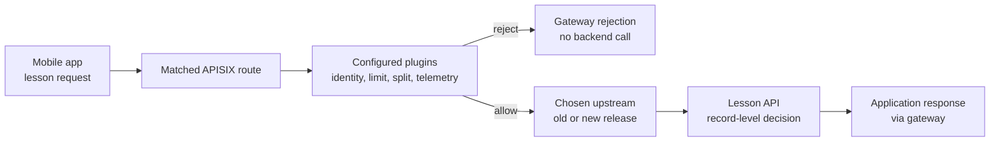

# How APISIX policies shape one request

## The idea in one minute

APISIX matches a request to a route, then runs the **plugins actually
configured** for that traffic. A plugin might identify a caller, reject
an over-limit request, select a release target, or record a signal.
Plugins are not automatically active just because APISIX is installed,
and their execution depends on the configured scope and phase.
[^apisix-plugin]

The gateway can answer questions such as "does this request carry a
recognized API key?" The application still answers a different question:
"may this user see lesson 42?" Keeping those questions distinct prevents
an authenticated API client from being mistaken for an authorized user.
The example below is **invented**; no request or policy was run for this
page.

Read [What Apache APISIX does for an API](apache-apisix.md) first for the
route and upstream model. This page follows a single route with optional
policy choices.

## A request can leave at more than one point

Suppose a mobile learning app asks for
`https://learn.example.com/lessons/42`. A route matches that host and path.
The team is considering API-key authentication, a request quota, a small
canary release, and gateway telemetry.

Text alternative: the mobile app request matches an APISIX route. The
enabled plugins may reject it at the gateway, in which case the lesson
API never receives it. If allowed, APISIX chooses an upstream, perhaps
one of two release versions. The lesson API then makes its own decision
about lesson 42 and returns a response. The gateway can record signals
about either path when the relevant telemetry is configured.

This diagram shows **possible outcomes**, not a literal order for all
plugins. APISIX plugins run in documented request phases and priority
order; two policies attached at different scopes may interact. Check the
effective plugin configuration and the current plugin documentation
before assuming one check always runs first.[^apisix-plugin]

## Four different policy questions

| Question | APISIX capability in this example | Limit of the answer |
| --- | --- | --- |
| Which API client is calling? | `key-auth` checks a credential associated with an APISIX `Consumer` when enabled on a Route or Service.[^apisix-key-auth] | A valid key identifies that configured consumer. It does not prove which human is using the app or whether that human owns lesson 42. |
| How many requests are allowed in a window? | `limit-count` counts by a configured key and time window.[^apisix-limit-count] | The result depends on the counter key and storage policy; a per-gateway counter is not a cluster-wide quota. |
| Which release receives an allowed request? | `traffic-split` can choose among upstreams by condition or weight.[^apisix-traffic-split] | A weight is a routing instruction, not a guarantee that a small sample has that exact ratio or that a user stays on one release. |
| What can operators observe? | `request-id`, `prometheus`, or `opentelemetry` can add correlation, metrics, or tracing when configured.[^apisix-request-id][^apisix-prometheus][^apisix-opentelemetry] | Gateway signals describe traffic through APISIX, not the full business result or every client that never reached it. |

### Identity is not record authorization

To use `key-auth`, the team needs a configured `Consumer` and credential,
then enables the plugin on the appropriate route or service. APISIX checks
the key before proxying and can pass consumer information to the backend.
The lesson API must still decide whether the authenticated caller is
allowed to read this specific lesson.[^apisix-key-auth]

For an identity provider, the `openid-connect` plugin supports more than
one interaction pattern. Its `bearer_only` option changes whether it
strictly expects bearer access tokens. Its documentation also has
explicit issuer and audience-validation options. A team must choose and
test the intended token flow; the presence of an OIDC plugin name alone
does not define a complete access policy.[^apisix-openid-connect]

Treat identity headers passed from the gateway as claims whose trust
depends on the network path. If a backend is reachable directly or a
client can supply the same header without a trusted gateway check, the
backend needs its own validation or a protected path. This follows from
the difference between a configured gateway check and an application
authorization decision; it was not tested here.

### A limit needs a key and a counter scope

The phrase "1,000 requests per minute" leaves two questions unanswered:
**per what key**, and **counted where**? In the lesson example, per-client
IP would group people behind a shared network, while a Consumer-based
key would require the authentication step to identify that Consumer.
The choice affects fairness and what happens when the gateway scales.
[^apisix-limit-count]

The current `limit-count` documentation says its default `local` policy
keeps a separate counter on each APISIX instance. With traffic spread
across replicas, the effective aggregate quota is approximately the
configured value multiplied by the number of instances. Redis-backed
policies share counters across instances. Those modes have different
availability and operating costs; select one for the actual quota
requirement.[^apisix-limit-count]

An over-limit response is not necessarily `429`. The current plugin
reference lists `503` as the default `rejected_code`, which can be set
to another value. Inspect the configured code and response before
interpreting a status as evidence of a rate limit.[^apisix-limit-count]

### A traffic split needs measured outcomes

If the team sends a small share of allowed requests to a new lesson API
version, `traffic-split` can use conditions and weighted upstreams. The
APISIX documentation warns that observed ratios can be less accurate
with round-robin selection, especially after state resets. A weight does
not prove the new backend is healthy or that a user journey succeeds.
Compare errors, latency, and a real lesson-read path for both versions
before increasing the share.[^apisix-traffic-split]

### Telemetry needs deliberate configuration

The `request-id` plugin can generate an ID or reuse a non-empty incoming
one. Current APISIX gateway logs include a request ID even without this
plugin; enabling it can place the chosen ID in the response header. An ID
helps join records across systems only if the backend receives and
records the same ID, or propagates it to downstream calls. It is not
proof of caller identity.[^apisix-request-id]

The Prometheus plugin collects gateway request and latency metrics when
enabled. Its route and status labels help separate matched routes and
response classes. The OpenTelemetry plugin reports tracing data when
enabled and connected to a collector. Neither plugin automatically
records that lesson 42 was correct or useful to the reader.
[^apisix-prometheus][^apisix-opentelemetry]

## Use the first missing signal

| Observation | First question | Next evidence |
| --- | --- | --- |
| Gateway rejects the request before the lesson API sees it. | Which configured authentication or limit plugin made the decision? | Effective route/plugin configuration and gateway response. |
| Request reaches the lesson API, which returns `404` or `403`. | Did the application reject this lesson or user? | Application response and logs tied to the same request. |
| New release receives unexpected traffic. | What match and weight did `traffic-split` actually use? | Per-version request counts and user-path results.[^apisix-traffic-split] |
| No gateway metric appears for a failing client. | Did the client reach APISIX, and is telemetry enabled for that path? | External entry and gateway access evidence, then plugin configuration.[^apisix-prometheus] |

For route matching rather than policy, use
[Trace an APISIX 404](../troubleshooting/apisix.md). For where the
Ingress Controller and gateway run, use
[How the APISIX gateway and controller fit together](apisix-architecture-and-deployment.md).

## Check your understanding

1. Why can a valid API key still lead to a lesson being denied by the
   application?
2. If two APISIX replicas each use the default local `limit-count`
   policy, is a configured limit automatically global?
3. What does a `traffic-split` weight say, and what outcome must still
   be measured?
4. Why should a request ID help investigation without being treated as
   proof of identity?

## Explore further

- [APISIX plugins](https://apisix.apache.org/docs/apisix/terminology/plugin/)
  explains phases, scope, and precedence.[^apisix-plugin]
- [key-auth](https://apisix.apache.org/docs/apisix/plugins/key-auth/)
  explains Consumers, credentials, and route enablement.[^apisix-key-auth]
- [limit-count](https://apisix.apache.org/docs/apisix/plugins/limit-count/)
  documents key choice, local and Redis counters, and rejected responses.
  [^apisix-limit-count]
- [traffic-split](https://apisix.apache.org/docs/apisix/plugins/traffic-split/)
  describes conditional and weighted upstreams.[^apisix-traffic-split]
- [prometheus](https://apisix.apache.org/docs/apisix/plugins/prometheus/)
  and [opentelemetry](https://apisix.apache.org/docs/apisix/plugins/opentelemetry/)
  show how gateway signals are enabled and exported.
  [^apisix-prometheus][^apisix-opentelemetry]
- [Back to Kubernetes applications and tools](index.md).

[^apisix-plugin]: [Apache APISIX, Plugin](https://apisix.apache.org/docs/apisix/terminology/plugin/), source record `apisix-plugin`.
[^apisix-key-auth]: [Apache APISIX, key-auth](https://apisix.apache.org/docs/apisix/plugins/key-auth/), source record `apisix-key-auth`.
[^apisix-openid-connect]: [Apache APISIX, openid-connect](https://apisix.apache.org/docs/apisix/plugins/openid-connect/), source record `apisix-openid-connect`.
[^apisix-limit-count]: [Apache APISIX, limit-count](https://apisix.apache.org/docs/apisix/plugins/limit-count/), source record `apisix-limit-count`.
[^apisix-traffic-split]: [Apache APISIX, traffic-split](https://apisix.apache.org/docs/apisix/plugins/traffic-split/), source record `apisix-traffic-split`.
[^apisix-request-id]: [Apache APISIX, request-id](https://apisix.apache.org/docs/apisix/plugins/request-id/), source record `apisix-request-id`.
[^apisix-prometheus]: [Apache APISIX, prometheus](https://apisix.apache.org/docs/apisix/plugins/prometheus/), source record `apisix-prometheus`.
[^apisix-opentelemetry]: [Apache APISIX, opentelemetry](https://apisix.apache.org/docs/apisix/plugins/opentelemetry/), source record `apisix-opentelemetry`.
