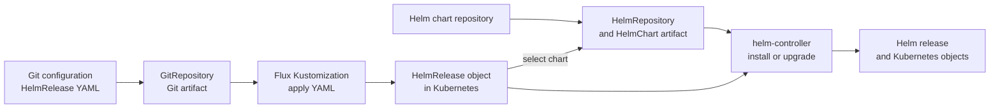

# How Flux applies a HelmRelease from Git

## The idea in one minute

A `HelmRelease` file in Git does **not** install a chart by itself. One Flux
controller first reads the Git artifact and creates the `HelmRelease` object
in Kubernetes. Another controller reads that object, obtains the chart, and
performs the Helm installation. These are two separate reconciliations with
separate status reports.[^flux-kustomization][^flux-helmrelease]

Think of Git as holding an installation request. The Flux `Kustomization`
delivers the request to the cluster; helm-controller carries it out. That
analogy stops at the second handoff: the controllers repeatedly compare
desired and observed state, and the chart must arrive through a source
object before helm-controller can install it.[^flux-helm-guide]

If you are new to Flux, read [Flux](flux.md) for the controller and artifact
model and [How Helm turns a chart into a release](helm.md) for chart, values,
and release vocabulary. This page follows one case in which Git contains a
`HelmRelease` declaration and a Helm repository provides its chart.

## Two paths meet at the HelmRelease



Text alternative: one path starts with Git configuration. A `GitRepository`
fetches it, and a Flux `Kustomization` applies the `HelmRelease` YAML to
Kubernetes. A second path starts with a chart repository. A
`HelmRepository` makes its index available and a `HelmChart` supplies the
selected chart artifact. helm-controller uses that chart and the
`HelmRelease` declaration to install or upgrade the Helm release and its
Kubernetes objects.[^flux-gitrepository][^flux-helm-guide]

The names are easy to mix up:

| Name | What it represents | Controller to inspect |
| --- | --- | --- |
| Flux `Kustomization` | A request to build and apply manifests from a source path. The path can contain ordinary Kubernetes objects, including a `HelmRelease`. | kustomize-controller[^flux-kustomization] |
| `HelmRelease` | A request for a chart version, values, and Helm release lifecycle. | helm-controller[^flux-helmrelease] |
| `HelmRepository` and `HelmChart` | Where the chart comes from and the selected chart package artifact. | source-controller[^flux-helm-guide][^flux-helmrepository] |

A Flux `Kustomization` is a Kubernetes custom resource. A
`kustomization.yaml` inside a repository is a Kustomize build file. They
are related but are not the same object.[^flux-kustomization]

## Example: the lesson API chart

The names, repository addresses, path, and chart version here are
**invented**. Nothing was fetched, applied, or installed for this example.
Assume a `GitRepository` named `platform-config` already fetches the team's
configuration repository and the `apps` namespace already exists.

The team stores a `HelmRepository` and `HelmRelease` under
`./clusters/demo/releases` in Git. A Flux `Kustomization` points to that
path. The chart comes from a separate Helm repository, not from that Git
path.[^flux-helm-guide]

```yaml
apiVersion: kustomize.toolkit.fluxcd.io/v1
kind: Kustomization
metadata:
  name: lesson-releases
  namespace: flux-system
spec:
  interval: 10m
  sourceRef:
    kind: GitRepository
    name: platform-config
  path: ./clusters/demo/releases
  prune: true
  healthChecks:
    - apiVersion: helm.toolkit.fluxcd.io/v2
      kind: HelmRelease
      name: lesson-api
      namespace: apps
```

This first object tells kustomize-controller *where to find declarations*.
Its `healthChecks` entry also makes it wait for the named `HelmRelease` to
become ready. Without that check, a ready `Kustomization` would establish
that it applied the `HelmRelease` object, not that helm-controller installed
the chart. `prune: true` means removing a previously managed object from the
path can cause Flux to delete it; choose that setting with the intended
removal behavior in mind.[^flux-kustomization]

The two files at that Git path can contain these objects:

```yaml
apiVersion: source.toolkit.fluxcd.io/v1
kind: HelmRepository
metadata:
  name: lesson-charts
  namespace: flux-system
spec:
  interval: 30m
  url: https://charts.example.invalid
---
apiVersion: helm.toolkit.fluxcd.io/v2
kind: HelmRelease
metadata:
  name: lesson-api
  namespace: apps
spec:
  interval: 30m
  chart:
    spec:
      chart: lesson-api
      version: 1.2.3
      sourceRef:
        kind: HelmRepository
        name: lesson-charts
        namespace: flux-system
```

The `.invalid` address is deliberately unusable. Replace it, the chart
name, and the version only after checking a real chart's documentation.
The `HelmRelease` chart template causes a `HelmChart` object and chart
artifact to be produced from its source. helm-controller then reconciles
the Helm release. A fixed version in this example makes the intended
chart explicit; a version range would allow a matching newer chart to be
selected as the source updates.[^flux-helm-guide]

### Follow one change

Suppose the team changes the chart version in the Git `HelmRelease` from
the invented `1.2.3` to `1.2.4`:

1. `GitRepository` fetches the new configuration revision and reports its
   artifact.[^flux-gitrepository]
2. `Kustomization` applies the changed `HelmRelease` object. Its health
   check prevents it from becoming ready until the named `HelmRelease` is
   ready.[^flux-kustomization]
3. source-controller prepares the selected chart artifact. helm-controller
   then performs the upgrade and reports the result on the
   `HelmRelease`.[^flux-helm-guide][^flux-helmrelease]
4. Kubernetes controllers work toward the objects produced by Helm. A real
   user request remains a separate verification step.

No step above was run for this guide. A newer Git revision, an applied
`HelmRelease` object, and a successful Helm action are different facts.

## Read the first failed boundary

In a cluster you are authorized to inspect, start with the reported
conditions rather than changing a resource because it looks old. Flux's
troubleshooting guide uses this source-then-reconciler order.[^flux-troubleshooting]

```bash
flux get sources git -n flux-system
flux get kustomizations -n flux-system
flux get sources helm -n flux-system
flux get helmreleases -n apps
```

These commands only read status. Use the names and namespaces in *your*
installation, then inspect the failing object's conditions and message.

| First failing signal | What it narrows down | What to check next |
| --- | --- | --- |
| `GitRepository` has no current artifact | Configuration may not have been fetched. | Its URL, reference, credentials, and condition message.[^flux-gitrepository] |
| `Kustomization` cannot build or apply | The declaration has not reached Kubernetes successfully. | Its source revision, path, apply error, and dependency or health-check message.[^flux-kustomization] |
| `HelmRepository` or `HelmChart` is not ready | The selected chart may not be available to helm-controller. | The source URL, chart name and version, and artifact conditions.[^flux-helm-guide][^flux-helmrepository] |
| `HelmRelease` is not ready | The chart may be available, but the Helm action, values, test, or release state failed. | Its condition reason and message; then the related Kubernetes objects.[^flux-helmrelease] |

Do not assume that a green `Kustomization` proves the application works.
It waits for the `HelmRelease` in this example only because `healthChecks`
names it. Even a ready `HelmRelease` says what helm-controller established
about a release; it does not send an end-user request. Helm drift detection
is also an explicit setting, so a ready release alone does not prove that
every live object still matches the stored manifest.[^flux-kustomization][^flux-helmrelease]

## When to use each object

- Use a Flux `Kustomization` to apply YAML or Kustomize overlays from a
  source. The YAML may itself declare a `HelmRelease`.[^flux-kustomization]
- Use a `HelmRelease` to ask Flux to manage a Helm chart installation,
  upgrade, and related lifecycle actions. It needs a chart source.[^flux-helmrelease]
- If Git holds the `HelmRelease` and a chart repository holds the chart,
  you normally need both paths in the diagram. Choose the health check
  deliberately so the `Kustomization` status means what readers expect.

For an installation procedure, use Flux's current
[Manage Helm Releases](https://fluxcd.io/flux/guides/helmreleases/) guide.
Check the current CRD versions, chart source, access rights, values,
secret handling, and removal behavior before applying any configuration.

## Check your understanding

1. A `Kustomization` applied a `HelmRelease`, but the chart could not be
   fetched. Which controller path should you inspect after the
   `Kustomization`?
2. Without `healthChecks`, what does a ready `Kustomization` establish
   about its `HelmRelease` manifest? What does it leave open?
3. Why are a Git commit, a chart version, and a Helm release revision
   different pieces of evidence?

## Explore further

- [Flux Kustomization](https://fluxcd.io/flux/components/kustomize/kustomizations/)
  explains source paths, pruning, and health checks.[^flux-kustomization]
- [Flux HelmRelease](https://fluxcd.io/flux/components/helm/helmreleases/)
  documents chart references, lifecycle, conditions, and drift detection.
  [^flux-helmrelease]
- [Manage Helm Releases](https://fluxcd.io/flux/guides/helmreleases/)
  walks through chart sources and declarative releases.[^flux-helm-guide]
- [Flux troubleshooting cheatsheet](https://fluxcd.io/flux/cheatsheets/troubleshooting/)
  gives the official status-inspection sequence.[^flux-troubleshooting]
- [Flux overview](flux.md) and [Helm basics](helm.md) provide the two
  prerequisite models.
- [Back to Kubernetes applications and tools](index.md).

[^flux-kustomization]: [Flux, Kustomization](https://fluxcd.io/flux/components/kustomize/kustomizations/), source record `flux-kustomization`.
[^flux-helmrelease]: [Flux, HelmRelease](https://fluxcd.io/flux/components/helm/helmreleases/), source record `flux-helmrelease`.
[^flux-helm-guide]: [Flux, Manage Helm Releases](https://fluxcd.io/flux/guides/helmreleases/), source record `flux-helm-guide`.
[^flux-gitrepository]: [Flux, GitRepository](https://fluxcd.io/flux/components/source/gitrepositories/), source record `flux-gitrepository`.
[^flux-helmrepository]: [Flux, HelmRepository](https://fluxcd.io/flux/components/source/helmrepositories/), source record `flux-helmrepository`.
[^flux-troubleshooting]: [Flux, troubleshooting cheatsheet](https://fluxcd.io/flux/cheatsheets/troubleshooting/), source record `flux-troubleshooting`.
