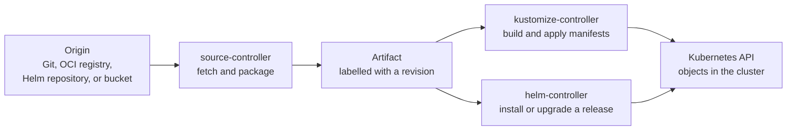

# Flux

## Purpose

Use this page to understand how Flux is put together: which controller does
which job, what passes between them, and what their status messages mean.
After reading it you should be able to follow one change from a repository to
a cluster and say which part to inspect when it stops.

The page is conceptual and contains nothing to run. It assumes the model in
[GitOps](gitops.md). For fields, commands, and YAML, continue to
[Flux reconciliation and Helm releases](flux-reconciliation-and-helm.md).

## What Flux is

Flux is a set of Kubernetes controllers that fetch a description of what
should run in a cluster and keep the cluster matching it. You configure Flux
by creating Kubernetes custom resources, and each controller acts on its own
kinds of resource.[^flux-components]

A **controller** is a program that watches objects in the Kubernetes API and
works to make reality match them. A **custom resource** is an object type
added to that API; see
[Custom resources and CRDs](../core-objects/custom-resources-and-crds.md).

## Why it matters

Flux is several controllers with a hand-off between them, not one program.
If you picture a single "Flux" that reads Git and applies YAML, a failure
gives you nowhere to look. When you know the chain, the question becomes
specific: did the fetch fail, or the apply, or the health check?

The same picture prevents two wrong assumptions: that Flux only works with
Git, and that every Flux installation sends alerts and updates image tags.

## The chain

Text alternative: an origin, which can be a Git repository, an OCI registry,
a Helm repository, or a bucket, is read by source-controller.
source-controller packages what it fetched as an artifact labelled with a
revision. From the artifact the flow splits into two parallel branches:
kustomize-controller builds and applies manifests, and helm-controller
installs or upgrades a Helm release. Both branches end at the Kubernetes API.
The reconcilers never read the origin themselves.

The diagram helps you decide which half a problem belongs to. Left of the
artifact is fetching. Right of it is applying.

| Part | Its resources | Its job |
| --- | --- | --- |
| source-controller | `GitRepository`, `OCIRepository`, `HelmRepository`, `HelmChart`, `Bucket` | Authenticate to an origin, detect a new version, fetch it, and make it available inside the cluster as an artifact.[^flux-source-controller] |
| kustomize-controller | `Kustomization` | Build the manifests at a path in an artifact, apply them, and correct drift on each interval.[^flux-kustomization] |
| helm-controller | `HelmRelease` | Run Helm actions such as install, upgrade, test, rollback, and uninstall to keep a Helm release matching its declaration.[^flux-helmrelease] |

Three things to understand about the hand-off:

- **A source is a Kubernetes object.** It records where the origin is and
  how to reach it. Each time a newer matching version appears, the source
  produces a new artifact.[^flux-concepts]
- **An artifact carries a revision.** For a `GitRepository`, the revision
  combines the branch and the commit it resolved to, and is reported in the
  object's status.[^flux-gitrepository]
- **One source can feed several reconcilers.**[^flux-concepts] Two
  `Kustomization` objects can apply different paths of the same artifact.

### Git is one origin among several

`GitRepository` is one kind of source. The others let Flux read from OCI
registries, Helm repositories, and object-storage
buckets.[^flux-components] Flux's documentation describes running the
controllers against a registry only, with no connection to a Git server,
while people still use Git to author changes.[^flux-concepts]

### Where Helm fits

A `HelmRelease` needs a chart. It gets one through the same chain: the chart
arrives as an artifact from a source object, and helm-controller consumes
it.[^flux-helmrelease] Helm is a second reconciler beside kustomize-controller,
not a separate system. [Helm for Kubernetes and Crossplane](helm.md) explains
charts and releases.

## Example: one commit through the chain

This example is illustrative. The names and revisions are invented, and
nothing here was run. It shows no YAML; the objects are described in words.

A team has two Flux objects in a cluster:

- a `GitRepository` named `shop-config` that follows the `main` branch of
  their configuration repository;
- a `Kustomization` named `shop-prod` that points at `shop-config`, applies
  the path `clusters/prod/shop`, and is set to wait for the applied resources
  to become ready.

| Step | Who acts | What happens | What the status now says |
| --- | --- | --- | --- |
| 1 | A person | Merges a commit to `main` that raises a memory limit. | Nothing yet. Flux has not looked. |
| 2 | source-controller | At its next check, resolves `main` to the new commit, fetches it, and stores a new artifact. | `shop-config` is ready with an artifact for revision `main@sha1:9d3f…`. |
| 3 | kustomize-controller | Sees the new artifact, builds the manifests at `clusters/prod/shop`, and applies them. | `shop-prod` is reconciling. |
| 4 | Kubernetes | The Deployment controller rolls out Pods with the new limit. | Unchanged while the rollout runs. |
| 5 | kustomize-controller | Its health checks pass. | `shop-prod` is ready: applied revision `main@sha1:9d3f…`. |
| 6 | kustomize-controller | One interval later, with no new revision, compares again and finds nothing to correct. | Unchanged. |

What to notice: the person's last action was the merge. Steps 2 and 3 are two
controllers. If step 2 had failed, for example because a credential expired,
`shop-prod` would keep the previous revision applied and the place to look
would be `shop-config`. Step 4 is ordinary Kubernetes behaviour, explained in
[Kubernetes fundamentals](../fundamentals/kubernetes-fundamentals.md).

## What a revision and a Ready condition prove

Each Flux object reports a `Ready` condition. It answers a question about
that object only.

| Signal | What it proves | What it does not prove |
| --- | --- | --- |
| `GitRepository` is ready | The controller reached the repository, the artifact is in storage, and it matches the latest revision the reference resolves to.[^flux-gitrepository] | That anything was applied, or that the content is valid Kubernetes configuration. |
| `Kustomization` is ready | The source was fetched, the manifests were built and applied, and the health checks it runs are passing.[^flux-kustomization] | That resources you did not ask it to check are healthy, or that users are served. |
| `HelmRelease` is ready | The release is installed and up to date with the declared chart and values, and any enabled Helm tests passed.[^flux-helmrelease] | That resources changed by hand since the release still match it, unless drift detection is enabled, or that users are served. |
| Applied revision | Which version of the source was last applied successfully.[^flux-kustomization] | That this is the version you meant to release. |

Health checking on a `Kustomization` is opt-in. `healthChecks` and `wait` are
optional fields; without them, "ready" reports a successful apply and says
nothing about rollout.[^flux-kustomization]

A revision tells you *what* was applied, which makes it the value to compare
against the commit you expected. None of these signals sends a request the
way a user would. [GitOps](gitops.md#what-a-green-sync-does-not-prove)
explains that gap.

## Separate and optional capabilities

Reconciliation needs only source-controller and kustomize-controller; those
two are the minimum Flux requires.[^flux-optional-components] Everything else
adds a capability.

| Capability | Controllers | What it adds | Installed by the default commands? |
| --- | --- | --- | --- |
| Helm releases | helm-controller | Reconciles `HelmRelease` objects. | Yes.[^flux-optional-components] |
| Notification | notification-controller | Sends events from the Flux controllers to external systems, and receives events from external systems to tell Flux a source changed.[^flux-notification-controller] | Yes, but it is not needed to reconcile.[^flux-optional-components] |
| Image automation | image-reflector-controller and image-automation-controller | Scans image repositories, selects an image using an `ImagePolicy`, updates YAML, and commits the change to a Git repository.[^flux-image-automation][^flux-image-policies] | No. They are extra components that must be requested.[^flux-optional-components] |

Two consequences:

- Notification does not apply anything. It is configured through its own
  `Provider`, `Alert`, and `Receiver` objects.[^flux-components] A cluster
  can reconcile with no alerts set up, in which case a failure is recorded in
  object status and events but nobody is told. Alerting is a decision you
  make.
- Image automation is the one part of Flux that **writes** to a repository.
  It needs write credentials to Git, and its commits then travel the normal
  chain. Treat turning it on as a security decision; see
  [GitOps security and multi-tenancy](gitops-security-and-multitenancy.md).

## An analogy: a goods-in clerk and a fitter

In a workshop, a goods-in clerk collects deliveries from suppliers, seals
each one in a crate, and writes the batch number on the label. A fitter
builds only from sealed crates on the shelf and never contacts a supplier.

Where the analogy stops being accurate:

- **The fitter never finishes.** A real fitter builds once. The reconcilers
  come back on every interval and correct what has changed.
- **The label names the batch, not its quality.** A revision identifies what
  was fetched. It does not say the contents are right.
- **One crate can serve many fitters.** A single source artifact can be used
  by several reconcilers at once.
- **The clerk works to a timer and can be nudged.** source-controller checks
  on an interval; a webhook received by notification-controller can prompt an
  earlier check.
- **There may be no one announcing arrivals.** Reporting outward is a
  separate capability that has to be configured.

## Common misconceptions

- **"Flux is one controller."** It is several, and the artifact is the
  hand-off between them.
- **"Flux only uses Git."** Git is one source type among several.
- **"Flux sends alerts and bumps image tags out of the box."** Alerts need
  notification objects that you create. Image automation is not installed by
  default.
- **"Ready means the application works."** Ready describes one Flux object.

## Check your understanding

- A commit was merged ten minutes ago and the cluster has not changed. Which
  object's status do you read first, and what would tell you the fetch
  succeeded?
- A `Kustomization` is ready and shows the revision you expected. Name one
  thing that is now established and one thing that is not.
- Which Flux capability writes to a Git repository, and is it present after a
  default installation?
- Why can two `Kustomization` objects share one `GitRepository`?

## Next steps

- Fields, commands, and YAML for the objects on this page:
  [Flux reconciliation and Helm releases](flux-reconciliation-and-helm.md).
- The operating model underneath: [GitOps](gitops.md).
- Comparing Flux with another tool: [Argo CD vs. Flux](argo-cd-vs-flux.md).
- Scoping permissions and secrets:
  [GitOps security and multi-tenancy](gitops-security-and-multitenancy.md).
- An applied route on AWS: [GitOps on EKS](../../cross-topic-guides/gitops-on-eks.md).

## Official documentation for deeper study

- Every controller and resource type: [Flux - GitOps Toolkit components](https://fluxcd.io/flux/components/).
- Definitions of source, reconciliation, and Kustomization: [Flux - Core Concepts](https://fluxcd.io/flux/concepts/).
- Artifacts, revisions, and the conditions on a Git source: [Flux - GitRepository](https://fluxcd.io/flux/components/source/gitrepositories/).
- Pruning, intervals, health checks, dependencies, and conditions: [Flux - Kustomization](https://fluxcd.io/flux/components/kustomize/kustomizations/).
- Chart references, remediation, and drift detection: [Flux - HelmRelease](https://fluxcd.io/flux/components/helm/helmreleases/).
- Which controllers an installation includes: [Flux - Optional components](https://fluxcd.io/flux/installation/configuration/optional-components/).
- Alerts and webhook receivers: [Flux - Notification Controller](https://fluxcd.io/flux/components/notification/).
- Image scanning and Git updates: [Flux - Image reflector and automation controllers](https://fluxcd.io/flux/components/image/).
- Selecting images by policy: [Flux - Image Policies](https://fluxcd.io/flux/components/image/imagepolicies/).

## Related links

- [GitOps](gitops.md)
- [Argo CD vs. Flux](argo-cd-vs-flux.md)
- [Flux reconciliation and Helm releases](flux-reconciliation-and-helm.md)
- [Back to Kubernetes applications and tools](index.md)
- [Back to Kubernetes index](../index.md)
- [Back to root index](../../../README.md)

[^flux-components]: [Flux - GitOps Toolkit components](https://fluxcd.io/flux/components/), source record `flux-components`.
[^flux-concepts]: [Flux - Core Concepts](https://fluxcd.io/flux/concepts/), source record `flux-concepts`.
[^flux-source-controller]: [Flux - Source Controllers](https://fluxcd.io/flux/components/source/), source record `flux-source-controller`.
[^flux-gitrepository]: [Flux - GitRepository](https://fluxcd.io/flux/components/source/gitrepositories/), source record `flux-gitrepository`.
[^flux-kustomization]: [Flux - Kustomization](https://fluxcd.io/flux/components/kustomize/kustomizations/), source record `flux-kustomization`.
[^flux-helmrelease]: [Flux - HelmRelease](https://fluxcd.io/flux/components/helm/helmreleases/), source record `flux-helmrelease`.
[^flux-optional-components]: [Flux - Optional components](https://fluxcd.io/flux/installation/configuration/optional-components/), source record `flux-optional-components`.
[^flux-notification-controller]: [Flux - Notification Controller](https://fluxcd.io/flux/components/notification/), source record `flux-notification-controller`.
[^flux-image-automation]: [Flux - Image reflector and automation controllers](https://fluxcd.io/flux/components/image/), source record `flux-image-automation`.
[^flux-image-policies]: [Flux - Image Policies](https://fluxcd.io/flux/components/image/imagepolicies/), source record `flux-image-policies`.
