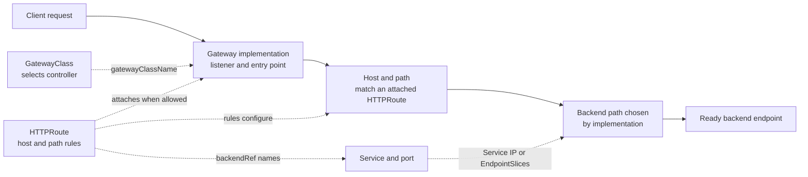

# Gateway API and Ingress

## Purpose

Use this page when a web request must enter a Kubernetes cluster and reach the
right application. You will learn which object describes the route, which
software actually serves it, and when Ingress or Gateway API is a useful
starting point. This is a model, not an installation guide.

## The request in one sentence

A client resolves a public name and connects to an address served by an
**ingress controller** or **gateway implementation**. That software matches
the request against a route that names a Kubernetes **Service** backend.
Depending on the implementation, it may connect through the Service IP or
use the Service's EndpointSlices to reach a ready backend directly. The route
does not promise one particular packet path.[^kubernetes-ingress]
[^kubernetes-gateway][^kubernetes-service]

An Ingress or HTTPRoute is a *description* of traffic rules. Creating the
object alone does not create a working public endpoint. The cluster also needs
a compatible controller or implementation, network exposure, DNS and, for
HTTPS, a working certificate and HTTPS entry point.[^kubernetes-ingress]
[^kubernetes-gateway]
Gateway API also needs its Custom Resource Definitions (CRDs) installed;
some controller installations provide them.[^gateway-api-getting-started]

Think of the route as an address directory and the implementation as the
reception desk that reads it. The analogy stops at ownership: Gateway API
also controls which teams may attach routes to a shared listener.

## Two ways to describe the route

| Model | Objects that matter | Good starting point | Check first |
| --- | --- | --- | --- |
| Ingress | An `Ingress` names hosts, paths, and backend Services; an `IngressClass` helps select the controller that implements those rules. | A cluster already has a maintained Ingress controller and the required HTTP routing fits its features. | Controller selection, TLS and exposure; extra behavior may depend on controller-specific annotations. |
| Gateway API | A `GatewayClass` selects an implementation, a `Gateway` defines listeners, and an `HTTPRoute` attaches routing rules that point to Services. | Teams need a clearer split between shared entry infrastructure and application routes, or a supported Gateway API feature. | Installed API resources, implementation support, listener and route attachment permissions. |
| Implementation-specific resource | A vendor's custom resource describes a feature the shared APIs do not offer. | The required feature is supported only by that implementation. | Portability and who maintains the custom resource. |

The Ingress API is stable but **frozen**: Kubernetes recommends Gateway API for
new capabilities. That does not mean existing Ingress resources have been
removed or must be migrated immediately.[^kubernetes-ingress] Check the
implementation's supported Gateway API features before assuming every
`HTTPRoute` option will work.[^kubernetes-gateway]

## Gateway API: three objects and a Service backend

Text alternative: the GatewayClass identifies the controller for a Gateway.
The Gateway's listener receives a client request, then an attached HTTPRoute
matches its host and path. The route names a Service and Service port as its
backend. The implementation may use the Service IP or its EndpointSlices to
reach a ready endpoint. Dashed arrows describe configuration relationships; only
solid arrows show the conceptual request path.[^gateway-api-overview]
[^kubernetes-gateway]

The split supports different owners. A platform team can own `GatewayClass`
and a shared `Gateway`; an application team can own its `HTTPRoute`. Attachment
needs both sides: the route's `parentRefs` names the Gateway, and the chosen
listener's `allowedRoutes` permits the route kind and namespace. If both set
hostnames, they must overlap. By default, a listener accepts routes only from
its Gateway's namespace. A shared Gateway must explicitly allow other
namespaces, for example with a selector on namespace labels. Whoever can
change those labels can affect which routes may attach.[^gateway-api-overview]
[^gateway-api-httproute]

Attachment and backend access are different permissions. `allowedRoutes`
lets a route attach to a Gateway in another namespace. If that route names a
**Service in another namespace**, the Service's namespace also needs a
`ReferenceGrant` allowing the reference. A cross-namespace certificate Secret
reference needs a grant from the Secret's namespace. A grant does not make an
unreachable backend healthy.[^gateway-api-referencegrant]

## Example: two teams, one HTTPS entrance

This is an illustrative design, not a deployed cluster or a manifest. A
platform team operates `Gateway` `public-web` in a `platform` namespace with
an HTTPS listener for `learn.example.org`. The articles team owns an
`HTTPRoute` in `articles` with a `/articles` path-prefix match and a backend
reference to `articles-service` in the same namespace. The search team has
the equivalent `/search` route and `search-service` in `search`. Each backend
reference names a **Service port**, which the Service maps to its Pod target
port.[^gateway-api-httproute][^kubernetes-service]

The listener must explicitly allow routes from both application namespaces;
the same-namespace default would allow neither. If it does, and the other
configuration is valid, a request for `learn.example.org/search?q=git` matches
the `/search` path: the query string is not part of the path match. A request
for `/articles/git` matches the articles route. If the search namespace is
not allowed, its route does not attach even though the route object exists.
These same-namespace Service backends need no `ReferenceGrant`.
[^gateway-api-overview][^gateway-api-httproute]

The HTTPS listener needs a certificate Secret for `learn.example.org`. It
terminates the client's TLS connection at the gateway. This does not by itself
encrypt the gateway-to-backend hop; backend TLS needs separate configuration,
such as a supported `BackendTLSPolicy`. Neither a Gateway nor an Ingress
automatically obtains a trusted certificate.[^gateway-api-tls]

To check a failure, follow the same boundaries as the request:

1. Check whether the GatewayClass reports `Accepted`, the Gateway reports
   `Accepted` and `Programmed`, and its listener is valid.
2. In the HTTPRoute's `status.parents` entry for this Gateway, distinguish
   `Accepted` (route attachment) from `ResolvedRefs` (backend references).
   A route may attach while its Service reference is invalid or forbidden.
3. Check the Service and its ready endpoints, then test public DNS, connection,
   certificate trust, and the actual HTTP response from outside the cluster.

These status conditions describe controller observations, not a successful
user request. A working gateway route also does not prove that an in-cluster
client can use the Service's ClusterIP path, since an implementation may use
EndpointSlices directly.[^gateway-api-troubleshooting][^kubernetes-gateway]

## Choose a starting route

- Keep a working Ingress when its controller is maintained, supports your
  Kubernetes version, and provides the routing and policy you need. The
  **Ingress NGINX controller** was retired in March 2026; it is one controller,
  not the Ingress API. Plan a move from that controller even if its routes
  still answer requests.[^ingress-nginx-retirement]
- Choose Gateway API when the selected implementation supports your required
  features and shared infrastructure needs explicit route ownership and
  attachment boundaries.
- Use an implementation-specific custom resource for a feature that the
  supported shared API cannot express, and document that dependency.

For a concrete implementation, [What Apache APISIX does for an
API](apache-apisix.md) explains how its controller and gateway divide the
work. For Service selection and readiness, read [How a Kubernetes Service
selects Pods](../core-objects/how-a-service-selects-pods.md).

## Check your understanding

- If an `HTTPRoute` exists but its namespace is not allowed by the Gateway,
  where would you investigate before checking the Service?
- Which components are missing if an Ingress object exists but no controller
  serves it?
- Why can a route be accepted while an external browser still cannot open the
  site?
- If a route attaches but its Service backend is in a different namespace and
  `ResolvedRefs` is false, which namespace needs to allow that reference?

## Official documentation for deeper study

- [Kubernetes Ingress](https://kubernetes.io/docs/concepts/services-networking/ingress/) explains the mature API, controller requirement, and frozen feature set.
- [Kubernetes Gateway API](https://kubernetes.io/docs/concepts/services-networking/gateway/) introduces the newer routing model.
- [Gateway API overview](https://gateway-api.sigs.k8s.io/docs/concepts/api-overview/) shows resource roles and ownership boundaries.
- [HTTPRoute reference](https://gateway-api.sigs.k8s.io/reference/api-types/httproute/) defines attachment and routing rules.
- [Kubernetes Service](https://kubernetes.io/docs/concepts/services-networking/service/) explains the backend abstraction.
- [Gateway API ReferenceGrant](https://gateway-api.sigs.k8s.io/reference/api-types/referencegrant/) separates cross-namespace backend references from route attachment.
- [Gateway API troubleshooting](https://gateway-api.sigs.k8s.io/docs/concepts/troubleshooting/) explains status conditions and their limits.
- [Gateway API TLS](https://gateway-api.sigs.k8s.io/guides/user-guides/tls/) distinguishes listener TLS from backend TLS.
- [Gateway API getting started](https://gateway-api.sigs.k8s.io/guides/getting-started/introduction/) covers required CRDs and controller setup.
- [Kubernetes Ingress NGINX retirement](https://kubernetes.io/blog/2026/03/30/kubernetes-v1-36-sneak-peek/) confirms why a working route is not enough to keep using that controller.

## Related links

- [What Apache APISIX does for an API](apache-apisix.md)
- [Kubernetes fundamentals](../fundamentals/kubernetes-fundamentals.md)
- [How a Kubernetes Service selects Pods](../core-objects/how-a-service-selects-pods.md)
- [Back to Kubernetes applications and tools](index.md)
- [Back to Kubernetes index](../index.md)
- [Back to knowledge index](../../index.md)

[^kubernetes-ingress]: [Kubernetes - Ingress](https://kubernetes.io/docs/concepts/services-networking/ingress/), source record `kubernetes-ingress`.
[^kubernetes-gateway]: [Kubernetes - Gateway API](https://kubernetes.io/docs/concepts/services-networking/gateway/), source record `kubernetes-gateway`.
[^gateway-api-overview]: [Gateway API - API Overview](https://gateway-api.sigs.k8s.io/docs/concepts/api-overview/), source record `gateway-api-overview`.
[^gateway-api-httproute]: [Gateway API - HTTPRoute](https://gateway-api.sigs.k8s.io/reference/api-types/httproute/), source record `gateway-api-httproute`.
[^kubernetes-service]: [Kubernetes - Service](https://kubernetes.io/docs/concepts/services-networking/service/), source record `kubernetes-service`.
[^gateway-api-referencegrant]: [Gateway API - ReferenceGrant](https://gateway-api.sigs.k8s.io/reference/api-types/referencegrant/), source record `gateway-api-referencegrant`.
[^gateway-api-troubleshooting]: [Gateway API - Troubleshooting and Status](https://gateway-api.sigs.k8s.io/docs/concepts/troubleshooting/), source record `gateway-api-troubleshooting`.
[^gateway-api-tls]: [Gateway API - TLS Configuration](https://gateway-api.sigs.k8s.io/guides/user-guides/tls/), source record `gateway-api-tls`.
[^gateway-api-getting-started]: [Gateway API - Getting started](https://gateway-api.sigs.k8s.io/guides/getting-started/introduction/), source record `gateway-api-getting-started`.
[^ingress-nginx-retirement]: [Kubernetes - Ingress NGINX retirement confirmation](https://kubernetes.io/blog/2026/03/30/kubernetes-v1-36-sneak-peek/), source record `ingress-nginx-retirement`.
