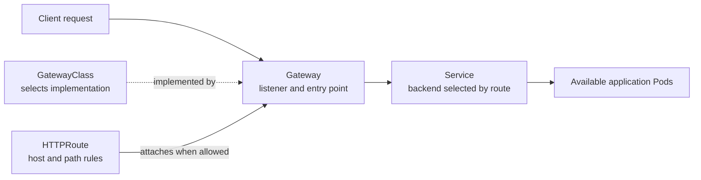

# Gateway API and Ingress

## Purpose

Use this page when a web request must enter a Kubernetes cluster and reach the
right application. You will learn which object describes the route, which
software actually serves it, and when Ingress or Gateway API is a useful
starting point. This is a model, not an installation guide.

## The request in one sentence

A client resolves a public name, connects to an address served by an **ingress
controller** or **gateway implementation**, and that software uses routing
rules to send the request to a Kubernetes **Service**. The Service selects the
application's available Pods.[^kubernetes-ingress][^kubernetes-service]

An Ingress or HTTPRoute is a *description* of traffic rules. Creating the
object alone does not create a working public endpoint. The cluster also needs
a compatible controller or implementation, network exposure, DNS and, for
HTTPS, a working certificate and listener.[^kubernetes-ingress][^kubernetes-gateway]

Think of the route as an address directory and the implementation as the
reception desk that reads it. The analogy stops at ownership: Gateway API
also controls which teams may attach routes to a shared listener.

## Two ways to describe the route

| Model | Objects that matter | Good starting point | Check first |
| --- | --- | --- | --- |
| Ingress | An `Ingress` names hosts, paths, and backend Services; an Ingress controller implements those rules. | A cluster already has a supported Ingress controller and the required HTTP routing fits its features. | Controller selection, TLS and exposure; extra behavior may depend on controller-specific annotations. |
| Gateway API | A `GatewayClass` selects an implementation, a `Gateway` defines listeners, and an `HTTPRoute` attaches routing rules that point to Services. | Teams need a clearer split between shared entry infrastructure and application routes, or a supported Gateway API feature. | Installed API resources, implementation support, listener and route attachment permissions. |
| Implementation-specific resource | A vendor's custom resource describes a feature the shared APIs do not offer. | The required feature is supported only by that implementation. | Portability and who maintains the custom resource. |

The Ingress API is stable but **frozen**: Kubernetes recommends Gateway API for
new capabilities. That does not mean existing Ingress resources have been
removed or must be migrated immediately.[^kubernetes-ingress] Check the
implementation's supported Gateway API features before assuming every
`HTTPRoute` option will work.[^kubernetes-gateway]

## Gateway API: four objects, four jobs

Text alternative: the GatewayClass identifies the implementation that serves
a Gateway. The Gateway exposes a listener. An HTTPRoute attaches to that
listener only when the Gateway allows it, and names a Service as its backend.
Requests reach the Gateway, follow the accepted route to the Service, and the
Service targets available Pods. The dashed relationship chooses the
implementation; it is not a packet path.[^gateway-api-overview]

The split supports different owners. A platform team can own `GatewayClass`
and a shared `Gateway`; an application team can own its `HTTPRoute`. A
Gateway's `allowedRoutes` rules determine which route kinds and namespaces may
attach, so a route in another namespace is not accepted merely because it
names the Gateway.[^gateway-api-overview][^gateway-api-httproute]

## Example: two teams, one HTTPS entrance

This is an illustrative design, not a deployed cluster or a manifest. A
platform team operates `Gateway` `public-web` with an HTTPS listener for
`learn.example.org`. The articles team owns an `HTTPRoute` for `/articles`
pointing to `articles-service`. The search team owns another route for
`/search` pointing to `search-service`. Both Services select their own Pods.

If the Gateway permits routes from both teams' namespaces, the implementation
can accept the routes. A request for `learn.example.org/search?q=git` should
then be sent to `search-service`; a request for `/articles/git` should go to
`articles-service`. If the search namespace is not allowed, the search route
does not attach and the expected request fails even though the route object
exists.[^gateway-api-overview][^gateway-api-httproute]

An `Accepted` route condition is one useful signal about configuration. It
does **not** prove that a public DNS record resolves, a client can connect,
TLS is trusted, or the backend responds correctly. Verify those separately
from outside the cluster before calling the site reachable.

## Choose a starting route

- Keep a working Ingress when its controller provides the routing and policy
  you need. Changing APIs without a concrete requirement adds migration work.
- Choose Gateway API when the selected implementation supports your required
  features and shared infrastructure needs explicit route ownership and
  attachment boundaries.
- Use an implementation-specific custom resource for a feature that the
  supported shared API cannot express, and document that dependency.

For a concrete implementation, [Apache APISIX](apache-apisix.md) explains how
its controller and gateway divide the work. For the distinction between a
Service and a Pod, read [Kubernetes fundamentals](../fundamentals/kubernetes-fundamentals.md).

## Check your understanding

- If an `HTTPRoute` exists but its namespace is not allowed by the Gateway,
  where would you investigate before checking the Service?
- Which components are missing if an Ingress object exists but no controller
  serves it?
- Why can a route be accepted while an external browser still cannot open the
  site?

## Official documentation for deeper study

- [Kubernetes Ingress](https://kubernetes.io/docs/concepts/services-networking/ingress/) explains the mature API, controller requirement, and frozen feature set.
- [Kubernetes Gateway API](https://kubernetes.io/docs/concepts/services-networking/gateway/) introduces the newer routing model.
- [Gateway API overview](https://gateway-api.sigs.k8s.io/docs/concepts/api-overview/) shows resource roles and ownership boundaries.
- [HTTPRoute reference](https://gateway-api.sigs.k8s.io/reference/api-types/httproute/) defines attachment and routing rules.
- [Kubernetes Service](https://kubernetes.io/docs/concepts/services-networking/service/) explains the backend abstraction.

## Related links

- [Apache APISIX](apache-apisix.md)
- [Kubernetes fundamentals](../fundamentals/kubernetes-fundamentals.md)
- [Back to Kubernetes applications and tools](index.md)
- [Back to Kubernetes index](../index.md)
- [Back to root index](../../../README.md)

[^kubernetes-ingress]: [Kubernetes - Ingress](https://kubernetes.io/docs/concepts/services-networking/ingress/), source record `kubernetes-ingress`.
[^kubernetes-gateway]: [Kubernetes - Gateway API](https://kubernetes.io/docs/concepts/services-networking/gateway/), source record `kubernetes-gateway`.
[^gateway-api-overview]: [Gateway API - API Overview](https://gateway-api.sigs.k8s.io/docs/concepts/api-overview/), source record `gateway-api-overview`.
[^gateway-api-httproute]: [Gateway API - HTTPRoute](https://gateway-api.sigs.k8s.io/reference/api-types/httproute/), source record `gateway-api-httproute`.
[^kubernetes-service]: [Kubernetes - Service](https://kubernetes.io/docs/concepts/services-networking/service/), source record `kubernetes-service`.
