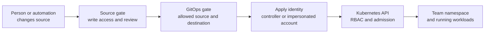

# GitOps security and multi-tenancy

## The idea in one minute

GitOps lets a controller read a desired configuration and apply it to a
cluster. A person may be unable to deploy directly with `kubectl` yet still
be able to change what the controller deploys by editing a trusted source.
That makes **who can change the source** and **what the controller may
apply** parts of the same security question.[^flux-multitenancy][^argo-declarative]

Picture a delivery desk with two checks. The first checks who may submit
an order. The second checks where the courier may deliver it. A reviewed
Git merge is the first check; a controller's deployment boundary is the
second. The analogy has a limit: a Kubernetes workload can itself gain
access to other resources in its namespace, so delivery into the right
namespace is not the whole security review.[^kubernetes-rbac]

This is a model for reviewing a design, not a ready-to-apply security
configuration. The tool-specific procedures are in the official links
below. Read [GitOps](gitops.md) first if the source-to-cluster path is new.

## Follow a change through four gates

Text alternative: a person or automation changes a trusted source. Its
write and review rules determine what reaches the GitOps controller. The
tool's source and destination policy decides whether to use that change.
The controller applies it under its own identity or an impersonated service
account. Kubernetes RBAC and admission decide which objects can be created
or changed. Running workloads then have their own access to resources and
secrets.[^github-protected-branches][^argo-projects][^flux-multitenancy][^kubernetes-rbac]

| Gate | Ask this concrete question | Why the previous gate is insufficient |
| --- | --- | --- |
| Source | Who can edit the branch, repository, chart, or image that production trusts? Are reviews and required checks enforced?[^github-protected-branches] | A controller cannot tell whether a valid manifest was approved by the right people. |
| GitOps policy | Which source, cluster, namespace, and resource kinds may this team use?[^argo-projects][^flux-multitenancy] | A reviewed change can still ask to alter the wrong environment. |
| Apply identity | Which Kubernetes identity makes the API request, and what can that identity do?[^flux-multitenancy] | A path or destination setting does not itself reduce API permissions. |
| Kubernetes and workload | What do RBAC and admission permit, and what can a deployed Pod access?[^kubernetes-rbac] | Permission to create a workload in a namespace can indirectly expose that namespace's Secrets and service-account privileges. |

The source gate applies to more than the configuration repository. A
`HelmRelease` can point at a chart stored elsewhere; review who may
publish or replace that chart too. [How Flux applies a HelmRelease from
Git](flux-reconciliation-and-helm.md) shows the two sources.

## Example: two teams, one cluster

This example is **invented**. No repository protection, GitOps policy,
service account, admission rule, or cluster was configured or tested for it.

The payments team deploys its API in the `payments` namespace. The catalog
team deploys in `catalog`. Platform administrators own the GitOps
installation, cluster-level add-ons, the two namespaces, and the initial
permission rules. The intended boundary is:

1. Payments writers can propose changes to the payments configuration,
   but a protected production branch requires the team's review before a
   merge.[^github-protected-branches]
2. The GitOps tool accepts payments configuration for `payments`; it must
   reject a payments request to deploy into `catalog` or the namespace
   containing the GitOps control plane.[^argo-projects][^argo-declarative]
3. Where the tool supports a scoped apply identity, that identity may
   manage the approved workload objects in `payments` and does not have
   cluster-admin permissions.[^flux-multitenancy]
4. Platform policy also considers what a Pod created in `payments` could
   mount or which service account it could use. Namespace separation is
   meaningful; arbitrary workloads within one namespace are not isolated
   from each other simply by giving their creator less direct Secret-read
   permission.[^kubernetes-rbac]

If a payments commit changes a Deployment replica count, the design should
let it pass after review. If it asks for a ClusterRoleBinding or targets the
catalog namespace, the design should stop it at a documented gate. That
expected behavior must be tested in a disposable environment before the
team treats the boundary as real.

### Argo CD: project and access rules

An Argo CD `AppProject` can restrict the repositories an application reads,
its destination clusters and namespaces, and which resource kinds may be
deployed. Project roles and Argo CD RBAC govern who may act on applications.
The built-in `default` project initially allows every repository, cluster,
and resource kind, so it is not a payments-team boundary.[^argo-projects]

Argo CD warns that a project allowed to deploy into Argo CD's own namespace
grants its applications admin-level access. In the invented example, the
payments project must not target that namespace. Source write access is
part of that decision: a person who can change a trusted repository can
change what Argo CD renders and applies.[^argo-declarative]

A project describes which deployments Argo CD should accept. It does not
replace Git review, Kubernetes admission, or a test that a payments
workload cannot reach catalog resources.

### Flux: apply identities for both stages

Flux documents that its controller service accounts have `cluster-admin`
authority by default. For a shared cluster, its multi-tenancy guide shows
how platform administrators can enforce an impersonated service account,
disable cross-namespace source references, and separate platform-owned
reconciliation from tenant-owned reconciliation.[^flux-multitenancy]

The important distinction is between *where* a manifest is placed and
*who* applies it:

- A Flux `Kustomization` can set `targetNamespace`, but that is a placement
  setting. Its `spec.serviceAccountName` selects the account to impersonate
  while it applies objects. That account is associated with the
  `Kustomization` object's namespace, not chosen by `targetNamespace`.
  [^flux-kustomization]
- If the applied objects include a `HelmRelease`, helm-controller later
  performs another reconciliation. The `HelmRelease` has its own
  `spec.serviceAccountName` for that Helm operation. Scoping only the
  first `Kustomization` does not establish that the chart installation
  uses the same restricted identity.[^flux-helmrelease][^flux-multitenancy]
- A tenant should not be able to edit the platform's privileged
  `Kustomization`, the service accounts and bindings that define its own
  boundary, or another tenant's source objects. Flux's lockdown guide
  addresses those relationships together.[^flux-multitenancy]

The former page showed `serviceAccountName` in an incomplete
`Kustomization` snippet. A field without an actual service account,
binding, source, and platform lockdown cannot demonstrate a secure
tenant setup. Use Flux's
[multi-tenancy procedure](https://fluxcd.io/flux/installation/configuration/multitenancy/)
and its [Kustomization](https://fluxcd.io/flux/components/kustomize/kustomizations/)
and [HelmRelease](https://fluxcd.io/flux/components/helm/helmreleases/)
references to design and test the complete boundary.

## Secrets remain a separate decision

A Kubernetes `Secret` stored as base64 text in Git is readable by anyone
with access to that file. Flux explicitly advises against plaintext or
base64 Secret values in either public or private Git sources.[^flux-secrets]

Two common paths are SOPS-encrypted Secret manifests, which Flux can
decrypt at reconciliation time, and a separate secret manager with an
operator that synchronizes values into Kubernetes. Both eventually create
or use live Kubernetes Secrets, so the team still has to manage decryption
keys, controller access, namespace access, and rotation.[^flux-secrets]

In the payments example, a restricted Git repository would not make a
plaintext payment credential safe. Nor would a namespace Role that blocks
`get secrets` necessarily protect it from someone who can create arbitrary
Pods in that namespace.[^kubernetes-rbac]

## What to verify before calling it a boundary

- Identify every trusted Git repository and chart source. Who can change
  each one, and which review rules are actually enforced?
- In Argo CD, inspect the application's project, permitted sources,
  destinations, resource kinds, and who can modify the project.
- In Flux, inspect both the `Kustomization` and any `HelmRelease` apply
  identity, the actual service accounts and RBAC bindings, and whether
  tenant objects can reference other namespaces.
- Test an allowed payments change and a denied catalog or cluster-scoped
  change in a disposable cluster. Record the API denial or policy decision,
  not merely a green sync.
- Check what an allowed workload can mount, which service account it can
  use, and how its secrets reach the namespace.[^kubernetes-rbac]
- Give each Kubernetes object one reconciliation owner. If Argo CD and
  Flux both manage it, their desired states can conflict; see
  [Argo CD vs. Flux](argo-cd-vs-flux.md#using-both).

## Check your understanding

1. Why can a person without direct cluster write access still change
   production through GitOps?
2. Does `targetNamespace: payments` by itself prevent a Flux controller
   from creating a resource in `catalog`? Which identity and permission
   would answer that question?
3. If a Flux `Kustomization` creates a `HelmRelease`, how many apply
   identities may need review?
4. Why is a base64 Kubernetes Secret in a private Git repository still
   a poor default for a payment credential?

## Explore further

- [Argo CD Projects](https://argo-cd.readthedocs.io/en/stable/user-guide/projects/)
  covers allowed sources, destinations, kinds, roles, and the default
  project.[^argo-projects]
- [Flux multi-tenancy](https://fluxcd.io/flux/installation/configuration/multitenancy/)
  gives the complete lockdown procedure.[^flux-multitenancy]
- [Kubernetes RBAC good practices](https://kubernetes.io/docs/concepts/security/rbac-good-practices/)
  explains workload-creation and privilege boundaries.[^kubernetes-rbac]
- [Flux secrets management](https://fluxcd.io/flux/security/secrets-management/)
  compares encrypted and external-secret paths.[^flux-secrets]
- [GitOps](gitops.md), [Flux](flux.md), and
  [Argo CD vs. Flux](argo-cd-vs-flux.md) give the prerequisite models.
- [Back to Kubernetes applications and tools](index.md).

[^github-protected-branches]: [GitHub, About protected branches](https://docs.github.com/en/repositories/configuring-branches-and-merges-in-your-repository/managing-protected-branches/about-protected-branches), source record `github-protected-branches`.
[^argo-projects]: [Argo CD, Projects](https://argo-cd.readthedocs.io/en/stable/user-guide/projects/), source record `argo-projects`.
[^argo-declarative]: [Argo CD, Declarative Setup](https://argo-cd.readthedocs.io/en/stable/operator-manual/declarative-setup/), source record `argo-declarative`.
[^flux-multitenancy]: [Flux, Multi-tenancy lockdown](https://fluxcd.io/flux/installation/configuration/multitenancy/), source record `flux-multitenancy`.
[^flux-kustomization]: [Flux, Kustomization](https://fluxcd.io/flux/components/kustomize/kustomizations/), source record `flux-kustomization`.
[^flux-helmrelease]: [Flux, HelmRelease](https://fluxcd.io/flux/components/helm/helmreleases/), source record `flux-helmrelease`.
[^flux-secrets]: [Flux, Secrets Management](https://fluxcd.io/flux/security/secrets-management/), source record `flux-secrets`.
[^kubernetes-rbac]: [Kubernetes, RBAC good practices](https://kubernetes.io/docs/concepts/security/rbac-good-practices/), source record `kubernetes-rbac`.
