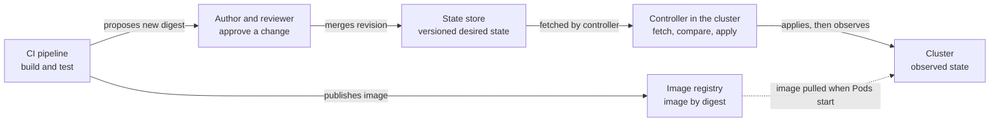

# GitOps

## Purpose

Use this page to understand GitOps as a way of operating a system, separate
from any one tool. After reading it you should be able to say what a pipeline
publishes, what a cluster controller pulls, and what a "synced" status does
and does not tell you.

The page is conceptual and contains nothing to run. For one tool's moving
parts, read [Flux](flux.md). To choose a tool, read
[Argo CD vs. Flux](argo-cd-vs-flux.md).

## What GitOps is

GitOps is a way of running a system in which you write down what should be
running, keep that description under version control, and let software inside
the environment fetch it and keep the environment matching it.

The description is called the **desired state**. The software that fetches and
applies it is called an **agent** or **controller**. The work of making the
real system match the description is called **reconciliation**.

## Why it matters

GitOps changes who acts on a cluster. In a push model, a pipeline job logs in
to the cluster and submits changes, as described in
[GitHub Actions with Kubernetes](../../cross-topic-guides/github-actions-with-kubernetes.md).
In GitOps the pipeline stops earlier, and a controller with standing
permissions acts instead.

People who miss that shift make predictable mistakes:

- They read "synced" as "working".
- They fix a production problem by hand and are surprised when the fix
  disappears, or when it quietly stays and the repository no longer describes
  the cluster.
- They assume that deleting a file always deletes the running resource, or
  that it never does.

## The four principles

The OpenGitOps project defines GitOps by four properties of the desired
state.[^opengitops-principles]

| Principle | In plain words | What it rules out |
| --- | --- | --- |
| Declarative | You describe the result you want, not the steps to get there. | A script of commands as the record of what should exist. |
| Versioned and immutable | Every version of the description is kept, and a stored version does not change. | Editing the record in place with no history. |
| Pulled automatically | Agents fetch the description from the source themselves. | A system that only changes when something outside pushes to it. |
| Continuously reconciled | Agents keep observing the real state and keep trying to apply the desired state. | Applying once and never checking again. |

Three details in the definitions are easy to miss:

- **The store does not have to be Git.** Git is the usual example, but any
  store that keeps immutable versions with access control and an audit record
  qualifies.[^opengitops-glossary]
- **"Continuously" does not mean "instantly".** It means reconciliation keeps
  happening.[^opengitops-glossary] Tools do this on an interval, so there is
  a delay between a change and its effect.
- **Desired state is configuration, not data.** It generally excludes
  persistent application data such as database contents.[^opengitops-glossary]
  GitOps does not back up or restore your data.

## What CI publishes and what the controller pulls

Text alternative: the CI pipeline builds and tests, publishes an image to a
registry, and proposes a change to the desired state that names the new image
by digest. An author and reviewer merge that change, which creates a new
revision in the state store. The controller inside the cluster fetches that
revision; the arrow shows the revision moving, and the controller is the one
that opens the connection. The controller applies the revision to the cluster
and then observes the result. Separately, the cluster pulls the image from
the registry when Pods start. No arrow runs from CI to the cluster.

The diagram helps you decide where a responsibility belongs. CI's output is
an artifact and a proposed change. The controller's input is a merged
revision. Argo CD's documentation states the consequence for its own tool:
with automated sync, a pipeline deploys by committing to the repository and
no longer needs direct access to Argo CD's API.[^argo-cd-automated-sync] The
standing access sits with the controller,
so its permissions deserve the scrutiny a pipeline's credentials would
otherwise get; see
[GitOps security and multi-tenancy](gitops-security-and-multitenancy.md).

## Five words to keep apart

| Word | Question it answers | Where the answer lives |
| --- | --- | --- |
| Source revision | Which version of the description is in play? | An identifier from the store, such as a commit hash. |
| Intended state | What should exist, according to that revision? | The rendered manifests for that revision. |
| Observed state | What exists right now? | The cluster's API. |
| Drift | Has the observed state moved away from the intended state? | A comparison made by the controller.[^opengitops-glossary] |
| Health | Do the applied resources report that they are ready? | Status fields on the resources, read by the controller. |

Two differences cause most confusion:

- **A new revision is not drift.** The controller acts in both cases, but a
  new revision is an intentional change to the description, while drift is
  the cluster moving away from an unchanged description.[^opengitops-glossary]
- **Applied is not healthy.** A controller can submit every manifest
  successfully and the workload can still fail to start.

## What a green sync does not prove

A successful reconciliation makes narrow statements. For example:

- Flux marks a Kustomization ready when the source was fetched, the manifests
  were built and applied, and the health checks it was told to run are
  passing. Those checks are optional settings.[^flux-kustomization]
- Argo CD's built-in check for a Deployment looks at the observed generation
  and the number of updated replicas, and an application's health is the
  worst health among its immediate child resources.[^argo-cd-resource-health]

Neither statement involves a request from a user. A sync can be green while
the application returns errors, because:

- the description itself is wrong, for example it names a wrong address for a
  dependency, and the controller faithfully applied it;
- the failure is outside the described resources, such as a database, a DNS
  record, or a certificate;
- the health check is weaker than real use.

Whether users are served is a separate question with separate evidence. See
[Observability stack](../../cross-topic-guides/observability-stack.md) for
that evidence, and
[End-to-end deployment](../../cross-topic-guides/end-to-end-deployment.md)
for what each delivery stage proves.

## Behaviour that depends on configuration

Two behaviours are often described as if GitOps always did them. Each tool
has its own setting and its own default, so check rather than assume.

**Pruning** means deleting a running resource because it is no longer in the
description.

- In Argo CD, automated sync does not delete such resources unless pruning is
  turned on. The documentation calls this a safety
  mechanism.[^argo-cd-automated-sync]
- In a Flux Kustomization, `prune` is a required field: the author must
  choose. When it is on, removing a resource from the source revision deletes
  that managed resource. Deleting the Kustomization also deletes its managed
  resources under the default `MirrorPrune` deletion policy; an explicit
  deletion policy can change that outcome.[^flux-kustomization]

**Self-healing** means reverting a change someone made directly in the
cluster.

- In Argo CD, a live change does not trigger an automated sync unless
  self-heal is turned on.[^argo-cd-automated-sync]
- A Flux Kustomization detects and corrects drift on each
  interval.[^flux-kustomization]

So "the file is gone, the resource is gone" and "the controller will undo
that edit" are both statements about one configuration, not about GitOps.

## Safe boundaries

### Secrets

The desired state often needs credentials, and a versioned store keeps every
version it has ever held. A secret committed in plain text is exposed to
everyone who can read the store, and stays in its history.

Both projects advise against putting plain-text secrets in the desired state.
Flux's guidance describes storing encrypted secrets that are decrypted in the
cluster, or having an operator fetch secrets from an external
store.[^flux-secrets-management] Argo CD recommends populating secrets on the
destination cluster, so that the delivery tool never handles the secret
values.[^argo-cd-secret-management]

The boundary to hold: the store may describe *which* secret a workload needs,
or hold it encrypted. It should not hold a readable secret value.

### Emergency changes by hand

During an incident someone may need to change the cluster directly. With a
reconciling controller that has two possible outcomes, and both are unsafe if
unplanned:

- The controller reverts the change at its next reconciliation.
- The change stays, and the store no longer describes the cluster. A later
  sync can then overwrite the fix without warning.

A safe emergency change is deliberate about both. Pause reconciliation for
the affected resources with the tool's own mechanism. In Flux, for example,
suspending a Kustomization stops new revisions from being applied and pauses
drift correction.[^flux-kustomization] Then make the change, record it, and
put the same change into the store before resuming. The emergency is over
only when the store and the cluster agree again.

## Example: one change to a fictional service

This example is illustrative. The service, repository, revisions, and
outcomes are invented, and nothing here was run. It assumes a controller set
up to apply new revisions automatically and to correct drift.

A team runs `parcel-tracker`. Its desired state lives in a repository named
`fleet-config`.

| Step | What happens | Source revision | Intended vs. observed | Health | Users |
| --- | --- | --- | --- | --- | --- |
| 1 | Steady state. | `7c1e` | Match. | Healthy. | Served. |
| 2 | CI builds a new image, publishes it, and opens a pull request that changes the image digest. | `7c1e` | Match. Nothing merged yet. | Healthy. | Served. |
| 3 | A reviewer merges. | `a1b2` in the store; the cluster still runs `7c1e`. | Differ, because of a new revision. Not drift. | Healthy. | Served. |
| 4 | The controller fetches `a1b2` and applies it. New Pods become ready. | `a1b2` | Match. | Healthy. | Errors: the new version reads a setting that the description never defined. |
| 5 | An engineer scales the Deployment by hand to cope. | `a1b2` | Differ. This is drift. | Healthy. | Still errors. |
| 6 | The controller's next reconciliation restores the replica count from `a1b2`. | `a1b2` | Match. | Healthy. | Still errors. |
| 7 | The team merges a revert. The controller applies `d4e5`. | `d4e5` | Match. | Healthy. | Served. |

What to notice:

- Health stayed green from step 4 to step 6 while users saw errors. The alert
  that caught it came from measuring requests, not from the controller.
- Steps 3 and 5 both show a mismatch, for different reasons.
- The hand edit in step 5 was undone in step 6 because this controller was
  configured to correct drift. Under another configuration it would have
  stayed.
- Recovery in step 7 was a new revision, not a command against the cluster.
  The store's history now records both the mistake and the fix.

## An analogy: a gardener with a planting plan

A garden has a planting plan kept in a binder where every past version is
filed. A gardener walks the beds on a regular round, compares them with the
current plan, and replants whatever does not match.

Where the analogy stops being accurate:

- **The gardener judges plants, not visitors.** The round confirms that each
  bed holds what the plan says. It does not find out whether visitors can use
  the path. A controller's health check has the same limit.
- **Weeding is an instruction, not a habit.** Whether the gardener removes a
  plant that the plan no longer lists depends on what they were told. Pruning
  is a setting.
- **The gardener only tends listed beds.** Anything outside the plan is left
  alone. A controller manages only the resources in its description.
- **A real gardener would notice a bad plan.** A controller will not. It
  applies a wrong description as faithfully as a right one.

## Common misconceptions

- **"GitOps means using Git."** The principles require a versioned, immutable
  store with pull and reconciliation. Keeping manifests in Git while a
  pipeline pushes them does not meet the third and fourth principles.
- **"Synced means it works."** Synced means the intended and observed states
  match.
- **"The controller always cleans up and always reverts edits."** Both depend
  on configuration.
- **"GitOps removes the need for cluster credentials."** It moves them from
  the pipeline to the controller.

## Check your understanding

- A pipeline finishes successfully in a GitOps setup. What has it produced,
  and what has it not done?
- The store has a new revision that the cluster has not applied yet. Is that
  drift? Why or why not?
- A file is deleted from the store. What do you need to know before you can
  say whether the running resource will be deleted?
- A sync is green and users report errors. Name two explanations that are
  consistent with both facts.

## Next steps

- One tool's parts and how a revision moves through them: [Flux](flux.md),
  then [Flux reconciliation and Helm releases](flux-reconciliation-and-helm.md).
- Choosing between two tools: [Argo CD vs. Flux](argo-cd-vs-flux.md).
- Controller permissions, tenancy, and secrets:
  [GitOps security and multi-tenancy](gitops-security-and-multitenancy.md).
- The push model this replaces:
  [GitHub Actions with Kubernetes](../../cross-topic-guides/github-actions-with-kubernetes.md).
- What each delivery stage proves:
  [End-to-end deployment](../../cross-topic-guides/end-to-end-deployment.md).
- Evidence that users are served:
  [Observability stack](../../cross-topic-guides/observability-stack.md).
- An applied route on AWS: [GitOps on EKS](../../cross-topic-guides/gitops-on-eks.md).

## Official documentation for deeper study

- The four principles: [OpenGitOps - GitOps Principles](https://opengitops.dev/).
- Definitions of desired state, drift, pull, reconciliation, and state store:
  [OpenGitOps - GitOps Glossary](https://github.com/open-gitops/documents/blob/main/GLOSSARY.md).
- Pruning, self-heal, and automated sync semantics in Argo CD:
  [Argo CD - Automated Sync Policy](https://argo-cd.readthedocs.io/en/stable/user-guide/auto_sync/).
- What Argo CD's health status measures:
  [Argo CD - Resource Health](https://argo-cd.readthedocs.io/en/stable/operator-manual/health/).
- Pruning, intervals, suspension, and health checks in Flux:
  [Flux - Kustomization](https://fluxcd.io/flux/components/kustomize/kustomizations/).
- Options for secrets: [Flux - Secrets Management](https://fluxcd.io/flux/security/secrets-management/)
  and [Argo CD - Secret Management](https://argo-cd.readthedocs.io/en/stable/operator-manual/secret-management/).

## Related links

- [Argo CD vs. Flux](argo-cd-vs-flux.md)
- [Flux](flux.md)
- [Flux reconciliation and Helm releases](flux-reconciliation-and-helm.md)
- [GitOps security and multi-tenancy](gitops-security-and-multitenancy.md)
- [GitOps on EKS](../../cross-topic-guides/gitops-on-eks.md)
- [Back to Kubernetes applications and tools](index.md)
- [Back to Kubernetes index](../index.md)
- [Back to root index](../../../README.md)

[^opengitops-principles]: [OpenGitOps - GitOps Principles v1.0.0](https://opengitops.dev/), source record `opengitops-principles`.
[^opengitops-glossary]: [OpenGitOps - GitOps Glossary](https://github.com/open-gitops/documents/blob/main/GLOSSARY.md), source record `opengitops-glossary`.
[^flux-kustomization]: [Flux - Kustomization](https://fluxcd.io/flux/components/kustomize/kustomizations/), source record `flux-kustomization`.
[^flux-secrets-management]: [Flux - Secrets Management](https://fluxcd.io/flux/security/secrets-management/), source record `flux-secrets-management`.
[^argo-cd-automated-sync]: [Argo CD - Automated Sync Policy](https://argo-cd.readthedocs.io/en/stable/user-guide/auto_sync/), source record `argo-cd-automated-sync`.
[^argo-cd-resource-health]: [Argo CD - Resource Health](https://argo-cd.readthedocs.io/en/stable/operator-manual/health/), source record `argo-cd-resource-health`.
[^argo-cd-secret-management]: [Argo CD - Secret Management](https://argo-cd.readthedocs.io/en/stable/operator-manual/secret-management/), source record `argo-cd-secret-management`.
