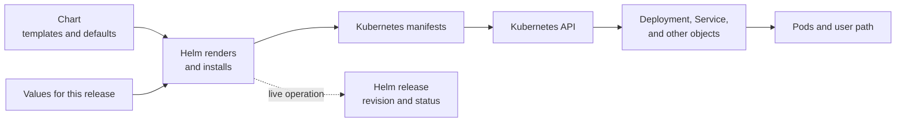

# How Helm turns a chart into a release

## The idea in one minute

Helm packages related Kubernetes resources into a **chart**. A chart
contains templates and default settings. You supply **values** to
select settings for one installation. Helm renders Kubernetes YAML
and installs it as a named **release**. Later upgrades and rollbacks
create revisions of that release.[^helm-intro]

A chart is like a reusable blueprint; values are choices for one
building; a release is the installation made from them. The
analogy stops at the Kubernetes API: a blueprint cannot prove
that the constructed application serves users correctly, and
Helm can include hooks and custom resource definitions with
different lifecycles.

Text alternative: Helm combines a chart with chosen values to render
Kubernetes manifests. The API stores the resulting objects, and
Kubernetes controllers work toward their desired state. Helm records
a release revision and status; the application's user path is a
separate check.

## One chart, two releases

The names and settings below are **invented**. No chart was built,
rendered, or installed for this example.

Suppose a `lesson-api` chart contains templates for a Deployment
and Service. The team installs it once as `lessons-dev` in the
`development` namespace and again as `lessons-prod` in `production`.
The installations may use different values even though they start
from the same chart. A chart version identifies the package being
used; a release revision records a change to one installation.
The application's own version is a separate value or image choice,
depending on the chart.[^helm-intro]

| Item | `lessons-dev` | `lessons-prod` |
| --- | --- | --- |
| Chart | `lesson-api`, reviewed version | Same chart, possibly a separately promoted version |
| Values | For example, `replicaCount: 1` | For example, `replicaCount: 3` |
| Release | Helm history for development | Separate Helm history for production |
| Real outcome | Check the development API | Check the production API |

`replicaCount` is **illustrative**. A real chart may name or handle
that setting differently. Inspect its documented values before
overriding anything. Changing a values file alone does not change
the cluster; the change must reach the release through the team's
deployment path.[^helm-intro]

## What each check can tell you

| Check | What it answers | What it cannot prove |
| --- | --- | --- |
| Read the chart and values | Which templates and defaults are in the reviewed chart version? | That the generated objects fit this cluster or application. |
| Render locally with `helm template` | Which manifests result from these chart inputs on the client? | That the cluster accepts them; values normally looked up in the cluster are simulated locally. |
| Use a Helm server dry run where appropriate | Would this Helm operation pass current server-side checks without persisting changes? | That a later live operation, controller rollout, or user request will succeed. |
| Read Helm release status | What did Helm record for this installation and revision? | That every Pod is ready or the application works.[^helm-status] |
| Read Kubernetes and application evidence | Did controllers make the desired objects ready, and can a user complete a request? | That every future request or dependent service will work. |

Helm's current `helm template` documentation explicitly says local
rendering does no server-side API support test. The current upgrade
reference distinguishes client and server dry runs. A dry-run output
can contain rendered Secrets, so review where that output is stored
or shared.[^helm-template][^helm-upgrade]

If a release is managed by Flux or another controller, change its
reviewed source rather than running a separate manual upgrade.
[How Flux applies a HelmRelease from Git](flux-reconciliation-and-helm.md)
shows the additional source and controller handoffs.

## Revisions are not time travel

Helm records release revisions, and `helm history` and
`helm rollback` can select an earlier revision. A rollback changes
Kubernetes resources again. It does not automatically reverse a
database migration, an external API call, user data, or every
custom-resource change. Verify the workload and user path after
a rollback as you would after an upgrade.[^helm-intro]

Custom Resource Definitions need extra care. Helm documents a
special `crds/` install path but does not manage CRD upgrades or
deletion through the normal Helm release lifecycle. A dry run
cannot establish the newly registered API in the cluster for a
custom resource that needs it. Read the chart's CRD procedure
before changing an operator or platform chart.[^helm-crds]

## Crossplane is a second controller layer

Crossplane is a useful example of Helm's boundary. The official
Crossplane installation guide uses Helm to install **Crossplane
core** into an existing Kubernetes cluster. Crossplane's own
`Provider`, `Function`, and `Configuration` packages and their
controllers then have separate health, compatibility, and
upgrade questions. A Helm release saying core was installed
does not prove an AWS provider can authenticate or reconcile
a managed resource.[^crossplane-install][^crossplane-providers]

For an installation, use the current
[official Crossplane install procedure](https://docs.crossplane.io/latest/get-started/install/)
and [provider guidance](https://docs.crossplane.io/latest/packages/providers/).
The [Crossplane section](../crossplane/index.md) explains
the package and external-resource model. Review the exact chart
version, values, CRDs, and recovery path in your environment
before making a live change.

## Check your understanding

1. Could two namespaces contain releases from the same chart with
   different values? What would each release history track?
2. If `helm template` succeeds, what must still be checked against
   the cluster?
3. Why would a healthy Helm release not prove a Crossplane
   provider can create an AWS resource?

## Explore further

- [Using Helm](https://helm.sh/docs/intro/using_helm/)
  introduces charts, values, releases, and revision history.
  [^helm-intro]
- [helm template](https://helm.sh/docs/helm/helm_template/)
  describes local rendering and its limits.[^helm-template]
- [helm upgrade](https://helm.sh/docs/helm/helm_upgrade/)
  documents dry-run modes and output sensitivity.[^helm-upgrade]
- [Helm and CRDs](https://helm.sh/docs/chart_best_practices/custom_resource_definitions/)
  describes their separate lifecycle.[^helm-crds]
- [Back to Kubernetes applications and tools](index.md).

[^helm-intro]: [Helm, Using Helm](https://helm.sh/docs/intro/using_helm/), source record `helm-intro`.
[^helm-template]: [Helm, helm template](https://helm.sh/docs/helm/helm_template/), source record `helm-template`.
[^helm-upgrade]: [Helm, helm upgrade](https://helm.sh/docs/helm/helm_upgrade/), source record `helm-upgrade`.
[^helm-status]: [Helm, helm status](https://helm.sh/docs/helm/helm_status/), source record `helm-status`.
[^helm-crds]: [Helm, Custom Resource Definitions](https://helm.sh/docs/chart_best_practices/custom_resource_definitions/), source record `helm-crds`.
[^crossplane-install]: [Crossplane, Install Crossplane](https://docs.crossplane.io/latest/get-started/install/), source record `crossplane-install`.
[^crossplane-providers]: [Crossplane, Providers](https://docs.crossplane.io/latest/packages/providers/), source record `crossplane-providers`.
