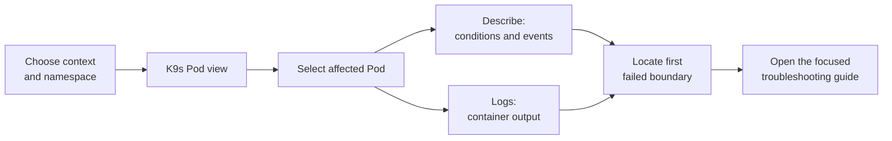

# Inspect a failing Pod with K9s

## What you will do

K9s is a terminal interface that **watches Kubernetes resources**
and lets you move between views, details, and logs. It shows
information from the cluster; it is not another source of truth.
Its shortcuts can also change resources when your identity has
permission, so start by confirming the target.[^k9s-overview]

This guide follows one task: find a Pod that is not serving an
application, inspect its evidence, and choose a focused next step.
The example uses an **invented** `lesson-api` Pod in namespace
`lessons`. No cluster or K9s session was used to create this page.



Text alternative: choose a known cluster context and namespace,
open K9s's Pod view, select the affected Pod, and read its
description and relevant container logs. Use the first concrete
failure signal to choose a troubleshooting guide.

## 1. Confirm the target

A kubeconfig context names a cluster, user, and optional namespace
choice. Check which context you intend to use, and verify its
cluster mapping if the name is ambiguous. The
[safe kubectl inspection guide](../commands/daily-usage.md)
walks through that check.

For an illustrative context named `learning-lab` and namespace
`lessons`, launch K9s this way:

```bash
k9s --context learning-lab -n lessons --readonly
```

Replace both names with your actual target. K9s documents
`--context`, `-n`, and `--readonly`; the last flag disables
K9s modification commands for this session.[^k9s-commands]
It does not remove your Kubernetes permissions or make the
cluster itself read only. Confirm the context and namespace
shown in K9s before reading or acting on a row.

> [!NOTE]
> If K9s cannot list Pods, an empty view may reflect the
> namespace, a filter, unavailable API access, or your
> permissions. An empty table alone does not prove that
> no Pods exist.

## 2. Open the Pod view and select one Pod

Inside K9s, type `:pod` and press Enter. K9s command mode
also accepts a resource name with a namespace, such as
`:pod lessons`; `?` shows the active help and available
keys in your installed version.[^k9s-commands]

Look at the **Pod name, namespace, status display, and restarts**.
If there are many rows, `/lesson-api` filters the current view.
Select the affected row with the keyboard before using an action
key. A displayed status is a clue, not a complete diagnosis:
Kubernetes distinguishes a Pod's phase from container waiting
and termination reasons.[^k8s-pod-lifecycle]

For example, an invented row might show
`lesson-api-abc12` with `ImagePullBackOff`. That suggests the
container image is not available to the node yet; it does not
by itself tell you whether the image name, tag, registry
credentials, or network path is responsible.

## 3. Read the evidence for the selected Pod

K9s documents `d` for describe, `v` for the resource view,
and `l` for logs in its key mappings. Press `?` if the
active view or your installed version shows a different
binding.[^k9s-commands]

| First clue | Read next | Why |
| --- | --- | --- |
| Pod is Pending | `d` for Pod conditions and recent events. | Scheduler, volume, and policy messages can explain why it has not started. |
| Image pull or container creation fails | `d` for waiting reason and related events. | Application logs may not exist because the container has not run. |
| Container starts and restarts | `d`, then `l` for the relevant container. | Termination reason and logs answer different parts of a restart. |
| Pod is Ready but users still fail | Service and entry-path evidence outside this Pod. | Pod readiness alone does not prove routing or an application response. |

For the invented image-pull case, select the row and press `d`.
Read the reported image name and the recent pull event. Do
not edit the Deployment just because the table says
`ImagePullBackOff`; identify the exact failing image path
first. The [Pod debugging documentation](https://kubernetes.io/docs/tasks/debug/debug-application/debug-pods/)
explains the underlying Kubernetes checks.[^k8s-debug-pods]

A full YAML view and logs may contain configuration, tokens,
or customer data. Share only the evidence needed for a
reviewed issue or incident.

## 4. Follow the first failed boundary

- For an image pull in a local kind cluster, follow
  [Diagnose a local image pull in kind](../troubleshooting/kind.md).
- For repeated container restarts, follow
  [Diagnose CrashLoopBackOff](../troubleshooting/crashloopbackoff.md).
- For scheduling or memory pressure, follow
  [Investigate Kubernetes resource pressure](../commands/workflows.md).
- For a Ready Pod with a failing user request, follow
  [Find the first failing Kubernetes boundary](../troubleshooting/common-solutions.md).

K9s is a convenient way to **read** those signals. A
restart, edit, delete, port forward, or shell is a separate
operation with its own target, permission, and side effects.
The official K9s command reference lists deletion and
immediate-kill keys; do not use them as generic repair
shortcuts.[^k9s-commands]

## Check your understanding

1. Why should you confirm context and namespace before
   trusting an empty Pod table?
2. Why might logs be unavailable for an image-pull failure?
3. If a Pod is Ready but the website fails, which boundary
   should you inspect next?

## Explore further

- [K9s commands](https://k9scli.io/topics/commands/)
  documents launch flags, navigation, filters, and action keys.
  [^k9s-commands]
- [K9s overview](https://k9scli.io/)
  shows the Pod, logs, and relationship views.[^k9s-overview]
- [Debug Pods](https://kubernetes.io/docs/tasks/debug/debug-application/debug-pods/)
  explains the Kubernetes evidence behind these screens.
  [^k8s-debug-pods]
- [Back to Kubernetes applications and tools](index.md).

[^k9s-overview]: [K9s, Overview](https://k9scli.io/), source record `k9s-overview`.
[^k9s-commands]: [K9s, Commands](https://k9scli.io/topics/commands/), source record `k9s-commands`.
[^k8s-debug-pods]: [Kubernetes, Debug Pods](https://kubernetes.io/docs/tasks/debug/debug-application/debug-pods/), source record `k8s-debug-pods`.
[^k8s-pod-lifecycle]: [Kubernetes, Pod lifecycle](https://kubernetes.io/docs/concepts/workloads/pods/pod-lifecycle/), source record `k8s-pod-lifecycle`.
