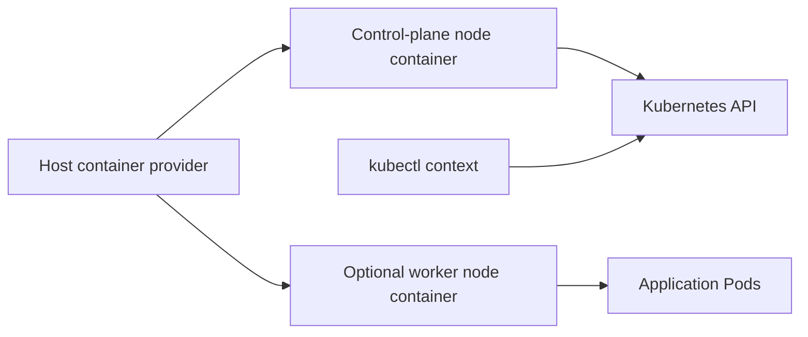
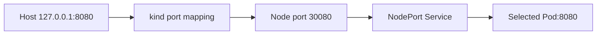

# How kind custom clusters fit together

## What problem does a custom cluster solve?

`kind` means **Kubernetes in Docker**, but current kind can use
Docker, Podman, or nerdctl as its container provider. It starts
containers that act as Kubernetes nodes. A default cluster is enough
to learn basic Pods and Services. A custom configuration is useful
when a test needs a particular node layout, Kubernetes version,
mounted host files, or a route from a host port into the cluster.
[^kind-quick-start][^kind-configuration]

A kind cluster is a **model of a cluster on one computer**. Adding
worker-node containers gives the scheduler more nodes to choose
between, but it does not add another physical machine, failure
domain, or real compute capacity. Use it to learn and test behavior;
do not treat a multi-node kind lab as proof that a production design
survives a machine failure.[^kind-configuration]



Text alternative: a host container provider runs a kind control-plane
node and, if configured, worker nodes. The control plane exposes the
Kubernetes API; a `kubectl` context selects that API. Workload Pods
can run on eligible nodes. All nodes still share the same host.

## Read a small configuration

This **illustrative** file describes a cluster with one control-plane
node and one worker. The host port is included to show where kind's
port mapping fits; a separate Kubernetes Service and an application
are still needed to answer a request.

```yaml
kind: Cluster
apiVersion: kind.x-k8s.io/v1alpha4
nodes:
  - role: control-plane
    extraPortMappings:
      - listenAddress: "127.0.0.1"
        hostPort: 8080
        containerPort: 30080
        protocol: TCP
  - role: worker
```

| Part | What it means |
| --- | --- |
| `kind` and `apiVersion` | Identify this as a kind cluster-creation configuration, not a Kubernetes workload manifest. |
| `nodes` | Ask kind for one control-plane container and one worker container. |
| `extraPortMappings` | Forward host `127.0.0.1:8080` to port `30080` on the control-plane node container. |
| `protocol: TCP` | Match the transport used by the example HTTP request. |

The configuration is consumed when creating the cluster, for example
with `kind create cluster --name study --config kind-study.yaml`.
The CLI `--name` value takes precedence over a name in the file.
Kind then writes access configuration for a context such as
`kind-study`; check the current context before using `kubectl`.
This example was **not run** for this page.[^kind-configuration]
[^kind-quick-start]

### Follow the complete port path

Imagine a test application that listens on Pod port `8080`. To
reach it from the host through the example mapping, a Kubernetes
`NodePort` Service would need `nodePort: 30080`, a Service selector
matching the application Pods, and a `targetPort` that reaches the
application's listening port. The path is:



Text alternative: the host request enters kind's port mapping,
arrives at node port `30080`, passes through a NodePort Service, and
reaches a selected Pod listening on `8080`.

The exact equality matters: for a NodePort Service, kind says the
mapping's `containerPort` must equal the Service's `nodePort`.
Mapping a host port does not create the Service, choose its Pods,
or make an unhealthy application respond. Binding the host side to
`127.0.0.1` keeps this lab path on the local host; kind explicitly
discourages exposing a local cluster's API publicly.
[^kind-configuration][^kubernetes-service]

## What else can the file change?

| Need | Configuration concept | Limit to remember |
| --- | --- | --- |
| Observe scheduling across nodes | Add `worker` entries or node labels. | Containers on one host do not provide machine-level resilience. |
| Use a particular Kubernetes version | Choose a compatible `kindest/node` image and digest from the release notes for the installed kind version. | This is the **node image**, not your application image. |
| Share a host directory with a node | Use `extraMounts` with host and container paths. | The path and file-sharing behavior depend on the host provider; avoid treating a local mount as durable cluster storage. |
| Receive a host request | Use `extraPortMappings` on the intended node. | A matching Service or other listener must still exist inside the cluster. |
| Serve images built locally | Load an image into the target cluster or configure a reachable registry. | A host image is not automatically present in node image stores. |

Kind's node image packages Kubernetes components for a node. An
application image packages the program your Pod runs. Changing one
does not rebuild the other. For image distribution, start with
[kind images and local registries](kind-images-and-local-registries.md)
and use the [image-pull diagnostic path](../troubleshooting/kind.md)
when a Pod cannot start.[^kind-node-image][^kind-quick-start]

## Check your understanding

- If the host mapping is `8080 → 30080` but a Service uses
  `nodePort: 31000`, where does the request stop?
- If a second worker is added, what behavior can you test, and
  which real failure condition remains untested?
- If `kubectl` reads another cluster after kind creates `study`,
  which boundary should you check first?

## Explore further

- [kind Configuration](https://kind.sigs.k8s.io/docs/user/configuration/)
  is the field-level source for cluster creation.[^kind-configuration]
- [kind Quick Start](https://kind.sigs.k8s.io/docs/user/quick-start/)
  covers installation, creation, context, and cleanup.[^kind-quick-start]
- [Kubernetes Service](https://kubernetes.io/docs/concepts/services-networking/service/)
  explains NodePort and backend selection.[^kubernetes-service]
- [Back to applications and tools](index.md).

[^kind-quick-start]: [kind, Quick Start](https://kind.sigs.k8s.io/docs/user/quick-start/), source record `kind-quick-start`.
[^kind-configuration]: [kind, Configuration](https://kind.sigs.k8s.io/docs/user/configuration/), source record `kind-configuration`.
[^kind-node-image]: [kind, Node Image](https://kind.sigs.k8s.io/docs/design/node-image/), source record `kind-node-image`.
[^kubernetes-service]: [Kubernetes, Service](https://kubernetes.io/docs/concepts/services-networking/service/), source record `kubernetes-service`.
