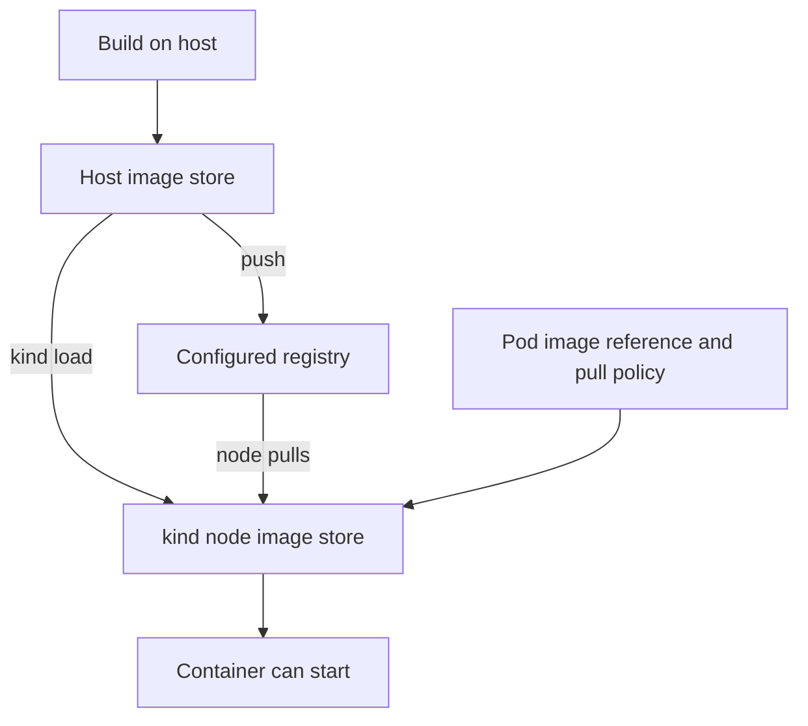

# How images reach a kind Pod

## The idea

A Pod names an image, such as `orders-api:dev-1`. Kubernetes must
make that image available **on the node where the Pod runs**. An image
built on your computer stays in the computer's container-runtime
store until you load it into kind nodes or push it to a registry that
those nodes can reach.[^kind-quick-start][^kubernetes-images]

Think of the image name as a **request for a package**, not the
package itself. The node needs a local copy or a reachable package
source. The analogy stops at image identity: tags can be reused and
the exact content behind a tag can change. A digest names a
particular image content more precisely.[^kubernetes-images]

Text alternative: a host build first produces an image in the host
store. A `kind load` operation copies it to kind nodes; alternatively,
a push sends it to a registry from which nodes pull it. The Pod's
image reference and pull policy must agree with the chosen path
before the container can start.

## Two local development paths

| Path | When it fits | What must be true |
| --- | --- | --- |
| Load a built image into kind | A small lab or one-off test needs a local build. | Load the **exact name and tag** into the correct named cluster; the Pod's pull policy must permit using the node copy. |
| Push to a local registry | Repeated builds or several workloads should pull from one local source. | Set up the registry and kind node connectivity first; push and reference the same image name. A push command alone does not configure the node. |

For an **invented** `study` cluster, suppose you build
`orders-api:dev-1` on the host. The side-load path copies
`orders-api:dev-1` into that cluster's nodes. The Pod then requests
the same reference, normally with `imagePullPolicy: IfNotPresent`
for this local workflow. Kind's Quick Start demonstrates this
pattern. These steps were **not run** for this page.[^kind-quick-start]
[^kubernetes-images]

The registry path has one extra boundary. The host can push to
`localhost:5001`, but `localhost` inside a kind node points back
to that node, not to the host. Kind's documented local-registry
setup connects the registry container to the kind network and
configures each node's container runtime to resolve the image
reference to that registry. Use the [official local-registry
procedure](https://kind.sigs.k8s.io/docs/user/local-registry/)
before using its `localhost:5001/...` example in a Pod. The
page's older bare `docker tag` and `docker push` recipe did not
establish this path.[^kind-local-registry]

> [!NOTE]
> An application container running **inside a Pod** has its own
> network namespace too. Kind's registry alias is configured for
> the node's image pull; application code inside a Pod does not
> automatically reach the registry at `localhost:5001`.
> [^kind-local-registry]

## How the pull policy changes the result

The image reference and `imagePullPolicy` are part of the Pod
specification. With `IfNotPresent`, the kubelet can use a matching
image already on the node. With `Always`, it consults a registry
when starting the container, so side-loading a local image may
not solve a registry problem. With `Never`, the image must already
be on the node. Kubernetes chooses a default when the object is
created: `:latest` or no tag normally selects `Always`, while a
non-latest tag normally selects `IfNotPresent`. Changing the tag
later does not automatically rewrite that stored policy.
Read the actual Pod specification rather than assuming the default.
[^kubernetes-images][^kind-quick-start]

Reusing `orders-api:dev-1` for new code can confuse a test: one
node may hold old content under the same tag while another obtains
a newer copy. Prefer a distinct development tag for each build
when the result matters, and confirm the Pod is using the image
you intended. For reproducible release images, consider
digest-based references and a registry rather than treating a
mutable tag as proof of content.[^kubernetes-images]

## A private registry is a different question

A private registry adds authentication. Kind's private-registry
guide presents Kubernetes `imagePullSecrets` as the preferred
portable route when possible. Pulling to the host and side-loading
is another local option. Mounting credentials into kind nodes is
more specific to the lab and can expose plain credentials; a host
configuration that only names an external credential helper will
not give the node the actual secret. Follow the official procedure
for the environment instead of copying credentials into a
repository.[^kind-private-registries]

## Find where a failed pull stops

Use the [kind image-pull diagnostic guide](../troubleshooting/kind.md)
to confirm context, namespace, the Pod's exact image and policy,
and the pull event. This explains why these symptoms need
different fixes:

| Observed evidence | Likely next boundary |
| --- | --- |
| Host has the build; node does not | Load the matching image into the correct kind cluster, or use a configured registry. |
| Pod requests another tag or registry prefix | Correct the workload reference or publish the reference it actually requests. |
| Registry address is `localhost` but kind has no registry alias | Finish the local-registry setup for the node. |
| Registry says authentication failed | Check the private-registry credential path. |
| Container starts but the application fails | The image is available; inspect application state, logs, and readiness instead. |

## Explore further

- [kind Quick Start](https://kind.sigs.k8s.io/docs/user/quick-start/)
  explains side-loading images.[^kind-quick-start]
- [kind Local Registry](https://kind.sigs.k8s.io/docs/user/local-registry/)
  shows the complete host-to-node registry setup.[^kind-local-registry]
- [kind Private Registries](https://kind.sigs.k8s.io/docs/user/private-registries/)
  covers authenticated pulls.[^kind-private-registries]
- [Kubernetes Images](https://kubernetes.io/docs/concepts/containers/images/)
  explains image references, digests, and pull policy.[^kubernetes-images]
- [How kind custom clusters fit together](kind-custom-clusters.md).
- [Back to applications and tools](index.md).

[^kind-quick-start]: [kind, Quick Start](https://kind.sigs.k8s.io/docs/user/quick-start/), source record `kind-quick-start`.
[^kind-local-registry]: [kind, Local Registry](https://kind.sigs.k8s.io/docs/user/local-registry/), source record `kind-local-registry`.
[^kind-private-registries]: [kind, Private Registries](https://kind.sigs.k8s.io/docs/user/private-registries/), source record `kind-private-registries`.
[^kubernetes-images]: [Kubernetes, Images](https://kubernetes.io/docs/concepts/containers/images/), source record `kubernetes-images`.
