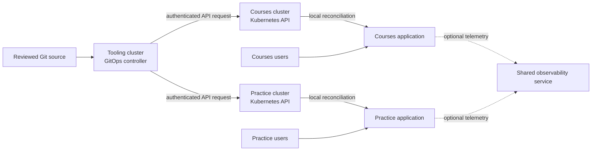

# How a tooling cluster connects to workload clusters

## Follow two different paths

A tooling cluster is a Kubernetes cluster assigned a platform role. It
might host a GitOps controller, but it does not become the Kubernetes
control plane for the workload clusters. Each target still has its own
API server and controllers. Read [when a tooling cluster helps](tooling-clusters.md)
first if the placement decision is new.

Imagine a shared dispatch desk. It reads approved delivery instructions
and sends them to two buildings. People visiting a building do not
walk through the desk. This analogy helps separate **management
traffic** from **user traffic**; it does not guarantee that an
application has no dependency on the desk's other services.

The example below is invented. No cluster, credential, network path,
GitOps controller, application, or failure test was created for it.

Text alternative: reviewed Git holds desired changes. A controller in
the tooling cluster separately contacts each workload cluster's
Kubernetes API. The target clusters' own controllers reconcile their
applications. Users reach the applications through their workload
clusters, not through the GitOps controller. Applications may send
telemetry to a shared observability service if one was installed.

A successful GitOps request only says that some desired state reached
the target; the exact status meaning depends on the controller and
its health checks. It does not by itself prove a user request works.
The application's own health and external path must be checked
separately.

This diagram shows **central push**: a controller in the tooling cluster
contacts both target APIs. An alternative is **local pull**: a
controller inside each workload cluster reads the approved source and
reconciles only that cluster. A shared interface or source can still
exist, but the central cluster need not hold target write credentials
for that path. Flux documents bootstrap of local controllers and also
supports remote Kustomizations; the operator chooses which path to
configure.[^flux-bootstrap][^flux-remote]

## Inspect each boundary

| Boundary | What crosses it | What to verify |
| --- | --- | --- |
| Git to controller | A source revision and any referenced chart or image. | Who can change or publish trusted inputs? Which revision is in use? |
| Tooling to target API | Authenticated Kubernetes API requests. | Can the controller reach the API endpoint? Which target identity does it use? What does RBAC allow? |
| Target API to application | Kubernetes objects reconciled by local controllers. | Which objects exist, and are the workload and its dependencies ready? |
| User to application | Requests through that application's exposure path. | Does a real user request work, including storage and external services? |
| Application to observability, if configured | Metrics, logs, or traces. | Is collection local or remote? Does a central outage affect visibility only, or also application behavior? |

Argo CD can register external clusters and store their connection
configuration. Flux Kustomizations can use a remote kubeconfig. Their
configuration differs, but both still need a reachable target API
and permission there.[^argo-clusters][^argo-declarative][^flux-remote]
Kubernetes RBAC answers which API actions an identity may perform;
network reachability and authentication are separate questions.
[^kubernetes-rbac]

## Bound the management connection

For each target, choose a credential or identity that can be rotated
and revoked, document who may change it, and scope its effective
permissions to the intended resources. Also protect Git writers:
changing trusted configuration can cause the controller to make API
requests even when a writer has no direct `kubectl` access. If several
teams share a controller, check its own source and destination rules
*and* target RBAC. Flux's multi-tenancy guidance calls out the risk of
controllers running with broad default authority.[^flux-multitenancy]

Do not assume that a namespace or a NetworkPolicy isolates every
platform service. A controller that legitimately holds broad target
credentials can still cross a namespace boundary by using those
credentials. [GitOps security and multi-tenancy](gitops-security-and-multitenancy.md)
walks through the complete permission chain.

## Trace a tooling-cluster outage

Suppose the tooling cluster stops while the two workload clusters stay
healthy. In this specific example, the central controller cannot send
new desired changes or correct drift until it recovers. Existing
application Pods **might** keep serving because the user path bypasses
that controller. The answer changes if an application calls a service
in the tooling cluster, if credentials expire and require its service
to refresh, or if the workload cluster also fails. A central dashboard
might become unavailable even while the application remains usable.
These are predictions from the drawn dependencies, not results of an
outage exercise.

| During the outage | Immediate question | Recovery evidence |
| --- | --- | --- |
| Deployment requests wait | Can the team make an authorized urgent change through an independent path? | Which Git revision and target state were reconciled after restart? |
| Existing application traffic may continue | Does a real request still work from the user path? | A representative request and dependency check. |
| Shared telemetry may disappear | Is there a target-local signal or provider-level view? | Alert and data collection resume, with any gap recorded. |
| Stored target credentials become unavailable with the controller | Can an operator recover them without the failed cluster? | Tested credential recreation and target API access. |

Keep the tooling cluster's definition, controller install method,
trusted source configuration, and credential recovery procedure
available outside the failed cluster. Otherwise recovery can become
circular: the controller needed to restore the cluster was itself
inside that cluster. Argo CD documents disaster recovery procedures;
the exact sequence depends on the services selected and needs a
rehearsal. Before resuming a restored controller, compare its trusted
source revision and planned deletions with each target's live state.
Do not assume an automatic sync or prune operation is safe after a
long outage.[^argo-disaster-recovery]

The team also needs a way to notice a tooling-cluster failure without
depending only on dashboards hosted there. An independent health
signal and an authorized direct path to each target make the recovery
plan testable. If the tooling cluster also runs infrastructure
controllers such as Cluster API or Crossplane, recovery of their
managed objects needs a separate product-specific procedure; do not
recreate controllers and assume they will safely adopt existing
external resources.

## Check your understanding

1. Which arrow in the diagram represents a user's request, and which
   represents a deployment request?
2. Why are API reachability, authentication, and RBAC three separate
   checks for the controller?
3. What evidence would show that an application survived a tooling
   outage? What evidence would show that deployment service recovered?

## Deeper study

- [Argo CD cluster management](https://argo-cd.readthedocs.io/en/stable/operator-manual/cluster-management/)
  and [declarative cluster setup](https://argo-cd.readthedocs.io/en/stable/operator-manual/declarative-setup/)
  for its target connection.
- [Flux remote Kustomizations](https://fluxcd.io/flux/components/kustomize/kustomizations/)
  plus [bootstrap](https://fluxcd.io/flux/installation/bootstrap/)
  and [multi-tenancy](https://fluxcd.io/flux/installation/configuration/multitenancy/)
  for its remote and permission paths.
- [Kubernetes RBAC](https://kubernetes.io/docs/reference/access-authn-authz/rbac/)
  for target API authorization.
- [EKS tooling cluster architecture](../../cross-topic-guides/eks-tooling-cluster-architecture.md)
  for AWS network and identity choices.

[Back to Kubernetes applications and tools](index.md)

[^argo-clusters]: [Argo CD - Cluster Management](https://argo-cd.readthedocs.io/en/stable/operator-manual/cluster-management/).
[^argo-declarative]: [Argo CD - Declarative Setup](https://argo-cd.readthedocs.io/en/stable/operator-manual/declarative-setup/).
[^argo-disaster-recovery]: [Argo CD - Disaster Recovery](https://argo-cd.readthedocs.io/en/stable/operator-manual/disaster_recovery/).
[^flux-remote]: [Flux - Kustomization and remote clusters](https://fluxcd.io/flux/components/kustomize/kustomizations/).
[^flux-multitenancy]: [Flux - Multi-tenancy](https://fluxcd.io/flux/installation/configuration/multitenancy/).
[^flux-bootstrap]: [Flux - Bootstrap](https://fluxcd.io/flux/installation/bootstrap/).
[^kubernetes-rbac]: [Kubernetes - Using RBAC Authorization](https://kubernetes.io/docs/reference/access-authn-authz/rbac/).
