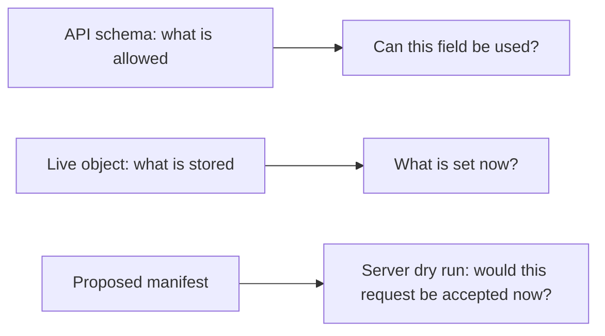

# Inspect a Kubernetes API field before changing a manifest

## What you will learn

A manifest field has three different views: the **schema** says what
the API accepts, a **live object** says what the cluster currently
stores, and a **proposed file** says what you intend to send. Checking
one view does not establish the others.[^explain][^get][^dry-run]



Text alternative: ask the API for the field definition, read the
current object, then submit the proposed file as a server dry run.
A successful dry run still does not prove a later rollout or user
request will work.

This guide uses an **invented** Deployment named `web` in namespace
`shop` and a file at `k8s/web-deployment.yaml`. No cluster was used
to test the example. Replace all three values with your actual
target; do not create the example file just to follow along.

## Before you start

- Confirm which cluster and namespace you are allowed to inspect.
  The [opening inspection guide](daily-usage.md) explains how to
  check a context whose name may be ambiguous.
- Have read access to the Deployment for the live-object step.
  A server dry run needs the same authorization as the corresponding
  real request, even though it does not persist the object.[^dry-run]
- Know who owns the live object. A GitOps or release controller may
  replace a direct change. This guide does not apply a live change.

### 1. Ask this cluster about the field

```bash
kubectl config current-context
kubectl api-resources --api-group=apps
kubectl explain deployment.spec.strategy --api-version=apps/v1
```

Compare the context with your intended environment **before** using
the next two commands. `api-resources` lists API resources served by
this cluster; its `NAMESPACED` column helps distinguish namespaced
resources such as Deployments from cluster-scoped ones. `explain`
reads the resource's API field documentation. It describes
`strategy`, not the value used by your `web` Deployment.
[^api-resources][^explain]

For a nested setting, ask for the exact path:

```bash
kubectl explain deployment.spec.strategy.rollingUpdate.maxUnavailable --api-version=apps/v1
```

The answer tells you the accepted field shape and description for
the chosen API version. If `explain` cannot find it, check the kind,
API version, field spelling, and cluster version. Do not treat an
example from a different Kubernetes version as proof that this
cluster accepts it.[^explain]

### 2. Read the stored Deployment

```bash
kubectl get deployment web -n shop -o yaml
```

Find `spec.strategy` in the returned object. Compare only the fields
relevant to your proposed change; the server may include defaults
or metadata absent from your file. `NotFound` calls for checking
context, namespace, and name before going further. The live object
is evidence of stored configuration, not proof that the Pods are
ready or that users can reach the service.[^get]

> [!CAUTION]
> A full YAML response can include configuration details. Use the
> same care when sharing it as you would with the manifest.

### 3. Check the proposed file with the API server

After reviewing the file's kind, name, namespace, and changed fields,
run a server dry run:

```bash
kubectl apply -f k8s/web-deployment.yaml -n shop --dry-run=server -o yaml
```

This sends an apply request through the API server without
persisting the resource. The server can perform admission,
defaulting, validation, and merge-conflict checks. It may reject
the request because of authorization or a webhook that cannot
safely support dry run. Read the error instead of switching to a
real apply to bypass it.[^apply][^dry-run]

A successful response means this request was acceptable **at that
moment**. Generated fields in the response can differ from a real
request, and the live object or admission setup can change before
a later apply. It does not approve the change, predict rollout
health, or test the application.[^dry-run]

## Choose the next route

- To make an approved direct change and verify its outcome, follow
  [Review and apply a Kubernetes manifest change](common-commands.md).
- To inspect a Pod that is already failing, use
  [Find the first failing Kubernetes boundary](../troubleshooting/common-solutions.md)
  and then the relevant symptom guide.
- For a different operation, read the focused official procedure:
  [server-side apply](https://kubernetes.io/docs/reference/using-api/server-side-apply/)
  explains field ownership;
  [debug running Pods](https://kubernetes.io/docs/tasks/debug/debug-application/debug-running-pod/)
  explains debug containers and copies;
  [safely drain a node](https://kubernetes.io/docs/tasks/administer-cluster/safely-drain-node/)
  explains workload disruption;
  [authorization](https://kubernetes.io/docs/reference/access-authn-authz/authorization/)
  explains permission checks. These actions have different
  prerequisites from field inspection.

## Explore further

- [kubectl api-resources](https://kubernetes.io/docs/reference/kubectl/generated/kubectl_api-resources/)
  lists resource names, groups, and scopes.[^api-resources]
- [kubectl explain](https://kubernetes.io/docs/reference/kubectl/generated/kubectl_explain/)
  documents fields served by the cluster.[^explain]
- [Kubernetes API dry-run](https://kubernetes.io/docs/reference/using-api/api-concepts/#dry-run)
  describes server processing and its limits.[^dry-run]
- [Back to Kubernetes commands](index.md).

[^api-resources]: [Kubernetes, kubectl api-resources](https://kubernetes.io/docs/reference/kubectl/generated/kubectl_api-resources/), source record `api-resources`.
[^explain]: [Kubernetes, kubectl explain](https://kubernetes.io/docs/reference/kubectl/generated/kubectl_explain/), source record `explain`.
[^get]: [Kubernetes, kubectl get](https://kubernetes.io/docs/reference/kubectl/generated/kubectl_get/), source record `get`.
[^apply]: [Kubernetes, kubectl apply](https://kubernetes.io/docs/reference/kubectl/generated/kubectl_apply/), source record `apply`.
[^dry-run]: [Kubernetes, Kubernetes API dry-run](https://kubernetes.io/docs/reference/using-api/api-concepts/#dry-run), source record `dry-run`.
