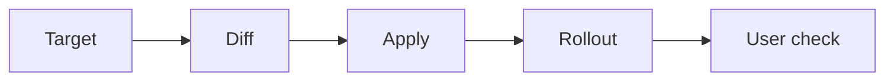

# Review and apply a Kubernetes manifest change

## What you will do

Use `kubectl` to take one **reviewed Deployment manifest**
from a known file to an observed workload state. The sequence is
target → diff → apply → rollout → application check. It is for a
cluster where your team permits direct `kubectl apply` and the
manifest file is the intended source of truth. If a GitOps
controller or another release system owns the object, make the
change through that system instead.[^kubectl-apply]
[GitOps ownership](../applications-and-tools/gitops.md)
explains the reconciliation boundary.



Text alternative: confirm the target before comparing the local
file with the live object. Apply only the reviewed change, watch
the Deployment rollout, then test a representative user request.

The page uses an **invented** `web` Deployment in namespace `shop`
and a file named `k8s/web-deployment.yaml`. No cluster command in
this guide was run for its creation. Replace these values with a
real, reviewed file and target.

## Before you change the cluster

- Have permission and an approved change for this environment.
- Confirm that the file describes the intended Deployment and
  namespace. `kubectl apply` can **create** a resource that does
  not already exist.[^kubectl-apply]
- Know how your team rolls back the source change if verification
  fails. A live `rollout undo` by itself may be reversed by a
  controller that keeps applying another desired state.
- Decide what user request demonstrates success. A completed
  rollout is a controller result, not an application test.
  [^deployments]

### 1. Confirm the target and existing object

```bash
kubectl config current-context
kubectl get deployment web -n shop
```

Compare the context with the environment named in the change
review; use the [opening inspection guide](daily-usage.md) to
confirm its cluster mapping when the name is ambiguous. Stop
if the target is uncertain. The second command confirms
the object exists in the namespace you intend to change. A
`NotFound` result may mean the context, namespace, or name is
wrong; applying the file without resolving that could create
a new object in the wrong place.[^current-context]
[^kubectl-apply]

### 2. Compare local intent with live state

```bash
kubectl diff -f k8s/web-deployment.yaml -n shop
```

Read the changed fields, especially the image, replicas,
selectors, Pod template, and namespace. Do not proceed when
the output includes a change you cannot explain. For example,
a line changing `image: registry.example/web:v1` to
`image: registry.example/web:v2` is an **illustrative diff**;
it says what value would change, not whether `v2` is safe or
whether the registry is reachable.[^kubectl-diff]

`kubectl diff` has a useful exit convention: `0` means no
difference, `1` means differences were found, and a value
greater than `1` means an error. A script that treats every
nonzero exit as failure can mistake a normal diff for a
failed check; a human must still review the actual output.
[^kubectl-diff]

> [!WARNING]
> The diff can reveal configuration details. Share it through
> the same controlled review channel used for the manifest.
> Confirm that the diff and the file come from the revision
> approved for this change.

### 3. Apply only the reviewed file

```bash
kubectl apply -f k8s/web-deployment.yaml -n shop
```

This asks the API server to create or update the resource
described by that file. It changes live cluster state. The
command succeeding means the API accepted the requested
configuration; it does not mean new Pods are ready or that
customers can complete a request.[^kubectl-apply]
[^deployments]

If the file changed after review, repeat the diff and review
before applying. If the API denies the change, read the error
and resolve the permission, validation, or field-ownership
issue through the normal process. Do not add force flags to
make an unexplained error disappear.

### 4. Watch the rollout and test the result

```bash
kubectl rollout status deployment/web -n shop --timeout=2m
kubectl get deployment web -n shop
```

For a Deployment Pod-template change, rollout status watches
the latest rollout until it completes or the command times out.
If another revision begins while it is watching, the default
command follows the latest revision; pin `--revision=N` only
when you need to verify one exact revision. A timeout or
failure calls for inspection, not an automatic second apply.
[^rollout-status]

Then follow the [Deployment inspection guide](kubectl-basics.md)
to examine matching Pods if readiness is short. Finally run
the representative user request agreed before the change.
Successful rollout status does not prove that request works.
[^deployments]

## If verification fails

Keep the context, diff, apply result, rollout events, and
application observation together. Use your team's release
and recovery procedure to correct or revert the **source of
truth**. A previous Deployment revision may be available,
but rolling it back is a live change with its own consequences
for configuration and data. Do not copy a rollback command
without checking what changed.[^deployments]

For other tasks, consult the focused Kubernetes references:
[rollout commands](https://kubernetes.io/docs/reference/kubectl/generated/kubectl_rollout/),
[scaling](https://kubernetes.io/docs/reference/kubectl/generated/kubectl_scale/),
[deletion](https://kubernetes.io/docs/reference/kubectl/generated/kubectl_delete/),
and [output selection](https://kubernetes.io/docs/reference/kubectl/generated/kubectl_get/).
They are separate decisions from applying this manifest.

## Explore further

- [kubectl diff](https://kubernetes.io/docs/reference/kubectl/generated/kubectl_diff/)
  explains the diff and exit codes.[^kubectl-diff]
- [kubectl apply](https://kubernetes.io/docs/reference/kubectl/generated/kubectl_apply/)
  describes declarative creation and updates.[^kubectl-apply]
- [Kubernetes Deployments](https://kubernetes.io/docs/concepts/workloads/controllers/deployment/)
  explains rollout behavior and status.[^deployments]
- [Back to Kubernetes commands](index.md).

[^current-context]: [Kubernetes, kubectl config current-context](https://kubernetes.io/docs/reference/kubectl/generated/kubectl_config/kubectl_config_current-context/), source record `current-context`.
[^kubectl-diff]: [Kubernetes, kubectl diff](https://kubernetes.io/docs/reference/kubectl/generated/kubectl_diff/), source record `kubectl-diff`.
[^kubectl-apply]: [Kubernetes, kubectl apply](https://kubernetes.io/docs/reference/kubectl/generated/kubectl_apply/), source record `kubectl-apply`.
[^rollout-status]: [Kubernetes, kubectl rollout status](https://kubernetes.io/docs/reference/kubectl/generated/kubectl_rollout/kubectl_rollout_status/), source record `rollout-status`.
[^deployments]: [Kubernetes, Deployments](https://kubernetes.io/docs/concepts/workloads/controllers/deployment/), source record `deployments`.
