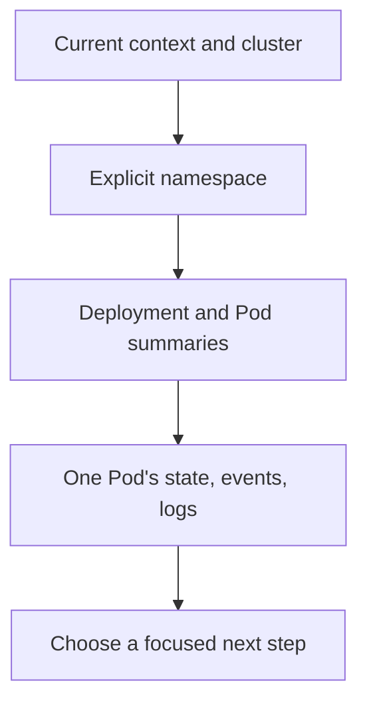

# Begin a safe kubectl inspection session

## What you will do

Use a short, repeatable sequence to answer: **Am I looking at the
right cluster, and which workload needs a closer look?** You will
read the current context, use an explicit namespace, list workloads
and Pods, and inspect one Pod only if its summary points to a
problem. These commands do not apply, delete, scale, restart, or
enter a workload.[^current-context][^kubectl-get]

A kubeconfig **context** selects a cluster and an identity, and may
include a default namespace. Treat it like the address on an
envelope: if the address is wrong, even a perfect message goes to
the wrong place. The analogy has a limit: a context name is just
a local label, so confirm which cluster it maps to rather than
trusting a familiar-sounding name.[^get-contexts]



Text alternative: first confirm the context and its cluster. Use
the intended namespace explicitly. Scan Deployment and Pod
summaries, inspect one affected Pod's evidence, and then choose
a focused diagnostic or change guide.

## Before you start

- Know the intended environment and namespace from your team or
  exercise instructions. This page uses `shop` as an **invented
  example**.
- Have `kubectl` configured with permission to read the target
  namespace. A `Forbidden` result is an access signal, not a
  reason to try another cluster at random.
- Handle logs as potentially sensitive application output. Read
  only what you need and avoid posting secrets into a ticket.

### 1. Confirm the target

```bash
kubectl config current-context
kubectl config get-contexts
```

The first command names the active context. In the context list,
find its row and compare the **CLUSTER** column with your team's
expected kubeconfig mapping. The cluster name is another local
label; if it is ambiguous, confirm its server address through
your trusted environment instructions. Stop if the target is
uncertain. A context can also hold
a namespace, but this guide uses `-n shop` on each namespaced
command so the target is visible at the point of use.
[^current-context][^get-contexts]

> [!WARNING]
> Reading from the wrong cluster can expose data. Before any later
> change, repeat this target check and follow the review process
> for that environment.

### 2. Scan the namespace

```bash
kubectl get deployments -n shop
kubectl get pods -n shop -o wide
```

The Deployment list shows desired and available replica summaries.
The Pod list shows readiness, status, restart counts, and, with
`-o wide`, placement. A zero in **READY**, a growing restart count,
or a Pending Pod is a clue to inspect, not a diagnosis. A ready
Pod also does not prove that a user request succeeds.
[^kubectl-get][^debug-pods]

If the namespace or a resource is `NotFound`, check the spelling,
context, and namespace. If the API returns `Forbidden`, ask for
appropriate read access; changing context to evade a permission
error is not a fix.

### 3. Inspect one affected Pod

Copy an exact Pod name from the list:

```bash
kubectl describe pod <pod-name> -n shop
kubectl logs <pod-name> -n shop --tail=100
```

The description shows container states, conditions, and related
events. Logs show what one container wrote. For a Pod with several
containers, choose the relevant container from the description
and add `-c <container-name>` to the log command. If the
container restarted, the [CrashLoopBackOff guide](../troubleshooting/crashloopbackoff.md)
explains when to request `--previous` logs.
[^kubectl-describe][^kubectl-logs][^debug-pods]

Events and logs can be incomplete or absent. Record what they
actually say and the time you observed it; do not infer a root
cause from a status word alone.

## Choose a next path

| Observation | Next route |
| --- | --- |
| Deployment has missing or unready replicas | [Inspect a Deployment with kubectl](kubectl-basics.md) to follow its selector to matching Pods. |
| Pod repeatedly restarts | [Diagnose CrashLoopBackOff](../troubleshooting/crashloopbackoff.md) to read the last exit and previous logs. |
| Pod cannot pull a local kind image | [Diagnose a local image pull in kind](../troubleshooting/kind.md). |
| Pods appear ready but requests fail | [Service and DNS troubleshooting](../troubleshooting/common-solutions.md) to follow the request path. |
| Workload needs a reviewed change | [Review and apply a manifest change](common-commands.md); do not use a diagnostic symptom alone as the proposed fix. |

This routine is an opening check. It is not a complete incident
response, a security audit, or proof of application health.
For a broader command lookup, use the
[official kubectl quick reference](https://kubernetes.io/docs/reference/kubectl/quick-reference/).

## Explore further

- [kubectl get](https://kubernetes.io/docs/reference/kubectl/generated/kubectl_get/)
  covers selectors and output formats.[^kubectl-get]
- [Debug Pods](https://kubernetes.io/docs/tasks/debug/debug-application/debug-pods/)
  covers conditions, events, and container evidence.[^debug-pods]
- [Back to Kubernetes commands](index.md).

[^current-context]: [Kubernetes, kubectl config current-context](https://kubernetes.io/docs/reference/kubectl/generated/kubectl_config/kubectl_config_current-context/), source record `current-context`.
[^get-contexts]: [Kubernetes, kubectl config get-contexts](https://kubernetes.io/docs/reference/kubectl/generated/kubectl_config/kubectl_config_get-contexts/), source record `get-contexts`.
[^kubectl-get]: [Kubernetes, kubectl get](https://kubernetes.io/docs/reference/kubectl/generated/kubectl_get/), source record `kubectl-get`.
[^kubectl-describe]: [Kubernetes, kubectl describe](https://kubernetes.io/docs/reference/kubectl/generated/kubectl_describe/), source record `kubectl-describe`.
[^kubectl-logs]: [Kubernetes, kubectl logs](https://kubernetes.io/docs/reference/kubectl/generated/kubectl_logs/), source record `kubectl-logs`.
[^debug-pods]: [Kubernetes, Debug Pods](https://kubernetes.io/docs/tasks/debug/debug-application/debug-pods/), source record `debug-pods`.
