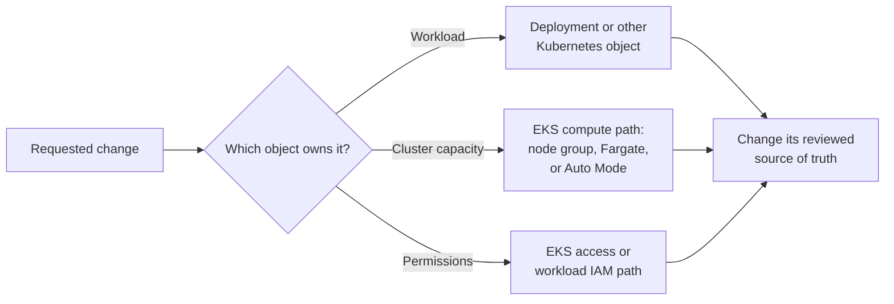

# Choose the right control path for an EKS change

## What you will do

Before changing an Amazon EKS application, identify **which object
needs to change and who owns its desired state**. A command that can
reach an object is not necessarily the right way to change it. For
example, a GitOps controller may own a Deployment, while a reviewed
infrastructure repository may own the node groups.[^eksctl-overview]
[^kubernetes-deployments]

Think of an application as a class and cluster capacity as its
building. Increasing the number of classes does not construct more
rooms; adding rooms does not decide how many classes to schedule.
The analogy stops there: Kubernetes makes scheduling decisions from
resource requests and other constraints, not just room count.



Text alternative: begin with the requested outcome. Identify whether
the relevant object is a Kubernetes workload, the cluster's compute
path, or an access and IAM path. Then change the reviewed source that
owns that object. `kubectl` talks to the Kubernetes API; `eksctl`
can manage EKS and related AWS resources. Neither tool proves that
an application works for a user.[^eksctl-overview]

## Map the request to its owner

| Request | First object or boundary | Where to learn the procedure |
| --- | --- | --- |
| Run more copies of one application | A Deployment's replicas or autoscaling configuration, plus Pod scheduling evidence. | [Kubernetes Deployments](https://kubernetes.io/docs/concepts/workloads/controllers/deployment/) and [inspect a Deployment](kubectl-basics.md). |
| Add EC2 worker capacity | The cluster's node-group and autoscaling design, if it uses node groups. | [eksctl node groups](https://docs.aws.amazon.com/eks/latest/eksctl/general-nodegroups.html). |
| Investigate missing managed node groups | First identify whether this cluster uses EKS Auto Mode, Fargate, or another compute path. | [EKS Auto Mode](https://docs.aws.amazon.com/eks/latest/eksctl/auto-mode.html) and [Kubernetes on AWS](../../cross-topic-guides/kubernetes-on-aws.md). |
| Let a person use `kubectl` | EKS authentication and authorization, which may include an access entry and Kubernetes RBAC. | [EKS human identity and RBAC](../../security/identity-federation/eks-human-identity-and-rbac.md). |
| Let a Pod call an AWS API | The Pod's service account, the selected Pod Identity or IRSA path, and IAM permission. | [EKS workload identity](../../cross-topic-guides/eks-workload-identity.md). |
| Change an EKS add-on or the control plane | EKS-managed component and its compatibility with the cluster and workloads. | [eksctl add-ons](https://docs.aws.amazon.com/eks/latest/eksctl/addons.html) or [cluster upgrades](https://docs.aws.amazon.com/eks/latest/eksctl/cluster-upgrade.html). |

`eksctl` can create clusters, manage node groups, and configure
several EKS capabilities, sometimes creating related CloudFormation
or IAM resources. It is not the universal owner of every EKS
installation. The cluster or component may instead be declared
through another infrastructure system; follow that system's review
and deployment path.[^eksctl-overview] A kubeconfig entry lets
`kubectl` locate and authenticate to a cluster; it is not itself
a grant of authorization to change it. Human cluster access and
Pod-to-AWS credentials solve different problems.[^eksctl-access]
[^eksctl-pod-identity]

## Example: lesson Pods are Pending

This is an **invented** incident. No AWS account, EKS cluster,
node group, Pod, or user request was inspected.

A team wants to increase the `lesson-api` Deployment from two to
four replicas. Two new Pods remain Pending. The team could request
more nodes, but Pending alone does not identify a capacity shortage.
First read the Pods' scheduling events. An insufficient CPU or memory
message may point toward requests and available capacity; other
messages may point toward taints, affinity, quotas, or storage.
The [resource-pressure guide](workflows.md) shows how to separate
these signals before choosing a change.

If evidence points to worker capacity, the next question is **which
compute path this cluster uses**. A standard EKS cluster may have
managed node groups; another cluster may use Fargate or Auto Mode.
An empty node-group listing does not prove that no compute exists.
Auto Mode extends AWS management to compute and other core
capabilities.[^eksctl-nodegroups][^eksctl-auto-mode]

### Read the target before proposing a change

For the invented cluster `learning-lab` in `eu-west-1`, the following
commands are **read only**. Replace the values with the environment
you have permission to inspect:

```bash
aws sts get-caller-identity
eksctl get cluster --region eu-west-1
eksctl get nodegroup --cluster learning-lab --region eu-west-1
kubectl config current-context
kubectl get pods -n lessons
```

Compare the AWS account and Region with the intended cluster. Check
the Kubernetes context's actual cluster mapping too; its displayed
name may be ambiguous. The two tools can use different credentials
and targets. Do not paste account identifiers or full command output
into a public issue. If `eksctl` or `kubectl` cannot read the target,
resolve identity, access, and network reachability before interpreting
an empty result. The [safe kubectl inspection guide](daily-usage.md)
continues the Kubernetes side.

The observed scheduling reason and compute model determine the next
owner. For a reviewed Deployment change, follow the
[manifest-change guide](common-commands.md). For a node-group
change, read the [official eksctl procedure](https://docs.aws.amazon.com/eks/latest/eksctl/general-nodegroups.html)
and the team's infrastructure source. AWS warns that a node-group
scale-down may remove nodes without explicitly draining them; check
the chosen group's behavior and workload disruption risk.
[^eksctl-nodegroups]

## What a dry run can tell you

`eksctl create cluster --dry-run` produces a `ClusterConfig` from
CLI options or a supplied config file. It helps you inspect the
configuration that `eksctl` would use; it is **not** a preview of
every AWS resource change, bill, permission outcome, or workload
effect. It also differs from
[`kubectl apply --dry-run=server`](advanced-commands.md), which
submits a Kubernetes API request without persisting it.
[^eksctl-dry-run] Use the review mechanism of the actual
infrastructure owner before creation, deletion, or upgrade.

## Explore further

- [What is eksctl?](https://docs.aws.amazon.com/eks/latest/eksctl/what-is-eksctl.html)
  lists the tool's EKS management capabilities.[^eksctl-overview]
- [Creating and managing clusters](https://docs.aws.amazon.com/eks/latest/eksctl/creating-and-managing-clusters.html)
  covers creation, kubeconfig effects, and deletion considerations.
- [Non-eksctl-created clusters](https://docs.aws.amazon.com/eks/latest/eksctl/unowned-clusters.html)
  records which commands AWS documents for clusters made elsewhere.
- [EKS operations](../../cross-topic-guides/eks-operations.md)
  starts from a symptom rather than a proposed command.
- [Back to Kubernetes commands](index.md).

[^eksctl-overview]: [AWS, What is eksctl?](https://docs.aws.amazon.com/eks/latest/eksctl/what-is-eksctl.html), source record `eksctl-overview`.
[^eksctl-nodegroups]: [AWS, Work with node groups](https://docs.aws.amazon.com/eks/latest/eksctl/general-nodegroups.html), source record `eksctl-nodegroups`.
[^eksctl-auto-mode]: [AWS, EKS Auto Mode with eksctl](https://docs.aws.amazon.com/eks/latest/eksctl/auto-mode.html), source record `eksctl-auto-mode`.
[^eksctl-access]: [AWS, EKS access entries with eksctl](https://docs.aws.amazon.com/eks/latest/eksctl/access-entries.html), source record `eksctl-access`.
[^eksctl-pod-identity]: [AWS, EKS Pod Identity associations with eksctl](https://docs.aws.amazon.com/eks/latest/eksctl/pod-identity-associations.html), source record `eksctl-pod-identity`.
[^eksctl-dry-run]: [AWS, eksctl dry run](https://docs.aws.amazon.com/eks/latest/eksctl/dry-run.html), source record `eksctl-dry-run`.
[^kubernetes-deployments]: [Kubernetes, Deployments](https://kubernetes.io/docs/concepts/workloads/controllers/deployment/), source record `kubernetes-deployments`.
