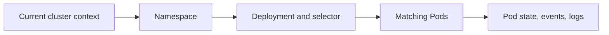

# Inspect a Kubernetes Deployment with kubectl

## What you will do

Use `kubectl` to answer one question: **where does a Deployment stop
matching the result you expect?** You will confirm the cluster, read
the Deployment, find its Pods, and inspect one Pod's events and logs.
The commands in this guide read information; they do not apply,
delete, scale, or restart resources.[^kubectl-reference]
[^current-context][^kubectl-get]

A **Deployment** declares how many application Pods Kubernetes
should keep running. A **Pod** contains one or more containers that
run the application. The Deployment's status is a summary; Pod
details and logs help explain why a replica is missing or unready.
A green Deployment count still does not test the user's request
path.[^deployments][^debug-pods]



Text alternative: identify the current cluster and namespace, then
read the Deployment and its selector. Use the selector to find its
Pods. Inspect Pod state, events, and logs to choose the next
investigation.

## Before you start

- Install `kubectl` and use credentials that can read the target
  namespace, Deployment, Pods, events, and logs.
- Know the intended environment and namespace. This guide uses
  `shop` as an **invented example**; replace it with your own.
- Have the Deployment name. The example uses `web`.

> [!WARNING]
> A valid command can read the wrong cluster. Confirm the context
> before inspecting a production workload. Logs may contain secrets
> or personal data printed by the application; handle their output
> accordingly.

## 1. Confirm the target

```bash
kubectl config current-context
kubectl get deployment web -n shop
```

The first command prints the active kubeconfig context. Stop if it is
not the cluster you intended. The second reads the `web` Deployment
in namespace `shop`; a `NotFound` result can mean the name, namespace,
or cluster is wrong.[^current-context][^kubectl-get]

In the Deployment table, compare **READY**, **UP-TO-DATE**, and
**AVAILABLE** with the desired replica count. Those columns describe
Kubernetes workload state, not whether a customer can complete a
request.[^deployments]

## 2. Find the Pods that belong to it

```bash
kubectl describe deployment web -n shop
kubectl get pods -n shop -l app=web
```

Read the **Selector** in the Deployment description. The `-l app=web`
part is only correct if the complete selector is `app=web`;
otherwise use the full selector shown, including any other labels.
Do not assume a Pod's label equals the Deployment name. The Pod
list shows each Pod's readiness, status, restart count, and
age.[^deployments][^kubectl-get]

If the Deployment is missing replicas, the description may point
to scheduling or rollout events. If a Pod exists but is `0/1`
ready, inspect that Pod next. A Pod can be running while its
container is not ready to serve traffic.[^debug-pods]

## 3. Read one Pod's evidence

Copy one exact Pod name from the previous result:

```bash
kubectl describe pod <pod-name> -n shop
kubectl logs <pod-name> -n shop --tail=100
```

The Pod description shows its container states, conditions, and
related events. Logs show what the application wrote. If the Pod
has more than one container, add `-c <container-name>` to the
logs command; choose the container named in the Pod description.
These commands can fail if your identity lacks permission to read
Pods or logs.[^debug-pods][^kubectl-logs]

If the container has restarted, the [CrashLoopBackOff guide](../troubleshooting/crashloopbackoff.md)
shows when to request the previous container's logs.

## Read the evidence before choosing a fix

Imagine the `web` Deployment wants two replicas but has only one
available. One matching Pod is `0/1` ready. Its description reports
readiness-probe failures, while the log says it cannot reach a
backend. This is an **illustrative observation**, not output from
a cluster tested for this page.

That evidence tells you where to investigate next: the backend
connection and readiness behavior. It does not justify changing
the probe immediately; the application might really be unable to
serve requests. After an actual fix, repeat the read-only checks
and test a representative user request. A ready Pod is only part
of that verification.

## If the path stops early

| Result | Next check |
| --- | --- |
| Unexpected context | Stop and select the intended cluster through your team's normal kubeconfig procedure. |
| Deployment `NotFound` | Confirm cluster, namespace, and name before searching other namespaces. |
| Pods do not match `-l app=web` | Read the Deployment's actual selector and use that label set. |
| `Forbidden` on a read | Ask for the least privilege needed; do not change context to bypass a denied permission. |
| Pod is restarting | Follow [Diagnose CrashLoopBackOff](../troubleshooting/crashloopbackoff.md). |
| Pods look ready but users still fail | Continue with the [service and DNS diagnostic guide](../troubleshooting/common-solutions.md). |

## Explore further

- [Kubernetes Deployments](https://kubernetes.io/docs/concepts/workloads/controllers/deployment/)
  explains the controller and status fields.[^deployments]
- [Debug Pods](https://kubernetes.io/docs/tasks/debug/debug-application/debug-pods/)
  explains conditions and events.[^debug-pods]
- [kubectl get reference](https://kubernetes.io/docs/reference/kubectl/generated/kubectl_get/)
  explains selectors and output choices.[^kubectl-get]
- [Back to Kubernetes commands](index.md).

[^kubectl-reference]: [Kubernetes, kubectl reference](https://kubernetes.io/docs/reference/kubectl/), source record `kubectl-reference`.
[^current-context]: [Kubernetes, kubectl config current-context](https://kubernetes.io/docs/reference/kubectl/generated/kubectl_config/kubectl_config_current-context/), source record `current-context`.
[^kubectl-get]: [Kubernetes, kubectl get](https://kubernetes.io/docs/reference/kubectl/generated/kubectl_get/), source record `kubectl-get`.
[^deployments]: [Kubernetes, Deployments](https://kubernetes.io/docs/concepts/workloads/controllers/deployment/), source record `deployments`.
[^debug-pods]: [Kubernetes, Debug Pods](https://kubernetes.io/docs/tasks/debug/debug-application/debug-pods/), source record `debug-pods`.
[^kubectl-logs]: [Kubernetes, kubectl logs](https://kubernetes.io/docs/reference/kubectl/generated/kubectl_logs/), source record `kubectl-logs`.
