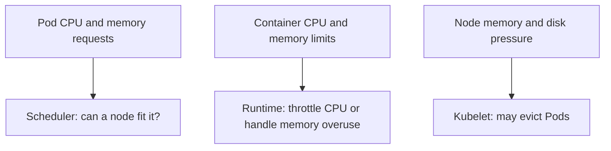

# Investigate Kubernetes resource pressure

## What question are you answering?

A Pod is Pending, has restarted with `OOMKilled`, was evicted,
or is slow under load. Before adjusting CPU or memory, determine
which **resource boundary** produced the observation:

- A **request** is the amount Kubernetes uses when deciding where
  the Pod can fit.
- A **limit** constrains a running container. CPU can be throttled;
  memory overuse can lead to an out-of-memory kill.
- **Node pressure** can cause the kubelet to evict a Pod when the
  node runs short of memory, disk space, or other monitored
  resources.[^resource-management][^node-pressure]

Think of a request as a reservation for a seat, and a limit as a
rule applied while using the seat. The analogy ends there: actual
usage can rise above a request, and node pressure depends on
other Pods and system processes too.[^resource-management]



Text alternative: Pod requests influence scheduling before a Pod
runs. Container limits affect a running workload. Node memory
or disk pressure can make the kubelet evict Pods. These are
different checks with different evidence.

## 1. Identify the observed state

This guide uses `shop` and a Pod name as **illustrative
placeholders**. Confirm the target context and namespace first,
following the [safe opening routine](daily-usage.md).

```bash
kubectl config current-context
kubectl get pod <pod-name> -n shop -o wide
kubectl describe pod <pod-name> -n shop
```

Read the Pod's **Node**, container states, last termination
reason, conditions, and events. If there is no assigned node
and an event says `FailedScheduling`, begin with request-versus-
allocatable capacity. If a container's last state says
`OOMKilled`, inspect its memory limit and workload behavior.
If the Pod reason is `Evicted`, read the eviction message and
the assigned node's conditions. A Pod status alone is too
broad to choose a fix.[^resource-management][^node-pressure]
[^debug-pods]

## 2. Compare the configured resources

```bash
kubectl get pod <pod-name> -n shop -o yaml
```

In each container under `spec.containers`, read `resources.requests`
and `resources.limits`. Include init containers and any Pod-level
resources when they are present; their accounting can affect what
fits. Values in a Pod can include defaults added by namespace
policies, so read the actual Pod, not only the repository file.
[^resource-management]

For `FailedScheduling`, the scheduler compares requested
resources with nodes' **allocatable** resources and other
reserved requests. An idle-looking node may still be unable
to accept a Pod whose request does not fit. Do not lower a
request solely to make the Pod schedule; measure the
application's real demand and decide whether capacity,
placement, or the request is wrong.[^resource-management]

For `OOMKilled`, ask whether the memory limit is below the
application's real peak, whether a recent change increased
memory use, or whether the application leaks memory. Raising a
limit without understanding the growth may move the failure
to a node or a later time.[^resource-management]

## 3. Read node pressure when relevant

If the Pod has an assigned node, copy that node's exact name
from the Pod list:

```bash
kubectl describe node <node-name>
```

Read the node's conditions, allocatable resources, allocated
requests, and events. A `MemoryPressure` or `DiskPressure`
condition directs you to node-level investigation. An eviction
is distinct from a container being killed for its own memory
limit. Node pressure can come from Pods or from system use;
the eviction message is the starting evidence.[^node-pressure]

If the Pod never received a node assignment, inspect
scheduling events and candidate-node constraints instead of
describing a guessed node.[^resource-management]

If reading Node objects is `Forbidden`, keep the Pod event
and ask a cluster operator for the node evidence. Do not
switch identities just to bypass the denied read.

## 4. Use live metrics as supporting evidence

Where a resource metrics pipeline is available:

```bash
kubectl top pod <pod-name> -n shop --containers
```

This reports recent CPU and memory usage by container. Metrics
may be unavailable for a few minutes after Pod creation or
when the cluster has no functioning Metrics API. A missing
`top` result is not proof that usage is zero. One `top`
snapshot cannot establish a peak, a leak, or CPU throttling;
compare it with time-series metrics and application behavior
when those claims matter.[^top-pod][^metrics-pipeline]

## Example: why low usage does not solve Pending

Imagine an **invented** `video-api` Pod requesting `2Gi` of
memory. Its `describe` output reports `FailedScheduling:
Insufficient memory`. A separate `kubectl top` view shows
low current memory usage on some running Pods. That does
not contradict the scheduling event: the scheduler is checking
whether the **requested reservation** fits alongside already
scheduled requests, not whether a node looks quiet at one
instant. No cluster produced these observations for this page.
[^resource-management]

The next decision is to verify the request against measured
workload demand and examine allocatable capacity and placement
rules. Depending on evidence, the reviewed correction may be
capacity, placement, or a request adjustment. Recheck the
Pod's scheduling event and the application request after any
approved change.

## Choose the next investigation

| Evidence | Next path |
| --- | --- |
| `FailedScheduling` mentions insufficient CPU or memory. | Compare Pod requests with node allocatable capacity and existing reservations.[^resource-management] |
| Last container state is `OOMKilled`. | Inspect the memory limit, previous logs, and peak-memory evidence; use [CrashLoopBackOff diagnosis](../troubleshooting/crashloopbackoff.md) if it is restarting.[^resource-management] |
| Pod was evicted for node pressure. | Inspect node conditions, eviction message, and the [node-pressure guide](https://kubernetes.io/docs/concepts/scheduling-eviction/node-pressure-eviction/).[^node-pressure] |
| Application is slow and CPU usage appears high. | Gather time-series and throttling evidence before attributing the slowness to a CPU limit.[^resource-management] |
| `kubectl top` has no data. | Check the [resource metrics pipeline](https://kubernetes.io/docs/tasks/debug/debug-cluster/resource-metrics-pipeline/) and continue with Pod/node events.[^metrics-pipeline] |

Do not apply a resource change from this page alone. Use the
[reviewed manifest-change guide](common-commands.md) once the
cause and desired correction are understood.

## Explore further

- [Resource Management for Pods and Containers](https://kubernetes.io/docs/concepts/configuration/manage-resources-containers/)
  explains requests, limits, scheduling, and OOM behavior.
  [^resource-management]
- [Node-pressure Eviction](https://kubernetes.io/docs/concepts/scheduling-eviction/node-pressure-eviction/)
  explains node-level resource signals.[^node-pressure]
- [kubectl top pod](https://kubernetes.io/docs/reference/kubectl/generated/kubectl_top/kubectl_top_pod/)
  documents the metrics view and its delay.[^top-pod]
- [Back to Kubernetes commands](index.md).

[^resource-management]: [Kubernetes, Resource Management for Pods and Containers](https://kubernetes.io/docs/concepts/configuration/manage-resources-containers/), source record `resource-management`.
[^node-pressure]: [Kubernetes, Node-pressure Eviction](https://kubernetes.io/docs/concepts/scheduling-eviction/node-pressure-eviction/), source record `node-pressure`.
[^top-pod]: [Kubernetes, kubectl top pod](https://kubernetes.io/docs/reference/kubectl/generated/kubectl_top/kubectl_top_pod/), source record `top-pod`.
[^metrics-pipeline]: [Kubernetes, Resource metrics pipeline](https://kubernetes.io/docs/tasks/debug/debug-cluster/resource-metrics-pipeline/), source record `metrics-pipeline`.
[^debug-pods]: [Kubernetes, Debug Pods](https://kubernetes.io/docs/tasks/debug/debug-application/debug-pods/), source record `debug-pods`.
