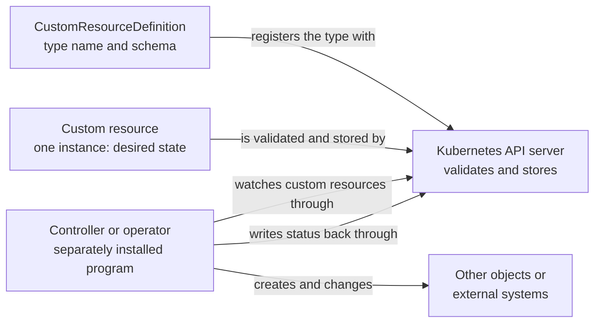

# Custom resources and CRDs

## Purpose

Use this page to understand three things that are often blurred together: a
CustomResourceDefinition, a custom resource, and the controller that acts on
it. Once you can tell them apart, tools such as Crossplane and other operators
stop looking like magic.

This page assumes the desired-state and controller ideas from [Kubernetes
fundamentals](../fundamentals/kubernetes-fundamentals.md). It explains the
model and does not show how to write or install a definition.

## What they are

The Kubernetes API is organized into resources. A resource is an API endpoint
that stores objects of one kind; the built-in `pods` resource stores Pod
objects. A **custom resource** is an extension of that API: a kind of object
that a default Kubernetes installation does not
have.[^kubernetes-custom-resources]

| Term | Simple definition |
| --- | --- |
| CustomResourceDefinition (CRD) | An object that registers a new type with the API: its group, its kind name, its versions, and the schema its objects must follow. |
| Custom resource (CR) | One object of that new type, such as one particular database request. |
| Controller | A program that watches objects of some type and acts to make reality match what they declare. |
| Operator | A controller, or set of controllers, that uses custom resources to manage an application and its components.[^kubernetes-operator-pattern] |

## Why it matters

Custom resources let a team offer its own API inside Kubernetes. A platform
team can let developers ask for "a database" or "an application network" in
one small object, using the same tools, access control, and review process as
for a Deployment.

The common misunderstanding is to expect a CRD to *do* something. It does not.
Knowing which of the three parts is missing is how you diagnose a custom
resource that was accepted and then apparently ignored.

## The mental model: type, instance, behaviour

**A CRD registers a type.** When a CRD is created, the API server starts
serving a new resource path for each version it declares, and it handles
storage of the objects. The CRD states whether objects are namespaced or
cluster-wide and carries a schema that the API server uses to validate
them.[^kubernetes-crd-task] Defining the type needs no
programming.[^kubernetes-custom-resources]

**A custom resource is one instance.** After the type exists, users create
objects of it, and tools such as `kubectl` work with them as they do with
built-in objects.[^kubernetes-custom-resources] The API server checks each
object against the schema and stores it.

**A controller supplies behaviour, separately.** On their own, custom resources
only let you store and retrieve structured data. Combined with a custom
controller, they become a declarative API: you record the desired state, and
the controller works to make the current state match
it.[^kubernetes-custom-resources]

The separation is real. The CRD and the controller are installed as different
things, often by the same package, and either can be present without the
other.

## Visual: who does what

Text alternative: the CustomResourceDefinition registers a type and schema
with the API server. A custom resource, which is one instance holding desired
state, is validated and stored by the API server. A controller, which is a
separately installed program, watches custom resources through the API server,
creates and changes other objects or external systems, and writes status back
through the API server. Nothing flows from the definition to the controller:
the API server is the only meeting point.

Use the diagram to locate a problem. An object rejected on creation points to
the schema in the definition. An object that is stored but never acted on
points to the controller.

## Example: a platform API for application networks

This is a conceptual walk-through with invented names. It is not recorded
cluster output and is not a manifest to apply.

A platform team wants developers to request a network for an application
without learning every cloud networking resource. They offer a type named
`ApplicationNetwork` in the API group `platform.example.com`.

1. **The type is registered.** A CRD for `ApplicationNetwork` is installed.
   The API server now accepts objects of that kind, and its schema says that
   `spec` has a required `region` and a `size` that must be `small` or `large`.
2. **A developer creates an instance.** They submit an `ApplicationNetwork`
   named `checkout-network` with region `eu-west-1` and size `small`. The API
   server validates it against the schema and stores it. A request with size
   `enormous` is rejected at this point.
3. **Nothing else happens, unless a controller is running.** If no controller
   watches `ApplicationNetwork` objects, `checkout-network` stays in the API as
   stored data. No network exists.
4. **A controller acts.** With a controller installed, it notices
   `checkout-network`, creates the underlying network resources, and records
   progress in the object's `status`. If someone later changes the size, the
   controller notices the difference and works towards the new desired state.

| What the developer sees | Which part is responsible |
| --- | --- |
| "Unknown kind `ApplicationNetwork`" | The definition is not installed. |
| "Invalid value for `size`" | The schema in the definition rejected the object. |
| Object exists, but no network and no status | No controller is acting on it. |
| Object shows an error in its status | The controller is running and reported a problem. |

Crossplane follows this model. In Crossplane, a platform team writes a
CompositeResourceDefinition (XRD) that defines the schema for a custom API,
and Crossplane creates a matching Kubernetes CustomResourceDefinition from
it.[^crossplane-xrd] Crossplane's own controllers then supply the behaviour.
See the [Crossplane component model](../crossplane/component-model.md) and
[How to request a Crossplane platform API](../crossplane/xrd-composition-and-xr-calls.md)
for how that is built.

## An analogy: a new form at a records office

Imagine a records office that accepts official forms:

- A **CRD** is a newly approved blank form. It names the form and says which
  boxes exist and what may be written in them.
- A **custom resource** is one filled-in copy that someone has filed.
- A **controller** is the member of staff who reads filed forms of that type
  and does the work they ask for.

Where the analogy stops being accurate:

- **The office files forms even when nobody is assigned to read them.** The
  API server accepts and stores valid custom resources whether or not a
  controller exists.
- **The box checks are about shape, not feasibility.** Schema validation
  confirms types and allowed values. It cannot know whether the request can be
  fulfilled.
- **Withdrawing the blank form destroys every filed copy.** Deleting a CRD
  deletes all custom resources of that type.[^kubernetes-crd-task] If a
  controller created real infrastructure from them, treat this as a
  destructive action.
- **A form may be impossible to remove until staff sign it off.** Controllers
  often add finalizers to objects so they can clean up first. A deleted object
  then stays in a terminating state until its finalizers are removed. If the
  controller is gone, it can stay there. The Kubernetes documentation advises
  against removing finalizers by hand unless you understand what they were
  protecting.[^kubernetes-finalizers]
- **Staff keep checking.** A clerk processes a form once. A controller keeps
  comparing desired and current state for as long as the object exists.

## Design points to remember

- **Versions are a commitment.** A CRD can serve several versions of its type.
  Schema changes affect objects already stored and clients already written, so
  treat a published version as an API contract.
- **Not everything needs a custom resource.** For plain configuration that an
  application reads as a file or environment variables, the Kubernetes
  documentation points to a ConfigMap instead.[^kubernetes-custom-resources]
- **Know who owns the controller.** A custom resource is only as reliable as
  the controller behind it. Find out which component reconciles a type before
  depending on it.

## Common misconceptions

- **"Installing the CRD installs the feature."** It installs the type. The
  behaviour comes from a controller.
- **"A CRD and a custom resource are the same thing."** One defines a kind; the
  other is an object of that kind.
- **"An operator is a different technology."** An operator is a controller that
  uses custom resources to manage an application.[^kubernetes-operator-pattern]
- **"Deleting a definition is tidy-up."** It removes every object of that
  type.

## Check your understanding

- A custom resource was created without error, but nothing happened. Which
  part would you check first, and why?
- What does the API server do with a custom resource when no controller is
  installed?
- Why is deleting a CRD more dangerous than deleting one custom resource?
- In Crossplane, which object does a platform team write, and what does
  Crossplane create from it?

## Next steps

- Review controllers and reconciliation in [Kubernetes
  fundamentals](../fundamentals/kubernetes-fundamentals.md).
- See custom resources used as a platform API in the [Crossplane component
  model](../crossplane/component-model.md).
- Follow one definition from schema to instance in [XRDs, Compositions, and XR
  calls](../crossplane/xrd-composition-and-xr-calls.md).

## Official documentation for deeper study

- Concepts, and when to choose a custom resource: [Custom Resources](https://kubernetes.io/docs/concepts/extend-kubernetes/api-extension/custom-resources/).
- Defining a type, schemas, scope, and deletion behaviour: [Extend the Kubernetes API with CustomResourceDefinitions](https://kubernetes.io/docs/tasks/extend-kubernetes/custom-resources/custom-resource-definitions/).
- Serving several versions of a type: [Versions in CustomResourceDefinitions](https://kubernetes.io/docs/tasks/extend-kubernetes/custom-resources/custom-resource-definition-versioning/).
- Controllers that manage applications: [Operator pattern](https://kubernetes.io/docs/concepts/extend-kubernetes/operator/).
- Why deletion can wait: [Finalizers](https://kubernetes.io/docs/concepts/overview/working-with-objects/finalizers/).
- How Crossplane builds on CRDs: [Composite Resource Definitions](https://docs.crossplane.io/latest/composition/composite-resource-definitions/).

## Related links

- [Crossplane](../crossplane/index.md)
- [Kubernetes fundamentals](../fundamentals/kubernetes-fundamentals.md)
- [Kubernetes custom resources documentation](https://kubernetes.io/docs/concepts/extend-kubernetes/api-extension/custom-resources/)
- [CRD task documentation](https://kubernetes.io/docs/tasks/extend-kubernetes/custom-resources/custom-resource-definitions/)
- [Back to Kubernetes core objects](index.md)
- [Back to Kubernetes index](../index.md)
- [Back to knowledge index](../../index.md)

[^kubernetes-custom-resources]: [Kubernetes - Custom Resources](https://kubernetes.io/docs/concepts/extend-kubernetes/api-extension/custom-resources/), source record `kubernetes-custom-resources`.
[^kubernetes-crd-task]: [Kubernetes - Extend the Kubernetes API with CustomResourceDefinitions](https://kubernetes.io/docs/tasks/extend-kubernetes/custom-resources/custom-resource-definitions/), source record `kubernetes-crd-task`.
[^kubernetes-operator-pattern]: [Kubernetes - Operator pattern](https://kubernetes.io/docs/concepts/extend-kubernetes/operator/), source record `kubernetes-operator-pattern`.
[^kubernetes-finalizers]: [Kubernetes - Finalizers](https://kubernetes.io/docs/concepts/overview/working-with-objects/finalizers/), source record `kubernetes-finalizers`.
[^crossplane-xrd]: [Crossplane - Composite Resource Definitions](https://docs.crossplane.io/latest/composition/composite-resource-definitions/), source record `crossplane-xrd`.
