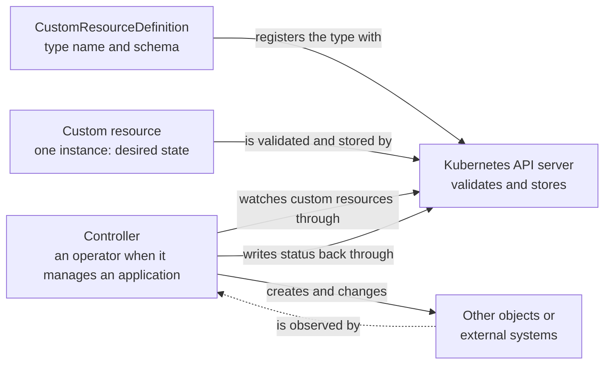

# Custom resources and CRDs

## Purpose

Use this page to understand three things that are often blurred together: a
CustomResourceDefinition, a custom resource, and the controller that acts on
it. Once you can tell them apart, tools such as Crossplane and other operators
stop looking like magic.

This page assumes the desired-state and controller ideas from [Kubernetes
fundamentals](../fundamentals/kubernetes-fundamentals.md). It explains the
model and does not show how to write or install a definition.

## What they are

The Kubernetes API is organized into resources. A resource is an API endpoint
that stores objects of one kind; the built-in `pods` resource stores Pod
objects. A **custom resource** is an extension of that API: a kind of object
that a default Kubernetes installation does not
have.[^kubernetes-custom-resources]

| Term | Simple definition |
| --- | --- |
| CustomResourceDefinition (CRD) | An object that registers a new API type: its group, plural resource name, kind, scope, served versions, and schema. |
| Custom resource (CR) | One object of that new type, such as one particular database request. |
| Controller | A program that watches objects of some type and acts to make reality match what they declare. |
| Operator | A controller, or set of controllers, that uses custom resources and application-specific knowledge to manage an application and its components.[^kubernetes-operator-pattern] |

## Why it matters

Custom resources let a team offer its own API inside Kubernetes. A platform
team can let developers ask for "a database" or "an application network" in
one small object, using the same tools and authorization system as for a
Deployment. Access is not automatic: administrators must grant permissions
to the people and controllers that need the new
resource.[^kubernetes-custom-resources]

The common misunderstanding is to expect a CRD to create the requested
network. The CRD makes the API type available and can validate and default
its objects; it does not create infrastructure outside the API. Knowing
which part handled a request narrows down why an accepted object has not
produced the expected result.

## The mental model: type, instance, behaviour

**A CRD registers a type.** After the CRD is established, the API server
serves a resource path for each version marked `served: true` and handles
storage of its objects. The CRD states whether objects are namespaced or
cluster-wide and carries a schema that the API server uses to validate
them.[^kubernetes-crd-task] Its own `metadata.name` follows
`<plural>.<group>`: our example below would use
`applicationnetworks.platform.example.com`. Defining the type needs no
programming.[^kubernetes-custom-resources]

**A custom resource is one instance.** After the type exists, authorized
users create objects of it, and tools such as `kubectl` work with them as
they do with built-in objects.[^kubernetes-custom-resources] Before storing
an object, the API server checks its schema and may fill in schema defaults.
For an unknown field, a strict request is rejected; a request that allows
warnings or ignores unknown fields can be accepted with that field removed.
Current `kubectl` uses strict server-side validation by default, with a
client-side fallback for older servers. Read back the object to see what the
API actually accepted.[^kubernetes-crd-task][^kubernetes-api-concepts]

**A controller supplies behaviour, separately.** On their own, custom resources
only let you store and retrieve structured data. Combined with a custom
controller, they become a declarative API: you record the desired state, and
the controller works to make the current state match
it.[^kubernetes-custom-resources]

The separation is real. The CRD and controller are different things, often
installed by the same package. A CRD without a controller can hold inert
objects. A controller that expects an unavailable API type cannot perform
its normal work. A built-in controller, such as the Deployment controller,
is also a controller; it is not thereby an operator.

## Visual: who does what



Text alternative: the CustomResourceDefinition registers a type and schema
with the API server. A custom resource, which is one instance holding desired
state, is validated and stored by the API server. A controller, which is a
separately installed program, watches custom resources through the API server,
creates and changes other objects or external systems, observes their state,
and can write status back through the API server. The controller uses the API
type registered by the definition; installing the definition does not by
itself install or start that controller.

Use the diagram to locate a problem. An invalid value rejected on creation
points to the schema; a `forbidden` error points to authorization. An object
stored but apparently ignored calls for checking the responsible controller
and its access, rather than assuming it is absent.

## Example: a platform API for application networks

This is a conceptual walk-through with invented names. It is not recorded
cluster output and is not a manifest to apply.

A platform team wants developers to request a network for an application
without learning every cloud networking resource. They offer a namespaced
type named `ApplicationNetwork` in the API group `platform.example.com`,
served as `v1alpha1` with the plural resource name `applicationnetworks`.

1. **The type is registered.** A CRD for `ApplicationNetwork` is installed.
   Once it reaches `Established`, the API server accepts this group and
   version. Its hypothetical schema requires `spec.region`, allows `size` to
   be `small` or `large`, and defaults an omitted `size` to `small`.
2. **A developer creates an instance.** They submit the following illustrative
   object. It is not an executable exercise: the matching CRD and controller
   are not supplied here.

   ```yaml
   apiVersion: platform.example.com/v1alpha1
   kind: ApplicationNetwork
   metadata:
     name: checkout-network
   spec:
     region: eu-west-1
   ```

   The API server validates it and returns an object with `spec.size: small`
   from the hypothetical schema default. A request with `size: enormous` is
   rejected. A misspelled field is rejected by a strict request; another
   validation setting can let it be dropped. Read the object back before
   assuming every submitted field was stored.[^kubernetes-api-concepts]
3. **The object can exist without a network.** If no controller reconciles
   `ApplicationNetwork` objects, `checkout-network` stays stored in the API.
   No network is created by the CRD alone.
4. **A controller can act.** A controller that watches this type sees the
   instance, creates the underlying network resources, and observes whether
   they match the request. If this API defines status and the controller
   writes it, readers may see progress or an error there. A later change to
   `spec.size` gives the controller new desired state to reconcile.

| What the developer sees | Which part is responsible |
| --- | --- |
| "No matches for kind `ApplicationNetwork`" | Check that the CRD exists and is `Established`, the requested group and version are served, and the client has refreshed API discovery. |
| "Forbidden" when creating an instance | Check authorization for the new resource in its API group and namespace. |
| "Invalid value for `size`" | The schema, or another admission rule, rejected the object. Read the returned error. |
| Object exists, but no network or status | Check whether a controller is installed, running, watching this namespace and version, and authorized. Absence of status alone proves none of these. |
| Object shows an error in status | A controller may have reported a problem earlier. Check when the status was written and whether it describes the latest `spec`. |

Crossplane adds a layer to this model. A platform team writes a
CompositeResourceDefinition (XRD), which is itself a custom resource. A
Crossplane controller reads it and creates the Kubernetes CRD for the new
composite resource type.[^crossplane-xrd] A Composition and its functions
describe what that resource should create; provider controllers reconcile
the resulting external resources. The XRD is a definition that generates
another definition, not a replacement for the Kubernetes API server. See the
[Crossplane component model](../crossplane/component-model.md) and
[How to request a Crossplane platform API](../crossplane/xrd-composition-and-xr-calls.md)
for the full chain.

## Reading progress and handling deletion

`spec` records what the user wants. A controller may write `status` to report
what it has observed or created; the CRD can enable a separate `/status`
subresource so status updates do not rewrite the requested
`spec`.[^kubernetes-crd-task] Status is optional and can become stale. Its absence
does not prove that no controller exists, and an old `Ready` value does not
prove the latest request succeeded.

Some controllers publish an `observedGeneration` alongside their status.
When the CRD enables `/status`, `metadata.generation` advances with changes
to the requested `spec`, not with status-only updates.[^kubernetes-crd-task]
For a controller that reports `observedGeneration`, an older reported value
means its status describes an earlier version of the request. A matching
number only says the controller considered that generation; it does not by
itself prove the external resource is healthy. This field is a controller
convention, not a field every custom resource must
have.[^crossplane-api-reference]

Deleting one custom resource asks Kubernetes to remove that object. If it
has a finalizer, the API server sets `metadata.deletionTimestamp` and keeps
the object until the responsible controller completes its cleanup and removes
the finalizer. That cleanup may affect infrastructure outside Kubernetes;
what happens depends on the controller and its policy, not on the CRD
alone.[^kubernetes-finalizers] Removing the controller before cleanup can
leave deletion waiting. Do not remove a finalizer merely to make the object
disappear without understanding what cleanup it protects.

Deleting the **CRD** is wider: Kubernetes starts removing all custom resources
of that type, then removes the API endpoint. Finalizers on those objects can
delay completion while their controllers clean up. Recreating a successfully
deleted CRD later does not bring its objects back.[^kubernetes-crd-task]
Check what the controller would do to external resources before deleting the
definition, and keep it available until protected cleanup finishes.

## An analogy: a new form at a records office

Imagine a records office that accepts official forms:

- A **CRD** is a newly approved blank form. It names the form and says which
  boxes exist and what may be written in them.
- A **custom resource** is one filled-in copy that someone has filed.
- A **controller** is the member of staff who reads filed forms of that type
  and does the work they ask for.

Where the analogy stops being accurate:

- **The office files forms even when nobody is assigned to read them.** The
  API server accepts and stores valid custom resources whether or not a
  controller exists.
- **The box checks are about declared rules, not feasibility.** A schema can
  check types, required fields, allowed values, and some relationships
  between fields. It cannot tell whether a real network can be created.
- **Staff keep checking.** A clerk processes a form once. A controller keeps
  comparing desired and current state for as long as the object exists.

## Design points to remember

- **Versions are a commitment.** A CRD can declare several versions, but
  serves only those marked `served: true` and has one storage version.
  Existing stored objects are not automatically rewritten just because you
  change that choice. Treat a published version as an API contract and plan
  conversion or migration when versions differ.[^kubernetes-crd-task]
- **Not everything needs a custom resource.** For plain configuration that an
  application reads as a file or environment variables, the Kubernetes
  documentation points to a ConfigMap instead.[^kubernetes-custom-resources]
- **Know who owns the controller.** A custom resource is only as reliable as
  the controller behind it. Find out which component reconciles a type before
  depending on it.

## Common misconceptions

- **"Installing the CRD installs the feature."** It installs the type. The
  API validation and storage work; the external behaviour comes from a
  controller.
- **"A CRD and a custom resource are the same thing."** One defines a kind; the
  other is an object of that kind.
- **"An operator is a different technology."** An operator is a controller that
  uses custom resources to manage an application. Not every controller is an
  operator.[^kubernetes-operator-pattern]
- **"Deleting a definition is tidy-up."** It removes every object of that
  type.

## Check your understanding

- A custom resource was created without error, but nothing happened. Which
  part would you check first, and why?
- What does the API server do with a custom resource when no controller is
  installed?
- Why is deleting a CRD more dangerous than deleting one custom resource?
- In Crossplane, which object does a platform team write, and what does
  Crossplane create from it?
- If `metadata.generation` is 3 but a controller's `observedGeneration` is 2,
  what can you conclude about its current status? What can you not conclude?
- Why might a deleted custom resource remain visible with a
  `deletionTimestamp`?

## Next steps

- Review controllers and reconciliation in [Kubernetes
  fundamentals](../fundamentals/kubernetes-fundamentals.md).
- See custom resources used as a platform API in the [Crossplane component
  model](../crossplane/component-model.md).
- Follow one definition from schema to instance in [How to request a Crossplane
  platform API](../crossplane/xrd-composition-and-xr-calls.md).

## Official documentation for deeper study

- Concepts, and when to choose a custom resource: [Custom Resources](https://kubernetes.io/docs/concepts/extend-kubernetes/api-extension/custom-resources/).
- Defining a type, schemas, scope, and deletion behaviour: [Extend the Kubernetes API with CustomResourceDefinitions](https://kubernetes.io/docs/tasks/extend-kubernetes/custom-resources/custom-resource-definitions/).
- How strict, warning, and ignored fields differ in API requests: [Kubernetes API Concepts](https://kubernetes.io/docs/reference/using-api/api-concepts/).
- Serving several versions of a type: [Versions in CustomResourceDefinitions](https://kubernetes.io/docs/tasks/extend-kubernetes/custom-resources/custom-resource-definition-versioning/).
- Controllers that manage applications: [Operator pattern](https://kubernetes.io/docs/concepts/extend-kubernetes/operator/).
- Why deletion can wait: [Finalizers](https://kubernetes.io/docs/concepts/overview/working-with-objects/finalizers/).
- How Crossplane builds on CRDs: [Composite Resource Definitions](https://docs.crossplane.io/latest/composition/composite-resource-definitions/).
- How a controller can report an observed generation: [Crossplane API Reference](https://docs.crossplane.io/latest/api/).

## Related links

- [Crossplane](../crossplane/index.md)
- [Kubernetes fundamentals](../fundamentals/kubernetes-fundamentals.md)
- [Kubernetes custom resources documentation](https://kubernetes.io/docs/concepts/extend-kubernetes/api-extension/custom-resources/)
- [CRD task documentation](https://kubernetes.io/docs/tasks/extend-kubernetes/custom-resources/custom-resource-definitions/)
- [Back to Kubernetes core objects](index.md)
- [Back to Kubernetes index](../index.md)
- [Back to knowledge index](../../index.md)

[^kubernetes-custom-resources]: [Kubernetes - Custom Resources](https://kubernetes.io/docs/concepts/extend-kubernetes/api-extension/custom-resources/), source record `kubernetes-custom-resources`.
[^kubernetes-crd-task]: [Kubernetes - Extend the Kubernetes API with CustomResourceDefinitions](https://kubernetes.io/docs/tasks/extend-kubernetes/custom-resources/custom-resource-definitions/), source record `kubernetes-crd-task`.
[^kubernetes-api-concepts]: [Kubernetes - API Concepts](https://kubernetes.io/docs/reference/using-api/api-concepts/), source record `kubernetes-api-concepts`.
[^kubernetes-operator-pattern]: [Kubernetes - Operator pattern](https://kubernetes.io/docs/concepts/extend-kubernetes/operator/), source record `kubernetes-operator-pattern`.
[^kubernetes-finalizers]: [Kubernetes - Finalizers](https://kubernetes.io/docs/concepts/overview/working-with-objects/finalizers/), source record `kubernetes-finalizers`.
[^crossplane-xrd]: [Crossplane - Composite Resource Definitions](https://docs.crossplane.io/latest/composition/composite-resource-definitions/), source record `crossplane-xrd`.
[^crossplane-api-reference]: [Crossplane - API Reference](https://docs.crossplane.io/latest/api/), source record `crossplane-api-reference`.
