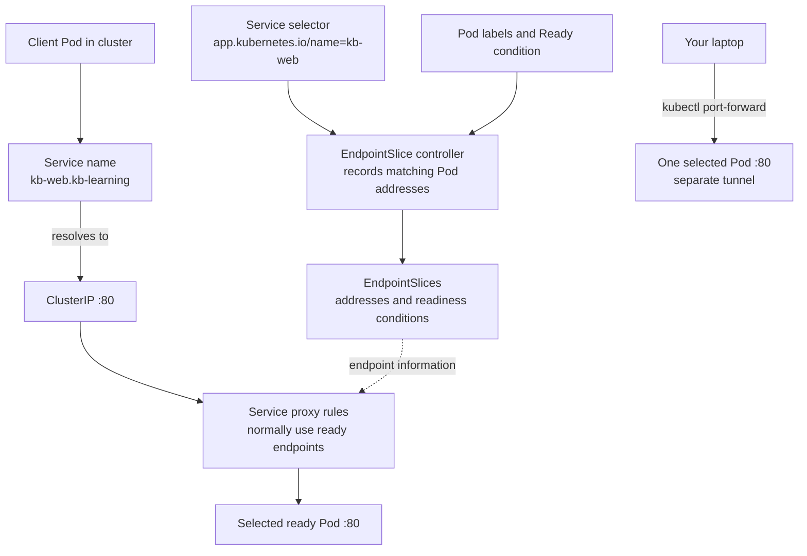

# How a Kubernetes Service selects Pods

## In one minute

A **Service** gives clients a stable way to reach a changing set of backends.
In this example, a Service of type `ClusterIP` has a name and a virtual
address inside the cluster. Its **selector** matches Pod labels; Kubernetes
records matching Pod addresses and readiness in **EndpointSlices**. Normal
Service traffic uses eligible endpoints, not Pod names.[^kubernetes-service]
[^kubernetes-endpointslices]

Read [Kubernetes fundamentals](../fundamentals/kubernetes-fundamentals.md)
first if Pod, Deployment, Namespace, or label is new. This page explains the
Service in the [local deployment learning
path](../../cross-topic-guides/local-deployment-learning-path.md). It covers
this selector-based, ordinary `ClusterIP` case. Headless and external Services,
Ingress, Gateway, and special traffic policies need their own explanations.

## Why this matters

Pods are replaceable: their names and IP addresses can change. A client that
uses one Pod IP must rediscover it after replacement. A Service keeps the
client-facing name and address while its set of usable endpoints changes.
When the Service exists but a request fails, the label match and endpoint
readiness are two different relationships to check.[^kubernetes-service]

## The four pieces

| Piece | Question it answers in `kb-web` |
| --- | --- |
| Pod labels | Does this Pod carry `app.kubernetes.io/name: kb-web`? |
| Service selector | Which Pods in `kb-learning` are candidates? |
| EndpointSlice | Which candidate Pod addresses and readiness conditions does the control plane currently record? |
| Service name and ClusterIP | Where does an in-cluster client connect without learning a Pod IP? |

The Service's own `metadata.labels` describe the **Service object**. They do
not choose its backends. Its `spec.selector` matches the labels on Pods in the
same Namespace. In the local example, the Deployment's Pod template supplies
the `kb-web` label. The Deployment has a separate selector for the Pods it
manages. Both selectors use the same label because the example author chose
it, not because the Service belongs to the Deployment. An unrelated Pod in
`kb-learning` with that label would also match the Service.[^kubernetes-service]
[^kubernetes-deployments]

To narrow the match, the Service selector could also require the existing
`app.kubernetes.io/part-of: kb-local-learning` Pod label. Any Pod with all
the selected labels would still match: labels organize traffic, not access
control.[^kubernetes-service]

## Follow the local example

The repository's [Service](../examples/local-deployment-learning-path/service.yaml)
and [Deployment](../examples/local-deployment-learning-path/deployment.yaml)
use these fields:

| File and field | Value | Meaning |
| --- | --- | --- |
| Service `metadata.namespace` | `kb-learning` | Scope of this Service and its Pod selection. |
| Service `spec.selector` | `app.kubernetes.io/name: kb-web` | Match Pods with this label. |
| Deployment `spec.selector.matchLabels` | `app.kubernetes.io/name: kb-web` | Identify Pods managed by this Deployment, independently of the Service. |
| Deployment `spec.template.metadata.labels` | `app.kubernetes.io/name: kb-web` and `app.kubernetes.io/part-of: kb-local-learning` | Give newly created Pods both labels; the extra label does not stop the Service match. |
| Service `spec.ports[].port` | `80` | Client-facing port on the Service. |
| Service `spec.ports[].targetPort` | `80` | Port to contact on a selected Pod. |
| Deployment container `containerPort` | `80` | Documents the intended container port; it does not by itself make a process listen. |

The three port values happen to be `80`, which hides their different jobs.
For example, a Service could offer `port: 80` and forward to a Pod application
listening on `targetPort: 8080`. Changing a port in YAML alone does not move
the application listener.[^kubernetes-service]

The Deployment also declares an HTTP readiness probe on `/` at port `80`.
When that probe succeeds and the Pod is Ready, the Pod can normally receive
Service traffic. A failed readiness probe marks it unready; it does not by
itself restart the container. Readiness is a routing signal, not a guarantee
that every user request will succeed.[^kubernetes-probes]

Kubernetes creates EndpointSlices for this Service because it has a selector.
They record matching Pod IPs and conditions such as `ready`. An unready Pod
with an assigned IP can still appear there with `ready: false`; seeing an
address in a slice does not mean normal Service proxying will use it. During
termination, the `serving` and `terminating` conditions add nuance. Service
proxies normally ignore terminating endpoints, but may use one that can still
respond (`serving`) if all available endpoints are terminating. This local
example has older ready Pods, so it uses the ordinary readiness path.
[^kubernetes-endpointslices][^kubernetes-virtual-ips]

## Visual: selection and traffic are different paths

Text alternative: the Service selector and matching Pod labels feed the
EndpointSlice controller; Pod readiness is recorded with each available
address. A client Pod resolves the Service name to its ClusterIP and connects
on port `80`. Cluster proxying normally uses ready endpoints from the
EndpointSlices to choose a Pod at target port `80`. A laptop using `kubectl
port-forward` instead opens a separate tunnel to one selected Pod; it does
not use the ClusterIP or Service proxy rules. Use the two paths to decide what
a successful local test actually proves.

The diagram is a model, not a packet trace or a recorded cluster run. The
local learning path's current failure patch has not been rerun in a cluster.

## Name, address, and local access

With cluster DNS configured, a Pod in `kb-learning` can normally look up the
short name `kb-web`. A Pod in another Namespace uses
`kb-web.kb-learning`; the full name also contains `.svc.` and the cluster's
configured domain. For this ordinary Service, DNS resolves to its ClusterIP,
not directly to the two Pod IPs. The ClusterIP is for cluster-internal
traffic; the kind exercise does not make it an address your laptop can call
directly.[^kubernetes-dns][^kubernetes-service]

Kubernetes implements the virtual address through node-level proxying such
as `kube-proxy` or an alternative, using Service and EndpointSlice data.
There is no one central Service process accepting every request. A stable
name therefore does not promise a successful request when no suitable
backend is available.[^kubernetes-virtual-ips]

The learning path uses
`kubectl --context kind-kb-local port-forward service/kb-web 8080:80 -n kb-learning`
from the laptop. `kubectl` selects one Pod for the forwarding session. The Kubernetes
reference does not promise which Pod it chooses; if that Pod terminates, the
session ends. A successful request through the tunnel proves one selected
Pod answered, but it does not prove that in-cluster traffic through the
Service's ClusterIP works.[^kubernetes-port-forward]

## An analogy, with limits

Imagine a radio dispatch desk with a shared channel inside one facility.
Teams call the channel (**Service name**), the desk's roster includes anyone
wearing the right badge (**selector and Pod label**), and an availability
light marks who can take a new call (**readiness**). The roster resembles an
EndpointSlice. A direct call to one person's handset resembles port-forward.

The analogy breaks in useful ways:

- There is no single human dispatcher. The Service defines a selector and
  ports; EndpointSlices record backends, and cluster nodes keep routing
  rules.[^kubernetes-virtual-ips]
- A badge is not ownership or authorization. A matching Pod can be selected
  even if a different controller created it.[^kubernetes-service]
- The availability light reflects the configured readiness signal. It does
  not prove the whole application or a user's workflow is healthy.
  [^kubernetes-probes]
- A direct handset call bypasses the normal channel. Port-forward can work
  while the in-cluster Service path is broken.[^kubernetes-port-forward]

## One failed rollout, interpreted

In the local learning path, the intended failure is an image tag that cannot
be pulled. The expected situation is two older ready Pods and one new Pod
that is not ready. The Service selector matches Pods by label, including the
new one if it has the same label. Its EndpointSlice entry, if it has an IP and
appears, should have `ready: false`, while the older ready endpoints remain
eligible for normal Service traffic. This three-Pod state has not been
observed in a recorded run of the revised exercise; it is the **expected
model**.[^kubernetes-endpointslices]

If a port-forward during that failure cannot reach the page, read its error
and inspect Pod status before concluding that the Service's in-cluster route
is broken. The [learning path](../../cross-topic-guides/local-deployment-learning-path.md)
shows how to forward to one specifically named ready Pod. Conversely, a
successful port-forward shows only one selected Pod answered.

## Check your understanding

- Which field selects the Service's candidate Pods: the Service's
  `metadata.labels` or its `spec.selector`?
- If an unrelated ready Pod in `kb-learning` receives the `kb-web` label,
  could this Service include it? What would you change to avoid that?
- Why can a Pod have a matching label yet not be a normal ready endpoint?
- Why does a successful laptop port-forward not prove that a client Pod can
  use `kb-web.kb-learning:80`?

## Next steps and official documentation

- Apply the model in the [local deployment learning
  path](../../cross-topic-guides/local-deployment-learning-path.md), where
  you inspect Pod IPs and EndpointSlice readiness during a failed rollout.
- Learn the complete object and selector rules in the official [Service
  guide](https://kubernetes.io/docs/concepts/services-networking/service/).
- Read [EndpointSlices](https://kubernetes.io/docs/concepts/services-networking/endpoint-slices/)
  for endpoint conditions and [readiness probes](https://kubernetes.io/docs/concepts/workloads/pods/probes/)
  for the signal that affects ordinary traffic.
- Read [DNS for Services and Pods](https://kubernetes.io/docs/concepts/services-networking/dns-pod-service/)
  when a client in another Namespace cannot resolve the short name.
- Continue to [Gateway API and
  Ingress](../applications-and-tools/gateway-api-and-ingress.md) when the
  question is how outside HTTP traffic reaches a Service.

[^kubernetes-service]: [Kubernetes Service](https://kubernetes.io/docs/concepts/services-networking/service/), source record `kubernetes-service`.
[^kubernetes-endpointslices]: [Kubernetes EndpointSlices](https://kubernetes.io/docs/concepts/services-networking/endpoint-slices/), source record `kubernetes-endpointslices`.
[^kubernetes-probes]: [Kubernetes liveness, readiness, and startup probes](https://kubernetes.io/docs/concepts/workloads/pods/probes/), source record `kubernetes-probes`.
[^kubernetes-dns]: [DNS for Services and Pods](https://kubernetes.io/docs/concepts/services-networking/dns-pod-service/), source record `kubernetes-dns`.
[^kubernetes-virtual-ips]: [Virtual IPs and Service proxies](https://kubernetes.io/docs/reference/networking/virtual-ips/), source record `kubernetes-virtual-ips`.
[^kubernetes-port-forward]: [kubectl port-forward](https://kubernetes.io/docs/reference/kubectl/generated/kubectl_port-forward/), source record `kubernetes-port-forward`.
[^kubernetes-deployments]: [Kubernetes Deployments](https://kubernetes.io/docs/concepts/workloads/controllers/deployment/), source record `kubernetes-deployments`.
