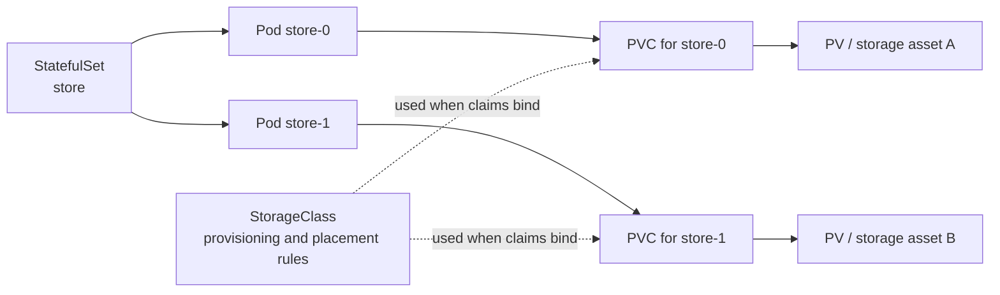

# Stateful workloads

## Purpose

Use this page to decide whether a workload needs stable Pod identities and to
understand how those identities connect to storage. You should be able to
explain what survives a Pod replacement, what can be deleted by policy, and
which data-safety responsibilities remain yours. This is a conceptual guide;
it does not deploy a database.

## The simple model

A **Deployment** keeps a desired number of interchangeable Pods running. A
**StatefulSet** keeps a desired set of Pods with stable names and identities,
creates and removes them in a predictable order by default, and can give each
one a persistent storage claim.[^kubernetes-deployment][^kubernetes-statefulset]

For a database-like workload, that difference matters because `store-0`
may have different local data from `store-1`. Replacing `store-0` should not
turn it into an anonymous replica with `store-1`'s disk. A StatefulSet can
recreate `store-0` and reconnect it to its own claim. The application still
has to know how to use or recover that data.[^kubernetes-statefulset]

Think of each Pod as a named desk with an assigned filing cabinet. The desk
can be replaced while the same cabinet remains assigned. The analogy ends
there: a filing cabinet does not copy its contents to other cabinets, repair
corrupt records, or keep a safe copy elsewhere.

## The four storage pieces

| Object | Plain meaning | What it does not promise |
| --- | --- | --- |
| StatefulSet | Controller that manages named Pods such as `store-0`, `store-1`, and `store-2`; a volume claim template can create a separate claim for each Pod. | Application replication, backups, or consistent writes. |
| PersistentVolumeClaim (PVC) | A request for storage with a size, access mode, and possibly a StorageClass. It binds to one suitable PersistentVolume. | A copy of the data or a guarantee that the underlying storage survives deletion. |
| PersistentVolume (PV) | The cluster's representation of a storage asset, provisioned in advance or dynamically. | A particular recovery objective. Its reclaim policy matters when the claim is deleted. |
| StorageClass | A storage offering that identifies a provisioner and settings such as binding mode and reclaim policy for new volumes. | That every node or zone can use every resulting volume. |

The usual flow is: a StatefulSet's claim template creates one PVC for each
Pod; a suitable PV binds to each PVC; a StorageClass can ask a provisioner to
create the PV and underlying storage when needed.[^kubernetes-statefulset][^kubernetes-pv][^kubernetes-dynamic-provisioning]

Text alternative: the StatefulSet creates named Pods. Each Pod has its own
PVC from the claim template, and each claim binds to a separate PV representing
an underlying storage asset. A StorageClass can control provisioning and
placement while the claims bind. Replacing a Pod does not automatically
replace the claim or copy data between the volumes.

When Pods need stable network names for peer discovery, a StatefulSet uses a
headless Service as its governing Service. That lets an application find a
particular named Pod; it does not make the application form a healthy
cluster.[^kubernetes-statefulset]

## Example: three database-like Pods

This is an illustrative model, not an observed cluster or a ready-to-run
database. A StatefulSet called `store` has three Pods: `store-0`, `store-1`,
and `store-2`. Its claim template gives each Pod its own PVC and volume.

Suppose the node running `store-1` fails. Kubernetes can recreate the Pod
with the same name and seek to attach the same volume through its existing
claim. If the storage can attach to the replacement node, `store-1` sees its
previous local files. The expected observation is the stable Pod name and
claim identity, not an assertion that the application has recovered or that
all writes survived.[^kubernetes-statefulset]

If the volume is restricted to one availability zone and no suitable node is
available there, the replacement may remain unscheduled. For new
topology-dependent storage, a StorageClass with `WaitForFirstConsumer` delays
provisioning and binding until a Pod is scheduled, so the scheduler can account
for placement. It cannot relocate an already provisioned zonal volume after
failure.[^kubernetes-storageclass]

The database must implement its own replication and consistency rules if the
three Pods are to share data safely. A StatefulSet and three PVCs do not create
a three-copy database. Backups, restore testing, and a recovery plan remain
separate requirements.

## Two deletion policies to keep apart

Removing a Pod is different from removing its claim, and removing a claim is
different from deleting the storage asset.

1. **StatefulSet PVC retention** decides whether claims created from the
   template remain after scale-down or StatefulSet deletion. The default is
   `Retain`; the `persistentVolumeClaimRetentionPolicy` can instead request
   claim deletion for either event.[^kubernetes-statefulset]
2. **PV reclaim policy** decides what happens to the PV and underlying storage
   after its PVC is deleted. `Retain` preserves the volume for manual
   recovery; `Delete` removes it through the storage provider. Dynamically
   provisioned PVs inherit the StorageClass reclaim policy, which defaults to
   `Delete` if unspecified.[^kubernetes-pv][^kubernetes-storageclass]

That two-stage chain is why "the StatefulSet keeps my data" is unsafe as a
general rule. Before scaling down or deleting a workload, inspect the claim
retention setting, the bound PV's reclaim policy, and the tested backup or
restore path. See [Velero storage and volume backups](../../migrations/velero/storage-and-volume-backups.md)
for Kubernetes volume recovery choices; database-native backup may still be
needed for application consistency.

## When to choose it

- Use a StatefulSet when each replica needs a stable name, its own persistent
  claim, or ordered creation and termination as part of the application's
  design.[^kubernetes-statefulset]
- Use a Deployment when replicas can be replaced interchangeably. A stateful
  application is not forbidden from using a Deployment; what matters is
  whether its identity and storage needs fit that controller's behavior.
- Choose storage and recovery by the data's failure model: zone availability,
  attach constraints, data replication, backup frequency, and tested restore.
  A controller choice alone cannot satisfy these requirements.

## Check your understanding

- If `store-1` is replaced, which names and storage relationship should
  remain stable? What still needs application-level recovery?
- If a StatefulSet is deleted with default PVC retention, are its underlying
  disks guaranteed to exist forever?
- Why does `WaitForFirstConsumer` help with initial zonal placement but not
  fix an unavailable zone later?

## Official documentation for deeper study

- [StatefulSets](https://kubernetes.io/docs/concepts/workloads/controllers/statefulset/) covers identity, ordering, volume claim templates, and PVC retention.
- [Persistent Volumes](https://kubernetes.io/docs/concepts/storage/persistent-volumes/) explains claims, binding, and reclaim policies.
- [Storage Classes](https://kubernetes.io/docs/concepts/storage/storage-classes/) explains provisioning settings and `WaitForFirstConsumer`.
- [Dynamic Volume Provisioning](https://kubernetes.io/docs/concepts/storage/dynamic-provisioning/) follows a storage request to a new volume.
- [Deployments](https://kubernetes.io/docs/concepts/workloads/controllers/deployment/) describes the interchangeable-Pod controller.

## Related links

- [Kubernetes fundamentals](../fundamentals/kubernetes-fundamentals.md)
- [Velero storage and volume backups](../../migrations/velero/storage-and-volume-backups.md)
- [Stateful vs. stateless on AWS](../../cloud/aws/architecture/stateful-vs-stateless.md)
- [Back to Kubernetes core objects](index.md)
- [Back to Kubernetes index](../index.md)
- [Back to root index](../../../README.md)

[^kubernetes-statefulset]: [Kubernetes - StatefulSets](https://kubernetes.io/docs/concepts/workloads/controllers/statefulset/), source record `kubernetes-statefulset`.
[^kubernetes-pv]: [Kubernetes - Persistent Volumes](https://kubernetes.io/docs/concepts/storage/persistent-volumes/), source record `kubernetes-pv`.
[^kubernetes-storageclass]: [Kubernetes - Storage Classes](https://kubernetes.io/docs/concepts/storage/storage-classes/), source record `kubernetes-storageclass`.
[^kubernetes-dynamic-provisioning]: [Kubernetes - Dynamic Volume Provisioning](https://kubernetes.io/docs/concepts/storage/dynamic-provisioning/), source record `kubernetes-dynamic-provisioning`.
[^kubernetes-deployment]: [Kubernetes - Deployments](https://kubernetes.io/docs/concepts/workloads/controllers/deployment/), source record `kubernetes-deployment`.
