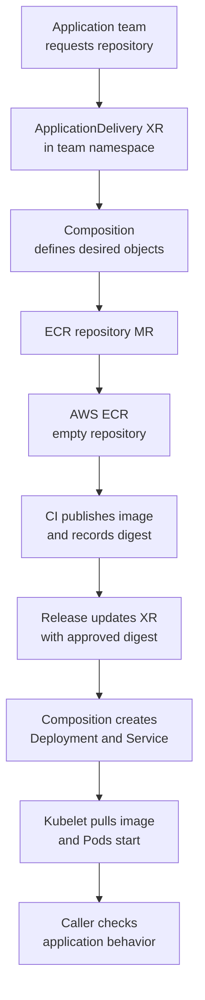

# How one platform request reaches a running application

## The useful question

A team wants to run a `payments-api` image on Kubernetes without
learning the AWS ECR and Crossplane provider APIs. The platform team can
offer an `ApplicationDelivery` API that creates an ECR repository and
later deploys an approved image. The request is useful only after an
image exists, the workload starts, and a user can reach the application.
This is an *invented design*, not a tested platform implementation.
[^crossplane-xrd][^crossplane-compositions][^aws-ecr-repositories]

Think of a repository as an empty shelf, an image digest as the
identity of one stocked item, and a Service as a way to find the
running application. The analogy stops at the shelf: Crossplane
reconciles infrastructure continuously, while a build system must
produce the image and Kubernetes must run it. An empty repository
cannot supply an image to a new Deployment.[^aws-ecr-images]

## Follow the staged request

The platform contract could make `imageDigest` optional at first.
This is a *design choice* that its XRD, Composition, and admission
policy must implement; the field names below are illustrative.
A repository request and a release request could instead be two
separate APIs.[^crossplane-xrd][^crossplane-compositions]

| Stage | What happens for the invented `payments-api` | What would show progress |
| --- | --- | --- |
| 1. Request a repository | The application team asks for a repository name in its namespace. The XRD validates the shape of the request; the Composition creates an ECR managed resource. | The XR and managed resource exist; the provider reports the external repository ready. |
| 2. Publish an artifact | CI builds and checks the image, then pushes it to that repository using its own push identity. CI records the resulting digest. | ECR contains the expected digest. A repository's readiness does **not** prove this. |
| 3. Request a release | The application team or release automation updates the request with the approved digest. The Composition creates or updates a Deployment and Service using the matching ECR image URI. | The desired Deployment and Service exist; the Deployment reports rollout progress. |
| 4. Check the result | Kubernetes pulls the image and starts Pods. A caller uses the intended route and checks application behavior. | Pods are ready, the Deployment is available, and a real request succeeds. |

Do not create a Deployment that points to a nonexistent image while
waiting for stage 2. A Composition can omit the workload resources
until a valid digest is supplied, but that needs explicit function
logic; simple patching alone does not establish the dependency.
The image URI must include the right registry, repository, and digest,
such as `<account>.dkr.ecr.<region>.amazonaws.com/payments-api@sha256:<digest>`.
The placeholders are not usable image references.[^crossplane-compositions][^aws-ecr-eks]

Text alternative: the application team creates an XR. Its Composition
creates a managed resource, and the ECR provider creates an empty
repository. CI publishes an image and gives the release process its
digest. The release process updates the XR; the Composition then
creates the Deployment and Service. The kubelet pulls the image, the
Pods start, and a caller checks the application.[^crossplane-xr]
[^crossplane-compositions][^kubernetes-images]

## Who owns each handoff?

| Actor | Owns | Does not prove |
| --- | --- | --- |
| Platform team | XRD contract, Composition, provider installation, repository rules, release guardrails, and Crossplane access. | That CI has built an image or the app works. |
| Application team | Requested name, approved release, app behavior, and its namespace access. | That the provider has permission in AWS. |
| ECR provider | Reconciliation of the repository through its ProviderConfig and AWS identity. | That an image exists in the repository. |
| CI system | Build, checks, push, and recorded image digest using a push identity. | That cluster nodes can pull or run the image. |
| Kubernetes runtime | Pull credentials, Pods, Deployment rollout, and Service routing. | That a user request produces the intended answer. |

These are **different credentials**. The provider identity creates
the repository; the CI identity pushes the image; the cluster's image
pull mechanism reads it. On EKS nodes, the node role commonly supplies
ECR pull permissions; Fargate uses its pod execution role. Other
Kubernetes clusters may use `imagePullSecrets` or a kubelet
credential provider. A Pod's application AWS identity is not, by
itself, proof that image pulls are configured.[^aws-ecr-eks]
[^kubernetes-images]

The XR's namespace limits where that Kubernetes request lives. It
does not make an ECR repository name private to the namespace; AWS
repository names live in a registry and Region. The platform must
prevent cross-team name collisions and constrain the chosen AWS
account, Region, repository policy, and image URI. Crossplane needs
permission to compose each Kubernetes resource type; its service
account can create some built-in types, including Deployments, while
other kinds require an aggregated ClusterRole. Check the installed
configuration rather than assuming every kind is allowed.
[^aws-ecr-repositories][^crossplane-compositions]

## Readiness has several meanings

| Signal | What it can establish | What it cannot establish |
| --- | --- | --- |
| ECR managed resource `Ready=True` | The provider reports the repository available at its last observation. | An image was pushed or can be pulled by this cluster. |
| XR `Ready=True` | The configured Composition pipeline reports its composed resources ready. | The application answered a user request. |
| Deployment availability and ready Pods | Kubernetes has started the requested workload under its configured checks. | The Service route and business behavior are correct. |
| Service exists | A stable Kubernetes Service object and selector are configured. | Backing Pods are ready or the app responds correctly. |
| Real request through the intended route | The particular path and behavior tested worked. | Every path, user, or later release will work. |

Function Patch and Transform normally waits for composed resources
with `Ready=True`. A Kubernetes Service often has no such condition;
a Deployment uses its own status and conditions. A Composition that
includes them needs deliberate readiness checks. Treating Service
creation as ready can make the XR look healthy before the app is
usable. Deployment `Available` also does not replace a request
through the route users will take.[^crossplane-patch-transform]
[^kubernetes-deployment][^kubernetes-service]

For a failed rollout, follow the first failing handoff:
XR conditions and Composition output, ECR managed-resource
conditions, image digest and push record, Pod image-pull events,
Deployment and Service state, then the real application request.
See [Find the first failing Crossplane handoff](troubleshooting.md).
[^crossplane-xr][^crossplane-managed]

## Design and lifecycle decisions

Before implementing this API, the platform team must decide:

1. Whether repository creation and release are stages of one XR or
   separate requests; how the workload stays absent until the image
   exists; and who may update the digest.
2. How the API derives a unique repository name, limits the image URI
   to the intended registry and repository, and chooses immutable
   release references.
3. Which resource readiness checks represent repository creation,
   Kubernetes rollout, and application health. State those separately
   in the portal or documentation.
4. What deletion means. Deleting an XR can delete composed resources
   and may cause the provider to delete the ECR repository, depending
   on management policy. AWS requires an empty repository or a force
   deletion to remove one containing images. Define retention and
   recovery rules before publishing the API.
   [^crossplane-managed][^aws-ecr-delete]

This page specifies no deployable XRD, Composition, provider package,
IAM policy, or CI pipeline. Build those against the installed
Crossplane and provider versions, render the Composition, then
exercise repository creation, image publication, rollout, failure,
and deletion in a disposable environment before offering the API
to teams.[^crossplane-compositions]

## Check your understanding

- If the ECR managed resource says `Ready=True` but the Pod reports
  `ImagePullBackOff`, which handoffs would you check next?
- Why can a just-created repository not be used as evidence that the
  first Deployment will start?
- Which identity creates the repository, which pushes the image, and
  which pulls it?
- If the XR says `Ready=True`, what user-path check is still needed?

## Go further

- [How a Crossplane Composition fulfills one application request](compositions.md)
  explains XRD, function output, and composed-resource readiness.
- [How a Crossplane provider reaches an external API](providers-and-authentication.md)
  explains package, ProviderConfig, Pod identity, and AWS authorization.
- [Amazon ECR](../../cloud/aws/compute/amazon-ecr.md) explains the
  registry and image lifecycle.
- [Crossplane Composition documentation](https://docs.crossplane.io/latest/composition/compositions/)
  covers function pipelines and resource access.
- [Function Patch and Transform documentation](https://docs.crossplane.io/latest/guides/function-patch-and-transform/)
  covers custom readiness checks.
- [AWS ECR on EKS documentation](https://docs.aws.amazon.com/AmazonECR/latest/userguide/ECR_on_EKS.html)
  covers image references and pull identities.

[^crossplane-xrd]: Crossplane, [Composite Resource Definitions](https://docs.crossplane.io/latest/composition/composite-resource-definitions/).
[^crossplane-xr]: Crossplane, [Composite Resources](https://docs.crossplane.io/latest/composition/composite-resources/).
[^crossplane-compositions]: Crossplane, [Compositions](https://docs.crossplane.io/latest/composition/compositions/).
[^crossplane-patch-transform]: Crossplane, [Function Patch and Transform](https://docs.crossplane.io/latest/guides/function-patch-and-transform/).
[^crossplane-managed]: Crossplane, [Managed Resources](https://docs.crossplane.io/latest/managed-resources/managed-resources/).
[^aws-ecr-repositories]: AWS, [Amazon ECR repositories](https://docs.aws.amazon.com/AmazonECR/latest/userguide/Repositories.html).
[^aws-ecr-images]: AWS, [Amazon ECR images](https://docs.aws.amazon.com/AmazonECR/latest/userguide/images.html).
[^aws-ecr-eks]: AWS, [Using Amazon ECR images with Amazon EKS](https://docs.aws.amazon.com/AmazonECR/latest/userguide/ECR_on_EKS.html).
[^aws-ecr-delete]: AWS, [DeleteRepository](https://docs.aws.amazon.com/AmazonECR/latest/APIReference/API_DeleteRepository.html).
[^kubernetes-images]: Kubernetes, [Images](https://kubernetes.io/docs/concepts/containers/images/).
[^kubernetes-deployment]: Kubernetes, [Deployments](https://kubernetes.io/docs/concepts/workloads/controllers/deployment/).
[^kubernetes-service]: Kubernetes, [Services](https://kubernetes.io/docs/concepts/services-networking/service/).
