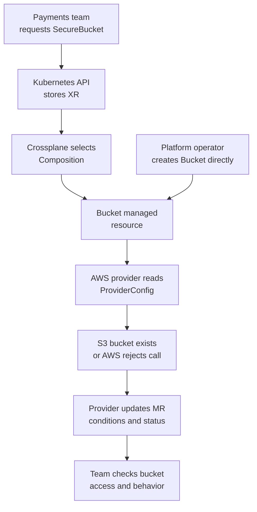

# How an AWS resource request moves through Crossplane

## Follow one request

Imagine that a payments team needs a private S3 bucket for artifacts.
A platform offers a `SecureBucket` API. The team creates one
namespaced request; Crossplane produces a `Bucket` managed resource;
an AWS provider calls S3 and records what it observes. This is an
*invented journey*, not a report of a bucket created or tested here.
[^crossplane-xrd][^crossplane-xr][^crossplane-managed]

Think of the Kubernetes request as a work order, the Composition as
the instructions for filling it, and the provider as the worker who
talks to AWS. The analogy stops at the receipt: a Kubernetes API
acceptance or green GitOps sync does not prove AWS accepted the order
or that the application can use the bucket.
[^crossplane-compositions][^crossplane-managed]



Text alternative: the payments team submits a `SecureBucket` XR to
Kubernetes. Crossplane uses its Composition to produce a Bucket
managed resource. A platform operator could also create the Bucket
managed resource directly. Either way, the AWS provider selects a
ProviderConfig, calls S3, and writes observed conditions and status.
The team then checks that its application can use the bucket.
[^crossplane-compositions][^crossplane-managed]

## What must exist first?

| Layer | Who prepares it | What it enables |
| --- | --- | --- |
| Kubernetes cluster | Cluster or platform team | A running API server and Pods for Crossplane. Crossplane itself needs this first cluster.[^crossplane-install] |
| Crossplane core | Platform team | Package installation, XRDs, XRs, and Composition reconciliation.[^crossplane-install] |
| AWS provider package and active API | Platform team | The provider controller and `Bucket` managed-resource kind. An installed package and an activated kind are separate checks.[^crossplane-providers][^crossplane-activation] |
| Provider identity and ProviderConfig | Platform and security teams | A deliberate AWS identity, account scope, and authentication path for the provider.[^crossplane-managed] |
| `SecureBucket` XRD and Composition | Platform team | A small consumer API and the implementation that produces its resources.[^crossplane-xrd][^crossplane-compositions] |

The platform may publish the XRD and Composition as a versioned
Configuration package. The payments team should need permission
to create the XR, while the platform controls provider installation,
Composition changes, and the AWS identity. Namespace access alone
does not limit what that identity may do in AWS.
[^crossplane-compositions][^crossplane-managed]

For a direct managed-resource exercise, the XRD and Composition are
unnecessary. That route helps a learner see the provider boundary
but exposes provider-specific fields to the request author.
[When to use a managed resource or a Crossplane platform API](providers-compositions-and-managed-resources.md)
compares the two routes.

## Trace the first creation

The consumer might submit this *illustrative* request:

```yaml
apiVersion: platform.example.com/v1alpha1
kind: SecureBucket
metadata:
  name: payments-artifacts
  namespace: payments
spec:
  region: eu-west-1
```

The example assumes a matching XRD, Composition, provider package,
and provider configuration. It is not a standalone deployable
manifest. The word `Secure` does not enforce privacy: the
Composition must create and verify the required access controls.
A real S3 bucket name must satisfy AWS naming rules and be
available under the selected S3 naming scheme; a namespaced XR
name alone does not reserve an S3 name.[^crossplane-xrd][^aws-s3-names]

| Handoff | What a learner would inspect | What that evidence means |
| --- | --- | --- |
| Kubernetes accepts the XR | XR exists; schema and namespace are correct. | The request shape was accepted, before any AWS result.[^crossplane-xrd] |
| Crossplane composes | XR `Synced`, selected Composition, and composed-resource references. | The function pipeline produced the intended Bucket object, or its condition explains a failure.[^crossplane-xr] |
| Provider reconciles | Bucket managed resource `Synced`, `Ready`, Reason, Message, and selected ProviderConfig. | The provider's last observation of its AWS work, including authentication or API errors.[^crossplane-managed] |
| AWS has the resource | Read-only inspection in the intended account and Region, with the recorded external name. | The bucket exists where expected; verify its actual controls separately.[^crossplane-managed] |
| Application uses it | A representative authorized upload or read through the real application path. | The tested use works with its identity and configuration. |

`kubectl` talks to Kubernetes; the provider controller talks to
AWS. A ProviderConfig tells the provider which authentication
source to use. For a local lab this might be temporary credentials
in a Kubernetes Secret. An EKS production setup can use an
appropriate workload identity after checking that the provider
runtime and AWS SDK support the chosen path. The provider's AWS
permissions still need to match the resources it must reconcile.
[^crossplane-managed]

## What happens after creation?

Changing a supported `spec.forProvider` field on a managed
resource changes desired state. The provider observes and
reconciles that field, subject to its API and
`managementPolicies`. A change outside Crossplane can be
corrected on a later reconcile when Crossplane owns the field.
A successful Kubernetes apply is not proof that AWS accepted
the update; read the managed-resource conditions and the
external result.[^crossplane-managed]

A `crossplane.io/paused: "true"` annotation stops a managed
resource's reconciliation. It also stops the work needed to
finish deletion, so a paused object can remain with a deletion
timestamp. Use pause only with a clear operating reason and
resume plan.[^crossplane-managed]

When a managed resource is deleted, the provider may delete its
AWS resource if its management policy includes `Delete`.
The provider's finalizer keeps the Kubernetes object until
cleanup is complete or a problem is resolved. An S3 bucket
that still has data or a provider identity without delete
permission needs investigation; removing the finalizer can
leave an unmanaged AWS resource. Decide the data-retention
and ownership outcome before deleting the XR or its composed
resources.[^crossplane-managed]

For a `SecureBucket`, deletion can involve more than the
Bucket itself: public-access controls, policies, or other
composed resources may have separate lifecycles. A platform
API should define and test those lifecycles as one product.
[^crossplane-compositions]

## Where GitOps fits

A GitOps controller can apply the provider, XRD, Composition,
and XR manifests from reviewed Git commits. It reports whether
those manifests reached the Kubernetes API. Crossplane and its
provider then reconcile the objects and AWS resources. Read
the GitOps sync signal, XR conditions, managed-resource
conditions, and application outcome as separate observations.
[How GitOps and Crossplane keep a platform request running](production-gitops-and-operations.md)
follows that operating loop.[^crossplane-xr][^crossplane-managed]

## Check your understanding

- If `kubectl apply` succeeded but the bucket is absent in AWS,
  which two Crossplane objects would you inspect first?
- If the provider reports `Ready=True`, why should the
  application team still try its own authorized access path?
- Which identity calls AWS, and where does it find its
  authentication configuration?
- What should the platform decide before deleting a bucket
  that may contain application data?

## Go further

- [Local AWS S3 lab](local-aws-s3-lab.md) is the separate
  hands-on route for a disposable environment.
- [How a Crossplane provider reaches an external API](providers-and-authentication.md)
  explains package, ProviderConfig, runtime identity, and AWS
  authorization.
- [Find the first failing Crossplane handoff](troubleshooting.md)
  helps locate a failed stage.
- [Crossplane installation](https://docs.crossplane.io/latest/get-started/install/)
  gives current setup instructions.
- [Crossplane managed resources](https://docs.crossplane.io/latest/managed-resources/managed-resources/)
  documents lifecycle and conditions.
- [AWS S3 bucket naming rules](https://docs.aws.amazon.com/AmazonS3/latest/userguide/bucketnamingrules.html)
  covers external-name constraints.

[^crossplane-install]: Crossplane, [Install Crossplane](https://docs.crossplane.io/latest/get-started/install/).
[^crossplane-providers]: Crossplane, [Providers](https://docs.crossplane.io/latest/packages/providers/).
[^crossplane-managed]: Crossplane, [Managed Resources](https://docs.crossplane.io/latest/managed-resources/managed-resources/).
[^crossplane-xrd]: Crossplane, [Composite Resource Definitions](https://docs.crossplane.io/latest/composition/composite-resource-definitions/).
[^crossplane-xr]: Crossplane, [Composite Resources](https://docs.crossplane.io/latest/composition/composite-resources/).
[^crossplane-compositions]: Crossplane, [Compositions](https://docs.crossplane.io/latest/composition/compositions/).
[^crossplane-activation]: Crossplane, [Managed Resource Activation Policies](https://docs.crossplane.io/latest/managed-resources/managed-resource-activation-policies/).
[^aws-s3-names]: AWS, [General purpose bucket naming rules](https://docs.aws.amazon.com/AmazonS3/latest/userguide/bucketnamingrules.html).
