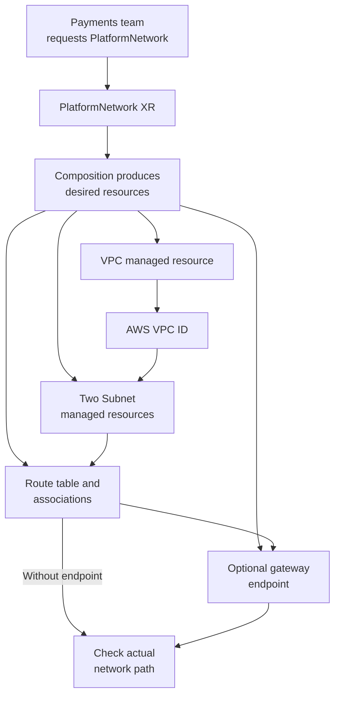

# How one Crossplane request becomes an AWS network

## One request, several AWS resources

Imagine that a payments team needs a VPC in `eu-west-1` with two
subnets in different Availability Zones. The team would rather
request a `PlatformNetwork` than submit AWS provider resources one
by one. A platform team can define that API with an XRD and implement
it with a Composition. The example on this page is *invented*; no
cluster or AWS account was used to validate a deployment.
[^crossplane-xrd][^crossplane-compositions]

Think of the XR as an order for a network, the Composition as the
platform's assembly instructions, and managed resources as the
individual work orders sent to AWS. The analogy has a limit:
Crossplane controllers reconcile asynchronously. A stored order
does not mean the network already exists or passes traffic.
[^crossplane-xr][^crossplane-managed]

An illustrative consumer request could look like this:

```yaml
apiVersion: platform.example.org/v1alpha1
kind: PlatformNetwork
metadata:
  name: payments-network
  namespace: payments
spec:
  region: eu-west-1
  vpcCidr: 10.40.0.0/16
  subnets:
    - name: private-a
      availabilityZone: eu-west-1a
      cidrBlock: 10.40.1.0/24
    - name: private-b
      availabilityZone: eu-west-1b
      cidrBlock: 10.40.2.0/24
```

These fields are a proposed API contract, not installed CRDs. The
platform must validate the supported Regions and Availability Zones,
the CIDR ranges and overlaps, subnet names, and who may create or
change the request. The Composition must choose the AWS account and
provider identity under platform control.[^crossplane-xrd]
[^crossplane-managed]

## Follow the pieces

| Piece | Why it exists in this example | Dependency or limit |
| --- | --- | --- |
| VPC managed resource | Requests the AWS VPC and its address range. | AWS returns the VPC ID after creation. |
| Two Subnet managed resources | Request address ranges in separate Availability Zones. | Each must reference that VPC ID; their ranges must fit inside the VPC without overlap. |
| Route table and associations | Give the two subnets an explicit routing policy. | AWS subnets otherwise use the VPC's main route table. A table's routes determine reachability. |
| Optional S3 or DynamoDB gateway endpoint | Let selected subnet route tables carry traffic for that AWS service through a gateway endpoint. | Associate the right route tables and still check IAM, endpoint policy, and service access. |
| Optional custom network ACL | Add subnet-level allow and deny rules when required. | A custom ACL needs correct rules in both directions because ACLs are stateless. |

A private-sounding subnet name or `mapPublicIpOnLaunch: false`
does not by itself define every route and access path. The route
table controls where traffic is sent. Security groups, network
ACLs, endpoint policies, identity permissions, DNS, and the
application's own configuration can still affect whether a request
works.[^aws-vpc-subnet-routes][^aws-vpc-acl]
[^aws-vpc-s3-endpoint]



Text alternative: the payments team creates one XR. Its Composition
produces a VPC, two Subnets, and routing resources, with an optional
gateway endpoint. The provider observes the AWS VPC ID; the Subnets
reference it. The route table associates with the Subnets, and a
gateway endpoint may associate with that route table. A final
connectivity check tests the intended path.[^crossplane-compositions]
[^crossplane-managed][^aws-vpc-subnet-routes]

Provider reference fields, such as `vpcIdRef` or
`vpcIdSelector`, can connect a Subnet managed resource to the
VPC managed resource. A selector using
`matchControllerRef: true` can narrow a match to resources
composed by the same XR. When there are two Subnets, a later
resource that needs just one must add a unique label or direct
name reference. Provider API groups and field names depend on
the installed package; check its CRDs before implementing this
pattern.[^crossplane-managed]

## Read the right success signal

A new network is delivered in stages:

1. **API accepted:** Kubernetes stores the XR and its schema-valid
   fields. This says nothing about AWS creation.[^crossplane-xrd]
2. **Composition reconciled:** Crossplane selects the intended
   Composition and produces the desired managed resources.
   Inspect XR conditions and the resource tree.[^crossplane-xr]
3. **Provider reconciled:** The AWS provider creates or observes
   each external resource and reports managed-resource conditions.
   A Subnet may wait for the VPC ID; check whether the wait
   resolves instead of assuming the YAML has an execution order.
   [^crossplane-managed]
4. **Network works:** Test a real, authorized path from the
   intended workload to its destination. A gateway endpoint
   existing does not prove DNS, route selection, IAM, or endpoint
   policy permits that request.[^aws-vpc-s3-endpoint]
   [^aws-vpc-ddb-endpoint]

A gateway endpoint can add a route to associated route tables
for its service. It does not provide general internet access.
Similarly, a custom network ACL with only an inbound allow rule
can block replies because it evaluates inbound and outbound
traffic separately.[^aws-vpc-s3-endpoint][^aws-vpc-acl]

## Decide deletion before offering the API

The previous version of this page showed a consumer
`deletionPolicy: Orphan` field patched into Crossplane v2
namespaced managed resources. The current Crossplane managed-resource
documentation uses `spec.managementPolicies` to control whether
the provider may delete an external resource. The provider determines
support for these policies. Do not promise an `Orphan` outcome
from an unverified field.[^crossplane-managed]

A platform can choose a tested retention policy for each managed
resource. For example, removing `Delete` from a supported
managed resource's `managementPolicies` means Crossplane should
leave its external resource when that managed resource is deleted.
Retaining a VPC while deleting Subnets, route tables, or endpoints
is a different outcome from retaining the whole network. Decide
which resources are retained together, who takes over their AWS
ownership, and how the team will recover or remove them later.
Test deletion in a disposable account before giving consumers
a retention option.[^crossplane-managed]

## What an implementation must still prove

This explanation supplies no deployable XRD, Composition, IAM policy,
provider package, or cleanup command. Before publication, a
platform team should:

- Pin compatible Crossplane, provider, and function versions and
  inspect the installed CRDs for the exact resource fields,
  including any ACL-to-subnet association and endpoint-to-route-table
  fields.[^crossplane-compositions][^crossplane-managed]
- Render the proposed Composition to inspect the desired resource
  set, then test it against a disposable control plane and AWS
  account. Rendering does not prove provider credentials, AWS
  acceptance, or connectivity.[^crossplane-compositions]
- Verify that a change or deletion of the XR produces the intended
  AWS outcome for **every** composed resource. Record the observed
  result before offering an operational guarantee.
  [^crossplane-managed]

## Check your understanding

- Why can a Subnet managed resource wait even though Kubernetes
  accepted the `PlatformNetwork` XR?
- What does a route table association add to a Subnet?
- Why might an S3 gateway endpoint exist while an application
  request to S3 still fails?
- If the VPC is retained but the Subnets are deleted, what
  should the platform tell the payments team?

## Go further

- [Choose how Crossplane repeats and connects resources](deployment-patterns-and-references.md)
  explains fixed templates, loops, and provider references.
- [How a Crossplane managed resource changes over time](managed-resources-and-lifecycle.md)
  explains reconciliation and deletion boundaries.
- [AWS subnet route tables](https://docs.aws.amazon.com/vpc/latest/userguide/subnet-route-tables.html)
  explains route-table associations.
- [AWS network ACLs](https://docs.aws.amazon.com/vpc/latest/userguide/vpc-network-acls.html)
  explains stateless subnet rules.
- [Crossplane managed resources](https://docs.crossplane.io/latest/managed-resources/managed-resources/)
  documents references and management policies.

[^crossplane-xrd]: Crossplane, [Composite Resource Definitions](https://docs.crossplane.io/latest/composition/composite-resource-definitions/).
[^crossplane-xr]: Crossplane, [Composite Resources](https://docs.crossplane.io/latest/composition/composite-resources/).
[^crossplane-compositions]: Crossplane, [Compositions](https://docs.crossplane.io/latest/composition/compositions/).
[^crossplane-managed]: Crossplane, [Managed Resources](https://docs.crossplane.io/latest/managed-resources/managed-resources/).
[^aws-vpc-subnet-routes]: AWS, [Subnet route tables](https://docs.aws.amazon.com/vpc/latest/userguide/subnet-route-tables.html).
[^aws-vpc-acl]: AWS, [Network ACLs](https://docs.aws.amazon.com/vpc/latest/userguide/vpc-network-acls.html).
[^aws-vpc-s3-endpoint]: AWS, [Gateway endpoints for Amazon S3](https://docs.aws.amazon.com/vpc/latest/privatelink/vpc-endpoints-s3.html).
[^aws-vpc-ddb-endpoint]: AWS, [Gateway endpoints for Amazon DynamoDB](https://docs.aws.amazon.com/vpc/latest/privatelink/vpc-endpoints-ddb.html).
