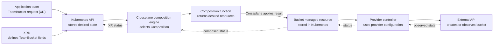

# How Crossplane's components turn a request into a resource

## The idea in one minute

Crossplane is software running in Kubernetes that helps a team offer its
own resource APIs and keep the resulting resources reconciled. A team can
expose a small request such as "give my application a bucket" while a
provider controller handles the external API calls. Crossplane's
composition engine and the provider controller have **different jobs**:
the first turns a platform request into resource declarations; the second
works to make a declared external resource exist.[^crossplane-overview]

Think of a library request desk, with a limit to the analogy. The desk
offers a simple request form and routes it to the right specialists. It
does not itself build the shelf or guarantee the book has arrived. In
Crossplane, the Kubernetes API stores the request, controllers do the
work over time, and status reports what they have observed. The example
below is invented; no bucket, provider, or cluster was run for this page.

Read [Custom resources and CRDs](../core-objects/custom-resources-and-crds.md)
first if adding an API type to Kubernetes is unfamiliar.

## Follow one invented bucket request

Imagine a platform team wants application teams to request a
`TeamBucket` with a region and purpose. The platform team chooses the
provider and bucket settings. The names are illustrative, not copyable
resource manifests.

Text alternative: an XRD defines the fields accepted by the Kubernetes
API for `TeamBucket`. The application team creates one such object, an
XR. Crossplane selects a Composition and runs its function pipeline to
produce a desired Bucket managed resource. A provider controller watches
that managed resource and calls the external service using its configured
identity. Observed conditions travel back through the managed resource
and XR status. Each arrow can be delayed or fail independently.

| Name in the path | What it means | Who supplies it |
| --- | --- | --- |
| **XRD** (Composite Resource Definition) | Defines the platform API's name, scope, versions, and allowed fields. It creates a Kubernetes API type; it does not create a bucket by itself.[^crossplane-xrds] | Platform team. |
| **XR** (composite resource) | One instance of that API: the application's request for a `TeamBucket`.[^crossplane-xrs] | Application team, portal, or GitOps controller. |
| **Composition** | The implementation selected for an XR; its pipeline says how to produce desired composed resources.[^crossplane-compositions] | Platform team. |
| **Function** | A package whose code can turn composition input into desired resource output. Crossplane runs the selected functions in a pipeline.[^crossplane-functions][^crossplane-compositions] | Platform team installs it; Composition refers to it. |
| **Managed resource (MR)** | A provider-defined Kubernetes object representing an external resource such as a bucket. Its desired fields and observed status live in Kubernetes.[^crossplane-managed] | Composition, platform team, or an advanced direct user. |
| **Provider** | A package that supplies managed-resource APIs and a controller. The controller authenticates and calls the external API; `kubectl` only talks to Kubernetes.[^crossplane-providers] | Platform operator. |

The XRD is the **form**, the XR is a **filled-in request**, and the
Composition is the **recipe** used to fulfill it. This analogy stops at
the provider: real controllers continually compare desired and observed
state. A recipe being selected or a Kubernetes object being accepted
does not prove the external bucket was created, accessible, or safe.
[^crossplane-xrs][^crossplane-managed]

## What must exist before the request works?

Crossplane core runs the package manager and composition engine. The
platform operator installs a compatible Provider package and any
Function packages that the Composition needs. A Provider can add many
managed-resource API types, but in Crossplane v2 those types may pass
through managed-resource definitions and activation policies before
they are usable. Provider configuration supplies the identity and
target used for external calls; the XR does not give the provider
credentials.[^crossplane-overview][^crossplane-providers][^crossplane-activation]

The `TeamBucket` XRD and its Composition are separate from those
packages. A Configuration package can distribute platform API objects
and dependencies as a versioned bundle, but it is optional for
understanding this request path.[^crossplane-configurations]

| First missing boundary | Question to ask | Evidence to inspect |
| --- | --- | --- |
| API type | Is the `TeamBucket` XRD established and its requested version served? | XRD conditions and Kubernetes API discovery.[^crossplane-xrds] |
| Composition | Did the XR select a Composition, and did its function pipeline return the desired resources? | XR conditions and events, selected Composition, and function health.[^crossplane-compositions] |
| Provider API and runtime | Is the Bucket MR type active, and is the provider controller healthy? | Provider package revision, API discovery or activation state, and provider pod health.[^crossplane-providers][^crossplane-activation] |
| External service | Can the controller use the intended identity and account, and what did the external API report? | Managed-resource conditions, events, provider logs, and external-resource evidence.[^crossplane-managed] |

Even an XR marked ready is a controller observation. An application
still needs its own access and outcome check. A bucket may exist while
the application's workload lacks permission to use it.

## Where the other names fit

You do not need every Crossplane type to understand the bucket path.
These names appear as a platform grows:

| Area | Objects and purpose | Start here |
| --- | --- | --- |
| Package rollout | `ProviderRevision`, `FunctionRevision`, and `ConfigurationRevision` record installed package revisions. `DeploymentRuntimeConfig` and `ImageConfig` affect package runtime or image handling. | [Providers and authentication](providers-and-authentication.md), [official package docs](https://docs.crossplane.io/latest/packages/). |
| Managed-resource API availability | A `ManagedResourceDefinition` describes a provider API; a `ManagedResourceActivationPolicy` can activate selected APIs. These v2 controls are version-sensitive; activation policies are alpha.[^crossplane-activation] | [Official activation-policy guide](https://docs.crossplane.io/latest/managed-resources/managed-resource-activation-policies/). |
| Provider access | `ProviderConfig` or `ClusterProviderConfig`, where supported by that provider, selects credentials and an external target for MRs. The provider controller uses them. | [Providers and authentication](providers-and-authentication.md). |
| Composition changes | `CompositionRevision` lets an XR stay with a selected version or adopt newer Composition logic according to policy. `EnvironmentConfig` can supply shared inputs to a function pipeline. | [Compositions](compositions.md). |
| Dependency and maintenance | `Usage` can protect a resource needed by another. Crossplane v2 `Operation`, `CronOperation`, and `WatchOperation` run task-oriented function pipelines rather than continuously reconciling an XR; Operations are alpha. | [How a Crossplane managed resource changes over time](managed-resources-and-lifecycle.md), [official Operations guide](https://docs.crossplane.io/latest/operations/operation/). |

Exact API groups, fields, and supported scopes depend on installed
Crossplane and provider versions. Use the cluster's API discovery and
the matching official versioned documentation before applying a
manifest. No execution evidence was recorded for the previous list of
example manifests, and it could imply one provider family's fields were a
universal Crossplane recipe.

## Choose the next page by your question

| If you need to... | Read |
| --- | --- |
| Learn what the provider controls and how it authenticates | [Providers and authentication](providers-and-authentication.md) |
| Understand desired state, observed state, and deletion | [How a Crossplane managed resource changes over time](managed-resources-and-lifecycle.md) |
| Design the API fields and implementation | [XRDs, Compositions, and XR calls](xrd-composition-and-xr-calls.md) |
| Trace a request into AWS | [Crossplane on AWS](../../cross-topic-guides/crossplane-on-aws.md) |
| Compare this operating model with Terraform | [Terraform vs Crossplane](terraform-vs-crossplane.md) |

## Check your understanding

1. Which object defines `TeamBucket`, and which object requests one?
2. Why can a healthy Composition still leave a bucket uncreated?
3. Which controller calls the external API, and where does it obtain
   the identity for that call?
4. What additional evidence would show that an application can use the
   resulting bucket?

## Explore the official references

- [What's Crossplane?](https://docs.crossplane.io/latest/whats-crossplane/)
  explains the four broad components.[^crossplane-overview]
- [Composite Resource Definitions](https://docs.crossplane.io/latest/composition/composite-resource-definitions/)
  and [Composite Resources](https://docs.crossplane.io/latest/composition/composite-resources/)
  distinguish the API type from a request.[^crossplane-xrds][^crossplane-xrs]
- [Compositions](https://docs.crossplane.io/latest/composition/compositions/)
  explains the function pipeline.[^crossplane-compositions]
- [Providers](https://docs.crossplane.io/latest/packages/providers/)
  and [Managed Resources](https://docs.crossplane.io/latest/managed-resources/managed-resources/)
  cover the external-resource boundary.[^crossplane-providers][^crossplane-managed]
- [Back to Crossplane](index.md).

[^crossplane-overview]: [Crossplane, What's Crossplane?](https://docs.crossplane.io/latest/whats-crossplane/), source record `crossplane-overview`.
[^crossplane-xrds]: [Crossplane, Composite Resource Definitions](https://docs.crossplane.io/latest/composition/composite-resource-definitions/), source record `crossplane-xrds`.
[^crossplane-xrs]: [Crossplane, Composite Resources](https://docs.crossplane.io/latest/composition/composite-resources/), source record `crossplane-xrs`.
[^crossplane-compositions]: [Crossplane, Compositions](https://docs.crossplane.io/latest/composition/compositions/), source record `crossplane-compositions`.
[^crossplane-providers]: [Crossplane, Providers](https://docs.crossplane.io/latest/packages/providers/), source record `crossplane-providers`.
[^crossplane-managed]: [Crossplane, Managed Resources](https://docs.crossplane.io/latest/managed-resources/managed-resources/), source record `crossplane-managed`.
[^crossplane-activation]: [Crossplane, Managed Resource Activation Policies](https://docs.crossplane.io/latest/managed-resources/managed-resource-activation-policies/), source record `crossplane-activation`.
[^crossplane-functions]: [Crossplane, Functions](https://docs.crossplane.io/latest/packages/functions/), source record `crossplane-functions`.
[^crossplane-configurations]: [Crossplane, Configurations](https://docs.crossplane.io/latest/packages/configurations/), source record `crossplane-configurations`.
