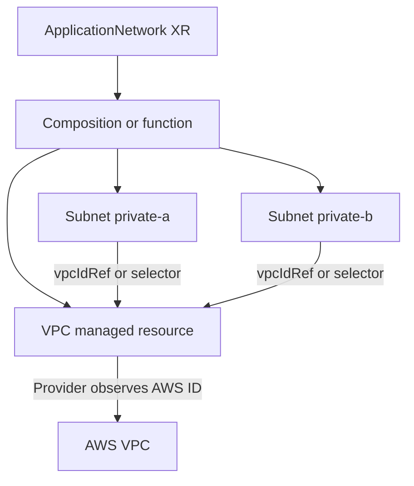

# Choose how Crossplane repeats and connects resources

## The question this page answers

Suppose a payments team needs one AWS VPC and two private subnets.
Later, another team may need three subnets. How should the platform
represent the repeated resources, and how should each subnet learn
the VPC ID?

Crossplane stores the desired Kubernetes objects, then its
controllers and providers reconcile them over time. A YAML file can
hold several objects, a Composition can produce several objects from
one request, and a function can calculate a variable set. These are
three different levels of reuse.[^crossplane-compositions]
[^crossplane-managed]

Think of a file as a folder of forms, a Composition as a reusable
form-making rule, and a function loop as a rule that fills in one
form per list item. This analogy only describes how desired objects
are produced. It does not mean that AWS creates the VPC and subnets
at the same instant.[^crossplane-compositions]

## Pick the repetition pattern

| Need | Choose | What the user supplies |
| --- | --- | --- |
| One-off infrastructure with users allowed to manage provider resources | Several managed-resource documents in one YAML file | Each VPC and Subnet object explicitly |
| A fixed platform product with one VPC and exactly two subnets | XRD plus a Composition with three named resource templates | One XR, such as `ApplicationNetwork` |
| A platform product whose subnet count comes from the request | XRD plus a Composition function that loops over a validated subnet list | One XR with `spec.subnets` |

The file is only a convenient way to submit objects to the Kubernetes
API. It creates no shared ownership or automatic relationship between
the documents. In the Composition cases, the XRD defines the XR
contract, the Composition selects the functions and desired resources,
and the resulting resources are associated with the XR. A
Configuration package can distribute that API and implementation to
multiple control planes.[^crossplane-xrd][^crossplane-compositions]
[^crossplane-config]

A fixed set needs no loop. Function Patch and Transform can describe
one VPC and two named subnets explicitly. For a variable number,
a templating function can iterate over `spec.subnets` and emit one
Subnet object per item. The platform must validate the list and
assign stable, unique composed-resource names; a reordered list
should not accidentally rename an existing subnet. The Go templating
function documents the required composition-resource-name
annotation. Renaming that identity may replace a resource; removing
an item from the desired list can delete its composed resource.
Review such changes as infrastructure changes, not harmless list
edits.[^crossplane-patch-transform][^crossplane-go-template]
[^crossplane-compositions]

The following is an *illustrative request shape*. It requires an XRD
and a Composition designed for these fields and has not been applied:

```yaml
apiVersion: platform.example.com/v1alpha1
kind: ApplicationNetwork
metadata:
  name: payments
  namespace: payments
spec:
  region: eu-west-1
  subnets:
    - name: private-a
      cidrBlock: 10.30.1.0/24
    - name: private-b
      cidrBlock: 10.30.2.0/24
```

The platform contract and its validation should reject duplicate
names, invalid or overlapping CIDRs, and unsupported Regions.
The Composition also needs the VPC CIDR, availability-zone choices,
provider configuration, and tags. Those details have intentionally
not been invented as a deployable recipe.[^crossplane-xrd]

## Connect the subnets to the VPC

AWS gives a new VPC an ID after creation. A subnet needs that ID.
A provider reference can resolve it from the VPC managed resource,
so the user need not guess or hard-code it.
[^crossplane-managed]



Text alternative: one XR leads the Composition or function to
produce a VPC and two Subnet managed resources. The provider creates
or observes the AWS VPC and records its ID. Each Subnet's reference
resolves through the VPC managed resource before the provider can
create its AWS subnet.[^crossplane-managed]

| Reference method | In the invented network | Watch for |
| --- | --- | --- |
| `vpcIdRef.name` | Each Subnet names its sibling VPC managed resource. | The name must be stable and the provider must expose this ref field. |
| `vpcIdSelector.matchLabels` | Each Subnet selects a labeled VPC. | Labels must identify one intended VPC. |
| `vpcIdSelector.matchControllerRef: true` | A composed Subnet selects a VPC owned by the same XR. | This helps only when the resources share that controller reference. |
| Raw `vpcId` | A user supplies an existing AWS VPC ID. | The platform must validate that external target and its ownership. |

These field names follow the documented AWS EC2 provider example;
the installed provider CRDs are the authority for its API version,
scope, field paths, and selector behavior. In Crossplane v2, the
`.m.` API family is namespaced. Keep a referenced managed resource
in the intended namespace and use a ProviderConfig with deliberate
scope. A Kubernetes namespace does not itself grant or restrict
access to AWS resources.[^crossplane-managed]

When one XR composes **several resources of the same kind**, a
controller reference alone may select too broadly. Combine it with
a unique label for the intended sibling. For example, an instance
that needs `private-a` can select a Subnet with both
`matchControllerRef: true` and
a `matchLabels` entry with key
`network.platform.example.com/subnet-name` and value `private-a`,
if its provider exposes a `subnetIdSelector` field.
[^crossplane-managed]

## When a provider reference is unavailable

A Composition can copy an observed field from a composed resource
into a custom XR `status` field with `ToCompositeFieldPath`.
Another resource template can read that status with
`FromCompositeFieldPath`. The XRD must define the custom status
field. This path is asynchronous: the first reconcile can request
the VPC, a later one can observe its ID, and a later one can use
that value. Prefer a provider reference when it exists because it
expresses the dependency closer to the managed resources.
[^crossplane-patch-transform]

A connection Secret serves a different purpose: it carries
connection data such as an endpoint or credential to a consumer.
It is not a general replacement for a provider reference to a
sibling VPC.[^crossplane-patch-transform]

## Preview and observe

`crossplane composition render` can show what a function produces
from an XR, Composition, and function definitions. It normally
needs Docker to run functions locally. Rendering checks the desired
objects produced by the pipeline; it does not contact AWS, prove
the provider can authenticate, or prove the VPC ID has appeared.
A server-side dry run can check a manifest against installed API
schemas, but it does not create the cloud network. Use a disposable
control plane and AWS account for live evidence.[^crossplane-compositions]
[^crossplane-cli]

For the invented network, inspect in this order:

1. Did Kubernetes accept the XR and select the intended Composition?
2. Did the function produce one VPC and the expected number of
   Subnet managed resources with stable names?
3. Did the VPC managed resource report an external ID and readiness?
4. Did each Subnet reference resolve to that VPC and reconcile?
5. Does the resulting AWS network have the expected addresses and
   connectivity for the actual application?

A condition is a controller's last observation. The last check
requires observing the real network and its intended use; XR
`Ready=True` alone does not answer it.[^crossplane-managed]

## Check your understanding

- If the request always needs two subnets, why can the Composition
  name two templates without a loop?
- What changes when the application team may request any allowed
  number of subnets?
- Why is `vpcIdRef.name` safer than copying a guessed AWS VPC ID
  into each new Subnet?
- If three Subnets belong to one XR, why is
  `matchControllerRef: true` insufficient to select just
  `private-a`?

## Go further

- [How a Crossplane Composition fulfills one application request](compositions.md)
  explains the function pipeline and its readiness signals.
- [How one Crossplane request becomes an AWS network](aws-vpc-platform-api.md) shows a network product and its
  connectivity and deletion limits.
- [When to use Terraform or Crossplane](terraform-vs-crossplane.md)
  compares reviewed plan/apply and continuous reconciliation.
- [Crossplane managed-resource references](https://docs.crossplane.io/latest/managed-resources/managed-resources/#referencing-other-resources)
  documents refs and selectors.
- [Function Go Templating](https://github.com/crossplane-contrib/function-go-templating)
  documents list iteration and composed-resource names.

[^crossplane-managed]: Crossplane, [Managed Resources](https://docs.crossplane.io/latest/managed-resources/managed-resources/).
[^crossplane-compositions]: Crossplane, [Compositions](https://docs.crossplane.io/latest/composition/compositions/).
[^crossplane-xrd]: Crossplane, [Composite Resource Definitions](https://docs.crossplane.io/latest/composition/composite-resource-definitions/).
[^crossplane-patch-transform]: Crossplane, [Function Patch and Transform](https://docs.crossplane.io/latest/guides/function-patch-and-transform/).
[^crossplane-cli]: Crossplane CLI, [Command Reference](https://docs.crossplane.io/cli/latest/command-reference/).
[^crossplane-go-template]: Crossplane Contrib, [Function Go Templating](https://github.com/crossplane-contrib/function-go-templating).
[^crossplane-config]: Crossplane, [Configurations](https://docs.crossplane.io/latest/packages/configurations/).
