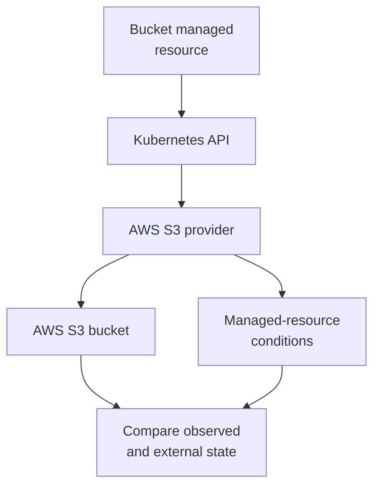

# Create and remove one S3 bucket with Crossplane

## What you will learn

You will ask Kubernetes for one S3 bucket, watch the provider
reconcile that request, confirm the bucket in AWS, then remove
it. The exercise uses a local `kind` cluster and a disposable AWS
account. It creates a **real bucket**. This page is a draft
procedure checked against source documentation; it has **not**
been run against a cluster or AWS account in this review.
The [validation record](aws-s3-lab-validation-template.md) is
where an authorized run can be documented.

Think of the Kubernetes managed resource as a work order and the
provider as the worker who calls AWS. `kubectl apply` proves the
work order was accepted. The provider's `Ready` condition and
a read from S3 are later checks. The analogy does not guarantee
that every application can access the bucket.
[^crossplane-managed-start][^crossplane-managed]



Text alternative: Kubernetes stores the Bucket managed resource.
The AWS provider reads it and calls S3. The provider records
conditions, and the learner separately checks the external bucket.
[^crossplane-managed-start]

## Before you begin

You need `docker` with a working daemon, `kind`, `kubectl`,
Helm 3, the AWS CLI, and `openssl`. Keep all steps in one shell so the
temporary variables below remain available. Use an AWS sandbox where you
may create and delete a general-purpose S3 bucket. Obtain
temporary credentials for an approved sandbox role through your
normal process. Keep the role's permissions scoped to the
exercise and ensure it can observe, create, tag, and delete
the bucket. The CLI verification also needs permission to read bucket
tags; the optional account-owned bucket list needs `s3:ListAllMyBuckets`.
The provider may need more read actions than `s3:CreateBucket` and
`s3:DeleteBucket` to reconcile its Bucket type. Have the sandbox owner
approve permissions for the exact provider version; if the MR reports
`AccessDenied`, stop and inspect the denied action rather than widening
permissions by guesswork. This guide does not supply an untested IAM policy.
[^crossplane-install][^crossplane-managed][^aws-sts]

Use a fresh shell. The setup below clears AWS key, role, web-identity,
and endpoint overrides before selecting the temporary file. These settings
or a local AWS config profile can make the CLI use a different identity from
the Secret below. Keep the credential file **outside the repository**. Do
not commit it or paste its values into a
validation record. Check how long the temporary session will
last before starting.[^aws-sts][^aws-cli-config]

This tutorial uses the verified published Crossplane chart
`2.4.2` and Upbound AWS S3 provider `v2.6.1`.
The provider marketplace lists namespaced
`Bucket` in `s3.aws.m.upbound.io/v1beta1`.
Check the installed CRD as well before applying the bucket.
The two package versions have not been tested together here.
[^upbound-s3][^crossplane-chart-index]

## 1. Check the identity the provider will use

Create a temporary file outside Git and fill it with
**temporary** AWS credentials supplied by your sandbox.
Do not copy the placeholder values as real credentials:

```bash
unset AWS_ACCESS_KEY_ID AWS_SECRET_ACCESS_KEY AWS_SESSION_TOKEN \
  AWS_ROLE_ARN AWS_WEB_IDENTITY_TOKEN_FILE AWS_DEFAULT_PROFILE \
  AWS_ENDPOINT_URL AWS_ENDPOINT_URL_S3 AWS_ENDPOINT_URL_STS
export LAB_AWS_REGION=eu-west-1
export LAB_CREDS_FILE="$(mktemp /tmp/crossplane-aws-creds.XXXXXX)"
chmod 600 "$LAB_CREDS_FILE"
LAB_DIR="$(mktemp -d /tmp/crossplane-lab.XXXXXX)"
cd "$LAB_DIR"
```

The file must have this shape:

```ini
[default]
aws_access_key_id = YOUR_TEMPORARY_ACCESS_KEY
aws_secret_access_key = YOUR_TEMPORARY_SECRET_KEY
aws_session_token = YOUR_TEMPORARY_SESSION_TOKEN
```

Point the AWS CLI at **that same file** and bypass any local config profile,
then check its identity:[^aws-cli-config]

```bash
export AWS_SHARED_CREDENTIALS_FILE="$LAB_CREDS_FILE"
export AWS_CONFIG_FILE=/dev/null
export AWS_PROFILE=default
aws sts get-caller-identity --region "$LAB_AWS_REGION"
LAB_ACCOUNT_ID="$(aws sts get-caller-identity \
  --region "$LAB_AWS_REGION" --query Account --output text)"
: "${LAB_ACCOUNT_ID:?}"
printf 'Sandbox account: %s\n' "$LAB_ACCOUNT_ID"
```

The account and role in the response must be the intended
sandbox identity. If the command fails, stop and correct the
credentials before creating a cluster; do not use an empty account ID.
Temporary STS credentials need all three values, including the session token.
[^aws-sts]

## 2. Start the control plane

```bash
kind create cluster --name crossplane-lab
kubectl config current-context
test "$(kubectl config current-context)" = kind-crossplane-lab
```

Stop if the context check fails. Then install Crossplane:

```bash
helm repo add crossplane-stable https://charts.crossplane.io/stable
helm repo update
helm install crossplane crossplane-stable/crossplane \
  --version 2.4.2 \
  --namespace crossplane-system \
  --create-namespace \
  --wait --timeout 5m
```

Crossplane Pods should become ready. If Helm times out, inspect the Pods
in `crossplane-system` before continuing. Crossplane needs
a working Kubernetes cluster before it can manage AWS.
[^crossplane-install]

## 3. Install the AWS S3 provider

Save this as `lab-provider.yaml` in a disposable working
directory:

```yaml
apiVersion: pkg.crossplane.io/v1
kind: Provider
metadata:
  name: provider-aws-s3
spec:
  package: xpkg.upbound.io/upbound/provider-aws-s3:v2.6.1
```

Apply it, then wait for a healthy provider:

```bash
kubectl apply -f lab-provider.yaml
kubectl wait providers.pkg.crossplane.io/provider-aws-s3 \
  --for=condition=Healthy --timeout=5m
kubectl get providers.pkg.crossplane.io
kubectl wait --for=create --timeout=5m \
  crd/buckets.s3.aws.m.upbound.io \
  crd/clusterproviderconfigs.aws.m.upbound.io
kubectl wait --for=condition=Established --timeout=2m \
  crd/buckets.s3.aws.m.upbound.io \
  crd/clusterproviderconfigs.aws.m.upbound.io
```

The package installs an AWS family provider dependency, which
supplies the `ClusterProviderConfig` API. Confirm that both packages
show `HEALTHY=True` before continuing. Both CRDs must be established.
The create wait handles the delay before a dependency creates its CRD.
If either wait times out, inspect the ProviderRevisions, installed
ManagedResourceDefinitions, and activation policies; wait for the
family provider and retry the CRD check before applying the provider
configuration. The v2 chart's default policy normally activates
all MRDs.
[^crossplane-providers][^upbound-s3][^crossplane-activation][^kubectl-wait]

## 4. Give the provider its sandbox credentials

Create the Secret in the provider's control-plane namespace,
using the file whose identity you checked:

```bash
kubectl create secret generic aws-secret \
  --namespace crossplane-system \
  --from-file=creds="$LAB_CREDS_FILE"
```

Save this as `lab-provider-config.yaml`:

```yaml
apiVersion: aws.m.upbound.io/v1beta1
kind: ClusterProviderConfig
metadata:
  name: lab-aws
spec:
  credentials:
    source: Secret
    secretRef:
      namespace: crossplane-system
      name: aws-secret
      key: creds
```

```bash
kubectl apply -f lab-provider-config.yaml
```

The `ClusterProviderConfig` tells the provider where to load
the credentials. Its cluster scope means a managed resource
in another namespace could select it if allowed to create
that resource. Use only the disposable cluster for this lab.
[^crossplane-managed]

## 5. Request one new bucket

Generate a random *candidate* name. It avoids embedding an
AWS account ID but does not mathematically guarantee
availability. If AWS reports a collision, choose a new name.
Never point this lab at an existing bucket.
[^aws-s3-names][^crossplane-managed]

```bash
export LAB_BUCKET_NAME="xp-lab-$(openssl rand -hex 12)"
printf '%s\n' "$LAB_BUCKET_NAME"
: "${LAB_BUCKET_NAME:?}" "${LAB_CREDS_FILE:?}" \
  "${LAB_AWS_REGION:?}" "${LAB_ACCOUNT_ID:?}"
```

Before applying, check that the candidate is not already
reachable by this identity. The expected `404 Not Found` is printed as an
AWS CLI error and exits nonzero; it is only a candidate check, not a
guarantee that the name will remain available.[^aws-head-bucket]

```bash
aws s3api head-bucket --bucket "$LAB_BUCKET_NAME" \
  --region "$LAB_AWS_REGION" \
  --expected-bucket-owner "$LAB_ACCOUNT_ID"
```

For a new name, AWS should return `404`. A `403`, a
successful response, an expired token, or a network error is
**not** proof that the name is free; stop and investigate or
choose another candidate.[^aws-s3-names][^aws-head-bucket]

Create the manifest with the exact name you just checked:

```bash
cat > lab-bucket.yaml <<EOF
apiVersion: s3.aws.m.upbound.io/v1beta1
kind: Bucket
metadata:
  name: $LAB_BUCKET_NAME
  namespace: default
spec:
  forProvider:
    region: $LAB_AWS_REGION
    tags:
      Purpose: crossplane-learning
  providerConfigRef:
    name: lab-aws
    kind: ClusterProviderConfig
EOF
kubectl apply --dry-run=server -f lab-bucket.yaml
```

Stop if the server dry run fails or the manifest does not show the intended
bucket name, Region, and provider configuration. Then submit it:

```bash
kubectl apply -f lab-bucket.yaml
```

The server dry run checks the installed Kubernetes schema.
The apply stores desired state; the provider then makes the
AWS call. The generated candidate, Region, and selected
ProviderConfig must match the values you intend to use.
[^crossplane-managed]

## 6. Check both control planes

```bash
kubectl wait "buckets.s3.aws.m.upbound.io/$LAB_BUCKET_NAME" \
  -n default --for=condition=Synced=True --timeout=5m
kubectl wait "buckets.s3.aws.m.upbound.io/$LAB_BUCKET_NAME" \
  -n default --for=condition=Ready=True --timeout=5m
kubectl describe "buckets.s3.aws.m.upbound.io/$LAB_BUCKET_NAME" -n default
LAB_EXTERNAL_NAME="$(kubectl get \
  "buckets.s3.aws.m.upbound.io/$LAB_BUCKET_NAME" -n default \
  -o jsonpath='{.metadata.annotations.crossplane\.io/external-name}')"
printf 'External name: %s\n' "$LAB_EXTERNAL_NAME"
test "$LAB_EXTERNAL_NAME" = "$LAB_BUCKET_NAME"
```

Stop if either wait times out or the external name differs from the candidate
you checked. Then
confirm the bucket and tag in the intended AWS account:

```bash
aws s3api head-bucket --bucket "$LAB_BUCKET_NAME" \
  --region "$LAB_AWS_REGION" \
  --expected-bucket-owner "$LAB_ACCOUNT_ID"
aws s3api get-bucket-tagging --bucket "$LAB_BUCKET_NAME" \
  --region "$LAB_AWS_REGION" \
  --expected-bucket-owner "$LAB_ACCOUNT_ID"
```

The managed resource should show `Synced=True` and
`Ready=True`, with an external name. The AWS CLI should
find the bucket and its `Purpose` tag in the expected account using
the same credential file supplied to the provider. This checks the
observable result; the CLI identity alone does not prove which identity
the provider Pod actually used. If a wait times out,
read the managed resource's Reason and Message, provider
package health, and events before changing anything.
[^crossplane-managed]

New S3 buckets already block public access by default.
Seeing four `true` values from
`get-public-access-block` would **not** prove Crossplane
created a separate `BucketPublicAccessBlock` resource.
This lab does not create one.[^aws-s3-public]

## 7. Remove the bucket and verify the result

This lab never uploads objects. If objects were added,
pause here and decide how they should be retained or
removed; a nonempty or versioned bucket needs separate
cleanup. Do not remove Crossplane finalizers to make
deletion appear successful.[^crossplane-managed][^aws-delete-bucket]

```bash
kubectl delete --wait=false -f lab-bucket.yaml
kubectl wait "buckets.s3.aws.m.upbound.io/$LAB_BUCKET_NAME" \
  -n default --for=delete --timeout=5m
aws s3api head-bucket --bucket "$LAB_BUCKET_NAME" \
  --region "$LAB_AWS_REGION" \
  --expected-bucket-owner "$LAB_ACCOUNT_ID"
```

Continue only if the Kubernetes deletion wait succeeds. The final AWS call
should report **404 Not Found** as a nonzero CLI result.
That supports deletion, but `HeadBucket` cannot explain every error from
its status alone. If your sandbox role has `s3:ListAllMyBuckets`, also
check the account-owned bucket list and confirm the exact name is absent:

```bash
aws s3api list-buckets --region "$LAB_AWS_REGION" \
  --query "Buckets[?Name=='${LAB_BUCKET_NAME}'].Name" --output json
```

The expected result is `[]`. A `403`, expired token, network failure, or
a result containing the bucket name means deletion is not yet confirmed.
If you cannot list owned buckets, get an authorized AWS-side deletion check before
tearing down the cluster.[^aws-head-bucket][^aws-list-buckets]

If the Kubernetes delete waits, inspect the managed
resource's conditions, finalizer, provider health, and
AWS bucket contents. If temporary credentials expired, obtain a new approved
session, replace the file contents without printing them, confirm the
new caller identity:

```bash
aws sts get-caller-identity --region "$LAB_AWS_REGION"
test "$(aws sts get-caller-identity --region "$LAB_AWS_REGION" \
  --query Account --output text)" = "$LAB_ACCOUNT_ID"
```

The new account and role must still be approved for this sandbox. Stop if
they differ. Then replace the existing Secret:

```bash
kubectl create secret generic aws-secret -n crossplane-system \
  --from-file=creds="$LAB_CREDS_FILE" --dry-run=client -o yaml | \
  kubectl replace -f -
```

Inspect the MR condition and retry the timed deletion wait. Do not remove the
provider or cluster while external deletion is unresolved.
[^crossplane-managed][^aws-head-bucket][^kubectl-delete]

Only after confirming the AWS result, remove the lab
objects and local cluster:

```bash
kubectl delete -f lab-provider-config.yaml
kubectl delete secret aws-secret -n crossplane-system
kind delete cluster --name crossplane-lab
rm -f "$LAB_CREDS_FILE"
cd /tmp
rm -f "$LAB_DIR/lab-provider.yaml" \
  "$LAB_DIR/lab-provider-config.yaml" "$LAB_DIR/lab-bucket.yaml"
rmdir "$LAB_DIR"
unset AWS_SHARED_CREDENTIALS_FILE AWS_CONFIG_FILE AWS_PROFILE
```

Record the actual versions, conditions, AWS identity
(account and role only, without secrets), bucket name
in a private record if needed, and the exact post-delete
AWS result in the [validation template](aws-s3-lab-validation-template.md).
Do not claim a successful run from a completed checklist
alone.

## Check your understanding

- Why does the provider need its own checked AWS identity
  even when the AWS CLI already works on your laptop?
- Which observation establishes that Kubernetes accepted
  the Bucket, and which observations establish AWS state?
- Why would four public-access values set to `true` be
  weak evidence about what Crossplane configured?
- Why must the provider keep running until the AWS-side
  deletion is confirmed?

## Go further

- [How an AWS resource request moves through Crossplane](aws-resource-workflow.md)
  maps the direct managed-resource and XR paths.
- [How a Crossplane managed resource changes over time](managed-resources-and-lifecycle.md)
  explains drift, pause, import, and deletion.
- [Crossplane managed-resource tutorial](https://docs.crossplane.io/latest/get-started/get-started-with-managed-resources/)
  provides an official beginner exercise.
- [Upbound AWS S3 provider v2.6.1](https://marketplace.upbound.io/providers/upbound/provider-aws-s3/v2.6.1?tab=managedResources)
  lists the provider APIs used here.

[^crossplane-install]: Crossplane, [Install Crossplane](https://docs.crossplane.io/latest/get-started/install/).
[^crossplane-chart-index]: Crossplane, [Stable Helm chart index](https://charts.crossplane.io/stable/index.yaml).
[^crossplane-activation]: Crossplane, [Managed Resource Activation Policies](https://docs.crossplane.io/latest/managed-resources/managed-resource-activation-policies/).
[^crossplane-managed-start]: Crossplane, [Get Started With Managed Resources](https://docs.crossplane.io/latest/get-started/get-started-with-managed-resources/).
[^crossplane-managed]: Crossplane, [Managed Resources](https://docs.crossplane.io/latest/managed-resources/managed-resources/).
[^crossplane-providers]: Crossplane, [Providers](https://docs.crossplane.io/latest/packages/providers/).
[^upbound-s3]: Upbound, [AWS S3 Provider v2.6.1](https://marketplace.upbound.io/providers/upbound/provider-aws-s3/v2.6.1?tab=managedResources).
[^aws-sts]: AWS, [STS Credentials](https://docs.aws.amazon.com/STS/latest/APIReference/API_Credentials.html).
[^aws-s3-names]: AWS, [General purpose bucket naming rules](https://docs.aws.amazon.com/AmazonS3/latest/userguide/bucketnamingrules.html).
[^aws-head-bucket]: AWS, [HeadBucket](https://docs.aws.amazon.com/AmazonS3/latest/API/API_HeadBucket.html).
[^aws-list-buckets]: AWS CLI, [list-buckets](https://docs.aws.amazon.com/cli/latest/reference/s3api/list-buckets.html).
[^aws-cli-config]: AWS CLI, [Configuring settings](https://docs.aws.amazon.com/cli/latest/userguide/cli-chap-configure.html).
[^aws-delete-bucket]: AWS, [Deleting a general purpose bucket](https://docs.aws.amazon.com/AmazonS3/latest/userguide/delete-bucket.html).
[^aws-s3-public]: AWS, [Blocking public access to S3 storage](https://docs.aws.amazon.com/AmazonS3/latest/userguide/access-control-block-public-access.html).
[^kubectl-delete]: Kubernetes, [kubectl delete](https://kubernetes.io/docs/reference/kubectl/generated/kubectl_delete/).
[^kubectl-wait]: Kubernetes, [kubectl wait](https://kubernetes.io/docs/reference/kubectl/generated/kubectl_wait/).
