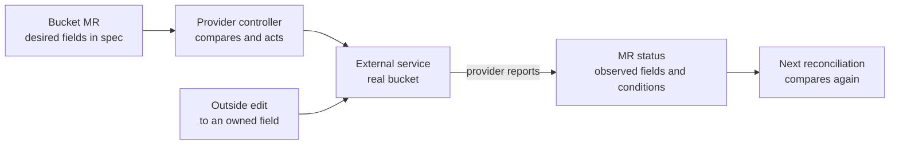

# How a Crossplane managed resource changes over time

## The idea in one minute

A **managed resource** (MR) is a Kubernetes object representing one
external object, such as a cloud bucket. Its provider defines the API
fields and runs the controller that communicates with the external
service. The Kubernetes object and the external object are related, but
they are not the same thing.[^crossplane-managed]

Think of a thermostat, with limits to the analogy. You set a target,
the controller reads the current state, and it acts when they differ.
Crossplane cannot force an external service to comply instantly:
credentials, provider support, immutable fields, and service errors
can stop or delay a change. The example below is invented. No cluster,
provider, bucket, or deletion was run for this page.

Read [How Crossplane's components turn a request into a resource](component-model.md)
first if you need to place an MR in the wider Crossplane request path.

## Follow one bucket through its lifecycle

Suppose a platform team creates a provider-defined Bucket MR for a
reports application. The provider's exact API group and bucket fields
depend on its installed version; this is a conceptual sequence, not a
manifest to apply.

Text alternative: Kubernetes stores the Bucket MR's desired
configuration. A provider controller reads it, uses provider
configuration to connect to the external service, and creates or
observes the real bucket. It writes observed fields, conditions, and
the external identifier back to the MR. If someone changes an
enforced field outside Crossplane, a later reconciliation can restore
the declared value when the provider supports that update.

| Stage | What the team can see | What it does **not** prove |
| --- | --- | --- |
| Kubernetes accepts the MR | The object exists with a desired `spec`. | The provider has called the external API or made a bucket. |
| Provider reconciles | `Synced` condition and messages report the last reconciliation outcome. | The external object is ready or the application can use it. |
| Provider observes readiness | `Ready`, `status.atProvider`, and the external name can describe the provider's observation. | The application's identity has bucket access or its real workflow works. |
| Desired field changes | The controller tries to apply a supported `spec.forProvider` change. | An immutable setting will be replaced automatically; Crossplane documents that it does **not** delete and recreate an MR because an immutable field changed.[^crossplane-managed] |

The two useful questions are **what did we ask for?** and **what did
the provider observe?** The first lives mainly in `spec`; the
second lives in status, conditions, and external evidence. An
application-level check is a third, separate question.
[^crossplane-managed]

## Read the fields by their job

| Field or marker | Meaning in the bucket example |
| --- | --- |
| `apiVersion` and `kind` | Select the installed provider's Bucket API. Discover the actual group, kind, version, and fields in the target cluster.[^crossplane-managed] |
| `spec.forProvider` | Desired external settings the provider normally keeps enforcing, subject to its supported actions and immutable fields.[^crossplane-managed] |
| `spec.initProvider` | Optional creation-time settings that are not enforced after creation. This and management policies are beta features in the current Crossplane documentation.[^crossplane-managed] |
| `spec.providerConfigRef` | Selects the provider configuration used for external access. A default may be used if omitted, so check the effective identity and target.[^crossplane-managed] |
| `spec.managementPolicies` | Restricts actions such as `Observe`, `Create`, `Update`, `Delete`, and `LateInitialize`. The provider decides which policies it supports.[^crossplane-managed] |
| `status.atProvider` and conditions | Provider-reported observations and reconciliation/readiness signals. Read the reason and message when a condition is false.[^crossplane-managed] |
| `crossplane.io/external-name` | The identifier the provider uses to find the external object. It may differ from the Kubernetes object name.[^crossplane-managed] |

For example, if the MR requests a tag `Purpose: reports` in
`spec.forProvider` and someone edits that tag in the cloud console,
an update-capable provider can put it back on reconciliation. If the
bucket's region is immutable, changing that field in Kubernetes does
not automatically replace the bucket. Confirm the installed
provider's behavior before making such a change.[^crossplane-managed]

References to another MR can use an external identifier, a Kubernetes
name reference, or a label selector where the provider exposes those
fields. A reference helps supply an external ID; it does not change
which controller owns either resource.[^crossplane-managed]

## Observe first when adopting an existing object

An already existing external resource needs a deliberate identity
match. Crossplane's import guide starts with the correct
`crossplane.io/external-name` and an `Observe` management policy.
In that mode Crossplane reads the object without changing or deleting
it. After inspecting its observed fields, a team can decide whether
to grant `Create`, `Update`, or `Delete` actions. That transition
changes ownership risk and should be reviewed against the provider's
actual support.[^crossplane-import]

Do not infer import success from a matching name alone. Confirm the
provider account, region, resource identity, and the resulting
`status.atProvider` before granting active control. The official
[import guide](https://docs.crossplane.io/latest/guides/import-existing-resources/)
has the version-specific procedure.[^crossplane-import]

## Pause and deletion are different decisions

The `crossplane.io/paused: "true"` annotation stops reconciliation
for a managed resource. It also prevents normal deletion while that
pause remains. Removing the annotation resumes reconciliation; a
changing `crossplane.io/reconcile-requested-at` token can request
another run. Neither action changes the desired settings by itself.
[^crossplane-managed]

Deleting the Kubernetes MR is a separate lifecycle event. With
external `Delete` permission, the provider begins deleting the
external object, and a finalizer keeps the Kubernetes object until
cleanup completes. Without `Delete` in a supported
`managementPolicies` configuration, the external object is left
behind. A paused resource or unavailable provider can leave the
Kubernetes object waiting. Do not remove a finalizer merely to clear
the display: that can break the link to an external resource that
still exists.[^crossplane-managed][^kubernetes-finalizers]

| If deletion waits... | Inspect before changing anything |
| --- | --- |
| Provider cannot reach the external API | Provider pod, selected ProviderConfig, credentials, endpoint, and MR condition message. |
| External service rejects deletion | Its dependency, protection, or permission error and the real object's state. |
| Resource is paused | The pause annotation and why it was set.[^crossplane-managed] |
| Another managed resource depends on it | Crossplane `Usage` relationships and the intended deletion order.[^crossplane-usages] |

## Choose a focused next step

| If you need to... | Read |
| --- | --- |
| Understand provider packages and identities | [How a Crossplane provider reaches an external API](providers-and-authentication.md) |
| Follow an XR into several managed resources | [Compositions](compositions.md) |
| Diagnose a failed provider reconciliation | [Crossplane troubleshooting](troubleshooting.md) |
| Practice in an authorized sandbox | [Local AWS S3 lab](local-aws-s3-lab.md) |

## Check your understanding

1. Why does a successful Kubernetes API response not prove that the
   external bucket exists?
2. What is the difference between a desired field in
   `spec.forProvider` and an observation in `status.atProvider`?
3. Why start with `Observe` when adopting an existing resource?
4. What must you know before deleting an MR or removing its finalizer?

## Explore further

- [Managed Resources](https://docs.crossplane.io/latest/managed-resources/managed-resources/)
  documents desired and observed fields, policies, annotations,
  conditions, and finalizers.[^crossplane-managed]
- [Import Existing Resources](https://docs.crossplane.io/latest/guides/import-existing-resources/)
  walks through observe-only adoption.[^crossplane-import]
- [Usages](https://docs.crossplane.io/latest/managed-resources/usages/)
  explains dependency protection.[^crossplane-usages]
- [Back to Crossplane](index.md).

[^crossplane-managed]: [Crossplane, Managed Resources](https://docs.crossplane.io/latest/managed-resources/managed-resources/), source record `crossplane-managed`.
[^crossplane-import]: [Crossplane, Import Existing Resources](https://docs.crossplane.io/latest/guides/import-existing-resources/), source record `crossplane-import`.
[^crossplane-usages]: [Crossplane, Usages](https://docs.crossplane.io/latest/managed-resources/usages/), source record `crossplane-usages`.
[^kubernetes-finalizers]: [Kubernetes, Finalizers](https://kubernetes.io/docs/concepts/overview/working-with-objects/finalizers/), source record `kubernetes-finalizers`.
