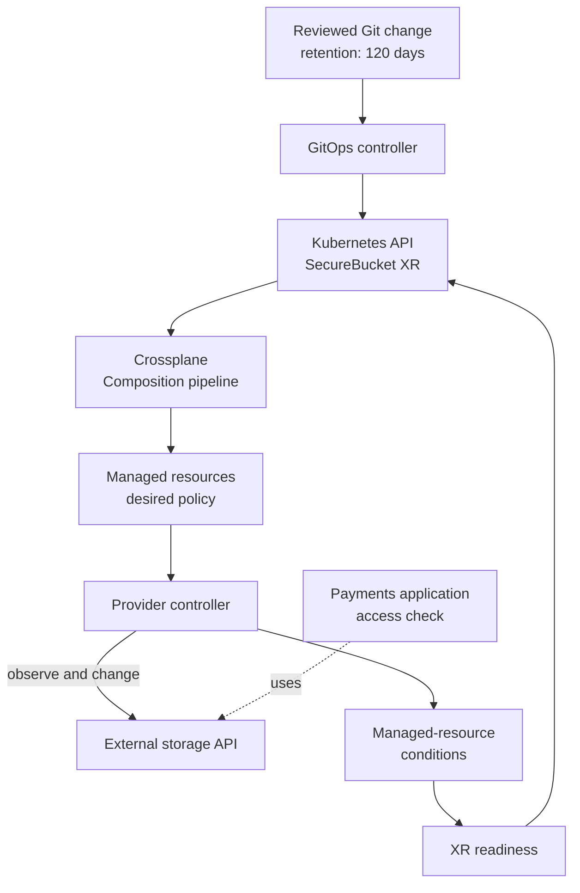

# How GitOps and Crossplane keep a platform request running

## Two loops, one user outcome

In a GitOps setup, one controller copies approved
Kubernetes objects from Git into the cluster. Crossplane
then watches those objects and works with providers to
make their composed resources match the request.
[^crossplane-argo][^crossplane-xrs][^crossplane-managed]

Think of two linked delivery rounds. The first delivers
an approved instruction to the workshop; the second
carries out the instruction and checks the result.
A successful first delivery does not prove the second
round succeeded. The analogy stops where real systems
need permissions, retries, and checks of the actual
application outcome.

The team arrangement for the request is in
[How a team operates a Crossplane platform API](professional-operating-model.md).
This page focuses on the **ongoing loops and operational
evidence** after a change enters Git.

## An invented retention change

Suppose a payments team changes a SecureBucket XR's
retention from 90 days to 120 days. The platform team
has already defined that field in its XRD and
Composition. This is an illustrative scenario; no
cluster, bucket, or retention policy was changed here.

Text alternative: a reviewed Git change changes the XR
in Kubernetes through a GitOps controller. Crossplane
runs the selected Composition, updates desired managed
resources, and provider controllers reconcile the
external storage system. The provider writes
managed-resource conditions in Kubernetes; Crossplane
uses them to determine XR readiness. A separate
application check establishes
whether the payments workflow still works.
[^crossplane-argo][^crossplane-xrs][^crossplane-managed]

| Signal | What it establishes | What still needs checking |
| --- | --- | --- |
| GitOps reports Sync. | The requested Kubernetes object matches Git. | GitOps Health is separate; Crossplane and the provider may still be working.[^crossplane-argo] |
| XR reports Synced=True. | Crossplane reconciled the XR without a reported error.[^crossplane-xrs] | The function pipeline may not yet report the composed resources ready. |
| XR reports Ready=True. | Its function pipeline reported the composed resources ready.[^crossplane-xrs] | The application may still lack access or use an unexpected path. |
| Managed resource reports Synced=True and Ready=True. | Its provider reconciled successfully and reports the external resource available.[^crossplane-managed] | The retention and application behavior still need a check for this scenario. |
| Application operation succeeds. | The selected user path works now. | Future changes and failures remain possible. |

An XR can remain unready if its Composition pipeline
does not signal readiness, even when the composed
resource is healthy.[^crossplane-compositions]
If GitOps Sync succeeds while the XR is failing, investigate
the XR's conditions and resource references, then
the first failing managed resource. If the provider
reports an authorization error, inspect its selected
configuration, controller identity, and external
permissions. The two loops let you locate the failing
handoff rather than treating "synced" as one global
success flag.[^crossplane-xrs][^crossplane-providers]

## Promote implementation changes carefully

An XR input change targets that request, though a
provider may reject an immutable field or replace a
resource; inspect the provider-specific effect before
approval. A Composition or provider package change
can affect many XRs. Existing XRs may follow a new
Composition revision automatically or stay on a
selected revision under a Manual policy. Check that
policy before promotion.[^crossplane-revisions]

A practical promotion path is to compare rendered
Composition output, validate schemas, test
representative XRs in a disposable environment,
and review package compatibility and identity.
The provider package's revision activation policy
affects when a new controller becomes active.
[^crossplane-providers]

For a Crossplane core upgrade, follow the version's
official upgrade guide and compatibility notes. A
successful package installation alone does not prove
that every existing managed resource still reconciles.
[^crossplane-upgrade]

When using Argo CD, follow Crossplane's
annotation-based resource tracking guidance and
configure health checks for the installed Crossplane
objects. Crossplane creates and updates composed
resources; incorrect tracking can make Argo CD
treat those resources as its own. Check exclusions
and pruning before enabling automatic deletion.
[^crossplane-argo]

## Observe the control plane

For a production service, monitor a small set of
questions rather than only a dashboard's green total:

| Question | Evidence to inspect |
| --- | --- |
| Did the Git request reach Kubernetes? | GitOps sync and the XR's current spec. |
| Can Crossplane process the request? | XR Synced/Ready conditions and Composition selection. |
| Can the provider reach the external API? | Managed-resource conditions, provider health, and relevant controller errors. |
| Is reconciliation falling behind? | Crossplane and provider metrics, including function latency and managed-resource readiness where supported.[^crossplane-metrics] |
| Can the application still use the resource? | A representative application operation and external service evidence. |

Crossplane documents Prometheus-style core and provider
metrics, but the exact available series depend on the
installed components and versions.[^crossplane-metrics]
Define alert thresholds from observed behavior in
your environment; this article does not invent a
universal duration for "stuck" or "slow."

## Plan recovery before a failure

Git can restore declared manifests, but it may not
capture every live status field, secret, or mapping
between a Kubernetes managed resource and its
external object. The provider's external-name
annotation identifies an external resource; losing
that mapping can complicate recovery and may risk
duplicate or orphaned resources.[^crossplane-managed]

A recovery plan should identify which Kubernetes
objects and secrets need protected backups, which
package versions to reinstall, and how to verify
external identities before controllers resume
changes. Crossplane documents a pause annotation
for XRs and managed resources. Managed-resource
managementPolicies can limit actions such as Update
or Delete when the provider supports them.
[^crossplane-xrs][^crossplane-managed]
Practice recovery in a disposable environment
and decide who owns deletion or intentional
retention of external resources. Do not remove
finalizers or recreate managed resources by guesswork.

## Check your understanding

1. Why can a GitOps sync report success while the
   SecureBucket XR reports failure?
2. Where would you look first if the provider cannot
   authenticate to the external API?
3. Why does a provider package upgrade require broader
   review than changing one XR's retention value?
4. What information beyond Git manifests may be needed
   to recover a managed external resource?

## Explore further

- [Crossplane with Argo CD](https://docs.crossplane.io/latest/guides/crossplane-with-argo-cd/)
  explains resource tracking and health.[^crossplane-argo]
- [Crossplane Composite Resources](https://docs.crossplane.io/latest/composition/composite-resources/)
  and [Managed Resources](https://docs.crossplane.io/latest/managed-resources/managed-resources/)
  explain conditions and external identity.
  [^crossplane-xrs][^crossplane-managed]
- [Crossplane Providers](https://docs.crossplane.io/latest/packages/providers/)
  covers provider packages and revisions.[^crossplane-providers]
- [Composition Revisions](https://docs.crossplane.io/latest/composition/composition-revisions/)
  explains how existing XRs take implementation changes.
  [^crossplane-revisions]
- [Crossplane Compositions](https://docs.crossplane.io/latest/composition/compositions/)
  explains pipeline readiness.[^crossplane-compositions]
- [Crossplane Metrics](https://docs.crossplane.io/latest/guides/metrics/)
  and [Upgrade Crossplane](https://docs.crossplane.io/latest/guides/upgrade-crossplane/)
  cover operating signals and version changes.
  [^crossplane-metrics][^crossplane-upgrade]
- [Back to Crossplane](index.md).

[^crossplane-argo]: [Crossplane, Configuring Crossplane with Argo CD](https://docs.crossplane.io/latest/guides/crossplane-with-argo-cd/), source record `crossplane-argo`.
[^crossplane-xrs]: [Crossplane, Composite Resources](https://docs.crossplane.io/latest/composition/composite-resources/), source record `crossplane-xrs`.
[^crossplane-compositions]: [Crossplane, Compositions](https://docs.crossplane.io/latest/composition/compositions/), source record `crossplane-compositions`.
[^crossplane-revisions]: [Crossplane, Composition Revisions](https://docs.crossplane.io/latest/composition/composition-revisions/), source record `crossplane-revisions`.
[^crossplane-managed]: [Crossplane, Managed Resources](https://docs.crossplane.io/latest/managed-resources/managed-resources/), source record `crossplane-managed`.
[^crossplane-providers]: [Crossplane, Providers](https://docs.crossplane.io/latest/packages/providers/), source record `crossplane-providers`.
[^crossplane-metrics]: [Crossplane, Metrics](https://docs.crossplane.io/latest/guides/metrics/), source record `crossplane-metrics`.
[^crossplane-upgrade]: [Crossplane, Upgrade Crossplane](https://docs.crossplane.io/latest/guides/upgrade-crossplane/), source record `crossplane-upgrade`.
