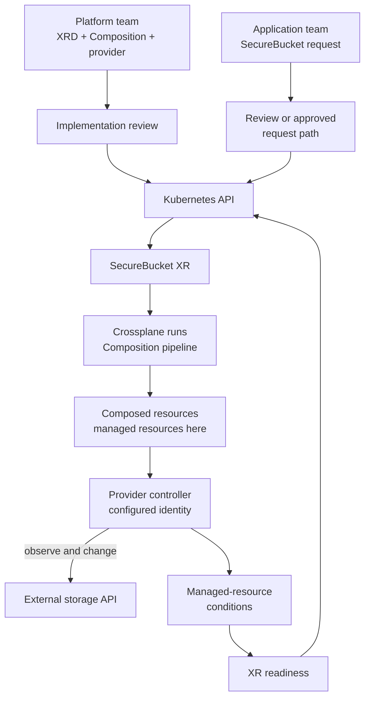

# How a team operates a Crossplane platform API

## The idea in one minute

A platform team can publish a small Kubernetes API for a
service it is willing to operate. Application teams create
requests through that API. Crossplane turns each request
into composed resources; provider controllers work with
external systems and report conditions back.
[^crossplane-xrds][^crossplane-xrs][^crossplane-compositions]

Think of a service counter and a workshop. The counter
offers a short request form. The workshop owns the tools,
materials, and work instructions. The analogy has a limit:
the platform must keep checking and repairing its managed
resources after the first request, and a successful form
submission is not proof of a usable service.

This page shows **one possible team arrangement**. Teams can
use GitOps, direct API access, a portal, or another approved
entry point. They still need clear ownership, permissions,
and ways to verify the result.

## One invented bucket request

Imagine an application team asks for a SecureBucket to hold
payments reports. The platform team has decided which
regions and retention options it offers. This request and
its implementation are illustrative; no bucket or cluster
was created for this article.

| Who or what | Responsibility for this request |
| --- | --- |
| Application team | Chooses the supported region and retention period, then creates one SecureBucket XR. |
| Platform team | Defines the SecureBucket XRD, Composition, provider installation, identity, and policy for this service. |
| GitOps controller, if used | Applies reviewed manifests from Git to the Kubernetes API. |
| Crossplane | Selects the Composition and applies the desired composed resources returned by its function pipeline. |
| Provider controller | Uses configured identity to call the external API and observes the resulting resource.[^crossplane-providers] |
| Both teams | Check that the bucket is actually usable for the application and respond when it is not. |

Text alternative: an application team submits one SecureBucket
request through its approved path. The platform team publishes
the XRD, Composition, and provider. Kubernetes stores the XR.
Crossplane runs the Composition's pipeline to apply
composed resources, which are managed resources in this
bucket example. The provider controller observes and
changes the external system, then writes the managed
resource's conditions in Kubernetes. Crossplane uses
those observations to report XR readiness.
[^crossplane-xrs][^crossplane-compositions][^crossplane-providers]

## Separate the two kinds of change

**A request change** asks for another bucket or updates an
allowed field on an existing XR. The application team can
review its own need, while the platform enforces the API
contract and access rules.

**An implementation change** alters the XRD, Composition,
function, provider package, credentials, or policy. It may
affect many existing XRs, depending on their Composition
revision update policies and selected revisions. The
platform team should review generated resources, rollout
scope, permissions, and recovery before promotion.
[^crossplane-xrds][^crossplane-compositions][^crossplane-revisions][^crossplane-providers]

| Change | Useful check before rollout | What that check cannot prove |
| --- | --- | --- |
| A new SecureBucket XR | API fields, namespace access, retention choice, and expected account. | That the external API will create a usable bucket. |
| A Composition change | Render a representative XR and validate the output against the intended schemas.[^crossplane-cli] | That provider credentials, external permissions, and live behavior work. |
| A provider upgrade | Check package revision, API compatibility, and a disposable integration exercise.[^crossplane-providers] | That every production resource will reconcile unchanged. |
| An identity change | Check which controller uses the identity and which external actions it permits. | That the application can use the resulting bucket. |

Local rendering runs the function pipeline with the
Crossplane CLI. It needs its documented runtime setup;
observed resources must be supplied when testing how a
pipeline reacts to existing objects. Schema validation
is a separate step. None of these is a live provider
or application test.[^crossplane-cli]

If the team uses Argo CD, it must configure resource
tracking and health assessment for Crossplane objects.
The Crossplane guide specifies annotation-based tracking;
GitOps sync and resource health remain separate signals.
[^crossplane-argo]

## The access boundary matters

A small XR helps simplify requests only when access rules
support that boundary. An application team that can also
create raw provider managed resources, edit the Composition,
or select a broad ClusterProviderConfig may bypass the
platform's intended defaults. In the documented AWS provider
model, a namespaced ProviderConfig applies within its
namespace, while a ClusterProviderConfig can serve managed
resources across namespaces. Kubernetes RBAC and admission
rules, provider identity, and external permissions each
enforce a different part of the boundary.
[^kubernetes-rbac][^crossplane-providers]

For the bucket example, the platform can let an application
team create SecureBucket XRs in its namespace while keeping
provider installation and Composition changes under platform
control. The exact RBAC and provider configuration depend on
the installed versions and the organization's account model;
this article does not specify a deployable policy.

## Check delivery in layers

1. **Request accepted:** the XR exists with the expected
   values and namespace. This proves API admission.
2. **Composition selected:** inspect the XR's selected
   Composition and resource references, then trace each
   composed resource and its Kubernetes events.
   [^crossplane-xrs]
3. **Controllers reconcile:** Synced reports whether the
   controller reconciled successfully. Ready reports
   readiness as defined by the relevant controller or
   Composition function pipeline. Investigate the first
   failing layer.[^crossplane-xrs][^crossplane-providers]
4. **External outcome works:** an authorized application
   operation succeeds with the expected retention and access
   behavior. That check is separate from controller status.

A platform service also needs an owner for incidents,
upgrades, backups, and deletion decisions. These are team
responsibilities, not automatic effects of installing
Crossplane. Read [How GitOps and Crossplane keep a platform request running](production-gitops-and-operations.md)
for those deeper operating questions.

## Check your understanding

1. Who creates the one bucket request, and who defines what
   that request is allowed to contain?
2. Why can a rendered Composition be useful before rollout
   without proving the external bucket exists?
3. Which access paths could let a team bypass a SecureBucket
   policy?
4. Why should a provider identity change receive different
   review from a new SecureBucket request?

## Explore further

- [Crossplane XRDs](https://docs.crossplane.io/latest/composition/composite-resource-definitions/),
  [XRs](https://docs.crossplane.io/latest/composition/composite-resources/),
  and [Compositions](https://docs.crossplane.io/latest/composition/compositions/)
  explain the platform API and implementation.
  [^crossplane-xrds][^crossplane-xrs][^crossplane-compositions]
- [Crossplane Providers](https://docs.crossplane.io/latest/packages/providers/)
  covers provider packages and controller work.[^crossplane-providers]
- [Composition Revisions](https://docs.crossplane.io/latest/composition/composition-revisions/)
  explains rollout policies for existing XRs.[^crossplane-revisions]
- [Crossplane CLI](https://docs.crossplane.io/cli/latest/command-reference/)
  documents render and resource validation.[^crossplane-cli]
- [Crossplane with Argo CD](https://docs.crossplane.io/latest/guides/crossplane-with-argo-cd/)
  covers GitOps tracking and health configuration.[^crossplane-argo]
- [Kubernetes RBAC](https://kubernetes.io/docs/reference/access-authn-authz/rbac/)
  explains API access control.[^kubernetes-rbac]
- [Back to Crossplane](index.md).

[^crossplane-xrds]: [Crossplane, Composite Resource Definitions](https://docs.crossplane.io/latest/composition/composite-resource-definitions/), source record `crossplane-xrds`.
[^crossplane-xrs]: [Crossplane, Composite Resources](https://docs.crossplane.io/latest/composition/composite-resources/), source record `crossplane-xrs`.
[^crossplane-compositions]: [Crossplane, Compositions](https://docs.crossplane.io/latest/composition/compositions/), source record `crossplane-compositions`.
[^crossplane-revisions]: [Crossplane, Composition Revisions](https://docs.crossplane.io/latest/composition/composition-revisions/), source record `crossplane-revisions`.
[^crossplane-providers]: [Crossplane, Providers](https://docs.crossplane.io/latest/packages/providers/), source record `crossplane-providers`.
[^crossplane-argo]: [Crossplane, Configuring Crossplane with Argo CD](https://docs.crossplane.io/latest/guides/crossplane-with-argo-cd/), source record `crossplane-argo`.
[^crossplane-cli]: [Crossplane CLI, Command Reference](https://docs.crossplane.io/cli/latest/command-reference/), source record `crossplane-cli`.
[^kubernetes-rbac]: [Kubernetes, Using RBAC Authorization](https://kubernetes.io/docs/reference/access-authn-authz/rbac/), source record `kubernetes-rbac`.
