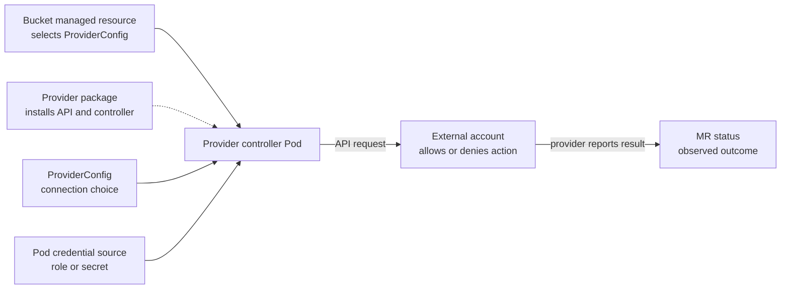

# How a Crossplane provider reaches an external API

## The idea in one minute

A Crossplane **Provider** is an installed package that adds
managed-resource APIs and a controller Pod. The Pod watches those
Kubernetes objects, obtains credentials, and calls an external API.
A `ProviderConfig` is a separate object that tells the provider
how to connect. A managed resource selects a provider configuration
through `spec.providerConfigRef`.[^crossplane-providers][^crossplane-managed]

Think of a courier with a work badge. A request names a delivery job;
the courier uses a particular badge, and the destination checks
whether that badge may perform the action. The analogy has limits:
the provider is a continuously running controller, and a healthy
Kubernetes package does not prove the destination granted access.
The bucket example below is invented; no provider or AWS call was
run for this page.

Read [How Crossplane's components turn a request into a resource](component-model.md)
first if XRs and managed resources are new terms.

## One request, four separate gates

Suppose a reports team has a Bucket managed resource. Its
`providerConfigRef` points to a configuration intended for a
particular account. The provider Pod runs in a management cluster
and tries to create the external bucket.

Text alternative: the Provider package supplies the Kubernetes API
type and controller Pod. The Bucket MR names the provider
configuration to use. That configuration and the Pod's credential
source determine how the controller identifies itself to the external
service. The external service authorizes or rejects the API call.
The provider reports the result in the managed-resource status.

| Gate | What it decides | What passing it does **not** prove |
| --- | --- | --- |
| Package | Is a compatible Provider revision installed and healthy, with the needed resource API active?[^crossplane-providers][^crossplane-activation] | The Pod has usable external credentials. |
| Provider configuration | Which supported `ProviderConfig` or `ClusterProviderConfig` does this MR select?[^crossplane-managed] | The chosen configuration points to the intended account or has permission there. |
| Credential source | Can the provider Pod obtain the credential required by that configuration? | The external service will authorize a particular create, update, or delete. |
| External authorization | Does the account policy permit this action on this resource? | The application that later uses the bucket has its own access. |

This is why a green `Provider` package status and an admitted Bucket
MR can coexist with an external access error. Start at the first gate
whose evidence is missing, not at a guessed manifest edit.

## Package installation is not cloud authorization

The `Provider` object names a package image; Crossplane installs a
revision and runs its controller. The provider documentation
distinguishes `Installed` and `Healthy` package conditions. A
healthy revision means the package is ready to work, not that it can
call every external API or create every possible resource.
[^crossplane-providers]

Providers may offer many managed-resource types. In Crossplane v2,
managed-resource definitions and activation policies can control
which types become active. Activation policies are alpha in the
current documentation. If the Bucket kind is absent, inspect the
installed provider revision, its API discovery, and activation state
before troubleshooting AWS credentials.[^crossplane-activation]

The exact package image, API group, kind, and fields depend on the
provider family and installed version. Use that provider's
official package documentation and the target cluster's API
discovery before copying an example into a real cluster.

## Which identity makes the call?

`spec.providerConfigRef` chooses a provider configuration for the
MR. The installed provider defines the configuration's schema and
credential options. In the AWS provider example documented by
Crossplane, a namespaced `ProviderConfig` applies to MRs in that
namespace, while a `ClusterProviderConfig` can be referenced from
multiple namespaces. The managed resource's
`spec.providerConfigRef` names the selected configuration
and its kind; inspect both values when tracing an account.
A wider scope should be paired with Kubernetes RBAC and
admission rules that control who can create MRs or select
that configuration.[^crossplane-providers]

Provider configuration and the Pod's identity work together. For
example, a provider may read a Kubernetes Secret, or its runtime
may use workload identity to obtain temporary cloud credentials.
The trust and permission policy at the external service still
decides what those credentials can do. The reports application's
own workload identity is a **different identity** from the
provider controller's identity.

On EKS, two AWS paths may be relevant:

- **EKS Pod Identity** associates a service account with a role in
  the cluster's AWS account. It requires the Pod Identity Agent
  unless EKS Auto Mode handles it, plus a compatible AWS SDK
  credential chain in the provider image. Cross-account access
  needs a delegated role path.[^eks-pod-identity]
- **IRSA** uses the cluster's OIDC issuer, a service-account
  identity token, and STS web-identity role assumption. It has a
  different trust setup and provider compatibility path.
  [^eks-irsa]

Neither name alone proves the provider Pod is using the intended
role. Verify the provider's actual service account, credential
source, account, and AWS audit result. The identity reported by
`aws sts get-caller-identity` in a maintainer's laptop shell
describes that shell, not the provider Pod.

For the AWS-specific account and access design, read
[Crossplane on AWS](../../cross-topic-guides/crossplane-on-aws.md).
For the two EKS credential mechanisms, read
[EKS workload identity](../../cross-topic-guides/eks-workload-identity.md).

## Diagnose the first missing boundary

| Observation | First question | Next evidence |
| --- | --- | --- |
| Bucket API kind is unknown. | Did the provider install and activate that exact managed-resource API? | Provider revision, discovered API resources, and activation state.[^crossplane-providers][^crossplane-activation] |
| Bucket MR exists, provider Pod is unhealthy. | Did the package runtime start? | Provider and Pod conditions, events, and package revision. |
| Provider reports missing credentials. | Which ProviderConfig and credential path did this MR select? | MR reference, provider config, service account, and Pod credential setup.[^crossplane-managed] |
| AWS denies the call. | Which role, account, resource, and action did AWS evaluate? | Provider condition/message and relevant AWS audit evidence. |
| AWS bucket exists, application fails. | Is the application using a separate identity or wrong bucket endpoint? | Application request path and its own authorization result. |

To inspect without changing state, start with the
[Find the first failing Crossplane handoff](troubleshooting.md) guide. A
server-side dry run can validate a manifest against an installed
Kubernetes schema, but it does not exercise the provider Pod or
authorize an external API call.

## Check your understanding

1. Why can a Provider report healthy while a Bucket MR fails to
   create an AWS bucket?
2. What does `providerConfigRef` select, and why must a platform
   limit who can choose it?
3. Why does a successful provider call not prove the reports
   application can read the bucket?
4. If the Bucket kind is unknown, which gate should you inspect
   before checking IAM?

## Explore further

- [Providers](https://docs.crossplane.io/latest/packages/providers/)
  explains package revisions, health, and controller runtime.
  [^crossplane-providers]
- [Managed Resources](https://docs.crossplane.io/latest/managed-resources/managed-resources/)
  explains provider configuration references and resource conditions.
  [^crossplane-managed]
- [EKS Pod Identity](https://docs.aws.amazon.com/eks/latest/userguide/pod-identities.html)
  and [IAM roles for service accounts](https://docs.aws.amazon.com/eks/latest/userguide/iam-roles-for-service-accounts.html)
  describe the AWS credential paths.[^eks-pod-identity][^eks-irsa]
- [Back to Crossplane](index.md).

[^crossplane-providers]: [Crossplane, Providers](https://docs.crossplane.io/latest/packages/providers/), source record `crossplane-providers`.
[^crossplane-managed]: [Crossplane, Managed Resources](https://docs.crossplane.io/latest/managed-resources/managed-resources/), source record `crossplane-managed`.
[^crossplane-activation]: [Crossplane, Managed Resource Activation Policies](https://docs.crossplane.io/latest/managed-resources/managed-resource-activation-policies/), source record `crossplane-activation`.
[^eks-pod-identity]: [Amazon EKS, EKS Pod Identity](https://docs.aws.amazon.com/eks/latest/userguide/pod-identities.html), source record `eks-pod-identity`.
[^eks-irsa]: [Amazon EKS, IAM roles for service accounts](https://docs.aws.amazon.com/eks/latest/userguide/iam-roles-for-service-accounts.html), source record `eks-irsa`.
