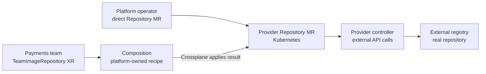

# When to use a managed resource or a Crossplane platform API

## The choice in one minute

A **direct managed resource (MR)** lets a user request an external
object through the provider's own Kubernetes API. A **platform API**
lets a team define its own smaller request type: an XRD defines the
type, an XR is one request, and a Composition turns that request into
one or more composed resources. Those composed resources may include
the *same* provider MRs. The provider controller still makes the
external API calls.[^crossplane-overview][^crossplane-managed][^crossplane-xrds][^crossplane-compositions]

Think of ordering ingredients versus ordering a prepared meal. A
direct MR exposes the supplier's choices; a platform API offers a
small menu and lets a platform team maintain the recipe. The
analogy stops at delivery: neither request proves the external
resource is ready or that its settings meet a promise such as
"private" until the implementation and result are checked.

Read [How Crossplane's components turn a request into a resource](component-model.md)
if the object names are new. This page focuses on **who should choose
the settings**.

## Two routes for one invented image repository

Suppose the payments application needs an image repository. The
example is invented; no provider, repository, Composition, or AWS
request was run.

**Direct route:** an authorized platform operator creates a
provider-defined `Repository` MR and chooses the provider-specific
fields. The installed provider controller reads that object, uses
its selected provider configuration, and asks the registry service
to create or update one repository.[^crossplane-managed]

**Platform API route:** a platform team defines a
`TeamImageRepository` XRD with a small contract, such as owner
and intended retention class. The payments team creates an XR.
Crossplane runs a selected Composition and its functions; the
result can be a `Repository` MR plus other resources that the
implementation actually declares. The provider controller then
handles each MR's external API calls.[^crossplane-xrds][^crossplane-compositions]

Text alternative: the direct route starts at a provider-defined
Repository MR. The platform route starts at a TeamImageRepository
XR and passes through a Composition that can produce a Repository
MR. Both routes then rely on the same kind of provider controller
to call the external registry. The platform route adds an API
contract and implementation layer; it does not replace the provider.

| Question | Direct MR | Platform API with XR and Composition |
| --- | --- | --- |
| Who chooses provider-specific fields? | The MR author, subject to policy. | The platform team can hide or fix them in the Composition. |
| What must the requester know? | The installed provider's API group, kind, schema, and lifecycle. | The platform API's fields and promised behavior. |
| How many resources can one request yield? | One MR represents one external object. | A Composition can produce one or many composed resources.[^crossplane-compositions] |
| Who handles external calls? | The provider controller. | The same provider controller for provider MRs that the Composition creates. |
| What is the added operating cost? | Users may repeat provider details and need access to sensitive MR or ProviderConfig choices. | Platform maintainers own XRD and Composition changes, compatibility, tests, and rollout. |

An XR is a useful interface only when its implementation is real.
Calling it `TeamImageRepository` does not automatically apply
retention, access controls, scanning, or any other standard.
Those properties need to be declared, restricted, and verified.

## When each route fits

Use a **direct MR** when the users are trusted to manage that
provider-specific resource, the need is narrow, or the team is
learning the installed API in a controlled environment. It is
also appropriate when a platform API would hide fields that the
operator must explicitly own. Direct access should still be
bounded by Kubernetes RBAC, the provider's permissions, and
resource policy.[^crossplane-managed]

Use an **XR and Composition** when many teams need the same
supported pattern, consumers should supply only a few intent
fields, or the platform must coordinate multiple resources behind
one contract. The XRD validates the request shape; the
Composition selects and produces desired resources. This adds an
implementation and versioning responsibility for the platform
team.[^crossplane-xrds][^crossplane-compositions]

Do not treat the XR as a security boundary by its name alone.
If application teams can also create arbitrary MRs or select a
privileged `ProviderConfig`, they may bypass the platform API's
defaults. The platform must control both its friendly API and
access to the lower-level APIs.

## A change shows the ownership difference

Imagine the organization changes the intended retention rule for
new repositories. With direct MRs, each resource author must
review and update the relevant provider fields, and existing
repositories may have different histories. With a platform API,
the platform team can update the Composition and decide how
existing XRs adopt the new implementation. A Composition change
is not automatically safe: it may change or remove real external
resources. Review rendered output and rollout policy before
promoting it.[^crossplane-compositions]

A Configuration package can bundle XRDs, Compositions, and
dependencies for distribution between control planes. Packaging
does not substitute for testing the behavior of an installed
provider or the permissions of its controller.[^crossplane-configurations]

In either route, a healthy provider package is different from a
ready MR, and a ready MR is different from an application
successfully pushing an image. Check each handoff separately.

## Choose the next page

| If you need to... | Read |
| --- | --- |
| See every object in the request path | [How Crossplane's components turn a request into a resource](component-model.md) |
| Understand provider identity and API access | [How a Crossplane provider reaches an external API](providers-and-authentication.md) |
| Understand MR drift, import, and deletion | [How a Crossplane managed resource changes over time](managed-resources-and-lifecycle.md) |
| Design the XRD and Composition | [Compositions](compositions.md) |
| See an application delivery design | [How one platform request reaches a running application](application-delivery-platform-api.md) |

## Check your understanding

1. Why can both routes end at the same provider controller?
2. What can the XRD validate, and what must the Composition
   actually implement?
3. Why might a direct MR be the clearer choice for a specialized
   platform operator?
4. What lower-level permissions could let a user bypass a
   supposedly standardized platform API?

## Explore further

- [Managed Resources](https://docs.crossplane.io/latest/managed-resources/managed-resources/)
  explains provider-defined external objects.[^crossplane-managed]
- [Composite Resource Definitions](https://docs.crossplane.io/latest/composition/composite-resource-definitions/)
  explains the platform API schema.[^crossplane-xrds]
- [Compositions](https://docs.crossplane.io/latest/composition/compositions/)
  explains how an XR produces desired resources.[^crossplane-compositions]
- [Configurations](https://docs.crossplane.io/latest/packages/configurations/)
  explains package distribution.[^crossplane-configurations]
- [Back to Crossplane](index.md).

[^crossplane-overview]: [Crossplane, What's Crossplane?](https://docs.crossplane.io/latest/whats-crossplane/), source record `crossplane-overview`.
[^crossplane-managed]: [Crossplane, Managed Resources](https://docs.crossplane.io/latest/managed-resources/managed-resources/), source record `crossplane-managed`.
[^crossplane-xrds]: [Crossplane, Composite Resource Definitions](https://docs.crossplane.io/latest/composition/composite-resource-definitions/), source record `crossplane-xrds`.
[^crossplane-compositions]: [Crossplane, Compositions](https://docs.crossplane.io/latest/composition/compositions/), source record `crossplane-compositions`.
[^crossplane-configurations]: [Crossplane, Configurations](https://docs.crossplane.io/latest/packages/configurations/), source record `crossplane-configurations`.
