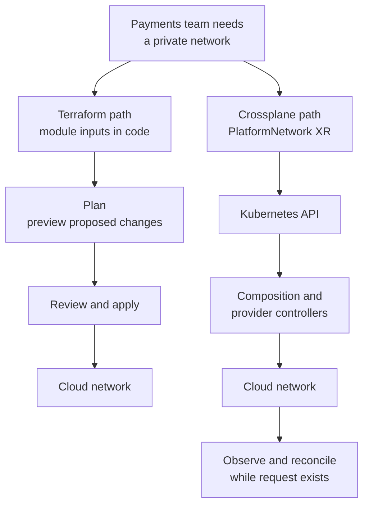

# When to use Terraform or Crossplane

## The choice in one minute

Choose **Terraform** when the important step is to preview a
specific infrastructure change, review it, and apply it as a
deliberate run. Choose **Crossplane** when a platform team wants
users to request infrastructure through Kubernetes APIs and
controllers to keep working toward the declared state. Many
platforms use both, with separate ownership.
[^terraform-plan][^crossplane-xrs][^crossplane-managed]

Think of the distinction as a scheduled inspection and an
on-duty caretaker. A Terraform run compares configuration
with the world, proposes changes, and can apply them. A
Crossplane controller keeps observing its Kubernetes request
and reconciles the resources it manages. The analogy has
limits: Terraform can run frequently in automation, and
Crossplane changes still need review, policy, and operational
care.

If the terms XRD, Composition, and XR are new, read
[How to request a Crossplane platform API](xrd-composition-and-xr-calls.md)
before comparing workflows.

## Follow one invented network request

Imagine a payments team needs a private network. The platform
team has a design for address ranges, subnets, and
routes. The following paths illustrate different ways to
operate that design; no network or cluster was created for
this article.

Text alternative: the Terraform path puts the network request
in configuration, previews it with a plan, then applies it
after review. The Crossplane path puts one `PlatformNetwork`
request in the Kubernetes API. A Composition and provider
controllers create and observe its managed resources over
time. Both paths still depend on cloud permissions, an
accurate design, and a test of whether the payments
application can use the network.

| Question | Terraform path | Crossplane path |
| --- | --- | --- |
| What is the request? | A root configuration calls a network module with inputs. | An XR gives a platform API its inputs. |
| Where is the reusable interface? | Module variables and outputs.[^terraform-modules] | XRD schema; Composition implements it.[^crossplane-xrds][^crossplane-compositions] |
| What checks a change first? | A `terraform plan` previews proposed actions for review.[^terraform-plan] | Git review, admission policy, and composition rendering can check different parts; an XR does not provide Terraform's plan workflow by itself.[^crossplane-compositions] |
| What tracks resources? | Terraform state maps configuration to remote objects.[^terraform-state] | Kubernetes objects, references, conditions, and provider observation.[^crossplane-xrs][^crossplane-managed] |
| When can drift be corrected? | A later refresh, plan, and apply can detect and correct changes. | A controller can observe and reconcile managed fields while it runs.[^terraform-plan][^crossplane-managed] |

A plan previews proposed actions; it cannot guarantee that
the apply or the application outcome will succeed. An XR
becoming ready reports controller readiness; it does not
complete a test of the application's route through the
network.[^terraform-plan][^crossplane-xrs]

## Choose the operating model

| Situation | Starting choice | Reason |
| --- | --- | --- |
| A small team makes occasional infrastructure changes and wants a visible approval step. | Terraform. | A plan and apply run fit that change process. |
| A platform team serves many standardized requests to teams using Kubernetes and GitOps. | Crossplane. | XRDs and XRs expose request types in the Kubernetes API, with ongoing status and reconciliation. |
| The first management cluster and its base network do not yet exist. | Terraform or another bootstrap tool. | Crossplane needs a running Kubernetes control plane before its controllers can serve requests. |
| Base cloud resources use a controlled pipeline, while application teams request repeatable services daily. | Both, with distinct owners. | Each tool serves the part of the workflow it fits. |

These are starting points. Also check provider support,
operational skills, recovery, security controls, and how
often requests change. Crossplane brings a control plane
that the team must operate; Terraform needs a reliable
run and state workflow. A convenient platform API does
not remove those responsibilities.
[^terraform-state][^crossplane-managed]

## Keep ownership clear when using both

For the invented network, Terraform could own the base
account, management cluster, and its initial network.
Crossplane could own separate application networks
requested as XRs. Each external resource and managed
field needs one active owner.

If Terraform and Crossplane both try to set the same
network field, a later Terraform apply and ongoing
Crossplane reconciliation can work against each other.
Write down the ownership boundary before migration.
Verify that the old tool has stopped managing a field
before the new one starts. Provider-specific import and
observation behavior require separate testing.
[^terraform-plan][^crossplane-managed]

## What to inspect after a change

For Terraform, review the **current** plan and apply
result, then verify the cloud network and an actual
payments application path. A previous speculative plan
can become stale if the world changes before apply.
[^terraform-plan]

For Crossplane, inspect the XR's `Synced` and `Ready`
conditions, the selected Composition, the composed
managed resources, their provider conditions, and
finally the payments application path. A healthy
request object and a working application are separate
observations.[^crossplane-xrs][^crossplane-managed]

Read [How a Crossplane managed resource changes over time](managed-resources-and-lifecycle.md)
for reconciliation and drift. Read the
[AWS VPC platform API](aws-vpc-platform-api.md) for a
more detailed network design.

## Check your understanding

1. A team must approve each network change after seeing
   proposed actions. Which workflow provides that
   preview directly?
2. Developers already submit Kubernetes manifests and
   need a small `PlatformNetwork` request. Which API
   pieces would the platform team publish?
3. Why can both a Terraform apply and a Crossplane XR
   show success while the payments app still cannot
   reach its dependency?
4. If both tools are installed, what must be decided
   before either manages the same cloud network?

## Explore further

- [Terraform plan](https://developer.hashicorp.com/terraform/cli/commands/plan)
  explains preview and apply boundaries.[^terraform-plan]
- [Terraform state](https://developer.hashicorp.com/terraform/language/state)
  explains how resources are tracked.[^terraform-state]
- [Terraform modules](https://developer.hashicorp.com/terraform/language/modules)
  explains reusable configuration.[^terraform-modules]
- [Crossplane XRDs](https://docs.crossplane.io/latest/composition/composite-resource-definitions/)
  and [XRs](https://docs.crossplane.io/latest/composition/composite-resources/)
  explain the platform API.[^crossplane-xrds][^crossplane-xrs]
- [Crossplane Compositions](https://docs.crossplane.io/latest/composition/compositions/)
  and [managed resources](https://docs.crossplane.io/latest/managed-resources/managed-resources/)
  explain implementation and reconciliation.
  [^crossplane-compositions][^crossplane-managed]
- [Back to Crossplane](index.md).

[^terraform-plan]: [HashiCorp, terraform plan command](https://developer.hashicorp.com/terraform/cli/commands/plan), source record `terraform-plan`.
[^terraform-state]: [HashiCorp, Terraform state](https://developer.hashicorp.com/terraform/language/state), source record `terraform-state`.
[^terraform-modules]: [HashiCorp, Modules overview](https://developer.hashicorp.com/terraform/language/modules), source record `terraform-modules`.
[^crossplane-xrds]: [Crossplane, Composite Resource Definitions](https://docs.crossplane.io/latest/composition/composite-resource-definitions/), source record `crossplane-xrds`.
[^crossplane-xrs]: [Crossplane, Composite Resources](https://docs.crossplane.io/latest/composition/composite-resources/), source record `crossplane-xrs`.
[^crossplane-compositions]: [Crossplane, Compositions](https://docs.crossplane.io/latest/composition/compositions/), source record `crossplane-compositions`.
[^crossplane-managed]: [Crossplane, Managed Resources](https://docs.crossplane.io/latest/managed-resources/managed-resources/), source record `crossplane-managed`.
