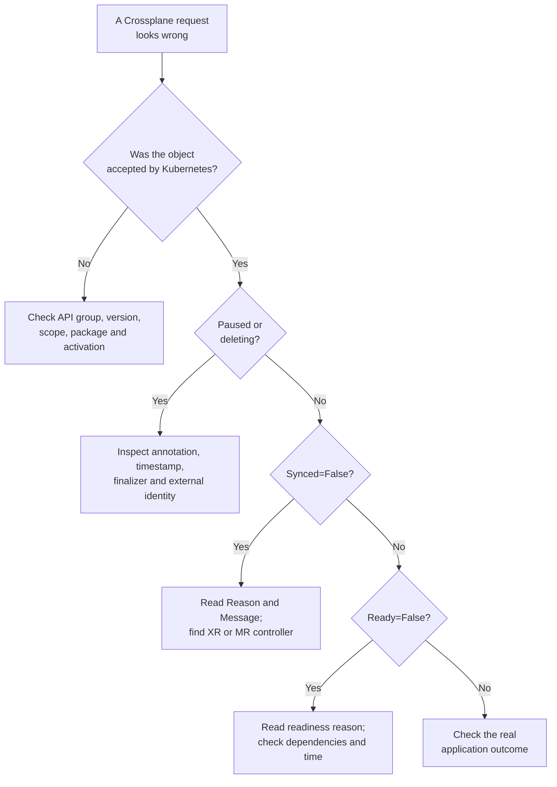

# Find the first failing Crossplane handoff

## Start with the object, not a guessed fix

A Crossplane request travels through several handoffs:
Kubernetes accepts an API object, Crossplane selects a
Composition if it is an XR, a provider observes a managed
resource, and an external API may create or change the
real resource. A later application check asks whether
the result is useful.[^crossplane-xr][^crossplane-managed]

Think of a parcel crossing tracking stations. The last
successful scan narrows where to look next. The analogy
has a limit: a condition records what a controller last
observed; it is not a continuous guarantee of the
external system or the application's experience.

Find **which object exists**, its **scope**, and its
**Reason** and **Message** before changing anything.
This guide uses Crossplane v2 namespaced examples.
Legacy cluster-scoped APIs and provider families can
use different groups and fields.[^crossplane-xrd]

## One invented stuck deletion

Suppose the reports team requested deletion of a
managed Bucket, but the Kubernetes object remains.
In this *invented* example, it is in namespace
`reports`, has a deletion timestamp, carries
`crossplane.io/paused: "true"`, and reports
`Synced=False` with reason `ReconcilePaused`.
No cluster, bucket, or deletion was inspected here.

The first read-only checks would be:

```bash
kubectl get buckets.s3.aws.m.upbound.io -n reports
kubectl describe buckets.s3.aws.m.upbound.io reports-archive -n reports
```

The exact fully qualified API group must match the
installed provider. The `.m.` in this AWS provider
family distinguishes its namespaced managed-resource
API from a legacy cluster-scoped API; do not infer
scope from a kind name such as `Bucket` alone.
Check API discovery if the command has no match.
[^crossplane-activation][^crossplane-provider]

Here, the pause and deletion timestamp explain why
the Kubernetes object is waiting. Pausing a managed
resource stops its provider reconciliation, including
the work needed to finish deletion. An old `Ready=True`
condition would describe the last observation before
the pause, not prove the bucket is still healthy.
The team must decide whether the external bucket
should be deleted or intentionally retained before
changing the pause or finalizer.
[^crossplane-managed]

## Follow the first missing handoff



Text alternative: if Kubernetes rejected the object, check
the API type and installed packages first. If the object
exists, inspect pause and deletion state. Next, read
`Synced` to find reconciliation errors and `Ready` to
find availability or waiting states. If both look healthy,
check the application's actual use of the resource.
[^crossplane-troubleshoot][^crossplane-xr][^crossplane-managed]

| Observation | First question | Where to go |
| --- | --- | --- |
| `no matches for kind` | Does the requested group/version exist and have the right scope? | Provider or XRD installation, API discovery, and managed-resource activation.[^crossplane-activation] |
| XR `Synced=False` | Did Composition selection or a function step fail? | XR Reason, Message, events, selected Composition, and function health.[^crossplane-xr] |
| Managed resource `Synced=False` | Did the provider fail to reconcile? | Managed-resource Reason/Message, ProviderConfig, provider health, and external API error.[^crossplane-managed][^crossplane-provider] |
| `Synced=True`, `Ready=False` | Is the resource still creating or waiting for a dependency? | Read the Ready Reason and elapsed time before treating it as an error.[^crossplane-managed] |
| `Ready=True`, application fails | Can the application access and use the external resource? | Application identity, endpoint, network path, and expected behavior. |

For an XR, `Synced=True` means Crossplane
reconciled the XR successfully; `Ready=True`
means its Composition function pipeline reports
composed resources ready. For a managed resource,
`Synced=True` means the provider's last reconcile
succeeded; `Ready=True` means the provider reports
the external resource available. The Reason and
Message explain the current state more precisely
than either short column alone.
[^crossplane-xr][^crossplane-managed]

A schema-invalid manifest is normally rejected
by the Kubernetes API before it can have Crossplane
conditions. An accepted object can still fail later
because the cloud API rejects a setting or permission.
Some providers report asynchronous operation failures
in an additional condition, so inspect all conditions.
[^crossplane-managed]

## Trace the right controller

If the problem starts at an **XR**, inspect its selected
Composition and resource references. The current
Crossplane CLI documents `crossplane resource trace`
for viewing the related resource tree. Its output and
flags depend on the installed CLI version. Continue
to the first unhealthy composed resource.
[^crossplane-cli][^crossplane-xr]

If the failure is in a **managed resource**, the
provider controller owns the external API call.
Read its events and conditions first, then its
selected ProviderConfig, controller Pod identity,
and provider logs. A namespaced ProviderConfig and
a ClusterProviderConfig have different reach; the
selected kind matters. See [How a Crossplane provider reaches an external API](providers-and-authentication.md).
[^crossplane-provider]

Core logs help with Crossplane package, XRD, and
XR reconciliation. Function pods have their own
logs for function execution. Provider pods are
the right place for provider API failures.
Crossplane's troubleshooting guide recommends
conditions and events before logs because
default logs can be terse.[^crossplane-troubleshoot]

## Distinguish two deletion problems

**The delete request was refused:** a Usage
dependency or admission rule may block deletion
before a deletion timestamp appears. Inspect the
API error and the protective object; a finalizer
is not yet the explanation.[^crossplane-usages]

**The object is terminating:** inspect the
deletion timestamp, finalizers, pause state,
provider health, and external dependencies.
The provider may need to delete the external
resource before removing the finalizer. Removing
a finalizer manually can leave an external
resource running without its Kubernetes record.
[^crossplane-managed]

If an event says `cannot determine creation result`,
the provider may have created an external resource
but lost the response or external identity. Inspect
the creation annotations and the external system
before retrying. Do not clear a pending annotation,
change `crossplane.io/external-name`, or force
deletion without a provider-specific recovery
decision; a duplicate or orphaned resource may
result.[^crossplane-managed]

Pausing only an XR does not necessarily pause
already composed managed resources. Verify each
controller boundary before using a pause during
an incident. A paused managed resource cannot
finish deletion until reconciliation resumes.
[^crossplane-xr][^crossplane-managed]

## Verify after the fix

After an approved correction, read the same XR or
managed resource again. Confirm that its Reason
and Message changed as expected, its relevant
composed or external resource reached the intended
state, and a representative application operation
works. A green condition alone does not establish
the user outcome.

No commands on this page were run against a
cluster. The example is invented and the commands
are read-only; adapt group, version, kind, scope,
and namespace to the installed Crossplane and
provider versions.

## Check your understanding

1. The API server rejects a Bucket manifest with
   "no matches for kind." Which checks come before
   investigating cloud permissions?
2. A managed resource has `Synced=True` and
   `Ready=False` with reason `Creating`. What does
   that tell you, and what must you inspect next?
3. A paused managed resource has a deletion timestamp.
   Why might removing its finalizer create a second
   problem?

## Explore further

- [Crossplane Troubleshoot Crossplane](https://docs.crossplane.io/latest/guides/troubleshoot-crossplane/)
  explains conditions, events, and logs.[^crossplane-troubleshoot]
- [Composite Resources](https://docs.crossplane.io/latest/composition/composite-resources/)
  and [Managed Resources](https://docs.crossplane.io/latest/managed-resources/managed-resources/)
  document their different conditions.[^crossplane-xr][^crossplane-managed]
- [Managed Resource Activation Policies](https://docs.crossplane.io/latest/managed-resources/managed-resource-activation-policies/)
  explains v2 API activation.[^crossplane-activation]
- [Crossplane CLI command reference](https://docs.crossplane.io/cli/latest/command-reference/)
  documents resource tracing.[^crossplane-cli]
- [How a Crossplane managed resource changes over time](managed-resources-and-lifecycle.md).
- [Back to Crossplane](index.md).

[^crossplane-troubleshoot]: [Crossplane, Troubleshoot Crossplane](https://docs.crossplane.io/latest/guides/troubleshoot-crossplane/), source record `crossplane-troubleshoot`.
[^crossplane-xrd]: [Crossplane, Composite Resource Definitions](https://docs.crossplane.io/latest/composition/composite-resource-definitions/), source record `crossplane-xrd`.
[^crossplane-xr]: [Crossplane, Composite Resources](https://docs.crossplane.io/latest/composition/composite-resources/), source record `crossplane-xr`.
[^crossplane-managed]: [Crossplane, Managed Resources](https://docs.crossplane.io/latest/managed-resources/managed-resources/), source record `crossplane-managed`.
[^crossplane-activation]: [Crossplane, Managed Resource Activation Policies](https://docs.crossplane.io/latest/managed-resources/managed-resource-activation-policies/), source record `crossplane-activation`.
[^crossplane-provider]: [Crossplane, Providers](https://docs.crossplane.io/latest/packages/providers/), source record `crossplane-provider`.
[^crossplane-usages]: [Crossplane, Usages](https://docs.crossplane.io/latest/managed-resources/usages/), source record `crossplane-usages`.
[^crossplane-cli]: [Crossplane CLI, Command Reference](https://docs.crossplane.io/cli/latest/command-reference/), source record `crossplane-cli`.
