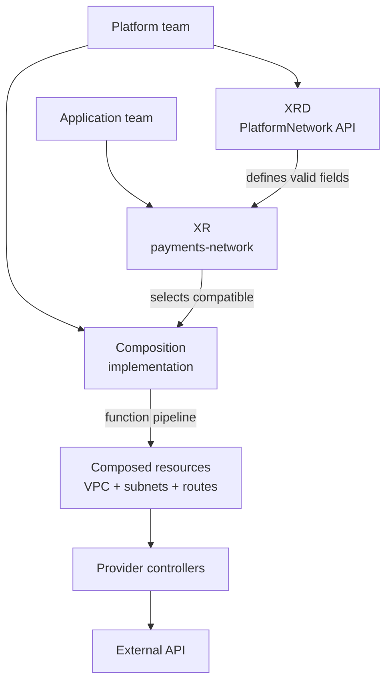

# How to request a Crossplane platform API

## The answer first

To use a Crossplane platform API, **create a composite resource
(XR)**. The platform team defines the request type with a
**Composite Resource Definition (XRD)** and implements it with
a **Composition**. The user creates an XR of that type and supplies
the requested values.[^crossplane-xrds][^crossplane-xrs]

Imagine a form for ordering a network:

- The **XRD** defines the fields on the form, such as a region
  and address range.
- The **XR** is one filled-in form for one network.
- The **Composition** is the platform team's instructions for
  turning that request into actual resources.

The analogy stops at delivery. A valid form can still lead to
a failed request if a function, provider, or external API cannot
do its part.

## One invented network request

Suppose a platform team offers a `PlatformNetwork` API. The
application team needs a private network for a payments service.
This is an illustration, not an installed API or tested cloud
configuration.

| Piece | Example | What it decides |
| --- | --- | --- |
| XRD | `PlatformNetwork` requires `region` and `cidrBlock`. | Which request fields Kubernetes accepts. |
| Composition | `platformnetwork-aws-private` uses a function pipeline. | Which resources should be created from valid fields. |
| XR | `payments-network` asks for `eu-west-1` and `10.40.0.0/16`. | The values for this one request. |
| Composed resources | A VPC, subnets, and routes in this example. | The objects Crossplane applies for the request. |
| Provider controllers | Observe the managed resources and call AWS APIs. | Whether external resources are actually reconciled. |



Text alternative: the platform team publishes an XRD and a
compatible Composition. An application team creates one
`PlatformNetwork` XR. Crossplane validates its shape through
the Kubernetes API, chooses a Composition, and runs its function
pipeline. The pipeline returns desired composed resources.
Provider controllers then reconcile those resources through
the external API.[^crossplane-xrds][^crossplane-compositions]

The platform API can also compose ordinary Kubernetes
resources; provider-managed cloud resources are just the
choice in this example.[^crossplane-compositions]

## What the user creates

A small XR can be the entire user-facing request:

```yaml
# Illustrative only: it requires the matching XRD and Composition.
apiVersion: platform.example.org/v1alpha1
kind: PlatformNetwork
metadata:
  name: payments-network
  namespace: payments
spec:
  region: eu-west-1
  cidrBlock: 10.40.0.0/16
```

The `apiVersion` and `kind` must match a served API version
and kind defined by the XRD. `metadata.namespace` matters if
the XRD defines a namespaced XR. The fields under `spec` are
the platform team's public contract; this example assumes the
XRD defined both fields and their validation rules.
[^crossplane-xrds]

The user normally does **not** create a new XRD or Composition
for every network. Those are reusable platform definitions.
The same XRD and Composition can serve multiple XRs with
different inputs.

## How one request chooses an implementation

A Composition declares which XR API type it supports through
`compositeTypeRef`. A matching type alone does not tell a
reader which Composition a particular XR will use. The
selection can come from the XRD's default, an explicit
`spec.crossplane.compositionRef` on the XR, or a selector.
An XRD can also enforce one Composition. Check the live XRD
and XR when investigating a real request.
[^crossplane-xrds][^crossplane-xrs][^crossplane-compositions]

For the invented network, an explicit choice would be:

```yaml
spec:
  crossplane:
    compositionRef:
      name: platformnetwork-aws-private
  region: eu-west-1
  cidrBlock: 10.40.0.0/16
```

This is a fragment of the XR above, not a second object.
The selected Composition still needs a matching
`compositeTypeRef`. A selection is an implementation choice;
it is not evidence that any VPC exists.[^crossplane-xrs]

## Where the Terraform analogy helps

If you know Terraform, creating an XR is **roughly** like
calling a reusable module with input values. The XRD
resembles the module's input contract, and the Composition
resembles its implementation. This analogy helps locate
who supplies inputs and who owns the internals.
[^terraform-modules][^crossplane-xrds]

The operating model differs. Terraform evaluates a
configuration during a plan/apply workflow and records state.
Crossplane controllers repeatedly observe Kubernetes objects
and work toward the desired state. An XR is a persistent API
object, not a one-time function invocation. Read
[When to use Terraform or Crossplane](terraform-vs-crossplane.md) for
the wider comparison.

## Follow evidence through the layers

| Observation | What it tells you | What it does not prove |
| --- | --- | --- |
| Kubernetes accepts the XR. | Its kind and submitted fields passed API admission. | A compatible Composition ran or external resources exist. |
| The XR reports `Synced=True`. | Crossplane reconciled the XR without a reported error. | All composed resources are ready.[^crossplane-xrs] |
| The XR reports `Ready=True`. | The function pipeline reported its composed resources ready. | A real application can use the network end to end.[^crossplane-xrs] |
| Managed resources report readiness. | Their controllers report reconciliation success. | The application's routing and access policies work for its traffic. |
| A representative application check passes. | That specific user path worked. | Every future request or failure mode will work. |

Start with the XR's conditions and resource references,
then inspect the composed resources and their conditions.
A rejected XR points toward the XRD contract. A selected
Composition with no expected output points toward its
function pipeline. A created managed resource with an
external error points toward its provider, credentials,
or cloud API. This narrows investigation to the first
missing handoff.[^crossplane-xrs][^crossplane-compositions]

For the function handoff, read
[How a Crossplane Composition fulfills one application request](compositions.md).
For the provider handoff, read
[How a Crossplane provider reaches an external API](providers-and-authentication.md).
The [How one Crossplane request becomes an AWS network](aws-vpc-platform-api.md) explores
a more detailed network design.

## Check your understanding

1. The platform team publishes an XRD and Composition. What
   does an application team create to request a second network?
2. If Kubernetes accepts an XR but no cloud resource appears,
   which later layers should you inspect?
3. Why does choosing a Composition by name not prove that
   its resources are ready?
4. In what way is an XR like a Terraform module call, and
   in what way is it different?

## Explore further

- [Crossplane Composite Resource Definitions](https://docs.crossplane.io/latest/composition/composite-resource-definitions/)
  covers API fields, versions, scope, and defaults.[^crossplane-xrds]
- [Crossplane Composite Resources](https://docs.crossplane.io/latest/composition/composite-resources/)
  covers XR creation, selection, and conditions.[^crossplane-xrs]
- [Crossplane Compositions](https://docs.crossplane.io/latest/composition/compositions/)
  covers function pipelines and composed resources.[^crossplane-compositions]
- [HashiCorp Terraform modules](https://developer.hashicorp.com/terraform/language/modules)
  explains the module comparison.[^terraform-modules]
- [Back to Crossplane](index.md).

[^crossplane-xrds]: [Crossplane, Composite Resource Definitions](https://docs.crossplane.io/latest/composition/composite-resource-definitions/), source record `crossplane-xrds`.
[^crossplane-xrs]: [Crossplane, Composite Resources](https://docs.crossplane.io/latest/composition/composite-resources/), source record `crossplane-xrs`.
[^crossplane-compositions]: [Crossplane, Compositions](https://docs.crossplane.io/latest/composition/compositions/), source record `crossplane-compositions`.
[^terraform-modules]: [HashiCorp, Modules overview](https://developer.hashicorp.com/terraform/language/modules), source record `terraform-modules`.
