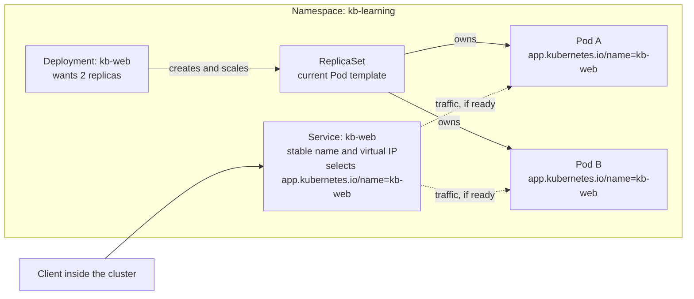

# Kubernetes fundamentals

## Purpose

Build the mental model you need before running `kubectl` commands or the
[local deployment learning path](../../cross-topic-guides/local-deployment-learning-path.md).
The page explains what Kubernetes is trying to do, how its main objects relate,
and why an application keeps working while individual containers come and go.

It does not teach commands or YAML syntax. Those come next, once the
relationships make sense.

## What Kubernetes is

Kubernetes runs containerized applications on a group of machines, called a
cluster, and keeps them in the shape you asked for. You do not tell it "start
this container on that machine". You describe the result you want, such as
"two copies of this web application, reachable under one name", and Kubernetes
keeps working to make the cluster match that description.[^kubernetes-concepts]

## Why it matters

Machines fail, containers crash, and new versions need to replace old ones.
Handling that by hand does not scale and is easy to get wrong under pressure. Kubernetes
turns those chores into a standing description that software keeps enforcing.

The trade-off is that you stop managing individual containers directly. To
understand why something happened, you need to know which object asked for it.

## Desired state and reconciliation

Every Kubernetes object you create is a stored record of intent, often called
desired state. For most objects it lives in the object's `spec`. The cluster's
real condition, such as which containers are actually running, is the current
state.

A controller is a program that runs a loop without end: watch the desired
state, observe the current state, and act to move current closer to desired.
Kubernetes has many controllers, each responsible for one kind of
object.[^kubernetes-controllers]

Two consequences are worth remembering:

- **Your request persists.** Creating a Deployment is not a one-off
  instruction. If a Pod disappears next week, the controller notices the gap
  and creates a replacement.
- **"Finished" is not guaranteed.** A busy cluster may never be perfectly
  still. That is normal, as long as controllers can keep making useful
  progress.[^kubernetes-controllers]

## The objects and how they connect

| Object | Simple definition | How it connects to the others |
| --- | --- | --- |
| Cluster | The whole system: a control plane that stores and enforces desired state, plus worker machines (nodes) that run workloads. | Everything below lives inside one cluster. |
| Namespace | A named area inside a cluster that scopes object names. | Two objects can share a name if they are in different namespaces.[^kubernetes-namespaces] |
| Pod | The smallest unit Kubernetes runs: one or more containers that share networking and storage. | Usually created for you by a controller, not by hand.[^kubernetes-pods] |
| ReplicaSet | A controller object that keeps a stated number of identical Pods running. | Created and managed by a Deployment. |
| Deployment | Desired state for an application: which Pod template to run and how many copies. | Manages ReplicaSets, which manage Pods, and handles gradual updates.[^kubernetes-deployments] |
| Label | A key-value tag on an object, such as `app.kubernetes.io/name: kb-web`. | Many objects can share a label; labels are not unique names. |
| Selector | A rule that matches objects by their labels. | Deployments and Services find "their" Pods through selectors.[^kubernetes-labels] |
| Service | A stable name in front of a changing set of Pods. The default kind also gets a stable virtual IP address inside the cluster. | Selects Pods by label so that traffic reaches the ready ones.[^kubernetes-services] |

The key idea is that most connections are made **by label matching, not by
name**. The Deployment and Service objects do not hold lists of their Pod
names. Controllers use their selectors to find matching Pods; the Service's
EndpointSlices record the current backend addresses and readiness. The
Kubernetes documentation calls the label selector the core grouping
primitive.[^kubernetes-labels][^kubernetes-endpointslices]

## An analogy: a café with a standing staffing order

Imagine a café run on standing orders:

- The **Deployment** is a manager's standing order: "Always keep two baristas
  trained on this month's menu on shift."
- The **ReplicaSet** is the shift roster for one version of that training.
- Each **Pod** is an individual barista. Customers do not care which one serves
  them.
- A **label** is the badge a barista wears, such as "barista, kb-web café".
- The **Service** is the café's counter and phone number. Customers talk to the
  counter, and the counter passes orders to whoever is wearing the right badge
  and is ready to work.
- **Reconciliation** is the manager checking the roster all day and calling in
  a replacement whenever someone leaves.

Where the analogy stops being accurate:

- **Pods are replaced, not nursed back to health.** Kubernetes can restart a
  crashed container inside an existing Pod, but once a Pod itself is gone, a
  controller creates a new Pod with a new name and, typically, a new IP
  address. No Pod is ever "the same barista returning".[^kubernetes-pods]
- **There is no single manager.** Separate controllers each watch one kind of
  object. The Deployment controller manages ReplicaSets; the ReplicaSet
  controller manages Pods.[^kubernetes-controllers]
- **Not every café has a counter.** The default Service type gives clients one
  stable virtual IP address. A headless Service has no such address; its DNS
  name returns the Pod addresses directly.[^kubernetes-services] This page
  uses the default type throughout.
- **The counter trusts badges completely.** A Service can send traffic to any
  normally eligible Pod in the same Namespace whose labels match its
  selector, including an unrelated Pod that happens to carry the same labels.
  Choose labels carefully.[^kubernetes-services]
- **Namespaces are not separate buildings.** Pods in different namespaces can
  still run on the same machines. A namespace scopes names and gives you a
  place to attach policies; real isolation depends on additional features such
  as access control and network policy.[^kubernetes-namespaces]

## Visual: one application inside a namespace

Text alternative: inside the `kb-learning` namespace, the `kb-web` Deployment
creates and scales a ReplicaSet, and the ReplicaSet owns and keeps two Pods
running. Both Pods carry the label `app.kubernetes.io/name=kb-web`.
Separately, the `kb-web` Service selects Pods by the label
`app.kubernetes.io/name=kb-web` and sends traffic to the matching Pods that are
ready. A client inside the cluster talks only to the Service. The example is a
Service of the default `ClusterIP` type, which has a stable virtual IP address;
other Service types are not shown. The solid arrows
show ownership and creation; the dashed arrows show traffic chosen by label
matching, not by ownership.

Use the diagram to decide where to look when something goes wrong: missing Pods
point to the Deployment and ReplicaSet chain, while "Pods run but traffic fails"
points to the Service selector, labels, and Pod readiness.

## One application, traced from creation to replacement

This is a conceptual walk-through, not recorded cluster output. It uses the
same names as the local learning path's
[Deployment](../examples/local-deployment-learning-path/deployment.yaml) and
[Service](../examples/local-deployment-learning-path/service.yaml) files, which
you can open to see the matching labels and selectors.

### 1. Creation

You submit a Deployment named `kb-web` that asks for two replicas, and a
Service named `kb-web`. Both live in the `kb-learning` namespace.

- The Deployment controller sees a Deployment with no ReplicaSet and creates
  one from the Deployment's Pod template.[^kubernetes-deployments]
- The ReplicaSet controller sees zero matching Pods where two are wanted, and
  creates two Pods. Each Pod carries the labels from the template.
- Because the Service has a selector, the control plane's EndpointSlice
  controller creates and maintains EndpointSlice objects for it. They list the
  Pods that currently match the selector, along with whether each one is
  ready.[^kubernetes-endpointslices]
- Once a Pod reports that it is ready, it becomes eligible for Service traffic.
  Until then, Service proxies normally leave it out.[^kubernetes-endpointslices]

### 2. Replacement

Someone deletes one of the two `kb-web` Pods by mistake.

- The ReplicaSet controller no longer counts the deleted Pod. It finds one
  matching Pod where two are wanted, so it creates a new Pod. The new Pod has a
  different name and IP address.
- After the deleted Pod finishes terminating, the EndpointSlice controller
  removes its address from the Service's EndpointSlices and adds the new one.
  The new Pod becomes eligible for normal traffic when it is ready.
  [^kubernetes-endpointslices]
- Clients were using the Service name all along, so they did not need to learn
  the new Pod's address.[^kubernetes-services]

Nobody issued a "replace the Pod" command. The gap between desired and current
state was enough.

A failed machine ends the same way, but not as quickly. Kubernetes first has
to notice that the node is unreachable, and the Pod objects on that node stay
bound to it for a while in case it recovers. By default, most Pods tolerate an
unreachable node for five minutes before they are evicted, and only then are
replacements created elsewhere.[^kubernetes-taints-tolerations] Reconciliation
is eventual, not instant.

### 3. Update

You change the Deployment's Pod template to use a new image version.

- With the default rolling-update strategy, the Deployment creates a new
  ReplicaSet for the new template, then gradually scales the new one up and the
  old one down.[^kubernetes-deployments]
- During that rollout, old and new Pods can both carry the Service's label.
  Once ready, both can receive traffic for a short time. Applications should
  tolerate this.
- The old ReplicaSet is kept, scaled to zero, as revision history up to a
  configurable limit. That history is what makes a rollback
  possible.[^kubernetes-deployments]

The [local deployment learning path](../../cross-topic-guides/local-deployment-learning-path.md)
lets you watch an update fail on purpose with a bad image tag, diagnose it, and
roll it back.

## Common misconceptions

- **"A Deployment is a running app."** A Deployment is a record of intent. The
  running parts are Pods, created through a ReplicaSet.
- **"I should restart a broken Pod by hand."** Usually you fix the desired
  state, such as the image or configuration, and let the controllers replace
  Pods.
- **"A Service is a load balancer on the internet."** The default Service type,
  `ClusterIP`, assigns an address that is internal to the
  cluster.[^kubernetes-services]
- **"Namespaces isolate teams securely."** Namespaces scope names. Access
  control, network policy, and quotas are separate features.[^kubernetes-namespaces]

## Check your understanding

- Why does a Deployment create Pods through a ReplicaSet instead of being a Pod
  itself?
- A Pod is deleted by mistake. Which controller notices, and what does it do?
- Why might replacements take several minutes to appear after a node becomes
  unreachable?
- A Service exists but no traffic reaches the Pods. Name two relationships you
  would check first.
- What does a client gain by using a Service name instead of a Pod IP address?

## Next steps

- Trace the traffic relationship in [How a Kubernetes Service selects
  Pods](../core-objects/how-a-service-selects-pods.md).
- Apply this model in the [local deployment learning
  path](../../cross-topic-guides/local-deployment-learning-path.md).
- Learn safe inspection commands in [kubectl
  basics](../commands/kubectl-basics.md).
- Diagnose failures with [Kubernetes troubleshooting](../troubleshooting/index.md).
- Return to the [Start here](../../start-here.md) learning route.

## Official documentation for deeper study

- Controllers, desired state, and control loops: [Controllers](https://kubernetes.io/docs/concepts/architecture/controller/).
- What a Pod is and why it is disposable: [Pods](https://kubernetes.io/docs/concepts/workloads/pods/).
- ReplicaSets, rolling updates, and rollback: [Deployments](https://kubernetes.io/docs/concepts/workloads/controllers/deployment/).
- Labels, selectors, and grouping: [Labels and Selectors](https://kubernetes.io/docs/concepts/overview/working-with-objects/labels/).
- Name scoping and cluster-scoped objects: [Namespaces](https://kubernetes.io/docs/concepts/overview/working-with-objects/namespaces/).
- Stable access and Service types: [Service](https://kubernetes.io/docs/concepts/services-networking/service/).
- Endpoint readiness and traffic eligibility: [EndpointSlices](https://kubernetes.io/docs/concepts/services-networking/endpoint-slices/).
- How Pods are evicted from unhealthy nodes: [Taints and Tolerations](https://kubernetes.io/docs/concepts/scheduling-eviction/taint-and-toleration/).
- Other workload types, such as Jobs and StatefulSets: [Workloads](https://kubernetes.io/docs/concepts/workloads/).

## Related links

- [How a Kubernetes Service selects Pods](../core-objects/how-a-service-selects-pods.md)
- [Local deployment learning path](../../cross-topic-guides/local-deployment-learning-path.md)
- [Kubernetes commands](../commands/index.md)
- [Kubernetes core objects](../core-objects/index.md)
- [Back to Kubernetes fundamentals](index.md)
- [Back to Kubernetes index](../index.md)
- [Back to knowledge index](../../index.md)

[^kubernetes-concepts]: [Kubernetes Concepts](https://kubernetes.io/docs/concepts/), source record `kubernetes-concepts`.
[^kubernetes-controllers]: [Kubernetes controllers](https://kubernetes.io/docs/concepts/architecture/controller/), source record `kubernetes-controllers`.
[^kubernetes-pods]: [Kubernetes Pods](https://kubernetes.io/docs/concepts/workloads/pods/), source record `kubernetes-pods`.
[^kubernetes-deployments]: [Kubernetes Deployments](https://kubernetes.io/docs/concepts/workloads/controllers/deployment/), source record `kubernetes-deployments`.
[^kubernetes-namespaces]: [Kubernetes namespaces](https://kubernetes.io/docs/concepts/overview/working-with-objects/namespaces/), source record `kubernetes-namespaces`.
[^kubernetes-labels]: [Kubernetes labels and selectors](https://kubernetes.io/docs/concepts/overview/working-with-objects/labels/), source record `kubernetes-labels`.
[^kubernetes-services]: [Kubernetes Service](https://kubernetes.io/docs/concepts/services-networking/service/), source record `kubernetes-services`.
[^kubernetes-endpointslices]: [Kubernetes EndpointSlices](https://kubernetes.io/docs/concepts/services-networking/endpoint-slices/), source record `kubernetes-endpointslices`.
[^kubernetes-taints-tolerations]: [Kubernetes taints and tolerations](https://kubernetes.io/docs/concepts/scheduling-eviction/taint-and-toleration/), source record `kubernetes-taints-tolerations`.
