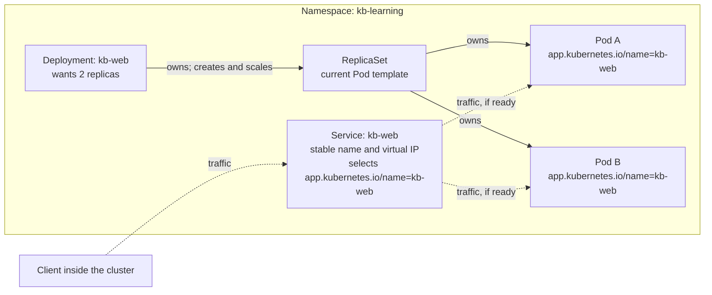

# Kubernetes fundamentals

## Purpose

Build the mental model you need before running `kubectl` commands or the
[local deployment learning path](../../cross-topic-guides/local-deployment-learning-path.md).
The page explains what Kubernetes is trying to do, how its main objects relate,
and why an application keeps working while individual containers come and go.

It does not teach commands. It points to a few YAML fields only to show where
these relationships are declared.

## What Kubernetes is

Kubernetes runs containerized applications on a group of machines, called a
cluster, and keeps working toward the shape you asked for. Usually you
describe the result you want, such as "two copies of this web application,
reachable under one name", and Kubernetes chooses suitable machines. You
can constrain placement when needed.[^kubernetes-concepts]

## Why it matters

Machines fail, containers crash, and new versions need to replace old ones.
Handling that by hand does not scale and is easy to get wrong under pressure. Kubernetes
turns those chores into a standing description that software keeps enforcing.

The trade-off is that you stop managing individual containers directly. To
understand why something happened, you need to know which object asked for it.

## Desired state and reconciliation

Many Kubernetes objects are stored records of intent, often called
**desired state**. For a Deployment, the `spec` records what you requested;
its `status` reports what the cluster has observed so far. A requested Pod
count and a running, ready Pod count can differ.[^kubernetes-objects]

A controller is a program that runs a loop without end: watch the desired
state, observe the current state, and act to move current closer to desired.
Kubernetes has many controllers, each focused on a job and sometimes watching
several kinds of objects.[^kubernetes-controllers]

Two consequences are worth remembering:

- **Your request persists.** Creating a Deployment is not a one-off
  instruction. If one of its Pods disappears next week, the ReplicaSet
  controller can notice the gap and create a replacement.
- **"Finished" is not guaranteed.** A busy cluster may never be perfectly
  still. That is normal, as long as controllers can keep making useful
  progress.[^kubernetes-controllers]

## The objects and how they connect

| Object | Simple definition | How it connects to the others |
| --- | --- | --- |
| Cluster | The whole system: a control plane that accepts requests and runs controllers, plus worker machines called nodes. | Namespaced objects and cluster-wide objects belong to one cluster. |
| Node | A machine in the cluster where Pods can run. | A scheduler assigns a Pod to a node; the node's kubelet starts and monitors its containers.[^kubernetes-pod-lifecycle] |
| Namespace | A named area that scopes many object names. | Two Pods can share a name in different namespaces; a Deployment and Service can share a name in one namespace because they are different resource types. Nodes and Namespaces themselves are cluster-scoped.[^kubernetes-namespaces][^kubernetes-object-names] |
| Pod | The smallest unit Kubernetes runs: one or more containers that share networking and any volumes declared for them. | Usually created for you by a controller, not by hand.[^kubernetes-pods] |
| ReplicaSet | An object whose controller works to keep the requested number of Pods for one Pod template. | A Deployment normally creates one for each template version and owns it; the ReplicaSet owns its Pods.[^kubernetes-replicasets][^kubernetes-owners-dependents] |
| Deployment | Desired state for an application: which Pod template to run and how many copies. | Manages ReplicaSets, which manage Pods, and normally handles gradual updates.[^kubernetes-deployments] |
| Label | A key-value tag on an object, such as `app.kubernetes.io/name: kb-web`. | Many objects can share a label; labels are not unique names. |
| Selector | A rule that matches objects by their labels. | Deployments and Services find "their" Pods through selectors.[^kubernetes-labels] |
| Service | A stable name in front of a changing set of Pods. The default `ClusterIP` type gets an internal virtual IP while the Service exists. | Selects Pods by label; the cluster's Service networking routes to eligible endpoints.[^kubernetes-services] |
| EndpointSlice | An object that records network addresses and readiness information for a Service's backends. | The control plane updates it as matching Pods appear, become ready, or leave.[^kubernetes-endpointslices] |

Two relationships matter. **Selectors** match labels. The Deployment declares
a base selector that matches its Pod template; each ReplicaSet it creates adds
an automatic `pod-template-hash` label to its own selector and Pod template.
The Service uses a separate selector to find traffic backends.
**Owner references** record which object manages a child: the Deployment owns
its ReplicaSets, and each ReplicaSet owns its Pods. The Service owns its
managed EndpointSlices, but does not own the Pods they describe.
Neither a Deployment nor a Service keeps a hand-written list of Pod names.
The Service's selector picks backends; EndpointSlices record their addresses
and readiness. In this example, a hand-made Pod labelled only
`app.kubernetes.io/name: kb-web` can be selected by the Service, but it lacks
the full selector of a Deployment-created ReplicaSet. A ReplicaSet can adopt
an unowned Pod only if its *full* selector matches. Choose selectors carefully.
[^kubernetes-deployments][^kubernetes-labels][^kubernetes-owners-dependents][^kubernetes-replicasets][^kubernetes-endpointslices]

## An analogy: a café with a standing staffing order

Imagine a café run on standing orders:

- The **Deployment** is a manager's standing order: "Always keep two baristas
  trained on this month's menu on shift."
- The **ReplicaSet** is the shift roster for one version of that training.
- Each **Pod** is an individual barista. Customers do not care which one serves
  them.
- A **label** is the badge a barista wears, such as "barista, kb-web café".
- The **Service** is the café's counter and phone number. Customers talk to the
  counter, and the counter passes orders to whoever is wearing the right badge
  and is ready to work.
- **Reconciliation** is repeated checking against the roster and calling in
  a replacement when the count falls below the request.

Where the analogy stops being accurate:

- **A replacement is a new Pod object.** The kubelet can restart a crashed
  container inside an existing Pod. If a Deployment-managed Pod is deleted,
  its ReplicaSet creates a new Pod with a new name and usually a new IP.
  [^kubernetes-pod-lifecycle][^kubernetes-replicasets]
- **A new menu means new staff, not retraining staff in place.** With the
  default rolling strategy, a Deployment changes its Pod template by creating
  a new ReplicaSet and replacing Pods gradually.[^kubernetes-deployments]
- **There is no single manager.** The Deployment controller works on
  ReplicaSets; the ReplicaSet controller works on Pods. Each controller may
  observe several resource types to do its job.[^kubernetes-controllers]
- **The counter and roster check different badges.** The Service can route to
  any ready Pod with its chosen label, even one outside the Deployment. A
  Deployment-created ReplicaSet also checks `pod-template-hash`, so the
  Service's label alone does not make a Pod part of its roster.
  [^kubernetes-deployments][^kubernetes-services]
- **Namespaces are not separate buildings.** Pods in different namespaces can
  still run on the same machines. A namespace scopes names and gives you a
  place to attach policies; real isolation depends on additional features such
  as access control and network policy.[^kubernetes-namespaces]

## Visual: one application inside a namespace

Text alternative: inside the `kb-learning` namespace, the `kb-web` Deployment
creates and scales a ReplicaSet, and the ReplicaSet owns and keeps two Pods
running. Both Pods carry the label `app.kubernetes.io/name=kb-web`.
Separately, the `kb-web` Service selects Pods by the label
`app.kubernetes.io/name=kb-web` and sends traffic to the matching Pods that are
ready. A client inside the cluster talks only to the Service. The example is a
Service of the default `ClusterIP` type, which has a stable virtual IP address;
other Service types are not shown. The solid arrows show ownership and
creation; the dashed arrows show traffic. The Service selector chooses
backends; EndpointSlices record them. Ownership plays no part in this traffic
choice.

Use the diagram to decide where to look when something goes wrong: missing Pods
point to the Deployment and ReplicaSet chain, while "Pods run but traffic fails"
points to the Service selector, labels, Pod readiness, and Service port mapping.

## One application, traced from creation to replacement

This is a conceptual walk-through, not recorded cluster output. It uses the
same names as the local learning path's
[Deployment](../examples/local-deployment-learning-path/deployment.yaml) and
[Service](../examples/local-deployment-learning-path/service.yaml) files, which
you can open to see the matching labels and selectors. In the Deployment file,
`spec.selector.matchLabels` is the base selector, and
`spec.template.metadata.labels` puts its labels on new Pods. Each
Deployment-created ReplicaSet adds `pod-template-hash` to its own selector and
Pods. In the Service file, `spec.selector` independently chooses the traffic
backends. The
`metadata.labels` on the Deployment and Service describe those objects; they
do not select Pods. The Pod template also declares an HTTP readiness probe.
[^kubernetes-deployments][^kubernetes-services]

### 1. Creation

You submit a Deployment named `kb-web` that asks for two replicas, and a
Service named `kb-web`. Both live in the `kb-learning` namespace.

- The Deployment controller sees a Deployment with no ReplicaSet and creates
  one from the Deployment's Pod template.[^kubernetes-deployments]
- The ReplicaSet controller sees zero matching Pods where two are wanted, and
  creates two Pod objects. Each Pod carries the labels from the template. The
  scheduler assigns each Pod to a suitable node, where the kubelet starts its
  container and checks its readiness probe.[^kubernetes-pod-lifecycle]
- Because the Service has a selector, the control plane's EndpointSlice
  controller creates and maintains EndpointSlice objects for it. They list the
  Pods that currently match the selector, along with whether each one is
  ready.[^kubernetes-endpointslices]
- Once a Pod passes its readiness probe and reports that it is ready, it
  becomes eligible for Service traffic. The cluster's Service networking
  normally leaves unready endpoints out.[^kubernetes-endpointslices]

### 2. Replacement

Someone deletes one of the two `kb-web` Pods by mistake.

- The ReplicaSet controller sees a gap in its desired count and creates a new
  Pod. It can do this while the deleted Pod is still shutting down. The new Pod
  has a different name and usually a different IP address.
  [^kubernetes-replicasets][^kubernetes-pod-lifecycle]
- The terminating Pod normally stops receiving new Service traffic. Its
  endpoint can remain listed for a while, marked as terminating, before the
  Pod disappears.[^kubernetes-endpointslices]
- The new Pod's endpoint can appear before the old one disappears. It is
  normally ineligible for Service traffic until it is ready. The two updates
  need not happen in a fixed order.[^kubernetes-endpointslices]
- Clients were using the Service name all along, so they did not need to learn
  the new Pod's address. This does not promise that a request already being
  handled by the old Pod will succeed.[^kubernetes-services]

Nobody issued a "replace the Pod" command. The gap between desired and current
state was enough.

A failed machine takes longer to handle. Kubernetes first has to detect that
the node is unreachable. By default, the node controller waits five minutes
*after marking its `Ready` condition `Unknown`* before its first eviction
request. Pods also get a default 300-second toleration for the node's
`unreachable` taint unless configured otherwise. On a one-node cluster there
is no other healthy node for a replacement to run on.
Any replacement still needs a healthy node, time to start, and a passing
readiness probe. The remaining Pods may have to carry the traffic meanwhile;
there is no fixed recovery time.[^kubernetes-nodes][^kubernetes-taints-tolerations][^kubernetes-pod-lifecycle]

### 3. Update

You change the Deployment's Pod template to use a new image version.

- With the default rolling-update strategy, the Deployment creates a new
  ReplicaSet for the new template, then gradually scales the new one up and the
  old one down. Each template version has its own ReplicaSet. Kubernetes adds
  a `pod-template-hash` label so the old and new ReplicaSets do not select each
  other's Pods.[^kubernetes-deployments]
- During that rollout, old and new Pods can both carry the label the Service
  selects, so both versions must be able to serve side by side.
  Once ready, both can receive traffic for a short time. Readiness also helps
  decide when the Deployment may scale down old Pods. For two requested
  replicas, the default surge limit permits one extra Pod, while the default
  unavailable limit is zero. Availability requires readiness for the configured
  `minReadySeconds` (zero by default). That is the *plan*, not a guarantee
  against failures or insufficient capacity.[^kubernetes-deployments]
- The old ReplicaSet is kept, scaled to zero, as revision history up to a
  configurable limit. That history is what makes a rollback
  possible.[^kubernetes-deployments]

If the new image cannot start, the rollout can stall while old ready Pods keep
serving. Kubernetes reports the lack of progress after
`progressDeadlineSeconds` (600 seconds by default); it does
not automatically roll back. A rollback restores the earlier Pod template,
not an earlier replica count or the contents of a referenced ConfigMap or
Secret.[^kubernetes-deployments]

The [local deployment learning path](../../cross-topic-guides/local-deployment-learning-path.md)
lets you watch an update fail on purpose with a bad image tag, diagnose it, and
roll it back.

## Common misconceptions

- **"A Deployment is a running app."** A Deployment is a record of intent. The
  running parts are Pods, created through a ReplicaSet.
- **"I should restart a broken Pod by hand."** Usually you fix the desired
  state, such as the image or configuration, and let the controllers replace
  Pods.
- **"A Service is automatically reachable from the internet."** The default
  `ClusterIP` type has an address inside the cluster. External access needs
  additional configuration.[^kubernetes-services]
- **"Namespaces isolate teams securely."** Namespaces scope names. Access
  control, network policy, and quotas are separate features.[^kubernetes-namespaces]

## Check your understanding

- Why does a Deployment manage Pods through ReplicaSets instead of directly?
- A Pod is deleted by mistake. Which controller notices, and what does it do?
- Why might replacements take several minutes to appear after a node becomes
  unreachable?
- A Service exists but no traffic reaches the Pods. Name two relationships you
  would check first.
- A hand-made Pod has only the `app.kubernetes.io/name: kb-web` label. Could the
  Service send it traffic? Would the Deployment-created ReplicaSet count it?
- What does a client gain by using a Service name instead of a Pod IP address?

## Next steps

- Trace the traffic relationship in [How a Kubernetes Service selects
  Pods](../core-objects/how-a-service-selects-pods.md).
- Apply this model in the [local deployment learning
  path](../../cross-topic-guides/local-deployment-learning-path.md).
- Learn safe inspection commands in [kubectl
  basics](../commands/kubectl-basics.md).
- Diagnose failures with [Kubernetes troubleshooting](../troubleshooting/index.md).
- Return to the [Start here](../../start-here.md) learning route.

## Official documentation for deeper study

- Controllers, desired state, and control loops: [Controllers](https://kubernetes.io/docs/concepts/architecture/controller/).
- What a Pod is and why it is disposable: [Pods](https://kubernetes.io/docs/concepts/workloads/pods/).
- ReplicaSets, rolling updates, and rollback: [Deployments](https://kubernetes.io/docs/concepts/workloads/controllers/deployment/).
- Labels, selectors, and grouping: [Labels and Selectors](https://kubernetes.io/docs/concepts/overview/working-with-objects/labels/).
- Name scoping and cluster-scoped objects: [Namespaces](https://kubernetes.io/docs/concepts/overview/working-with-objects/namespaces/).
- Stable access and Service types: [Service](https://kubernetes.io/docs/concepts/services-networking/service/).
- Endpoint readiness and traffic eligibility: [EndpointSlices](https://kubernetes.io/docs/concepts/services-networking/endpoint-slices/).
- How Pods are evicted from unhealthy nodes: [Taints and Tolerations](https://kubernetes.io/docs/concepts/scheduling-eviction/taint-and-toleration/).
- Stable Pod identity for a different controller: [StatefulSets](https://kubernetes.io/docs/concepts/workloads/controllers/statefulset/).
- Other workload types, such as Jobs and StatefulSets: [Workloads](https://kubernetes.io/docs/concepts/workloads/).

## Related links

- [How a Kubernetes Service selects Pods](../core-objects/how-a-service-selects-pods.md)
- [Local deployment learning path](../../cross-topic-guides/local-deployment-learning-path.md)
- [Kubernetes commands](../commands/index.md)
- [Kubernetes core objects](../core-objects/index.md)
- [Back to Kubernetes fundamentals](index.md)
- [Back to Kubernetes index](../index.md)
- [Back to knowledge index](../../index.md)

[^kubernetes-concepts]: [Kubernetes Concepts](https://kubernetes.io/docs/concepts/), source record `kubernetes-concepts`.
[^kubernetes-controllers]: [Kubernetes controllers](https://kubernetes.io/docs/concepts/architecture/controller/), source record `kubernetes-controllers`.
[^kubernetes-objects]: [Objects in Kubernetes](https://kubernetes.io/docs/concepts/overview/working-with-objects/), source record `kubernetes-objects`.
[^kubernetes-nodes]: [Kubernetes Nodes](https://kubernetes.io/docs/concepts/architecture/nodes/), source record `kubernetes-nodes`.
[^kubernetes-pod-lifecycle]: [Kubernetes Pod lifecycle](https://kubernetes.io/docs/concepts/workloads/pods/pod-lifecycle/), source record `kubernetes-pod-lifecycle`.
[^kubernetes-pods]: [Kubernetes Pods](https://kubernetes.io/docs/concepts/workloads/pods/), source record `kubernetes-pods`.
[^kubernetes-deployments]: [Kubernetes Deployments](https://kubernetes.io/docs/concepts/workloads/controllers/deployment/), source record `kubernetes-deployments`.
[^kubernetes-namespaces]: [Kubernetes namespaces](https://kubernetes.io/docs/concepts/overview/working-with-objects/namespaces/), source record `kubernetes-namespaces`.
[^kubernetes-object-names]: [Kubernetes object names and IDs](https://kubernetes.io/docs/concepts/overview/working-with-objects/names/), source record `kubernetes-object-names`.
[^kubernetes-owners-dependents]: [Kubernetes owners and dependents](https://kubernetes.io/docs/concepts/overview/working-with-objects/owners-dependents/), source record `kubernetes-owners-dependents`.
[^kubernetes-replicasets]: [Kubernetes ReplicaSets](https://kubernetes.io/docs/concepts/workloads/controllers/replicaset/), source record `kubernetes-replicasets`.
[^kubernetes-labels]: [Kubernetes labels and selectors](https://kubernetes.io/docs/concepts/overview/working-with-objects/labels/), source record `kubernetes-labels`.
[^kubernetes-services]: [Kubernetes Service](https://kubernetes.io/docs/concepts/services-networking/service/), source record `kubernetes-services`.
[^kubernetes-endpointslices]: [Kubernetes EndpointSlices](https://kubernetes.io/docs/concepts/services-networking/endpoint-slices/), source record `kubernetes-endpointslices`.
[^kubernetes-taints-tolerations]: [Kubernetes taints and tolerations](https://kubernetes.io/docs/concepts/scheduling-eviction/taint-and-toleration/), source record `kubernetes-taints-tolerations`.
