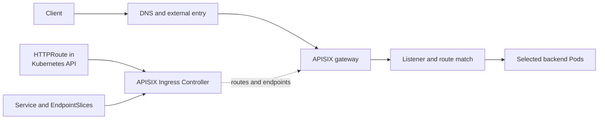

# Trace an APISIX 404 to its first failed handoff

## The question to answer

An HTTP `404` means a request did not find the requested
resource **somewhere** on its path. The status alone does not
prove that APISIX rejected the route: an HTTP-aware entry layer,
gateway, or backend application could have returned it. A Network
Load Balancer forwards network traffic; if it is the only AWS entry
layer, it does not create an HTTP `404` response itself. First identify
the answering layer and the exact request it saw.[^aws-nlb]

This guide uses a **made-up** request for
`https://learn.example.com/lessons` through an APISIX Gateway.
The example assumes the team declares routing with Gateway
API `HTTPRoute`. APISIX can also use Kubernetes Ingress or
APISIX custom resources; inspect the kind your cluster
actually uses.[^apisix-architecture][^apisix-gateway-api]
No gateway, route, Pod, or request was inspected for this page.



Text alternative: a live request travels from client through
the external entry into APISIX, then through listener and route
matching to the backend. Separately, the APISIX Ingress
Controller translates the `HTTPRoute` and backend Service and
EndpointSlice information stored in Kubernetes into gateway
configuration. A route existing in Kubernetes does not by itself
prove that this request matched it. The Service identifies the backend;
APISIX normally proxies directly to selected Pod endpoints.
[^apisix-architecture][^apisix-resources][^gateway-httproute]

## 1. Capture one failing request

Record the time, URL, HTTP method, `Host` header, scheme,
response status, and any request ID. Use gateway access logs
or tracing to see whether the request reached APISIX. If
it did not, inspect DNS, the external load balancer, and the
gateway Service before changing an `HTTPRoute`. If APISIX
forwarded it and the backend returned `404`, investigate
the application route and any path rewrite. A response
header by itself may be insufficient to identify the
answering layer when proxies add or remove headers.

Keep the real request shape: testing only an IP address
without the original `Host` header may miss the route
that a browser request would match.[^gateway-httproute]

## 2. Compare the request with the route

For the invented `lessons` route in namespace `lessons`,
the following commands only **read** Kubernetes objects.
Replace names and namespaces with your actual installation:

```bash
kubectl config current-context
kubectl get httproute lessons -n lessons -o yaml
kubectl get gateway public-api -n gateway-system -o yaml
```

Confirm the context's cluster mapping before trusting
the results. In the `HTTPRoute`, compare `parentRefs`,
`hostnames`, and path matches with the request. Then read
the route's `status.parents` entry for the intended Gateway
and its conditions. A route may name a Gateway yet not be
accepted by its listener; an accepted route still requires
the request's host and path to match.[^gateway-httproute]

If a route refers to a backend in another namespace,
check the required `ReferenceGrant` in the backend namespace before
assuming the controller can use it. The APISIX support
matrix is version-specific, so verify that your installed
controller supports the Gateway API kind and fields in
the manifest.[^apisix-gateway-api][^gateway-referencegrant]

## 3. Check the controller-to-gateway handoff

When the Kubernetes route appears correct but the live
request still misses it, compare the controller's observed
state and the gateway's applied configuration. APISIX
documents a controller debug view and Admin API inspection
for that distinction. Those interfaces may expose routes,
upstreams, or credentials; follow your team's access
procedure rather than enabling or forwarding an
administrative endpoint as a generic first step.
[^apisix-config-troubleshoot]

One **conditional** APISIX case is listener port matching.
If `listener_port_match_mode` is enabled, the configured
Gateway listener port and the actual port on which APISIX
accepted the connection can differ after Service port
mapping. APISIX documents this as a possible `404` cause.
Check that setting and the actual listener path before
changing either value; the feature is off by default in
the referenced documentation.[^apisix-config-troubleshoot]

## 4. Follow the next boundary

| Evidence | Next place to look |
| --- | --- |
| No request reached APISIX | DNS, external load balancer, gateway Service, and APISIX Pod reachability. |
| Request reached APISIX but no route matched | `HTTPRoute` attachment, host/path/method, controller translation, and conditional listener-port matching. |
| Route matched and a policy rejected the request | The attached authentication, authorization, or rate-limit plugin; read the actual status and plugin evidence. |
| Request reached the backend and it returned `404` | Application route, rewrite behavior, and backend logs. |
| Request matched but the backend is unavailable | Service selector, EndpointSlice readiness, and Pod evidence; use the [Kubernetes Service debug guide](https://kubernetes.io/docs/tasks/debug/debug-application/debug-service/).[^k8s-debug-service] |

For a broader gateway request model, read
[How the APISIX gateway and controller fit together](../applications-and-tools/apisix-architecture-and-deployment.md).
For policy failures, read
[How APISIX policies shape one request](../applications-and-tools/apisix-security-traffic-and-observability.md).
Change the reviewed routing source only after the first
failed handoff is supported by evidence, then repeat the
same user request to verify the result.

## Check your understanding

1. Why is a `404` status insufficient to blame APISIX?
2. What can `HTTPRoute` status tell you, and what does a
   real request still need to match?
3. Why would a Gateway listener on port `80` need special
   attention if APISIX actually accepts traffic on `9080`
   and listener-port matching is enabled?

## Explore further

- [APISIX configuration troubleshooting](https://apisix.apache.org/docs/ingress-controller/reference/apisix-ingress-controller/configuration-troubleshoot/)
  explains translated versus synchronized configuration and
  the listener-port case.[^apisix-config-troubleshoot]
- [Gateway API HTTPRoute](https://gateway-api.sigs.k8s.io/reference/api-types/httproute/)
  explains parent attachment, hostnames, matches, and status.
  [^gateway-httproute]
- [APISIX Gateway API support](https://apisix.apache.org/docs/ingress-controller/concepts/gateway-api/)
  lists the supported resource versions and field limits.
  [^apisix-gateway-api]
- [Back to Kubernetes troubleshooting](index.md).

[^apisix-architecture]: [Apache APISIX, Deployment Architecture](https://apisix.apache.org/docs/ingress-controller/concepts/deployment-architecture/), source record `apisix-architecture`.
[^apisix-config-troubleshoot]: [Apache APISIX, Configuration Troubleshooting](https://apisix.apache.org/docs/ingress-controller/reference/apisix-ingress-controller/configuration-troubleshoot/), source record `apisix-config-troubleshoot`.
[^apisix-gateway-api]: [Apache APISIX, Gateway API support](https://apisix.apache.org/docs/ingress-controller/concepts/gateway-api/), source record `apisix-gateway-api`.
[^apisix-resources]: [Apache APISIX, Ingress Controller Resources](https://apisix.apache.org/docs/ingress-controller/concepts/resources/), source record `apisix-resources`.
[^gateway-httproute]: [Gateway API, HTTPRoute](https://gateway-api.sigs.k8s.io/reference/api-types/httproute/), source record `gateway-httproute`.
[^k8s-debug-service]: [Kubernetes, Debug Services](https://kubernetes.io/docs/tasks/debug/debug-application/debug-service/), source record `k8s-debug-service`.
[^aws-nlb]: [Elastic Load Balancing, NLB listeners](https://docs.aws.amazon.com/elasticloadbalancing/latest/network/load-balancer-listeners.html), source record `aws-nlb`.
[^gateway-referencegrant]: [Gateway API, ReferenceGrant](https://gateway-api.sigs.k8s.io/reference/api-types/referencegrant/), source record `gateway-referencegrant`.
