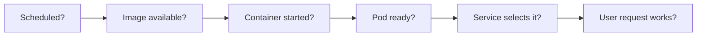

# Find the first failing Kubernetes boundary

## What this guide helps you decide

When an application fails, first ask **where the expected path
stops**. A Pod must be scheduled, obtain its image, start its
containers, become ready, be selected by a Service, and answer
the caller's request. A status word points to a stage; it does
not prove a root cause.[^pod-lifecycle][^debug-services]

Think of the path as a delivery route with checkpoints. If
delivery stops before the Service has a ready backend, changing
DNS will not make that backend healthy. The analogy has a limit:
several failures can happen together, and a passing checkpoint
does not prove the complete user journey works.



Text alternative: inspect the Pod's scheduling, image, container,
and readiness evidence before following Service selection and
the caller's request. The first failed checkpoint chooses the
next investigation.

## Start with read-only evidence

Know the intended cluster and namespace. These examples use
`shop` as an **invented namespace**:

```bash
kubectl config current-context
kubectl get pods -n shop -o wide
kubectl get events -n shop --sort-by=.lastTimestamp
```

Confirm the context-to-cluster mapping using the
[safe inspection guide](../commands/daily-usage.md). The Pod list
shows readiness, status, restarts, and placement. Events may
show a recent scheduling, image, probe, or mount failure, but
they are observations with limited retention; do not invent a
cause when they are absent.[^debug-pods]

> [!WARNING]
> These checks read cluster information. Inspecting a Pod or
> Service may expose configuration and logs. Keep evidence
> within the appropriate team channel; do not paste secrets
> into a public report.

## Match the symptom to the first useful check

| What you see | Read next | What the result can mean |
| --- | --- | --- |
| Pod shows `Pending` | `kubectl describe pod <pod-name> -n shop` | `Pending` includes waiting for scheduling **or** image setup. Read conditions and events first; if `FailedScheduling` cites CPU or memory, use the [resource-pressure guide](../commands/workflows.md).[^pod-lifecycle][^debug-pods] |
| Pod shows `ErrImagePull` or `ImagePullBackOff` | Pod image reference, pull policy, and events in `describe` and Pod YAML. | A wrong reference, missing image, denied registry access, or unreachable registry needs a different correction. For a local kind build, use the [kind image-pull guide](kind.md).[^debug-pods] |
| Container repeatedly restarts | Last terminated state, previous logs, and events. | Follow [Diagnose CrashLoopBackOff](crashloopbackoff.md); the delay itself is not the cause.[^pod-lifecycle] |
| Pod is Running but not Ready | Pod conditions, container states, and readiness events. | Readiness can block normal Service traffic even while a container runs.[^pod-lifecycle][^endpointslices] |
| Service has no usable backend | Service selector, Pod labels/readiness, and EndpointSlices. | The selector may match no Pods, or selected endpoints may be unready; follow the example below.[^debug-services][^endpointslices] |
| Service has ready backends but callers still fail | Service ports, DNS, caller location, network policy, and application response. | Follow the [official Service debugging path](https://kubernetes.io/docs/tasks/debug/debug-application/debug-service/) from the caller's position; avoid assuming DNS is the problem.[^debug-services] |
| `kubectl` returns `Forbidden` | Exact verb, resource, namespace, and identity. | Follow the [EKS human access guide](../../security/identity-federation/eks-human-identity-and-rbac.md) on EKS or your cluster's access process; permission denial is separate from workload readiness. |

This table is a route chooser, not a list of fixes. A `Pending`
Pod can be waiting for an image, and a Running Pod can still be
unready. Use the **event and condition** to distinguish them.
[^pod-lifecycle]

## Worked example: the Service has no ready backend

Imagine an **invented** `web` Service in namespace `shop`.
The user gets a `503`, and the Pod list contains a `web` Pod
marked `Running` but `0/1` Ready. This is not output from a
cluster tested for this page.

First read the Service and its EndpointSlices:

```bash
kubectl describe service web -n shop
kubectl get endpointslices -n shop -l kubernetes.io/service-name=web -o yaml
kubectl get pods -n shop --show-labels
```

Compare the Service's `spec.selector` with the labels on the
intended Pods. In each EndpointSlice, read the endpoint addresses
and `conditions.ready` values. A Service can exist with no
usable endpoint. If the selector matches no Pods, investigate
the Service and workload labels. If it matches a Pod that is
not ready, inspect that Pod's conditions and readiness events
before changing Service configuration.[^debug-services]
[^endpointslices][^service]

There is one important exception: a Service with
`publishNotReadyAddresses: true` can mark endpoints ready even
when the Pods are not. In that case inspect Pod readiness and
the EndpointSlice `serving` condition too.[^endpointslices]

```bash
kubectl describe pod <pod-name> -n shop
kubectl logs <pod-name> -n shop --tail=100
```

Suppose the Pod description reports a failing readiness probe
and the logs say the application cannot reach a backend. The
next check is the application's backend dependency and probe
behavior. Do not make the probe less strict merely to turn
`0/1` into `1/1`: the Pod may really be unable to serve.
After a reviewed fix, repeat the Pod and EndpointSlice checks,
then test the original user request. A ready endpoint is still
only one checkpoint.[^debug-pods][^debug-services]

## When to stop and ask for help

Stop before a change when the cluster target is uncertain,
the needed data is forbidden, the proposed fix is not explained
by the evidence, or the system has a controller that will
reconcile your manual change away. Save the exact observation
and use the team's incident or change process. The
[manifest-change guide](../commands/common-commands.md)
starts only after a correction has been reviewed.

## Explore further

- [Debug Pods](https://kubernetes.io/docs/tasks/debug/debug-application/debug-pods/)
  explains Pod conditions, container state, and events.[^debug-pods]
- [Debug Services](https://kubernetes.io/docs/tasks/debug/debug-application/debug-service/)
  follows DNS, Service, selected endpoints, and application
  response.[^debug-services]
- [EndpointSlices](https://kubernetes.io/docs/concepts/services-networking/endpoint-slices/)
  explains endpoint readiness and Service association.[^endpointslices]
- [Back to Kubernetes troubleshooting](index.md).

[^pod-lifecycle]: [Kubernetes, Pod Lifecycle](https://kubernetes.io/docs/concepts/workloads/pods/pod-lifecycle/), source record `pod-lifecycle`.
[^debug-pods]: [Kubernetes, Debug Pods](https://kubernetes.io/docs/tasks/debug/debug-application/debug-pods/), source record `debug-pods`.
[^debug-services]: [Kubernetes, Debug Services](https://kubernetes.io/docs/tasks/debug/debug-application/debug-service/), source record `debug-services`.
[^service]: [Kubernetes, Service](https://kubernetes.io/docs/concepts/services-networking/service/), source record `service`.
[^endpointslices]: [Kubernetes, EndpointSlices](https://kubernetes.io/docs/concepts/services-networking/endpoint-slices/), source record `endpointslices`.
