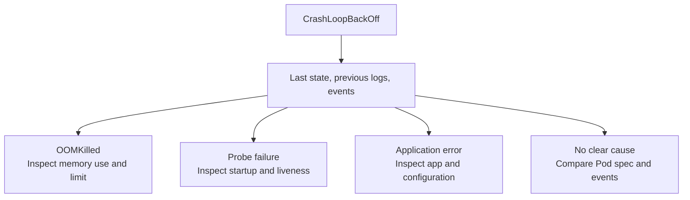

# Diagnose CrashLoopBackOff

## What the symptom means

`CrashLoopBackOff` says that a container has failed and Kubernetes is
waiting before another restart attempt. The wait grows after repeated
failures. It describes the **restart delay**, not the reason the
container failed. The label can appear in `kubectl`'s Status column;
it is not a Pod phase or a diagnosis.[^pod-lifecycle]

A failed application startup, a missing setting, a memory kill, or a
failing startup or liveness probe can all lead here. A failed
**readiness** probe alone marks the container unready; it does not
restart it.[^pod-lifecycle][^probes]

## Check the target before the cause

You need `kubectl` access to the intended cluster and permission to
read the Pod and its logs. Replace the placeholders below with the
actual namespace and Pod name; run the commands only after the
context names the cluster you intend to inspect.

```bash
kubectl config current-context
kubectl get pods -n <namespace>
```

What to look for: confirm the environment and copy the exact Pod
name. If several containers share the Pod, note which container has
the growing restart count. Stop if the context is unexpected.
Reading logs can expose secrets or personal data that an application
printed, so handle and share the output accordingly.

## Read the last failure

```bash
kubectl describe pod <pod-name> -n <namespace>
kubectl logs <pod-name> -c <container-name> -n <namespace> --previous --tail=100
```

`describe` shows container states, restart counts, and related
events. In the container's **Last State**, look for its termination
reason and exit code. `--previous` asks for the prior terminated
instance's logs, if they still exist; `-c` selects the container.
A current container may be waiting while the previous one holds the
useful error.[^debug-pods][^kubectl-logs]

If previous logs are unavailable, try current logs and review the
Pod's events. Missing logs do not prove the application was healthy.

## Choose the next investigation



Text alternative: start at the restart symptom and read last state,
previous logs, and events. A memory-killed process leads to memory
investigation; startup or liveness failures lead to probe settings
and startup timing; an application error leads to its code or
configuration. If none explains the failure, inspect the Pod
specification and recent events.

| Evidence | Likely next step | Important limit |
| --- | --- | --- |
| Last State says `OOMKilled` | Compare observed memory use with the container's memory limit and investigate the application or workload sizing.[^resources] | Raising a limit without understanding growth may hide a leak or move pressure elsewhere. |
| Events report startup or liveness probe failures | Check the configured path, port, thresholds, and how long startup really takes.[^probes] | A readiness failure alone does not explain the restart. |
| Previous logs show an application exception or missing setting | Find the owning workload configuration or code and correct the cause. | Do not paste secret values from logs into tickets or chat. |
| No clear error in logs | Compare the Pod spec, termination reason, and recent events; inspect the container and node path that the evidence points to.[^debug-pods] | An empty log does not identify a root cause. |

## One illustrative diagnosis

Suppose the `orders-api` container in a Pod under namespace `shop`
restarts repeatedly. Its Last State says `Terminated` with reason
`Error`, and previous logs say that a required `DATABASE_URL` setting
is missing. That combination points to application configuration,
not to the backoff timer. The team should check where the owning
workload obtains that setting and propose a reviewed correction.
This is an **invented example**; no cluster was queried for this page.

After the correction is deployed, check the new Pod's restart count,
readiness, and recent events. Then test the user-facing request path.
A stable Pod alone does not prove the application can serve an order.

## Explore further

- [Kubernetes Pod lifecycle](https://kubernetes.io/docs/concepts/workloads/pods/pod-lifecycle/)
  explains the backoff and restart behavior.[^pod-lifecycle]
- [Debug Pods](https://kubernetes.io/docs/tasks/debug/debug-application/debug-pods/)
  covers Pod state and events.[^debug-pods]
- [Startup, liveness, and readiness probes](https://kubernetes.io/docs/concepts/workloads/pods/probes/)
  explains which failures restart containers.[^probes]
- [kubectl basics](../commands/kubectl-basics.md) shows the read-only
  inspection commands in a wider workflow.
- [Back to Kubernetes troubleshooting](index.md).

[^pod-lifecycle]: [Kubernetes, Pod lifecycle](https://kubernetes.io/docs/concepts/workloads/pods/pod-lifecycle/), source record `pod-lifecycle`.
[^debug-pods]: [Kubernetes, debug Pods](https://kubernetes.io/docs/tasks/debug/debug-application/debug-pods/), source record `debug-pods`.
[^kubectl-logs]: [Kubernetes, kubectl logs](https://kubernetes.io/docs/reference/kubectl/generated/kubectl_logs/), source record `kubectl-logs`.
[^probes]: [Kubernetes, startup, liveness, and readiness probes](https://kubernetes.io/docs/concepts/workloads/pods/probes/), source record `probes`.
[^resources]: [Kubernetes, resource management for Pods and containers](https://kubernetes.io/docs/concepts/configuration/manage-resources-containers/), source record `resources`.
