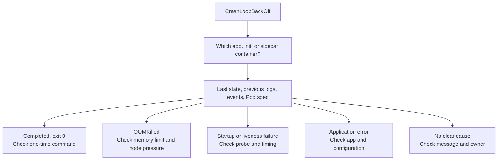

# Diagnose CrashLoopBackOff

## What the symptom means

`CrashLoopBackOff` says that a container has exited repeatedly and the
node's **kubelet** is delaying another restart attempt. The wait grows
after repeated exits. It describes the **restart delay**, not why the
container exited. The label can appear in `kubectl`'s Status column;
it is not a Pod phase or a diagnosis.[^pod-lifecycle]

The usual backoff can grow to five minutes, although cluster settings
can change that maximum. A container can show `Running` between exits,
so one healthy-looking snapshot does not establish recovery.
[^pod-lifecycle]

An exit is not always an application error. A Deployment Pod uses
`restartPolicy: Always`; unless an individual container overrides it,
even a process that finishes successfully with exit code `0` restarts.
A one-time command in a Deployment can therefore enter a loop; check
whether it should instead be a Job or whether the service command ends
when it should keep running.
[^pod-lifecycle]

A failed application startup, a setting the application needs, a memory
kill, or a failing startup or liveness probe can all lead here. A failed
**readiness** probe alone marks the container unready; it does not
restart it.[^pod-lifecycle][^probes]

If Kubernetes cannot create the container at all, for example because
it references a missing Secret key, investigate that setup error in Pod
events. It is a different symptom from a process that starts and exits.
[^debug-pods]

## Check the target before the cause

You need `kubectl` access to the intended cluster and permission to
read the Pod and its logs. Replace the placeholders below with the
actual namespace and Pod name; run the commands only after the
context names the cluster you intend to inspect.

```bash
kubectl config current-context
kubectl get pods -n <namespace>
```

What to look for: confirm the environment and copy the exact Pod
name. The Pod list summarizes restarts; it does not identify which
container restarted. Stop if the context is unexpected.
Reading logs can expose secrets or personal data that an application
printed, so handle and share the output accordingly.

## Read the last failure

```bash
kubectl describe pod <pod-name> -n <namespace>
```

Under `Containers:` and `Init Containers:`, find the container with
a nonzero or increasing `Restart Count`. `Init:CrashLoopBackOff` points
to an init container. Application containers have not started until
regular init containers finish successfully. A Kubernetes-native
sidecar can also appear under `Init Containers:` but stays running
alongside the application.[^sidecars] Use that container's name
below.[^debug-running-pods]
[^debug-init-containers]

```bash
kubectl logs <pod-name> -c <container-name> -n <namespace> --previous --tail=100
```

`describe` shows container states, restart counts, and related
events. In the container's **Last State**, look for its termination
reason, exit code, and any message. `--previous` asks for the prior
terminated instance's logs, if they still exist; `-c` selects the container.
A current container may be waiting while the previous one holds the
useful error.[^debug-running-pods][^kubectl-logs]

If previous logs are unavailable, try current logs and review the
Pod's events. `kubectl get pod <pod-name> -n <namespace> -o yaml`
can also show `lastState.terminated.message`: an application can write
a brief message to its termination-message file, and the kubelet places
it in this status field. If the container is still waiting to start,
read `state.waiting.message` instead. Missing logs or events do not
prove the application was healthy. If the process never started,
inspect its state message and events instead of expecting application
logs.
[^termination-message][^debug-running-pods]

## Choose the next investigation



Text alternative: identify the restarting app, init, or sidecar
container, then read its last state, previous logs, events, and Pod
specification. A clean exit points to a one-time command under a
restart policy; `OOMKilled` points to memory evidence; startup or
liveness failures point to probe settings and timing; an application
error points to its code or configuration. If none explains the exit,
inspect the state message and the workload owner.

| Evidence | Likely next step | Important limit |
| --- | --- | --- |
| Last State says `Completed`, exit code `0`, but restarts continue | Compare the container command with its restart policy. If it is a one-time task, check whether the owner should run it as a Job rather than a long-running Deployment.[^pod-lifecycle] | A clean exit is not proof that a continuously running service is healthy. |
| Last State says `OOMKilled` | Check the configured memory limit first and compare any historical usage; if there is no limit or node-level OOM evidence, inspect node memory pressure.[^resources][^node-pressure] | A current memory sample cannot reconstruct the killed process's peak; raising a limit alone may hide a leak or move pressure elsewhere. |
| Events point to startup or liveness probe failures | Compare the Pod's probe path, port, thresholds, and startup time with the events.[^probes] | Missing events do not rule out probe kills; readiness failure alone does not explain a restart. Exit code `137` without reason `OOMKilled` is not proof of an out-of-memory kill. |
| Previous logs show an application exception or a setting the application rejected | Find the owning workload configuration or code and correct the cause. | Do not paste secret values from logs into tickets or chat. |
| No clear error in logs, or no logs | Compare the termination reason, exit code, message, Pod spec, and available events; inspect the container and node path that the evidence points to.[^debug-running-pods][^termination-message] | A process that never started may produce no application logs. |

Node-pressure **eviction** is a different symptom: the Pod may fail
with reason `Evicted` and a controller may create a replacement Pod.
Do not treat that as the same container restarting inside one Pod.
[^node-pressure][^pod-lifecycle]

## One illustrative diagnosis

Suppose the `orders-api` container in a Pod under namespace `shop`
restarts repeatedly. Its Last State says `Terminated` with reason
`Error`, and previous logs say that a required `DATABASE_URL` setting
is missing. That combination points to application configuration,
not to the backoff timer. The team should check where the owning
workload obtains that setting and propose a reviewed correction. Here
the application started and rejected its setting; a missing referenced
Secret that prevents container creation would need a different path.
This is an **invented example**; no cluster was queried for this page.

The `Controlled By:` line in `describe` identifies the Pod's immediate
controller. A Deployment Pod commonly names a **ReplicaSet** there;
follow that ReplicaSet's owner to the Deployment. Then find the team's
declared configuration source, such as Helm or GitOps, rather than editing
the ReplicaSet or replaceable Pod directly.[^replicasets]

After a reviewed correction, confirm the owning workload's rollout
has completed. For a Deployment, the read-only check is:

```bash
kubectl rollout status deployment/<deployment-name> -n <namespace>
```

List Pods again because a rollout can create a new Pod with a new name.
Confirm the affected container actually received the reviewed change;
a completed rollout alone does not prove the setting or image is correct.
Observe the affected container's state, restart count, readiness, and
events long enough to cover its **old survival time** (the interval
between its previous `Started` and `Finished` timestamps). Include
the configured startup and liveness probe windows; for a memory failure,
check behavior under the load that previously preceded it. A new Pod's
zero restart count or a momentary `Running` state is not proof of
recovery. On a Pod that stayed in place, look for a restart count that
stops increasing. The new Pod does not need to wait through the old
Pod's restart backoff. Then test the original user-facing request path;
a stable Pod alone does not prove the application can serve an order.
[^pod-lifecycle][^probes][^rollout-status]

## Explore further

- [Kubernetes Pod lifecycle](https://kubernetes.io/docs/concepts/workloads/pods/pod-lifecycle/)
  explains the backoff and restart behavior.[^pod-lifecycle]
- [Debug Pods](https://kubernetes.io/docs/tasks/debug/debug-application/debug-pods/)
  covers Pod state and events.[^debug-pods]
- [Debug running Pods](https://kubernetes.io/docs/tasks/debug/debug-application/debug-running-pod/)
  shows previous logs and container state; [debug init containers](https://kubernetes.io/docs/tasks/debug/debug-application/debug-init-containers/)
  shows the separate init-container path.[^debug-running-pods][^debug-init-containers]
- [Startup, liveness, and readiness probes](https://kubernetes.io/docs/concepts/workloads/pods/probes/)
  explains which failures restart containers.[^probes]
- [kubectl basics](../commands/kubectl-basics.md) shows the read-only
  inspection commands in a wider workflow.
- [Back to Kubernetes troubleshooting](index.md).

[^pod-lifecycle]: [Kubernetes, Pod lifecycle](https://kubernetes.io/docs/concepts/workloads/pods/pod-lifecycle/), source record `pod-lifecycle`.
[^debug-pods]: [Kubernetes, debug Pods](https://kubernetes.io/docs/tasks/debug/debug-application/debug-pods/), source record `debug-pods`.
[^debug-running-pods]: [Kubernetes, debug running Pods](https://kubernetes.io/docs/tasks/debug/debug-application/debug-running-pod/), source record `debug-running-pods`.
[^debug-init-containers]: [Kubernetes, debug Init Containers](https://kubernetes.io/docs/tasks/debug/debug-application/debug-init-containers/), source record `debug-init-containers`.
[^sidecars]: [Kubernetes, sidecar containers](https://kubernetes.io/docs/concepts/workloads/pods/sidecar-containers/), source record `sidecars`.
[^termination-message]: [Kubernetes, determine the reason for Pod failure](https://kubernetes.io/docs/tasks/debug/debug-application/determine-reason-pod-failure/), source record `termination-message`.
[^kubectl-logs]: [Kubernetes, kubectl logs](https://kubernetes.io/docs/reference/kubectl/generated/kubectl_logs/), source record `kubectl-logs`.
[^probes]: [Kubernetes, startup, liveness, and readiness probes](https://kubernetes.io/docs/concepts/workloads/pods/probes/), source record `probes`.
[^resources]: [Kubernetes, resource management for Pods and containers](https://kubernetes.io/docs/concepts/configuration/manage-resources-containers/), source record `resources`.
[^node-pressure]: [Kubernetes, node-pressure eviction](https://kubernetes.io/docs/concepts/scheduling-eviction/node-pressure-eviction/), source record `node-pressure`.
[^replicasets]: [Kubernetes, ReplicaSets](https://kubernetes.io/docs/concepts/workloads/controllers/replicaset/), source record `replicasets`.
[^rollout-status]: [Kubernetes, kubectl rollout status](https://kubernetes.io/docs/reference/kubectl/generated/kubectl_rollout/kubectl_rollout_status/), source record `rollout-status`.
