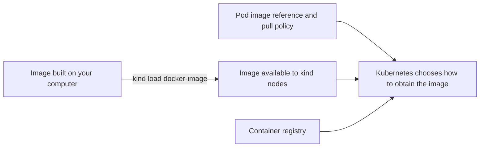

# Diagnose a local image pull in kind

## The problem in one sentence

You built an image on your computer, but a Pod in a local `kind`
cluster reports `ErrImagePull` or `ImagePullBackOff`. The image may
exist on your computer without existing inside the cluster's node
containers. First check that you are looking at the intended cluster
and that the Pod requests the exact image you built.[^kind-quick-start]
[^kubernetes-images]

`kind` runs Kubernetes nodes as containers. Think of your computer's
image store and a kind node's image store as **two shelves**: placing
a book on one shelf does not put it on the other. The analogy stops
there: a node can also pull an image from a registry, and the
workload's image pull policy affects whether a local copy is used.
[^kind-quick-start][^kubernetes-images]



Text alternative: a local build starts in the computer's image store.
`kind load docker-image` makes that image available to the kind nodes.
The Pod's image reference and pull policy determine whether Kubernetes
uses a node copy or tries a registry.

## Before you change anything

This guide uses `orders-api:dev-1`, a cluster named `study`, and the
`default` namespace as an **invented example**. Replace all three
with your own values. You need a working kind cluster, `kubectl`
access to its Pods, and access to the container runtime that holds
your built image. The checks below read state; the later `kind load`
command changes the kind nodes' image stores.

> [!WARNING]
> Do not switch context or load an image until you know which cluster
> and namespace you are targeting. A successful load into the wrong
> cluster will not fix the Pod you are investigating.

### 1. Confirm the cluster and Pod

```bash
kind get clusters
kubectl config current-context
kubectl get pods -n default
kubectl describe pod <pod-name> -n default
kubectl get pod <pod-name> -n default -o yaml
```

`kind get clusters` lists local kind cluster names. The current
`kubectl` context for the example cluster is normally `kind-study`;
if it points elsewhere, stop and follow the kind kubeconfig guidance
before continuing. Find the affected Pod in the intended namespace.
Its description shows the container's image, waiting reason, and
recent events. The YAML shows each container's `image` and
`imagePullPolicy` under `spec.containers`. Read the pull error: a
missing registry image, denied registry access, or a wrong tag is
different from a local image that has simply not been loaded.
[^kind-quick-start][^kubernetes-debug-pods][^kubectl-get]

Check the image reference character for character. For example,
`orders-api:dev-1` is different from `orders-api:latest` or
`registry.example/orders-api:dev-1`. A Pod in `Pending` because it
cannot be scheduled is a different investigation; loading an image
will not make a node eligible.[^kubernetes-images]
[^kubernetes-debug-pods]

### 2. Match the fix to the evidence

| Evidence | Next action |
| --- | --- |
| The Pod requests your locally built `orders-api:dev-1`, but the kind node lacks that image. | Load that exact image into the confirmed cluster, then recheck the Pod. |
| The Pod requests a different name or tag. | Correct the workload's reviewed image reference or build the image it actually requests. |
| The Pod uses `imagePullPolicy: Always`. | Review that policy and the intended distribution method. An image loaded on the node may still lead to a registry pull. |
| Events show registry authentication or network failure. | Investigate registry access; a local-image load is only suitable if the workload is meant to use that local image. |
| The Pod is unschedulable rather than waiting for an image. | Read scheduling events and follow the [general troubleshooting guide](common-solutions.md). |

Kubernetes chooses a default pull policy when a workload object is
created. Changing a tag later does not automatically update the
stored policy. `:latest` normally defaults to `Always`; a non-latest
tag normally defaults to `IfNotPresent` unless the policy was
specified. Read the policy recorded on this Pod instead of assuming
the default.[^kubernetes-images]

### 3. Load only the matching local image

If the Pod's image reference matches the image you built, the
cluster name is confirmed, and the pull policy permits use of a node
copy, load the image:

```bash
kind load docker-image orders-api:dev-1 --name study
```

This command copies the image from the local container runtime into
the nodes of the named kind cluster. It does **not** edit the
Deployment, change the Pod's image reference, or publish the image
to a registry. The official kind Quick Start documents the same
pattern and recommends a distinct tag instead of `:latest` for
local loading.[^kind-quick-start]

If the image is not present in the runtime kind uses, build or import
it there first. Do not run the load command repeatedly when the
observed problem is a wrong image reference or registry permission.
For a team workflow that needs repeatable pulls rather than local
copies, see kind's [local registry guide](https://kind.sigs.k8s.io/docs/user/local-registry/).

### 4. Check the result

```bash
kubectl get pods -n default
kubectl describe pod <pod-name> -n default
```

Watch the affected workload for a new or updated Pod and read its
events again. A Pod may still show an earlier pull backoff briefly;
new events reveal whether it can obtain the image now. If it starts,
check readiness and a representative application request. `Running`
alone does not show that the application works for its users.
[^kubernetes-debug-pods]

## Other kind symptoms

This page's image path does not cover every local cluster failure.
Use the observed symptom to choose the next check:

| Symptom | First evidence to read | Further help |
| --- | --- | --- |
| Container runtime permission denied | The exact permission error and whether your user can reach the runtime. | [kind known issues](https://kind.sigs.k8s.io/docs/user/known-issues/); follow your runtime's ownership guidance rather than blindly using `sudo`.[^kind-known-issues] |
| `kubectl` reads another cluster | `kubectl config current-context` and `kind get clusters`. | [kind kubeconfig guidance](https://kind.sigs.k8s.io/docs/user/quick-start/#interacting-with-your-cluster).[^kind-quick-start] |
| Pod stays `Pending` | Pod scheduling events, node capacity, selectors, taints, and volumes. | [Kubernetes Pod debugging](https://kubernetes.io/docs/tasks/debug/debug-application/debug-pods/).[^kubernetes-debug-pods] |
| Service cannot be reached from the host | The Service type, actual listener, and configured host-to-node mapping. | [kind extra port mappings](https://kind.sigs.k8s.io/docs/user/configuration/#extra-port-mappings); for a NodePort mapping, the node container port must match the Service's `nodePort`.[^kind-configuration] |

## Explore further

- [kind Quick Start](https://kind.sigs.k8s.io/docs/user/quick-start/)
  covers cluster selection and loading images.[^kind-quick-start]
- [Kubernetes Images](https://kubernetes.io/docs/concepts/containers/images/)
  explains image references and pull policies.[^kubernetes-images]
- [Inspect a Deployment with kubectl](../commands/kubectl-basics.md)
  gives a broader read-only inspection path.
- [Back to Kubernetes troubleshooting](index.md).

[^kind-quick-start]: [kind, Quick Start](https://kind.sigs.k8s.io/docs/user/quick-start/), source record `kind-quick-start`.
[^kind-configuration]: [kind, Configuration](https://kind.sigs.k8s.io/docs/user/configuration/), source record `kind-configuration`.
[^kind-known-issues]: [kind, Known Issues](https://kind.sigs.k8s.io/docs/user/known-issues/), source record `kind-known-issues`.
[^kubernetes-images]: [Kubernetes, Images](https://kubernetes.io/docs/concepts/containers/images/), source record `kubernetes-images`.
[^kubernetes-debug-pods]: [Kubernetes, Debug Pods](https://kubernetes.io/docs/tasks/debug/debug-application/debug-pods/), source record `kubernetes-debug-pods`.
[^kubectl-get]: [Kubernetes, kubectl get](https://kubernetes.io/docs/reference/kubectl/generated/kubectl_get/), source record `kubectl-get`.
