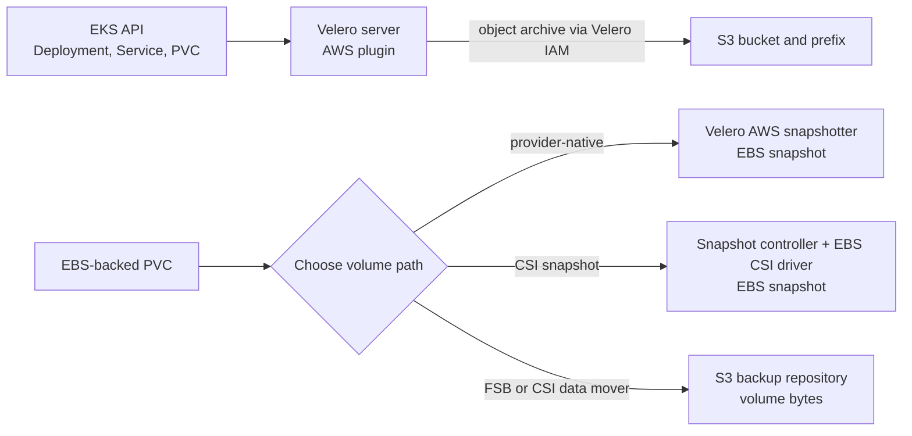

# How Velero on EKS uses S3 and EBS

## The idea in one minute

A Velero installation on Amazon EKS may use **S3 for the backup
archive** and **EBS for volume snapshots**. Those are different copies
with different AWS API callers. S3 can hold Kubernetes object
metadata, logs, and a file or data-mover repository. An ordinary
provider or CSI EBS snapshot remains with EBS; the S3 archive does not
contain its volume bytes. To copy volume bytes to object storage,
choose File System Backup or CSI snapshot data movement explicitly.
[^velero-aws-plugin][^velero-csi]

Think of two workers with different keys. One files records in an
archive; another copies the storage disk. Giving the archivist the
archive key does not give the disk worker the right identity or prove
a disk copy exists. The analogy stops at restore behavior: a snapshot
and its application may need more preparation than a physical disk
copy suggests.

This is an Explanation of the installation's moving parts, not a
ready-to-apply IAM policy or install command. The prior page included
unrun bucket creation, add-on installation, Helm values, and cloud
permissions that depended on the exact EKS and Velero setup. Use the
linked official procedures after choosing the path and verifying the
versions in your environment. No EKS cluster, S3 bucket, IAM role,
EBS volume, or Velero server was created or tested for this page.

## Follow one invented photo app

Suppose a photo API runs in EKS. Its Deployment and Service are
Kubernetes objects; its PVC uses an EBS-backed StorageClass. The
platform team wants Velero to protect both the objects and photo
files. The team must make two decisions:

1. **Where will object backups live?** Configure a
   `BackupStorageLocation` (BSL) for an S3 bucket and a cluster-owned
   prefix. The Velero server, through the AWS object-store plugin,
   needs an AWS identity that can use that location.
2. **How will volume bytes be protected?** Choose a provider-native
   EBS snapshot, a Kubernetes CSI snapshot, CSI snapshot data
   movement, or File System Backup. Each has different prerequisites
   and restore reachability.[^velero-aws-plugin][^velero-locations]

Text alternative: Velero reads selected Kubernetes objects through
the EKS API and stores their archive in S3 with the Velero workload's
AWS identity. The EBS-backed PVC has a separate volume-data choice.
A provider-native snapshot uses the Velero AWS plugin; a CSI snapshot
uses the snapshot controller and EBS CSI driver; File System Backup
or CSI data movement copies volume bytes to an S3-backed repository.
These are alternatives, not three proofs from one backup.

## Match each component to its job

| Component | Its job | What it does not prove |
| --- | --- | --- |
| Velero server and AWS plugin | Read selected Kubernetes objects, write the archive to S3, and optionally use the provider-native EBS snapshotter. | A successful S3 write does not mean any PVC data was protected. |
| `BackupStorageLocation` | Select the S3 bucket, prefix, and access settings for backups. | It does not put an EBS snapshot's bytes in S3. |
| `VolumeSnapshotLocation` | Supply region and other provider settings for Velero's **provider-native** snapshot path. | It is not the selection mechanism for Kubernetes CSI snapshots.[^velero-locations] |
| CSI snapshot controller | Reconcile Kubernetes `VolumeSnapshot` API objects. | The add-on itself does not supply EBS IAM permissions.[^eks-snapshot-controller] |
| EBS CSI driver and `VolumeSnapshotClass` | Create and restore CSI snapshots for supported EBS volumes. | A class name alone does not prove that a snapshot was created or is usable.[^eks-ebs-csi] |
| Velero node-agent, if selected | Run File System Backup or Velero's built-in CSI data mover. | Merely installing it does not enable or complete a copy to S3; the transfer Pods also need usable repository access. |

The node-agent's two paths are documented separately: [File System
Backup](https://velero.io/docs/v1.18/file-system-backup/) reads a mounted
Pod volume, while [CSI snapshot data movement](https://velero.io/docs/v1.18/csi-snapshot-data-movement/)
uses a snapshot as its source and needs an explicit backup choice.

The AWS plugin's published compatibility table pairs plugin
**v1.14.x** with Velero **v1.18.x**. That is a compatibility
statement, not proof that an arbitrary Helm chart, EKS add-on,
StorageClass, or IAM policy has been tested together. Pin and check
the installed versions against the official table before a sandbox
run.[^velero-aws-plugin]

## Separate the AWS identities

| Path | AWS caller to identify | Permission category to verify |
| --- | --- | --- |
| Object archive in S3 | Velero server's workload identity. | S3 access to the intended bucket and prefix, including read, write, and backup deletion according to retention policy. |
| FSB or CSI data-mover repository in S3 | Node-agent and data-mover Pods; inspect their actual service accounts and credential path. | Access to the repository prefix and any required KMS permissions; a successful object archive alone does not verify this path. |
| Provider-native EBS snapshot | Velero server through the AWS snapshotter plugin. | EC2 snapshot and volume APIs, plus KMS access if the workflow needs an encrypted snapshot or volume. |
| CSI EBS snapshot | EBS CSI driver controller's workload identity. | Its own EC2 and any required KMS permissions. The snapshot controller add-on does not replace this identity.[^eks-ebs-csi][^eks-snapshot-controller] |

EKS supports Pod Identity associations and IAM Roles for Service
Accounts (IRSA). A Pod Identity association maps an IAM role to a
service account **outside** the Kubernetes service-account object;
IRSA uses an annotation on that object and a different trust path.
Do not copy an IRSA annotation into a Pod Identity setup and assume
the role is bound. Inspect the actual service account, association or
annotation, role trust, and effective permissions for the caller you
chose.[^eks-pod-identity]

A single role may cover more than one path in a small lab, but the
important check remains **which Pod makes the AWS API call**. S3
success through Velero does not prove the EBS CSI controller can
create a snapshot. An EBS snapshot does not prove Velero can read its
S3 backup archive.

## Choose the EBS snapshot path deliberately

For a CSI-backed PVC, the **CSI path** needs a snapshot-capable EBS
CSI driver, the CSI snapshot controller and its CRDs, and Velero's
`EnableCSI` feature flag. It also needs a `VolumeSnapshotClass` for
the matching driver that Velero can select: the v1.18 documentation
describes a default-class annotation, Velero's
`velero.io/csi-volumesnapshot-class: "true"` label, and per-backup or
per-PVC selection. Check which method your installation uses rather
than assuming that any class will be picked.[^velero-csi]
The EKS snapshot controller can be an EKS managed add-on;
AWS also documents a self-managed alternative.[^velero-csi]
[^eks-snapshot-controller]

The **provider-native path** uses Velero's AWS snapshotter and
`VolumeSnapshotLocation`. The AWS plugin documentation says its
snapshotter can handle volumes provisioned by `ebs.csi.aws.com`.
That does not make the native and CSI workflows interchangeable:
they have different Kubernetes objects and potentially different
AWS callers. On EKS Auto Mode, AWS documents a different provisioner,
`ebs.csi.eks.amazonaws.com`; inspect the actual StorageClass and
supported snapshot path instead of assuming a standard-driver name.
[^velero-aws-plugin][^eks-ebs-csi]

For a move outside the snapshot's usable account, region, or storage
boundary, plan a supported snapshot-copy step or an object-storage
volume-data method. [Where Velero keeps volume data](storage-and-volume-backups.md)
compares those choices. A database or write-heavy photo metadata
store may need application-native consistency steps as well.

## Evidence before calling installation successful

| Check | Evidence that matters |
| --- | --- |
| Version and cluster target | Recorded Velero server, AWS plugin, Kubernetes context, EBS driver, and snapshot-controller versions. |
| S3 path | BSL available; a bounded backup completes; expected object is visible in a restored disposable namespace. Use the [ConfigMap exercise](backup-restore-workflows.md) for this first check. |
| Chosen EBS path | A snapshot for a disposable EBS PVC reaches its documented ready state; its AWS snapshot exists under the intended identity and retention policy. |
| Data recovery | Restore the test PVC and read known content through the application or a controlled test Pod. Record failures and cleanup evidence. |

The first two checks do not replace the last two. No such EBS test
was run here, so this page remains draft. For exact setup commands,
start with the [Velero AWS plugin](https://github.com/velero-io/velero-plugin-for-aws),
[Velero installation options](https://velero.io/docs/v1.18/customize-installation/),
[EKS EBS CSI driver](https://docs.aws.amazon.com/eks/latest/userguide/ebs-csi.html),
and [EKS snapshot controller](https://docs.aws.amazon.com/eks/latest/userguide/csi-snapshot-controller.html).

## Check your understanding

1. If a Velero Backup is stored in S3 and an EBS snapshot was used,
   where are the photo bytes?
2. Which AWS identity would you inspect if the S3 archive succeeds but
   a CSI EBS snapshot receives `AccessDenied`?
3. Why does creating a `VolumeSnapshotClass` not prove an EBS backup?
4. What test shows that the chosen EBS path can restore usable files?

[Back to Velero index](index.md)

[^velero-aws-plugin]: [Velero - AWS Plugin](https://github.com/velero-io/velero-plugin-for-aws).
[^velero-locations]: [Velero v1.18 - Backup and Snapshot Locations](https://velero.io/docs/v1.18/locations/).
[^velero-csi]: [Velero v1.18 - CSI Snapshot Support](https://velero.io/docs/v1.18/csi/).
[^eks-ebs-csi]: [Amazon EKS - EBS CSI Driver](https://docs.aws.amazon.com/eks/latest/userguide/ebs-csi.html).
[^eks-snapshot-controller]: [Amazon EKS - CSI Snapshot Controller](https://docs.aws.amazon.com/eks/latest/userguide/csi-snapshot-controller.html).
[^eks-pod-identity]: [Amazon EKS - Assign an IAM Role to a Service Account](https://docs.aws.amazon.com/eks/latest/userguide/pod-id-association.html).
