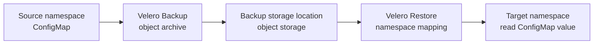

# Back up and restore one ConfigMap with Velero

## What you will do

Create one disposable ConfigMap, back it up, restore it into another
empty namespace, and read its value. This small exercise proves that
Velero can select, store, and recreate **that Kubernetes object** in
this environment. It does **not** test a persistent volume, a database,
an application, a schedule, or disaster recovery.[^velero-backup]
[^velero-restore]

Imagine putting one labeled note in an archive and asking a clerk to
place a copy in a second room. The note is our ConfigMap. The archive
receipt is the Velero backup; the copy in the second room is the
restore. A receipt alone does not prove the copy has the right words.



Text alternative: Velero reads a ConfigMap in the source namespace and
writes its backup to object storage. A Restore reads that backup and
maps the source namespace to a new target namespace. Reading the
restored value checks the outcome.

This guide uses the Velero v1.18 command and behavior references. The
commands have been checked against those documents but **have not
been executed in a live cluster** during this review.

## Before you begin

You need a disposable Kubernetes cluster, a working `kubectl` context,
a Velero v1.18 installation, a Velero CLI that matches the server, and
a writable, available BackupStorageLocation. You must be allowed to
create two namespaces and ConfigMaps in this cluster. Use the same
shell and cluster context for every step. Do not run this against a
production cluster merely to follow the example.

The names below are reserved for this exercise:
`kb-velero-source`, `kb-velero-target`, `kb-velero-note`,
`kb-velero-note-backup`, and `kb-velero-note-restore`. First confirm
that none already exists. If any does, choose a different consistent
set of names; do not overwrite or delete someone else's resource.

```bash
kubectl config current-context
velero version
velero backup-location get
kubectl get namespaces kb-velero-source kb-velero-target
velero backup get
velero restore get
```

The namespace check should report **NotFound for both names**. A
permission or connection error is not evidence that a name is free.
The backup location should be available and writable before you
create a backup. Review the context and location rather than assuming
that the CLI targets the cluster you intended.[^velero-backup]

## 1. Create the small source

```bash
kubectl create namespace kb-velero-source
kubectl create namespace kb-velero-target
kubectl -n kb-velero-source create configmap kb-velero-note \
  --from-literal=message='This note came from the source namespace.'
kubectl -n kb-velero-source get configmap kb-velero-note \
  -o jsonpath='{.data.message}'
```

The final output should be `This note came from the source namespace.`
Both namespaces must contain only resources you are willing to remove
at the end of this exercise. A ConfigMap stores configuration data,
not a persistent volume.

## 2. Back up the ConfigMap

```bash
velero backup create kb-velero-note-backup \
  --include-namespaces kb-velero-source \
  --include-resources configmaps \
  --snapshot-volumes=false \
  --wait
velero backup describe kb-velero-note-backup --details
velero backup logs kb-velero-note-backup
```

The namespace and resource filters limit this backup to ConfigMaps in
the source namespace. The volume-snapshot flag makes the object-only
scope explicit. Check that the backup reports `Completed`, that the
expected ConfigMap was included, and that warnings or errors do not
undermine the result. `--wait` only waits for a terminal outcome; it
is not an application recovery check.[^velero-backup]

If the backup is unavailable, partial, or failed, stop and inspect
the logs and BackupStorageLocation. Do not proceed as though the
object was stored.

## 3. Restore into the empty target

```bash
velero restore create kb-velero-note-restore \
  --from-backup kb-velero-note-backup \
  --namespace-mappings kb-velero-source:kb-velero-target \
  --wait
velero restore describe kb-velero-note-restore --details
velero restore logs kb-velero-note-restore
kubectl -n kb-velero-target get configmap kb-velero-note \
  -o jsonpath='{.data.message}'
```

The last line should print the same note. This checks the restored
object rather than trusting the Restore status alone. Velero normally
skips an object that already exists in the destination, so the empty
target namespace matters. If the ConfigMap was already there, a
matching value would not prove Velero restored it.[^velero-restore]

If the Restore is partial or failed, the object is absent, or the value
is different, leave the two namespaces and Velero records in place for
diagnosis. A namespace mapping changes where namespaced objects are
created; it cannot make an incompatible API or unavailable volume
data usable.[^velero-restore]

## 4. Clean up this exercise

Only after recording the backup, restore, and value results, confirm
the cluster context and the exact five names again. Then remove only
resources created for this exercise:

```bash
kubectl config current-context
kubectl delete namespace kb-velero-source kb-velero-target
velero restore delete kb-velero-note-restore
velero backup delete kb-velero-note-backup
```

Deleting the backup removes this test recovery point. Deleting a
namespace removes every resource now inside it, so skip cleanup if
another person or process has since put resources there. If a command
fails, inspect the remaining objects rather than assuming cleanup
finished.

## What this exercise did not prove

| Next question | Follow this route |
| --- | --- |
| Where do PVC data and snapshots live? | [Where a Velero backup keeps objects and volume data](storage-and-volume-backups.md). |
| How do schedules, filters, hooks, and restore changes work? | [Velero backup reference](https://velero.io/docs/v1.18/backup-reference/), [restore reference](https://velero.io/docs/v1.18/restore-reference/), and [resource filtering](https://velero.io/docs/v1.18/resource-filtering/). |
| Will an application recover in another cluster? | [Cluster migration and disaster recovery](cluster-migration-and-disaster-recovery.md) and an authorized restore drill with application data checks. |

## Check your understanding

1. Why did the preflight require an empty target namespace?
2. What does reading the restored value prove beyond `Completed`?
3. Why would this exercise be insufficient for the notes app with a PVC
   from the [storage comparison](storage-and-volume-backups.md)?

[Back to Velero index](index.md)

[^velero-backup]: [Velero v1.18 - Backup Reference](https://velero.io/docs/v1.18/backup-reference/).
[^velero-restore]: [Velero v1.18 - Restore Reference](https://velero.io/docs/v1.18/restore-reference/).
