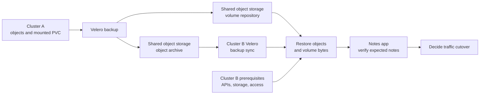

# How a Velero backup reaches another cluster

## The idea in one minute

Velero can help move selected Kubernetes objects and, when configured,
volume data from a source cluster to a destination cluster. The source
writes a backup archive to object storage. Velero on the destination
can discover that archive from the same backup storage location and
restore eligible objects. Volume data has a separate path: a provider
or CSI snapshot might stay in its storage system, while File System
Backup or CSI data movement can copy bytes to a Velero repository in
object storage.[^velero-migration][^velero-how]

Think of moving a small library. The catalog lists the books and
shelves; the books themselves still need to arrive. A new building
also needs doors, staff, and an address before visitors can use it.
The analogy stops at data consistency: an application might keep
writing while a backup is taken, so its restored data must be checked
under that application's own rules.

This page explains the handoffs for **one** migration or recovery.
For a safe first Velero operation, use the [disposable ConfigMap
exercise](backup-restore-workflows.md). For volume methods, use
[where Velero keeps volume data](storage-and-volume-backups.md).
The layouts below are illustrative. No two-cluster restore or cutover
was run in this review.

## Follow an invented notes app

Suppose `notes` runs in cluster A with a Deployment, Service, and PVC
holding note files. The team wants to recover it in cluster B. The
backup was intentionally configured to include both the Kubernetes
objects and **File System Backup** of the mounted volume; this is an
assumption for the example, not a result observed here.

Text alternative: Velero in cluster A stores selected Kubernetes
objects in an archive and, under the example's File System Backup
configuration, copies mounted volume files to a repository. Velero in
cluster B discovers the archive through shared object storage. After
cluster B has compatible APIs, storage, and access, it restores the
objects and volume data. The team opens the app, checks notes, then
decides when user traffic should move.

If the backup had used only an EBS or CSI snapshot, the volume bytes
would not be in the object archive or the File System Backup
repository. Cluster B would also need access to a compatible snapshot
in the storage backend. Matching Kubernetes object definitions and
a completed `Backup` are not proof that the data is portable.
[^velero-locations]

| Part of `notes` | Where it is in this example | What cluster B must check |
| --- | --- | --- |
| Deployment, Service, and PVC definitions | In the object archive. | APIs exist, images pull, and restored objects have the intended configuration. |
| A Secret, if included by the backup filter | In the object archive with its backed-up value. | Credentials and endpoints are suitable for B; a copied Secret may still reach A's production services. |
| Files on the mounted PVC | In the FSB repository **only if its backup completed**. | Node-agent and target storage can restore them; an expected file or checksum matches. |
| StorageClass, CSI driver, and cluster operators | Destination platform dependencies, which this namespace example does not establish. | Install or map compatible components under their own owner before restoring the app. |
| External database, DNS, and user traffic | Outside this Velero backup. | Use separate migration and cutover decisions. |

## What the destination must have

| Needed before restore | Why it matters | Evidence to seek |
| --- | --- | --- |
| Access to the correct bucket and prefix | Velero syncs backup records from object storage; a similarly named but different location will show a different set. | Destination sees the exact source backup name and can inspect its metadata. |
| Compatible Velero and storage integration | The destination must be able to read the archive and use the selected volume path. | BackupStorageLocation is available; required provider or data-mover components are healthy. |
| Served Kubernetes APIs and required controllers | A restored custom resource needs its API version on the target, and its controller to do useful work. | Required CRDs and operators are installed at compatible versions before app restore. |
| A usable volume-data path | A PVC object alone does not recover the old files. | Snapshot access or repository data plus a tested restore into target storage. |
| Application dependencies | Velero cannot recreate every external database, cloud IAM role, DNS record, secret provider, or endpoint. | Owner checks each dependency and a real user path. |

Velero v1.18 says it does not support restoring into a Kubernetes
cluster with a **lower version** than the source. The target must also
serve the backed-up API group/version for each resource; an API that
was removed or renamed can stop its restore even when the target is
newer. Compatibility is per resource and must be checked rather than
inferred from cluster version alone.[^velero-migration][^velero-how]

A destination `BackupStorageLocation` can use `ReadOnly` access mode
during recovery. That mode prevents Velero from creating or deleting
backups at that location while it restores. It does not replace
provider-level storage permissions, retention controls, or a separate
immutable copy. The source and destination should not both write to
one prefix without an intentional ownership plan. Configure the
destination's shared source location as read-only **from the start**.
If B later needs to create its own backups, give it a separate writable
bucket or prefix rather than turning the shared source location back
to read-write.[^velero-migration]
[^velero-disaster-recovery]

## Separate migration from disaster recovery

| Question | Planned migration | Disaster recovery |
| --- | --- | --- |
| Is cluster A still usable? | Usually yes; rehearse cluster B while A serves users. | Maybe not; depend on backups and access prepared earlier. |
| How fresh must data be? | Choose a final backup or application-level replication and define a write-freeze or changeover point. | Use the latest *usable* recovery point and measure actual data loss. |
| When does traffic move? | After cluster B and the application pass checks. | After enough service is restored and the incident owner approves. |
| Can traffic move back? | Only if source data remains valid or target writes can be reconciled safely. | A route change alone cannot undo writes made on B. |

The exact cutover plan is application-specific. Restored Jobs,
CronJobs, Secrets, and workloads can start acting on real external
systems before DNS changes. A test restore in another namespace is
not automatically isolated. Keep side effects, source and destination
GitOps controllers, and external credentials in the migration plan.
This is an architectural implication of restoring runnable objects,
not a claim that Velero controls their behavior.

Before cutover, confirm that the source backup will not expire during
the migration window. Stop or account for source writes after the
chosen recovery point; otherwise they will not appear on B. Once B
accepts writes, a route change back to A does not copy those changes
back. Define a data reconciliation or reverse-migration plan before
calling that route change a rollback.[^velero-how]

## Read the evidence in order

1. **Source:** Was the intended backup completed without important
   warnings? Which objects and volume method were actually included?
2. **Transport:** Does cluster B see the correct backup from the
   expected bucket and prefix? Backup sync can discover a source
   backup, but it does not itself check target compatibility.
   [^velero-how]
3. **Restore:** Which objects were created, skipped, or failed? Velero
   normally leaves an existing target object unchanged. Inspect volume
   restore status separately.[^velero-restore]
4. **Application:** Do a representative read and write, check known
   data, background work, and the user-facing route. Record the
   newest recovered item and elapsed recovery time.
5. **Cutover:** Decide which cluster may accept writes. If B has
   accepted new writes, routing back to A can lose or conflict with
   them unless an application-specific reconciliation path exists.

A successful drill supports a recovery claim only for the tested
versions, data path, target, and application checks. It does not
promise the same outcome for another storage backend or workload.

## Check your understanding

1. Why can cluster B see a `Backup` record but fail to restore the
   notes app's files?
2. What must exist in B before a backed-up custom resource can be
   useful?
3. Why is a read-only backup location helpful, and what does it not
   protect?
4. Why can switching DNS back to A lose data after B has taken writes?

## Official documentation for deeper study

- [Velero cluster migration](https://velero.io/docs/v1.18/migration-case/)
  for backup sync and source/destination storage setup. Its install
  commands use older example image versions; check the installed
  release and provider compatibility before following them.
- [How Velero works](https://velero.io/docs/v1.18/how-velero-works/)
  for object-storage sync, backed-up API versions, and restore behavior.
- [Velero disaster recovery](https://velero.io/docs/v1.18/disaster-case/)
  for the read-only backup-location step.
- [Backup and snapshot locations](https://velero.io/docs/v1.18/locations/)
  for the separate archive and provider-snapshot locations.
- [Restore reference](https://velero.io/docs/v1.18/restore-reference/)
  for existing resources, namespace mapping, and volume restore limits.

[Back to Velero index](index.md)

[^velero-migration]: [Velero v1.18 - Cluster Migration](https://velero.io/docs/v1.18/migration-case/).
[^velero-disaster-recovery]: [Velero v1.18 - Disaster Recovery](https://velero.io/docs/v1.18/disaster-case/).
[^velero-how]: [Velero v1.18 - How Velero Works](https://velero.io/docs/v1.18/how-velero-works/).
[^velero-restore]: [Velero v1.18 - Restore Reference](https://velero.io/docs/v1.18/restore-reference/).
[^velero-locations]: [Velero v1.18 - Backup and Snapshot Locations](https://velero.io/docs/v1.18/locations/).
