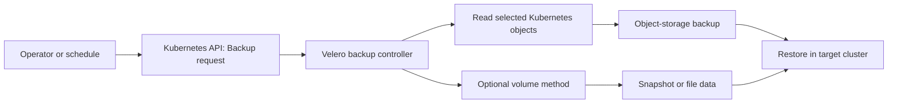

# Velero components and architecture

## The idea in plain language

A Velero command does not copy a cluster by itself. It tells Kubernetes to
create a **request object**, such as `Backup` or `Restore`. A Velero
**controller** running in the cluster notices that object and does the work.
An object-storage location keeps the backup archive outside the cluster.
This separation is why a new cluster can discover a backup after the source
cluster is gone, provided it can access the same backup data.[^velero-how]

Imagine an order slip sent to a workshop. The slip describes the job; a
worker carries it out and records the result. The analogy stops there: a
Kubernetes `Backup` object is only the in-cluster request and status, while
the archive in object storage holds the selected resource data. Keeping the
slip does not replace keeping the archive.

## Meet the parts

| Part | Plain-language role |
| --- | --- |
| Velero CLI or automation | Asks Kubernetes to create a `Backup`, `Restore`, or `Schedule` object. |
| Kubernetes API | Stores those request objects so controllers can find them. |
| Velero server | Watches requests, reads or recreates selected Kubernetes objects, and records operation status. |
| `BackupStorageLocation` | Names the object-storage bucket or prefix for backup archives and metadata. |
| `VolumeSnapshotLocation` | Configures provider snapshot locations when that snapshot path is used. |
| Node-agent | Performs file system backup work on cluster nodes when that method is configured. |

The last two rows are conditional. A resource-only backup need not use a
volume snapshot location or node-agent. Different volume methods have
different prerequisites and durability boundaries.[^velero-locations][^velero-fsb]

## Follow one request

Text alternative: an operator or schedule creates a request in the
Kubernetes API. The Velero controller reads selected Kubernetes objects and
stores their archive in object storage. A configured volume method may
protect data separately. A target cluster needs access to the relevant
backup pieces before it can restore them. The diagram helps locate where a
missing object or missing file would have been lost.

Velero can also create backups on a schedule. A `Schedule` object tells its
controller when to create new `Backup` objects; each backup then follows the
same path. For a restore, the CLI creates a `Restore` object, and a restore
controller fetches the saved backup data and recreates eligible Kubernetes
resources.[^velero-how]

## An illustrative second-cluster restore

Suppose cluster A backed up a small `notes` application to an object-storage
bucket. Cluster B has Velero installed and permission to read the same
backup location. This is an invented scenario; no cluster was used.

1. Cluster A's Velero server wrote selected object definitions to the
   configured `BackupStorageLocation`. Any volume data followed its
   configured protection method.
2. Cluster B's Velero server checks the object-storage location. Velero can
   recreate a missing in-cluster `Backup` object from an available backup
   archive. That is **object-storage sync**, not a copy of cluster A's
   Kubernetes database.[^velero-how]
3. A restore request in cluster B tells its controller which backup to use.
   It recreates eligible resources and uses the volume method recorded by
   the backup when protected data is available.[^velero-how]
4. The operator checks restore warnings and the app's actual notes. A
   restored `Backup` object or a completed `Restore` status does not by
   itself prove the app works.

This path depends on access to the object-storage archive, compatible
Kubernetes APIs and storage, and the volume data's own location. For
example, a provider snapshot may remain with that provider; it is not
automatically copied into the object-storage archive. File System Backup
stores its volume data under the backup storage location.[^velero-locations]

## Where to look when a piece is missing

| Symptom | First architecture question |
| --- | --- |
| No backup request appears | Did the CLI or schedule create the object in the intended cluster? |
| A request exists but no archive is available | Could the controller complete and write to the configured backup storage location? |
| Cluster B cannot discover a backup | Can its Velero server read the same location and backup archive? |
| Objects return but files do not | Was the volume method enabled, successful, and usable in this target? |
| Restore completes but the app fails | Are its dependencies, configuration, and application data actually usable? |

These are diagnosis questions, not proof of a particular failure. The
[troubleshooting guide](troubleshooting-and-operations.md) has operational
checks. A `BackupStorageLocation` or `VolumeSnapshotLocation` setting alone
does not certify that any backup is restorable.

## Check your understanding

- What does the Velero CLI create, and which component does the backup work?
- If the original cluster disappears, which data must a new cluster still
  be able to read?
- Why might the backup archive exist while a volume cannot be restored?

## Official documentation for deeper study

- [How Velero works](https://velero.io/docs/v1.18/how-velero-works/) explains
  controllers, requests, scheduled backups, and object-storage sync.
- [Backup and snapshot locations](https://velero.io/docs/v1.18/locations/)
  explains where metadata and volume data live.
- [File System Backup](https://velero.io/docs/v1.18/file-system-backup/)
  explains the node-agent path for volume data.

For first principles, return to [Velero fundamentals](fundamentals.md). For
method selection, read [storage and volume
backups](storage-and-volume-backups.md). For commands, use [backup and
restore workflows](backup-restore-workflows.md). Return to the [Velero
index](index.md).

[^velero-how]: [Velero v1.18: How Velero Works](https://velero.io/docs/v1.18/how-velero-works/).
[^velero-locations]: [Velero v1.18: Backup Storage Locations and Volume Snapshot Locations](https://velero.io/docs/v1.18/locations/).
[^velero-fsb]: [Velero v1.18: File System Backup](https://velero.io/docs/v1.18/file-system-backup/).
