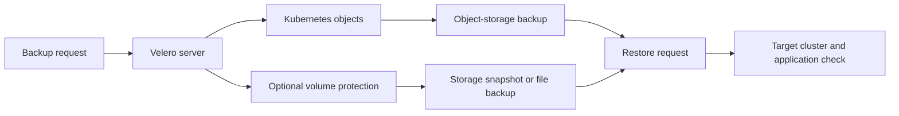

# Velero fundamentals

## The idea in plain language

**Velero helps you back up and restore things running in Kubernetes.** It
copies selected Kubernetes objects, such as a Deployment or Service, to
backup storage. Depending on how it is configured, it can also protect data
in persistent volumes. A *persistent volume* is storage a workload can keep
using after its container is replaced.[^velero-how][^k8s-pv]

This matters when someone deletes a namespace, a cluster fails, or you need
to move a workload. The objects describe *what Kubernetes should run*; a
volume may hold *what the application saved*. Recovering one without the
other may leave the application unusable.

Think of a workshop inventory. A list of machines tells you what to set up;
the workpieces are separate things you may also need to preserve. This
analogy has two limits: a volume snapshot may stay with its storage provider
instead of inside the object-storage backup, and neither an inventory nor a
copy of workpieces proves that a running application will behave correctly
after recovery.[^velero-csi]

## Follow one backup and restore

Velero runs a server in a Kubernetes cluster. A request to make a backup
becomes a Kubernetes `Backup` object. The server reads the selected objects
through the Kubernetes API and uploads the backup archive to object storage.
Volume protection is a separate path: it may use storage snapshots or file
system backup, according to the volume and configuration.[^velero-how]

Text alternative: a backup request reaches the Velero server. It writes
selected Kubernetes objects to object storage and, when configured, starts a
separate volume-data path. A restore reads the available backup parts into a
target cluster. You then check the application itself. The diagram helps you
ask whether both required parts were protected before you need a restore.

A restore can select only some resources. By default, Velero skips a
Kubernetes resource that already exists in the target cluster; it does not
replace it simply because it appears in the backup.[^velero-restore]

## An illustrative recovery

Imagine a `notes` namespace with a Deployment that runs a notes app, a
Service that gives it a stable network address, and a persistent volume
claim (PVC) holding note files. This is an invented example; no backup or
restore was run.

1. Velero backs up the selected Kubernetes objects. The backup contains
   their definitions, including the Deployment, Service, and PVC.
2. Suppose volume protection is configured and actually completes. The note
   files are protected through the chosen snapshot or file-backup method.
3. After the namespace is lost, a restore can recreate eligible objects in
   a compatible target cluster and recover the protected volume data.
4. Someone must still open the app and confirm that expected notes can be
   read. A completed Velero operation alone cannot establish that outcome.

If step 2 did not happen, recreating the PVC object does **not** recover its
old files. If this were a database with ongoing writes, a volume copy would
also need an application-specific consistency plan. Velero notes that a
cluster backup is not strictly atomic; file system backup reads a live file
system and does not capture all files at one instant.[^velero-how][^velero-fsb]

## What to decide before relying on it

| Question | Why it matters |
| --- | --- |
| Which Kubernetes objects are selected? | Filters can leave out a namespace or resource the app needs. |
| Does the app need persistent volume data? | An object-only backup cannot recreate files that were never protected. |
| Where does the volume copy live? | A provider snapshot and a file backup have different storage and portability limits. |
| Can the target cluster use the objects and storage? | The destination needs compatible APIs, drivers, permissions, and application dependencies. |
| How will you prove recovery? | Inspect backup and restore status, then test the actual user action and data. |

Velero can be one part of a recovery plan. It does not replace a
database-native backup or an application-level restore test. It also cannot
by itself guarantee a recovery time or acceptable data-loss point. Choose
the volume method and rehearse the restore for the workload you care about.

## Check your understanding

- If a Deployment returns but the app's files do not, which part of the
  backup would you investigate?
- Why might a storage snapshot in one provider be unsuitable for a move to
  another provider?
- What must you check after Velero reports a completed restore before you
  say the application has recovered?

## Official documentation for deeper study

- [How Velero works](https://velero.io/docs/v1.18/how-velero-works/) explains
  the backup, restore, and object-storage-sync flows.
- [CSI snapshot support](https://velero.io/docs/v1.18/csi/) explains when a
  Kubernetes storage snapshot can protect a volume and where its data lives.
- [File System Backup](https://velero.io/docs/v1.18/file-system-backup/)
  explains the node-agent path and its consistency limits.
- [Restore reference](https://velero.io/docs/v1.18/restore-reference/)
  explains ordering, existing resources, and restore behavior.
- [Kubernetes persistent volumes](https://kubernetes.io/docs/concepts/storage/persistent-volumes/)
  explains how a claim connects a workload to storage with its own lifecycle.

Next, see [components and architecture](components-and-architecture.md) for
the moving parts, [storage and volume backups](storage-and-volume-backups.md)
to compare data-protection methods, or [backup and restore
workflows](backup-restore-workflows.md) for operations. Return to the
[Velero index](index.md).

[^velero-how]: [Velero v1.18: How Velero Works](https://velero.io/docs/v1.18/how-velero-works/).
[^velero-fsb]: [Velero v1.18: File System Backup](https://velero.io/docs/v1.18/file-system-backup/).
[^velero-csi]: [Velero v1.18: CSI Snapshot Support](https://velero.io/docs/v1.18/csi/).
[^velero-restore]: [Velero v1.18: Restore Reference](https://velero.io/docs/v1.18/restore-reference/).
[^k8s-pv]: [Kubernetes: Persistent Volumes](https://kubernetes.io/docs/concepts/storage/persistent-volumes/).
