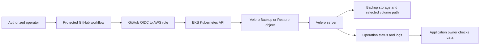

# How automation asks Velero to back up or restore

## The simple idea

A GitHub Actions runner can request a Velero backup or restore in EKS.
It acts like an operator at a terminal: it authenticates, talks to the
Kubernetes API, and creates a `Backup` or `Restore` object. The Velero
server in the cluster then processes that request. The runner does not
need a copy of the S3 backup archive to make the request. Fetching
Velero log artifacts later may still require the runner to reach the
object-storage endpoint through a temporary signed URL.
[^velero-how-it-works][^velero-troubleshooting]

Think of the runner as a person submitting a library request and
Velero as the librarian who handles the collection. The analogy stops
at permissions: Kubernetes decides whether the runner can submit the
request, while Velero's own identity decides whether it can read S3 or
make a storage snapshot. Success at one boundary does not prove the
other works.

This page explains the request and trust path. It is **not** a ready-to-
run workflow or IAM policy. A real implementation needs repository,
cluster, storage, and application owners to agree on scope and test it
in a disposable environment.

Text alternative: an authorized operator starts a protected workflow.
GitHub OIDC lets the runner assume a scoped AWS role and receive
short-lived credentials, which it uses to connect to the EKS
Kubernetes API and submit a Velero object. The Velero
server uses its own storage setup to process the request. The team
then checks status, logs, and the application result.

## Keep the two identities separate

| Identity | What it needs | What it does not prove |
| --- | --- | --- |
| Workflow runner | Permission to obtain a short-lived AWS role, reach the intended EKS cluster, and create/read only the required Velero resources in Kubernetes. | It does not grant the Velero server S3 or EBS access. |
| Velero server and its plugins | Their own permissions and configured backup storage, plus snapshot or data-movement access when selected. | A working S3 archive does not prove PVC bytes were protected. |
| Application owner | Authority to choose a recovery point, judge application data, and approve cutover. | A `Completed` Velero phase does not prove an app is usable. |

GitHub's OIDC permission lets a workflow request an identity token.
For a protected environment, AWS should check the token audience
(`sts.amazonaws.com`) and the repository-and-environment subject;
GitHub should separately restrict which refs may use that environment.
A trust policy that accepts only a branch can let another job on that
branch assume the role without the environment review. On EKS, the
resulting IAM identity also needs Kubernetes authorization. Access
entries require `API` or `API_AND_CONFIG_MAP` authentication mode;
custom Kubernetes RBAC may be needed for Velero's `velero.io`
resources. `eks:DescribeCluster` alone does not authorize a Velero
`Backup` or `Restore`.[^github-oidc-aws][^eks-access][^eks-auth-mode]

Permission to create those requests is powerful. A broad Backup can
collect Secrets, and a Restore can recreate sensitive or cluster-scoped
objects from a backup Velero can read. Use separate, narrowly scoped
workflow identities and controls for each cluster and for backup versus
restore. Keep routine restores in isolated rehearsal clusters;
production recovery needs an incident-specific approval. Do not grant
the runner permission to create new Velero backup storage locations
as part of a routine operation.
[^velero-how-it-works][^velero-restore]

For the server-side S3/EBS paths, see [how Velero on EKS uses S3 and
EBS](aws-s3-ebs-installation.md). The workflow should match the Velero
CLI version to the installed server and pin third-party GitHub Actions
to reviewed commit SHAs;
version numbers in an old example are not a deployment decision.

## Decide what a run may request

| Request | Reader-facing meaning | Required boundary |
| --- | --- | --- |
| Scoped backup | Save selected Kubernetes objects and the explicitly chosen volume method at a recovery point. | Confirm namespace/resource selection, volume method, retention, and where objects and bytes will live. |
| Restore rehearsal | Use a known backup in an isolated target to learn whether objects, PVC data, and the application can recover. | Restored Secrets may contain real credentials. Exclude or replace them, block outbound access to production, limit who can read the target, and prevent DNS updates. |
| Recovery restore | Recreate eligible objects and selected volume data for a real incident. | Confirm the target cluster, backup name, storage location and creation time, existing-object behavior, dependencies, and application owner's approval. |

A plan-only workflow step can display **intended inputs** before
execution, but it cannot prove the actual backup or restore will work.
The operator should see the target cluster identity, source backup,
namespace and resource scope, storage method, and expected side
effects before the workflow creates a Velero object. Tie approval to
the exact reviewed commit and inputs; a plan-only run followed by a
fresh run can read different files. Never treat an
unvalidated path or file from an untrusted branch as authority to
choose an AWS role or production cluster.

A restore may create Pods, Secrets, PVCs, Ingresses, or resources that
trigger cloud infrastructure. GitHub environments can require a human
review before the job starts and can restrict eligible branches;
concurrency can prevent overlapping operations. These protections
must be **configured in the repository**. Naming an environment in
YAML alone does not establish a review gate; check that required
reviewers are available for the repository's visibility and GitHub
plan. A job that prints a plan
only after environment approval is not asking the reviewer to approve
that exact plan.[^github-environments]

## Example: a rehearsal request

Imagine an operator wants to check whether a backup of a small notes
app can recover in a separate EKS test cluster. This is a design
example, not an executed workflow.

1. The operator chooses a known backup and an isolated target whose
   storage, APIs, and Velero installation are already prepared.
2. A protected manual workflow shows the selected cluster, backup,
   namespace mapping, and approval record. Its scoped AWS identity
   can reach only the intended cluster and submit the allowed Velero
   request types.
3. The runner creates a `Restore` object. Velero reads the chosen
   backup from the configured location and attempts to create eligible
   Kubernetes objects. Existing target objects are skipped by default,
   so a pre-created PVC could block restoration of its expected data.
   [^velero-restore]
4. The team checks Velero's phase and logs, then the PVC's data path.
   The app owner reads one known note and image from the agreed
   recovery point. Only then does the rehearsal count as useful
   evidence.

A green workflow job only shows that its own steps finished according
to their exit codes. Record the Velero object's final phase and any
warnings or errors explicitly; `Completed`, `PartiallyFailed`, and
`Failed` have different meanings. Even `Completed` still needs an
application-level check.[^velero-how-it-works]

A destination Velero installation that reads a source cluster's
backup location should use a read-only location until the migration
plan explicitly requires writes there. Velero's migration guide shows
`ReadOnly` access mode for this case; it reduces the chance that a
second installation deletes the source recovery point during cleanup.
Check that the chosen backup has not expired before rehearsal.
[^velero-migration]

## What to check when a run fails

| Symptom | First boundary to inspect |
| --- | --- |
| OIDC role cannot be assumed | GitHub token permission, repository/ref/environment trust condition, and AWS role configuration. |
| EKS API can be described but Velero object is forbidden | EKS access entry and Kubernetes RBAC for the actual runner identity. |
| Velero object exists but backup or restore fails | Velero server logs, backup location, plugin identity, and selected volume method. |
| Backup or restore phase exists but CLI logs cannot be downloaded | Runner network access to the object-storage endpoint and signed-URL diagnostics. |
| Velero says `Completed` but old app data is missing | Backup scope, PVC data copy, restore result, target binding, and an application-level check. |

Use [find why a Velero restore has no application
data](troubleshooting-and-operations.md) for the last path. For a
safe first hands-on exercise, [back up and restore one ConfigMap with
Velero](backup-restore-workflows.md) avoids volume data and production
cutover.

## Check your understanding

1. If the runner can create a `Backup` object but S3 rejects Velero,
   which identity needs investigation?
2. Why can an AWS role with `eks:DescribeCluster` still fail to create
   a Velero `Restore`?
3. What can a plan-only step prove, and what must a rehearsal prove?
4. Which application observation is stronger than a `Completed`
   restore phase?

## Official documentation for deeper study

- [Velero: How Velero works](https://velero.io/docs/v1.18/how-velero-works/)
  for the client, request object, server, and storage flow.
- [Velero: Restore reference](https://velero.io/docs/v1.18/restore-reference/)
  for restore scope and existing-object behavior.
- [Velero: Cluster migration](https://velero.io/docs/v1.18/migration-case/)
  for read-only access to a source backup location.
- [Velero: Troubleshooting](https://velero.io/docs/v1.18/troubleshooting/)
  for signed artifact downloads and server logs.
- [GitHub: OIDC in AWS](https://docs.github.com/en/actions/how-tos/secure-your-work/security-harden-deployments/oidc-in-aws)
  for short-lived runner identity and trust conditions.
- [GitHub: Deploying with GitHub Actions](https://docs.github.com/en/actions/how-tos/deploy/configure-and-manage-deployments/control-deployments)
  for environment review and concurrency controls.
- [Amazon EKS: Access entries](https://docs.aws.amazon.com/eks/latest/userguide/access-entries.html)
  and [authentication mode](https://docs.aws.amazon.com/eks/latest/userguide/setting-up-access-entries.html)
  for granting an IAM principal Kubernetes access.

[Back to Velero index](index.md)

[^velero-how-it-works]: [Velero v1.18 - How Velero Works](https://velero.io/docs/v1.18/how-velero-works/).
[^velero-restore]: [Velero v1.18 - Restore Reference](https://velero.io/docs/v1.18/restore-reference/).
[^velero-migration]: [Velero v1.18 - Cluster Migration](https://velero.io/docs/v1.18/migration-case/).
[^velero-troubleshooting]: [Velero v1.18 - Troubleshooting](https://velero.io/docs/v1.18/troubleshooting/).
[^github-oidc-aws]: [GitHub Docs - Configuring OpenID Connect in Amazon Web Services](https://docs.github.com/en/actions/how-tos/secure-your-work/security-harden-deployments/oidc-in-aws).
[^eks-access]: [Amazon EKS - Grant IAM Users Access to Kubernetes with EKS Access Entries](https://docs.aws.amazon.com/eks/latest/userguide/access-entries.html).
[^eks-auth-mode]: [Amazon EKS - Change Authentication Mode to Use Access Entries](https://docs.aws.amazon.com/eks/latest/userguide/setting-up-access-entries.html).
[^github-environments]: [GitHub Docs - Deploying with GitHub Actions](https://docs.github.com/en/actions/how-tos/deploy/configure-and-manage-deployments/control-deployments).
