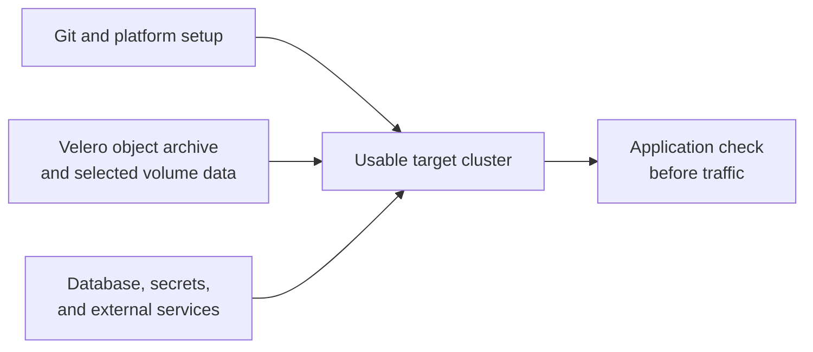

# Choose where Velero fits in a recovery plan

## The simple idea

Velero helps recover **Kubernetes objects** and, when a volume method was
selected and completed, **some persistent volume data**. It does not by
itself move an external database, reissue cloud identities, change DNS,
or prove that an application can use the recovered data. Think of it as
one part of a moving plan: packing boxes helps, but the new building
still needs power, keys, and a working address. The analogy stops at
live data: a database may have writes in flight that a file copy does
not make consistent.[^velero-how-it-works][^velero-fsb]

This page helps you **choose a recovery pattern**. It is not a command
runbook. Before any restore, use the linked task guides, identify an
owner for the application's data, and rehearse in an isolated target.

Text alternative: Git and platform setup, Velero's object archive and
selected volume data, and separately managed databases, secrets, and
external services all feed a usable target cluster. The application
owner then checks the result before traffic is sent there.

## First decide what must come back

Ask where each important piece lives. A Kubernetes `Deployment` says
how to run Pods; it is not a copy of files on a PersistentVolumeClaim
(PVC). A PVC describes requested storage; its existence does not show
that yesterday's bytes were protected. [Where a Velero backup keeps
objects and volume data](storage-and-volume-backups.md) explains the
methods and storage boundaries.[^velero-restore]

| Needed after recovery | Likely owner or path | Check that proves more than a healthy Pod |
| --- | --- | --- |
| Kubernetes manifests and selected runtime objects | GitOps for desired state; Velero for eligible backed-up objects outside Git. | Required objects exist, controllers reconcile, and versions are compatible. |
| Files on a PVC | A compatible provider/CSI snapshot, CSI data movement, or File System Backup (FSB), chosen before backup. | Restored files match a known recovery point and the app reads them. |
| Database transactions | Database owner and a tested database-native recovery or migration method. | A real query, consistency check, and agreed recovery point pass. |
| Secrets and cloud identity | Security/platform owner and approved target secret or identity path. | The target workload authenticates only to intended services. |
| DNS, certificates, queues, and external buckets | Each service's owner and its own change plan. | End-to-end request or job works through the target path. |

A backup captures data at a **recovery point**; recent changes after
that point may be lost. The recovery point objective (RPO) is the
maximum acceptable data loss. The recovery time objective (RTO) is
the maximum acceptable downtime while the team rebuilds and verifies
the application. Choose both targets with the
application owner before selecting a Velero schedule or volume
method; a `Completed` backup does not, by itself, prove that either
target can be met.

## Match the situation to a pattern

| Situation | What Velero can contribute | What needs a separate decision |
| --- | --- | --- |
| One namespace was deleted | Restore eligible namespace objects and protected PVC data from the last suitable, known-good backup. | Stop conflicting reconcilers, confirm backup scope, restore into an isolated target if possible, and check the app before routing users. |
| A cluster must be rebuilt | Make backups visible to the new Velero installation, then restore eligible objects and portable volume data. | Install compatible APIs, CRDs, operators, CSI/storage drivers, networking, and identity first. Test the volume method in the destination. |
| Production is copied to development | Namespace mapping can create copies of selected Kubernetes objects. | Use an isolated target that cannot reach production services, exclude production Secrets and sensitive data, and keep restored workloads from starting until replacement configuration is ready. Give the target read-only access to the source backup location. |
| An Argo CD-managed app moves cluster | Velero may carry selected runtime objects or PVC data that Git cannot recreate. | Argo CD should recreate intended manifests from Git. Decide which controller owns each object and keep reconciliation from changing the rehearsal or recovery target unexpectedly. |
| An AKS app moves to EKS | FSB or a proven data movement path may carry suitable PVC file data; Velero can carry eligible object definitions. | Azure disk snapshots do not become EBS snapshots. Choose and test EKS StorageClass mappings; rebuild AWS identity, ingress, and external dependencies; use application-native methods for databases. |
| Risky maintenance needs a recovery point | A scoped backup can preserve eligible objects and selected volume data. | Keep the Git/IaC rollback, database recovery, and application verification plans. Test the backup before depending on it. |

FSB reads volumes mounted by running Pods; stopping those Pods before
the file backup can leave no volume data to copy. A safe write pause
must be designed for the workload and checked in a rehearsal. FSB
also reads live files and does not by itself give a transactional
database recovery point.[^velero-fsb]

For cross-cluster details, read [how a Velero backup reaches another
cluster](cluster-migration-and-disaster-recovery.md). Velero documents
object-storage sync between installations, destination compatibility,
and the lack of native cross-provider snapshot portability. A shared
source backup location should be read-only from the target until the
migration design explicitly calls for writing there.
[^velero-migration]

## Example: moving a notes app

Imagine a notes service on AKS. Its Deployment and Service are in Git,
its uploaded images are on a PVC, its notes live in a managed database,
and its public name points to the old ingress. This is an **invented**
example, not a tested migration.

1. The platform team builds the EKS destination and reviews its Git
   manifests, but holds the application workload from starting while
   its data and target configuration are prepared. It chooses an EKS
   StorageClass or an explicit class mapping for the restored PVC.
2. The app and storage owners choose and test a portable method for the
   image PVC. A plain Azure disk snapshot cannot restore as an EBS
   volume. FSB or data movement needs a measured backup and restore
   trial. An FSB restore uses a Velero-restored Pod and helper init
   container, so its Pod must be allowed to run **in an isolated
   target** without reaching production services. Argo CD must not
   pre-create an empty PVC that causes Velero to skip it.
   [^velero-migration][^velero-data-movement][^velero-fsb]
   [^velero-restore]
3. The database owner moves notes using the database's own supported
   recovery method and checks a known record. Velero's Kubernetes
   object archive does not contain that managed database's data.
4. The security and network owners provide target credentials,
   certificates, and routing. They prevent the rehearsal app from
   calling production services or writing to production data.
5. Once data and target configuration are ready, Argo CD reconciles the
   intended workload under an agreed ownership boundary with Velero.
   The application owner compares a known image and note at the agreed
   recovery point, then checks a real request through the target.
   Only after that evidence should the team discuss traffic cutover.

GitOps and Velero can both touch Kubernetes objects. Argo CD's
self-heal and prune settings can reapply or remove live resources, so
an owner must set the reconciliation boundary for the rehearsal and
cutover. Velero's default restore skips objects that already exist; an
`update` policy is not a shortcut for restoring existing PVC bytes.
[^argocd-auto-sync][^velero-restore]

## A plan is ready when these questions have answers

- Which Kubernetes objects are recreated from Git, which are restored
  by Velero, and which are created by operators?
- Which PVCs have a completed, destination-compatible data copy? Where
  are those bytes stored?
- Which database, queue, object bucket, secret, identity, and endpoint
  changes have separate owners?
- What known item or transaction will the application owner read after
  restore, and how recent must it be?
- When do source writers stop, when may target writers begin, and what
  happens if the target fails after new writes start?
- Has the whole path been rehearsed without touching production
  traffic or data?

If any answer is unknown, the plan needs more discovery. For a bounded
first task, use [back up and restore one ConfigMap with
Velero](backup-restore-workflows.md). For a failed restore, use [find
why a Velero restore has no application
data](troubleshooting-and-operations.md).

## Check your understanding

1. A restored PVC says `Bound`. What further evidence would show the
   application has its old data?
2. Why is restoring an AKS snapshot directly as an EBS volume a poor
   cross-cloud plan?
3. If GitOps owns a Deployment, what should the team decide before
   restoring that same Deployment from Velero?
4. Which part of the notes app example needs a database owner's plan?

## Official documentation for deeper study

- [Velero: How Velero works](https://velero.io/docs/v1.18/how-velero-works/)
  for backup and restore behavior.
- [Velero: Cluster migration](https://velero.io/docs/v1.18/migration-case/)
  for synced backup locations and compatibility limits.
- [Velero: Restore reference](https://velero.io/docs/v1.18/restore-reference/)
  for existing objects and PVC restoration.
- [Velero: File System Backup](https://velero.io/docs/v1.18/file-system-backup/)
  and [CSI snapshot data movement](https://velero.io/docs/v1.18/csi-snapshot-data-movement/)
  for volume-data paths.
- [Argo CD: Automated Sync Policy](https://argo-cd.readthedocs.io/en/stable/user-guide/auto_sync/)
  for reconciliation behavior during a migration.

[Back to Velero index](index.md)

[^velero-how-it-works]: [Velero v1.18 - How Velero Works](https://velero.io/docs/v1.18/how-velero-works/).
[^velero-fsb]: [Velero v1.18 - File System Backup](https://velero.io/docs/v1.18/file-system-backup/).
[^velero-restore]: [Velero v1.18 - Restore Reference](https://velero.io/docs/v1.18/restore-reference/).
[^velero-migration]: [Velero v1.18 - Cluster Migration](https://velero.io/docs/v1.18/migration-case/).
[^velero-data-movement]: [Velero v1.18 - CSI Snapshot Data Movement](https://velero.io/docs/v1.18/csi-snapshot-data-movement/).
[^argocd-auto-sync]: [Argo CD - Automated Sync Policy](https://argo-cd.readthedocs.io/en/stable/user-guide/auto_sync/).
